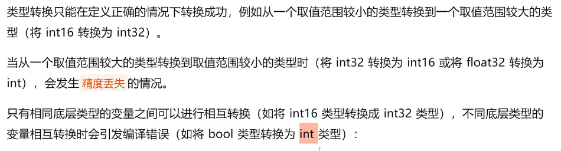
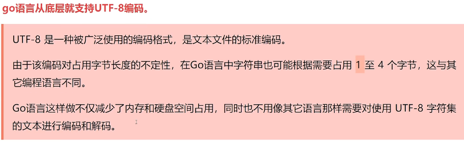
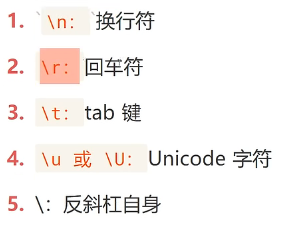
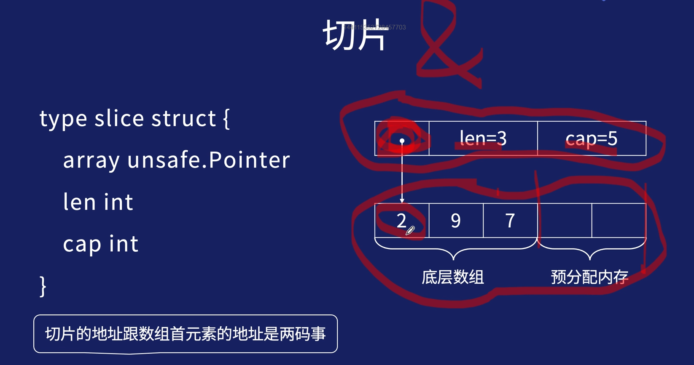
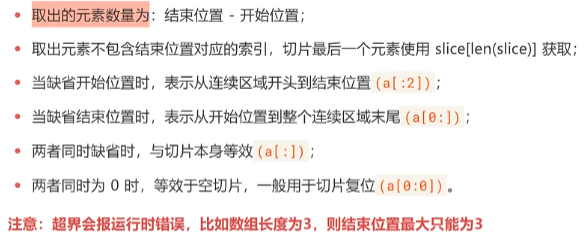

# 基础篇

<br/>

## 1. 类型转换

Go语言不支持隐式类型转换，因此所有的类型转换都**必须显式声明**

```golang
    //类型转换
    c := 4.0
    d := int(c)
    fmt.Print(d, c)
```

- 注意精度丢失：



<br/>

## 2. demo 修改和替换字符串

Go中字符串是不可变的，修改字符串的时候可以将字符串转化为[]byte进行修改

```
    //修改字符串
    a := "xxj"
    //var b []byte = []byte(a)
    b := []byte (a)
    b[0] = 'k'
    fmt.Print(b)
    fmt.Print(string(b))
```

## 3. 字符串类型

**注意 **：string类型采用的utf-8编码，由于该编码对占用字节长度的不确定性，所以字符串可能需要1 至 4个字节，节省空间。



字符串中可以使用转义字符实现换行缩进等效果



<br/>

字符串是多个字节的定长数组(就是字节数组)，byte和rune都是字符类型，若多个字符放在一起，就组成了字符串:

比如hello，由ascii，每个字母对应的编号是104，101，108，108，111

```golang
    //多个字符组成字符串
    str1 := "hello"
    char1 := [5]byte{104, 101, 108, 108, 111}
    fmt.Printf("str1:%s\n", str1)
    fmt.Printf("char1:%s", char1)
```

<br/>

**注意**：每个字母占用一个字节，每个汉字占用三个字节

```golang
    //字母和汉字字节长度
    str1 := "abc"
    str2 := "你好"
    fmt.Println(len(str1)) //3
    fmt.Println(len(str2)) //6
```

<br/>

字符串实际上就是字节数组，可使用索引来读取字节：

```golang
    //字符串实际上就是字节数组
    str1 := "xxj"
    fmt.Print(str1[0])
    //结果：120
```

<br/>

**注意**：获取字符串中某个字节的地址属于非法行为，例如&str[i]

```golang
    //获取字符串中某个字节的地址属于非法行为
    str := "xxj"
    fmt.Print(&str[2])
```

<br/>

## 4.字符串的应用

- 计算字符串长度：

1. 对于ASCII字符串使用 len() 函数
2. 对于unicode字符串使用 utf8.RuneCountInString() 函数，utf8.RuneCountInString()多用于计算中文的长度

```golang
    //计算字符串长度
    str1 := "在吗"
    fmt.Println(len(str1))
    fmt.Println(utf8.RuneCountInString(str1))
    //结果：6    2
```

<br/>

- 拼接字符串 + / byte.Buffer ：

```golang
    //拼接字符串"+"
    str := "xxj" + "你好"
    str += "吗"
    fmt.Print(str)
        //拼接大量的字符串时候
    str1 := "abc,,,,,"
    str2 := "def,,,,,"
    var stringBuilder bytes.Buffer
    stringBuilder.WriteString(str1)
    stringBuilder.WriteString(str2)
    fmt.Printf("拼接之后的字符串：%s", stringBuilder.String())
```

<br/>

- 从字符串”xxj,你好“中获取"好"

```golang
        //从字符串”xxj,你好“中获取"好"
        str1 := "abc" //对应ASCII码表，底层为[]byte数组
        fmt.Printf("%c\n", str1[2])
        str2 := "xxj,你好" //有中文，对应unicode字符集，会变成[]rune数组
        //fmt.Printf("%c")   //直接使用索引无效，可以使用string方法进行转换
        fmt.Print(string([]rune(str2)[5]))
        //结果:c 好
```

<br/>

- 遍历

unicode字符集(中文为unicode)使用for range进行遍历（使用for读取会乱码），ascii字符集可以用for range和 for进行遍历

```golang
//遍历
    str := "niHaoMa"        //ascii
    str1 := "你好吗"           //unicode 一般为中文只能用for range才能读取到正确字符
    for k, s := range str { //for range
        fmt.Printf("unicode:%c %d,%d\n", s, s, k)
    }
    fmt.Print("__________")

    for i := 0; i < len(str); i++ { // for
        fmt.Printf("ascii:%c %d\n", str[i], str[i])
    }

    fmt.Print("__________")
    for _, m := range str1 { //for range
        fmt.Printf("ascii:%c %d\n", m, m)
    }
```

<br/>

- 字符串的格式化

print：结果写到标准输出

Sprint：结果会以字符串形式返回

```golang
    //字符串的格式化
    str := "你好，xxj"
    result := fmt.Sprint(string([]rune(str)[2]))
    fmt.Println(result)
    //结果：，
```

<br/>

%s string
%f 浮点数
%c 单一字符
%d 十进制打印数字

<br/>

%T 动态类型

```golang
fmt.Printf("动态类型：%T\n", str) //动态类型：%T 输出结果:动态类型：string
```

<br/>

%v 本来值的输出 和 %+v 字段名 + 值打印

```golang
    userInfo := user{
        Name: "xxj",
        Age:  20,
    }
    fmt.Printf("输出value:%v\n", userInfo) //结果：输出value:{xxj 20}
    fmt.Printf("输出key-value:%+v\n", userInfo)//结果：输出key-value:{Name:xxj Age:20}
```

<br/>

%p 指针，十六进制

```golang
fmt.Printf("userInfo的十六进制指针：%p\n", &userInfo) //结果：userInfo的十六进制指针：0xc000008078
```

<br/>

%b二进制

```golang
fmt.Printf("6的二进制表示：%b\n", 6)//6的二进制表示：110
```

<br/>

- 字符串查找

获取字符串中的某一段字符

strings.Index() ：正向

strings.LastIndex() ：反向

```golang
    //字符串的查找 正向与反向
    str := "我来了,我走了,bye bye"
    //正向
    index := strings.Index(str, "bye")
    fmt.Printf("bye 所在的位置：%d\n", index) //结果：20

    index1 := strings.Index(str, "你好")
    fmt.Printf("你好 所在的位置：%d\n", index1) //结果：-1

    index2 := strings.Index(str[index:], "e")
    fmt.Printf("e 所在的位置：%d\n", index2) //结果：2

    //反向类似
    index3 := strings.LastIndex(str, "by")
    fmt.Printf("by 所在的位置：%d\n", index3)
```

<br/>

## 5. 常量和iota常量初始器

**注意**：所有变量的运算都可以在编译期间完成，减少了运行时的工作，也方便其他代码的编译优化。

- 常量声明一般省略type，常量(const)间所有的算术运算、逻辑运算和比较运算的结果都是常量。

```golang
    const name string = "xxj"
    const pi = 2.3 //type可以省略
    const ( //与变量定义一样可以批量声明多个常量
        e = 232
        p = 888
    )

    var ( //变量批量声明
        name_ string
        age   int
    )
```

<br/>

- 如果批量声明的常量，除了第一个外其它的常量右边的初始化表达式都可以省略，如果省略初始化表达式则表示使用前面的初始化表达式，对应的变量类型也是一样的。

```golang
    const (
        a = 1
        b
        c = 3
        d
    )
    fmt.Println(a, b, c, d) //1,1,3,3
```

<br/>

- 常量生成器

iota相当于索引，代表处于常量列表的第几个，在它之后的常量为iota + 1

```golang
    const (
        a = 4
        b
        c = iota
        d
    )
    fmt.Print(a, b, c, d)    //4，4，2，3
```

<br/>

## 6. 指针

指针在go中可以拆分为两个和核心概念：

1. 类型指针，允许对这个指针类型的数据进行修改，传递数据可以直接使用指针，而无需拷贝数据，类型指针不能进行偏移运算。
2. 切片，有指向起始位置元素的原始指针、元素数量和容量组成

切片比原始指针具备跟强大的特性，而且更安全，切片在发生越界的时候会报出宕机，并打出堆栈，而原始指针只会崩溃。

```golang
    //指针
    var room int = 10
    var ptr = &room

    fmt.Printf("变量地址：%p\n", &room)
    fmt.Printf("指针变量地址：%p\n", &ptr)
    fmt.Printf("指针指向的值：%d\n", *ptr)
    fmt.Printf("变量地址：%p", ptr)
/*
  变量地址：0xc0000a6058
    指针变量地址：0xc0000ca018
    指针指向的值：10
    变量地址：0xc0000a6058*/
```

<br/>

## 7.  变量的生命周期

全局变量、局部变量

go的内存中应用了两种数据结构用于存放变量：

1. 堆(heap) ：堆适用于存放进程执行中被动态分配的内存段。它的大小并不固定，可动态扩张或者缩减。当进程调用 malloc等函数分配内存时，新分配的内存就会被动态的加入到堆上(堆被扩张)。当利用free等函数释放内存的时候，被释放的内存从堆中被删除(堆被缩减)
2. 栈（stack）: 又称为堆栈，用来存放程序暂时创建的局部变量

<br/>

- 变量逃逸

**不要有刻板印象，觉得局部变量在函数调用完之后会销毁，实际上存在变量逃逸现象**

```golang
//变量逃逸
var global *int
func f() {
    x := 1
    global = &x
}
```

```golang
//变量逃逸test
f()
fmt.Print(*global) //仍然能够取出x的值
```

上述代码中 x 必须在堆上分配，因为他在函数退出后需要可以通过包一级的global变量找到，即使他是在函数内部定义的。

<br/>

## 8. 类型别名

go 1.9 之后添加，主要用于解决代码升级、迁移中存在的问题

仅仅时别名，编译按照原来的类型来

```golang
    //类型别名
    type myInt = int
    var age myInt = 22
    var height int = 43
    fmt.Printf("age的数据类型：%T\n", age)
    fmt.Printf("height的数据类型：%T\n", height)
    /*
    结果：
    age的数据类型：int
    height的数据类型：int
    */
```

<br/>

## 9. 字符串和其它数据类型之间的转换

1. 字符串 《--》 整数

```golang
    //1.字符串 《--》整数
    str := "45"
    intValue, _ := strconv.Atoi(str)
    fmt.Printf("str转为整数后：%d\n", intValue)
    //结果：str转为整数后：45
    intValue1 := 2
    strValue := strconv.Itoa(intValue1)
    fmt.Printf("整数转为字符串后：%s, 类型为：%T\n", strValue, strValue)
    //结果：整数转为字符串后：2, 类型为：string
```

<br/>

2. 浮点数《--》字符串

```golang
    //2. 字符串 《--》 浮点
    str1 := "3.14"
    parseFloat, _ := strconv.ParseFloat(str1, 32)
    fmt.Printf("字符串转浮点：%f,类型：%T\n", parseFloat, parseFloat)
    //结果：字符串转浮点：3.140000,类型：float64
    floatValue := 3.14
    str2 := strconv.FormatFloat(floatValue, 'f', 2, 32)
    fmt.Printf("浮点数转字符串：%s,类型：%T\n", str2, str2)
    //结果：浮点数转字符串：3.14,类型：string
```

- 获取键盘输入字符

```golang
    //获取键盘输入字符
    reader := bufio.NewReader(os.Stdin)
    readString, _ := reader.ReadString('\n')
    fmt.Println(readString)
```

<br/>

## 10. 数组

数组是一个有固定长度的特定类型元素组成的序列，一个数组可以由零个或者多个元素组成

**注意**：因为数组的长度是固定的，所以在Go语言中很少使用数组。

```golang
var 数组变量名 [元素数量]Type
```

<br/>

从数组中取值常见两种方式:

1. 索引

```golang
a[1]
```

2. for range

```golang
    //数组
    scores := [5]int{1, 2, 3, 4, 5}
    for index, value := range scores {
        fmt.Printf("索引：%d, 得分：%d\n", index, value)
    }
```

<br/>

自动推断数组长度使用 "..."

```golang
arr := [...]int{1,2,3,4,5}
```

<br/>

特殊用法：假设只想初始化某个索引处的值

```golang
    scores1 := [3]int{2: 3} //只初始化第三个值，且设置为3
    fmt.Print(scores1)//结果：[0,0,3]
```

<br/>

## 11. 多维数组

Go中允许使用多维数组，因为数组属于值类型，所以多维数组的所有维度都会在创建的时候自动初始化为零值，多维数组尤其适合管理具有父子关系或者坐标系相关联的数据。

```golang
var arr [size1][size2]...[sizen] arr_type
```

<br/>

```golang
    arr := [4][2]int{1: {12, 21}, 2: {43, 34}}
    for index, value := range arr {
        fmt.Printf("索引：%d,值：%d\n", index, value)
    }
    //结果：
    //索引：0,值：[0 0]
    //索引：1,值：[12 21]
    //索引：2,值：[43 34]
    //索引：3,值：[0 0]
```

<br/>

对多维数组元素的简单应用：

```golang
    //对多维数组元素的简单应用
    var arr1 [2]int = arr[1] //取出一个一维数组赋值
    fmt.Print(arr1)
    var a int = arr[1][0]
    fmt.Print(a)
```

<br/>

## 12. 切片

 切片(Slice)与数组一样，也是可以容纳若干**类型相同**的元素的容器

与数组不同的是，无法通过切片类型来确定其值的长度。每个切片值都会将数组作为其底层数据结构，我们也把这样的数组称为**切片的底层数组**。

```
切片是对数组的一个连续片段的引用，所以切片是一个**引用类型**。这个片段可以是整个数组，也可以是由起始和终止索引标识的一些**项的子集**。需要注意的是，**终止索引标识**的项目不包括切片内(**因为是左闭右开的区间**)。

go中切片的内部结构包括地址、大小和容量，切片一般用于快速操作一块数据集合。
```



<br/>

1. 从数组中生成切片:

```golang
    arr := [...]int{32, 54, 76, 12, 76}
    fmt.Print(arr, arr[1:4]) //从数组中生成切片
    //结果：[32 54 76 12 76] [54 76 12]
```

<br/>

- 丛数组或者切片生成新的切片拥有以下特性：



<br/>

2. 直接声明切片：

除了从原有的数组或者切片中生成切片外，也可以声明一个新的切片，每一种类型都可以拥有其切片类型，表示多个相同类型元素的集合。

声明格式和数组相似，不过不需要给出长度，因为不定长

```golang
 var name []Type
```

切片是动态结构，只能与nil判定相等，不能互相判断相等。声明新的切片之后，可以使用append()函数向切片中添加元素

<br/>

切片添加元素与判空：

```golang
    //自定义切片,添加元素
    var nameLists []string
    nameLists = append(nameLists, "xxj", "kk")
    fmt.Print(nameLists)
    //切片判空
    fmt.Println(nameLists == nil)
```

<br/>

3. 使用make()函数构造切片

```golang
make([]Type, size, cap)
```

size 分配元素个数，cap 提前分配空间大小。

```golang
    //make声明切片
    ints := make([]int, 3, 10)
    fmt.Print(len(ints)) //3
    ints = append(ints, 9, 6, 3)
    fmt.Print(ints) //[0 0 0 9 6 3]
```

**注意**：使用make函数生成的切片一定发生了内存分配操作，但给定开始和结束位置（包括切片复位）的切片只是将新的切片结构指向已经分配好的内存区域，设定开始与结束位置，不会发生内存分配操作。

<br/>

```golang
    //切片初始化
    var s []int            //切片声明，len = cap = 0
    s = []int{}            //初始化，len = cap = 0
    s = make([]int, 3)     //初始化，len = cap = 3
    s = make([]int, 3, 5)  //初始化，len = 3, cap = 5
    s = []int{1, 2, 34, 5} //len = cap =4
    s2d := [][]int{
        {1}, {2, 4}, //二维数组各行的列数相等，但二维切片各行的len可以不等
    }
```

<br/>

4. append函数：

- 自动扩容
- 预留空间用完之后，会申请一块更大的内存空间，cap变为原来的两倍(cap < 1024)或者1.25倍(cap > 1024) [不是很准却的描述，现在的扩容策略不是1024比较负责，可自行查看]。然后把原内存空间拷贝过来，在新的内存空间上执行append操作

```golang
//append函数扩容策略
func coef_cap() {
    s := make([]int, 2, 5)
    nowCap := cap(s)
    for i := 0; i < 100; i++ {
        s = append(s, i)
        afterCap := cap(s)
        if afterCap > nowCap {
            fmt.Printf("%d ---> %d\n", nowCap, afterCap)
            nowCap = afterCap
        }
    }
}
/*
结果：
5 ---> 10
10 ---> 20
20 ---> 40
40 ---> 80
80 ---> 160
*/
```

<br/>

5. 子切片

- 刚开始子切片和母切片共享底层的内存空间，修改子切片会反映到母切片上，在子切片上执行append会把新元素放到母切片预留的内存空间上。
- 档子切片不断执行append，耗完了母切片预留的内存空间，子切片跟母切片就会发生内存分离，此后两个切片没有任何关系，从此形同陌路。

```golang
func sub_slice() {
    arr := make([]int, 3, 5)
    crr := arr[0:2]
    crr[0] = 3
    fmt.Println(arr[0]) //arr也被修改

    crr = append(crr, 5, 6, 5, 6) //超过cap，内存分离
    crr[1] = 4
    fmt.Println(arr) //arr[1]并没有被改变
}
/*
result:
3
[3 0 0]
*/
```

<br/>

6. 切片传参

- go语言函数传参，传的都是值不是引用，即传切片会把切片的{arrayPointer, len , cap}这三个字段拷贝一份传进来
- 由于传的是底层数组的指针，所以可以直接修改底层数组里的元素

```golang
func updateSlice(crr []int) {
    crr[0] = 100
}

updateSlice(crr)
fmt.Print(crr[0]) //100，修改成功
```
