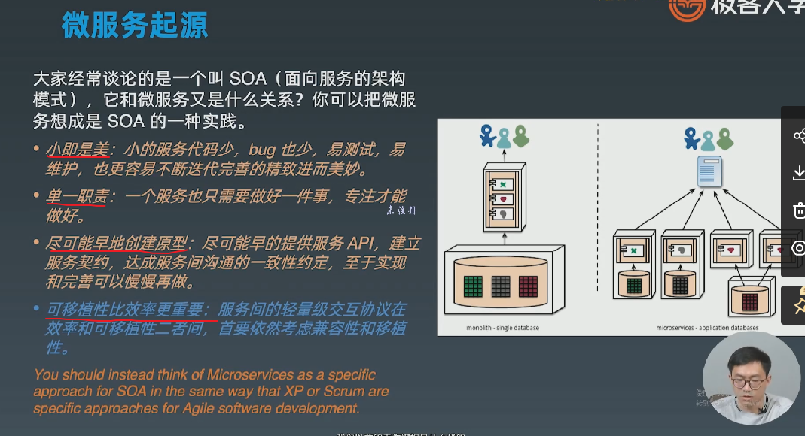

# 特别篇 前行课程

## 1 基础语法和Web框架起步

### 1.1 包声明


<br/>

	为什么有匿名引用的机制


<br/>

### 1.2 string和基础类型

小技巧：长字符串可以使用反引号，会识别换行不需要转义字符

```golang
func useOfBackticks() 
	fmt.Print(`hello
自动换行`)
/*
   hello
   自动换行
*/
}
```

<br/>

string长度：


<br/>

<br/>

<br/>

# 一、开营第一课 如何学习与职业发展

一个好的开发工程师一定对sre有着很深的理解：


构建go语言知识体系：


```
优秀的开源项目：gin ngix go-zero kratos k8s redis....
```

<br/>

信息获取：


<br/>

工具：


<br/>

## 1. 缓存

内容大纲：1. 工作中常被问到cache和db的数据一致性问题。2. 可用性相关，比如缓存的性能，和出现集群故障，热点事件，缓存穿透如何对下游系统进行保护 3. 整理的缓存的最佳实践

### 1.1 缓存技巧

<br/>


<br/>


<br/>


<br/>

# 二、微服务

## 2.1 微服务概览 巨shi架构(单体架构)到微服务架构的演进

1. 单体架构：


<br/>

2. 微服务架构

- 微服务起源


<br/>



- 微服务定义


<br/>


<br/>

- 微服务的缺点


<br/>


<br/>

- 实现微服务——组件服务化


<br/>


<br/>

- 微服务如何去组织


<br/>

- 去中心化


<br/>

- 基础设施自动化


<br/>

- 可用性 & 兼容性设计


<br/>


<br/>

## 2.2 微服务设计

重要角色：api gateway，bff层，micro service、、、

### 2.2.1 微服务重要角色和演进过程

- Api Gateway

初代 微服务全部对外


<br/>

二代 bff对外，对内grpc，加了一层


<br/>

三代 拆分bff


<br/>

四代 加了一层，引入api gateway，踢掉web server

**envy是网关框架，可以学习**，，java体系主要使用zuul，go体系主要有kong、ingress、envy


<br/>

### 2.2.2 Microservice微服务划分

- 业务职能和上下文划分


<br/>

- CQRS划分


<br/>


<br/>

### 2.2.3 Microservice安全

<br/>


<br/>

<br/>

## 2.3 gRPC&服务发现

服务与服务之间通讯的核心就是RPC框架（rpc偏向同步通讯）和消息队列（偏向异步通讯）

<br/>

### 2.3.1 gRPC


<br/>


<br/>


<br/>

### 2.3.2 服务发现

- 两种模式

1. 客户端发现模式 没有集中式的负载均衡


<br/>

2. 服务端发现模式 集中式的负载均衡


<br/>

3. 对比两种模式


<br/>


<br/>

- 服务发现

<br/>


<br/>


<br/>


<br/>

<br/>

## 2.4 多集群&多租户
