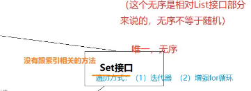

# Java集合

## 1.简要集合结构

大致分为两类

1. 一个数据一个数据的存储

该类型主要有arrayList,linkedList,hashSet,treeSet三种实现类


2. 一对数据一对数据的存储

该类型主要有hashMap,treeMap两种实现类


## 2. Collection接口的常用方法

**方法摘要**


**Collection接口的常用方法**:

- 增加 ：add(E e) addAll(Collection<? extends E> c)
- 删除 : clear() remove(Object o)
- 修改 : 
- 查看 : iterator() size()
- 判断 : contains(Object o) equals(Object o) isEmpty()

**注意**：

- 由于接口不能创建对象，需要利用实现类创建对象
- 集合有一个特点，只能存放引用数据类型的数据，若传入基本数据类型，不会报错但会自动装箱（例 int --> Integer）

**案例**：

```java
    public void testCollection() {
        Collection col = new ArrayList();
        //add()
        //集合如果传入基本类型会自动化装箱
        col.add(55);
        col.add(5);
        col.add(96);
        System.out.println(col/*多态调用的是list的toString*/);
        //addAll(Collection<? extends E> c)
        List<Integer> list = Arrays.asList(new Integer[]{1, 2, 3, 4, 5});
        col.addAll(list);
        System.out.println(col);
        //clear()等
        //col.clear();
        System.out.println(col);
        System.out.println("是否删除成功：" + col.isEmpty());
        System.out.println("集合中元素的数量为：" + col.size());
        System.out.println("集合中是否包含55" + col.contains(55));
        col.remove(55);
        System.out.println("55已经移除");
        System.out.println("集合中是否包含55" + col.contains(55));

        //equals(Object o)
        Collection col1 = new ArrayList();
        col1.add(12); 
        col1.add(13);
        col1.add(14);

        Collection col2 = new ArrayList();
        col2.add(12);
        col2.add(13);
        col2.add(14);
        System.out.println("俩集合是否相等：" + col1.equals(col2));
        System.out.print("俩集合地址是否相同：");
        System.out.println(col1 == col2);
    }
```

<br/>

## 3. Collection接口的遍历方式

- **迭代器简要原理图：**


**案例：**

```java
    @Test
    public void testCollection01() {
        Collection col = new ArrayList();
        col.add(1);
        col.add(12);
        col.add(13);
        col.add("xxj");
        col.add(0.2);

        //方法一：普通遍历（无索引行不通）
        /*for(int i; i < col.size();i++) {
            System.out.println(col.);
        }*/

        //方法二：加强循环
        for(Object o : col ) {
            System.out.println(o);
        }
        System.out.println("——————————————————");

        //方法三：迭代器
        Iterator it = col.iterator();
        while(it.hasNext()) {
            System.out.println(it.next());
        }
    }
```

## 3. List接口的常用方法和遍历方式

**案例（继承于Collection就不演示了）：**

```java
    @Test
    public void listTest01() {
        /*
        * List集合常用方法（继承自Collection的就不到说了）：
        * 增加：add(int index,E element)
        * 删除:remove(int index) remove(Object o)
        * 修改：set(int index, E element)
        * 查看：get(int index)
        * 判断：
        *  */
        List list = new ArrayList();
        list.add(1);
        list.add(12);
        list.add("abc");
        list.add(3.0);
        list.add(2);
        System.out.println(list);
        list.add(1,"xxj");
        System.out.println(list);
        list.set(1,"kkk");
        System.out.println(list);

        list.remove(2);//集合中存的是Integer数据的时候，remove调用的是remove(int index)
        System.out.println(list);
        list.remove("abc");
        System.out.println(list);

        Object o = list.get(2);
        System.out.println(o);

        //list遍历
        //方法一：普通遍历
        for(int i = 0; i < list.size(); i++) {
            System.out.println(list.get(i));
        }
        System.out.println("___________");
        //方法二：增强for循环
        for(Object obj : list) {
            System.out.println(obj);
        }
        System.out.println("___________");
        //方法三：迭代器
        Iterator it  = list.iterator();
        while(it.hasNext()){
            System.out.println(it.next());
        }

    }
```

## 4. ArrayList实现类源码

**创建ArrayList对象的方式：**

```java
ArrayList arrayList = new ArrayList();public class ArrayListTest {
    @Test
    public void arrayListTest() {
        //创建Arraylist对象方式有两种方式
        //1. 接口 = 实现类（推荐,因为扩展性比较好）
        Collection col = new ArrayList();
        List list = new ArrayList();
        //2. 直接创建实现类对象
        ArrayList arrayList = new ArrayList();
        arrayList.add("abc");
    }
}
```

- **JDK 1.8 ArrayList源码分析**

1. 和1.7一样其底层依然是Object类型的数组，size：数组中有效长度


2. ArrayList arrayList = new ArrayList();调用空构造器：


3. add方法：


**1.7和1.8ArrayList源码:**

- jdk 1.7 :

底层为数组，在调用构造器的时候，数组长度初始化为10，扩容的时候扩展为    原数组的1.5倍

- jdk 1.8：

底层为数组，再调用构造器的时候，底层数组为{}（空数组），在调用add方法后底层数组才重新赋值为新数组，新数组的长度为10

**两者主要的区别就是1.8在调用add方法之后才创建数组，相对于1.7节省了内存，1.7不管三七二十一在new对象的时候直接创建长度为十的数组。**

## 5. Vector实现类（不常使用）

**在面试时经常拿来与ArrayList做对比：**

- **联系**：底层都是数组的扩容
- **区别**：**ArrayList**底层扩容长度为原数组的**1.5**倍    **线程不安全**    **效率高**
  ```
            **Vector**底层扩容长度为原数组的**2**倍    **线程安全**    **效率低**（淘汰）
  ```

## 6.泛型

### 1. 泛型的引入

1. 什么是泛型（Generic）

我的理解：泛型就相当于标签或者一个过滤器

形式：<>

集合容器类在设计阶段/声明阶段不能确定这个容器到底是存储的是什么类型的对象（因为集合能存很多种类型的数据），所以jdk1.5之前只能把元素类型设计为Object，1.5之后使用泛型来解决。因为这个时候除了元素的类型不确定，其他部分是确定的，例如关于这个元素如何保存，如何管理等是确定的，因此此时把元素的类型设计成一个参数，这个类型参数就叫做泛型。

Collection<E>,List<E>这个<E>就是类型参数，即泛型

2. 集合中使用泛型：

```java
    @Test
    public void genericsTest() {
        //不使用泛型
        ArrayList arrayList = new ArrayList();
        arrayList.add(12);
        arrayList.add(33);
        arrayList.add(55);
        arrayList.add("xxj");
        arrayList.add(5.6);

        for(Object o : arrayList) {
            System.out.println(o);
        }
        //使用泛型后
        ArrayList<Integer> list = new ArrayList<>();
        list.add(12);
        list.add(33);
        list.add(55);
        /*list.add("xxj");
        list.add(5.6);*/
        for(Integer i : list) {
            System.out.println(i);
        }
    }

```

### 2. 自定义泛型结构

#### 1. **泛型类，泛型接口**

- 泛型类的定义和实例化

```java
class GenericTest01<E> {
    int age;
    String name;
    E sex;

    public void a(E n) {

    }
    public void b(E[] x) {

    }
}
```

```java
    @Test
    public void genericTest01() {
        //GenericTest01进行实例化：
        //（1）实例化的时候不指定泛型：如果实例化的时候不明确指定类的泛型，那么认为此泛型为Object类型
        GenericTest01 gt1 = new GenericTest01();
        gt1.a(23);
        gt1.a("xxj");
        gt1.b(new String[]{"a","b","c"});
        //（2）实例化的时候指定泛型 -》推荐方式
        GenericTest01<String> sgt1 = new GenericTest01<>();
        sgt1.sex = "男";
        sgt1.a("xxj");
//        sgt1.a(33);
        sgt1.b(new String[]{"a","b","c"});

    }
```

- 继承情况
  - 父类指定泛型
    ```java
     //父类指定泛型
    class SubGenericTest01 extends GenericTest01<Integer>{
    }
    @Test
      public void subGenericTest01() {
          SubGenericTest01 subGenericTest01 = new SubGenericTest01();
          subGenericTest01.sex = 1;
          subGenericTest01.a(11);
      }
    ```
  - 父类不指定泛型

```java
//如果父类不指定泛型，那么子类也会变成一个泛型类，那个这个E类型可以在创建子类对象的时候确定：
class SubGenericTest02<E> extends GenericTest01<E>{

}
    @Test
    public void subGenericTest02() {
        SubGenericTest02<String> stringSubGenericTest02 = new SubGenericTest02<>();
        stringSubGenericTest02.sex = "女";
    }
```

- 细节
  - 泛型类可以定义多个参数类型
  
  
  - 泛型类的构造器不能加泛型
  
  
  - 不同泛型的引用类型不可以相互赋值
  
  
  - 泛型如果不指定，那么就会被擦除，反应对应的类型为Object类型
  
  

#### 2. **泛型方法**

- 什么是泛型方法

**不是带有泛型的方法就是泛型方法**

泛型方法有要求：这个方法的泛型的参数类型要和当前类的泛型无关

换个角度：泛型方法对应的那个泛型参数类型 和 当前所在的这个类 是否是泛型类，泛型是什么 都没有关系

- 泛型方法定义的时候，前面要加上<T>

原因：如果不加的话，会把T当作一种数据类型，然而代码中没有T类型那么就会报错

- T的类型是在调用方法的时候确定的
- 泛型方法可以是静态方法

```java
public class GenericsTest02<E> {
    //不是泛型方法
    public void a(E e) {
    }
    //是泛型方法
    public <T> void b(T t) {

    }
    //泛型方法可以作为静态方法
    public static <F> void c(C c) {
        
    }

    @Test
    public void GenericsTest() {
        GenericsTest02<String> stringGenericsTest02 = new GenericsTest02<>();
        stringGenericsTest02.a("xxj");
        stringGenericsTest02.b("fff");
        stringGenericsTest02.b(22);
    }
}
```

<br/>

#### 3. **泛型参数存在继承关系的情况**

```java
public class GenericsTest03 {
    public static void main(String[] args) {
        Object obj = new Object();
        String str = new String();
        obj = str;//多态的一种表现形式

        Object[] objects = new Object[10];
        String[] strings = new String[10];
        objects = strings;//多态的一种形式

        /*List<Object> list1 = new ArrayList<>();
        List<String> list2 = new ArrayList<>();
        list1 = list2;//总结：A和B是父子关系，但是G<A> G<B>不存在继承关系的 是并列关系。*/

    }
}
```

<br/>

#### 4. **通配符**

- 在没有通配符的时候，下面的a方法想的于重复定义
  ```java
  class TongPeiFu {
  public void a(List<Object> list) {
  }
  public void a(List<String> list) {
  }
  public void a(List<Integer> list) {
  }
  }
  ```
- 引用通配符
  
   发现：A和B是父子关系，但是G<A> G<B>不存在继承关系的 是并列关系，加入通配符 ？ 后，G<?>就变成了   G<A> 和 G<B>的父类

```java
    @Test
    public void test () {
        ArrayList<Object> list1 = new ArrayList<>();
        ArrayList<String> list2 = new ArrayList<>();
        ArrayList<Integer> list3 = new ArrayList<>();

        List<?> list = null;
        list = list1;
        list = list2;
        list = list3;
    }
```

- 应用
  
   

```java
    public void a(List<?> list) {
        //1. 遍历
        for (Object o : list){
            System.out.println(o);
        }
        //2. 数据的写入操作
        //list.add("abc")--->出错，不能添加数据，只能读
        
        //3.数据的读取
        list.get(0);
    }
```

<br/>

#### 5. **泛型受限**

泛型可以设置上限和下限

```java
public class Person extends Object{
}
public class Student extends Person{
}

```

```java
public class Test {
    public static void main(String[] args) {
        ArrayList<Object> a = new ArrayList<>();
        ArrayList<Person> b = new ArrayList<>();
        ArrayList<Student> c = new ArrayList<>();

        //泛型上限,最高只能到Person(Person及其子类)
        List<? extends Person> list1 = null;
        //list1 = a;
        list1 = b;
        list1 = c;
        //泛型的下限，最低为Person(Person及其父类)
        List<? super Person> list2 = null;
        list2 = a;
        list2 = b;
        //list2 = c;
    }
}

```

## 7. LinkedList

### 1. LinkedList常用方法

```java
public class LinkedListTest {
    /*
    * LinkedList常用方法:
    * 增加：addFirst(E e) addLast(E e)
    *      offer(E e) offerFirst(E e) offerLast(E e)
    * 删除：poll()
    *      pollFirst() pollLast()
    *      removeFirst() removeLast()
    * 修改：
    * 查看：element()
    *      getFirst() getLast()
    *      indexOf(Object o) lastIndexOf(Object o)
    *      peek()
    *      peekFirst() peekLast()
    * 判断：
    * */
    @Test
    public void linkedListTest() {
        LinkedList<String> list = new LinkedList<>();
        list.add("aa");
        list.add("bb");
        list.add("cc");

        list.addFirst("--");
        list.addLast("--");

        list.offer("//");//在列表尾部添加元素
        list.offerFirst("xxj");
        list.offerLast("xxj");

        System.out.println(list);//LinkedList可以添加重复元素

        System.out.println(list.poll());//删除首部元素并且返回元素
        System.out.println(list.pollFirst());
        System.out.println(list.pollLast());
        System.out.println(list);

        list.remove("aa");

        System.out.println(list.element());

        //集合的遍历
        System.out.println("--------------------");
        //普通遍历、增强for循环、迭代器
        //新的迭代器写法（节省内存it作用域为循环）
        for(Iterator<String> it = list.iterator();it.hasNext();) {
            System.out.println(it.next());
        }

    }

}

```

<br/>

### 2. LinkedList简要底层原理

**底层：双向链表**


### 3. 模拟LinkedList源码

模拟：

- Node.class

```java
package LinkedListTest01;

public class Node {//节点类
    //三个属性
    //上一个元素的地址
    private Node pre;
    //当前存入的元素 不用定义为Node类型
    private Object obj;
    //下一个元素的地址
    private Node next;

    public Node getPre() {
        return pre;
    }

    public void setPre(Node pre) {
        this.pre = pre;
    }

    public Object getObj() {
        return obj;
    }

    public void setObj(Object obj) {
        this.obj = obj;
    }

    public Node getNext() {
        return next;
    }

    public void setNext(Node next) {
        this.next = next;
    }

    @Override
    public String toString() {
        return "Node{" +
                "pre=" + pre +
                ", obj=" + obj +
                ", next=" + next +
                '}';
    }
}

```

- MyLinkedList.class

```java
package LinkedListTest01;

public class MyLinkedList {
    //链中一定有一个首节点和一个尾节点
    Node first;
    Node last;
    //计数器
    int count;
    //提供一个构造器
    public MyLinkedList() {

    }
    //添加元素的方法
    public void add(Object o) {
        Node node = new Node();
        if(first == null) {//添加的元素是第一个节点
            //将添加的元素封装成一个Node对象
            node.setPre(null);
            node.setObj(o);
            node.setNext(null);
            //当前链中第一个节点变成n最后一个节点也变为n
            first = node;
        } else {//证明添加的不是第一个节点
            //封装
            node.setPre(last);//node的上一个节点一定是当前链表的最后一个节点
            node.setObj(o);
            node.setNext(null);
            //当前链表的最后一个节点的下一个元素要指向node
            last.setNext(node);
            //将最后一个节点变为node
        }
        last = node;
        count++;
    }

    //得到集合中元素的数量
    public int getSize() {
        return count;
    }

    //通过“索引”获取元素
    public Object get(int index) {
        Node n = first;
        for(int i = 0;i < index; i++) {
            n = n.getNext();
        }
        return n.getObj();
    }
}

class Test {
    public static void main(String[] args) {
        MyLinkedList m1 = new MyLinkedList();
        m1.add("aa");
        m1.add("bb");
        m1.add("cc");
        System.out.println(m1.getSize());
        System.out.println(m1.get(2));
    }
}


```

## 8. 面试题：iterator(),Iterator,Iterable关系

对应的关系：


## 9. Set 接口介绍



### 1. HashSet

底层：哈希表

- 唯一且无序

```java
public class HashSetTest {
    public static void main(String[] args) {
        HashSet<Integer> hs = new HashSet<>();//唯一且无序
        hs.add(22);
        hs.add(3);
        hs.add(3);
        hs.add(554);
        hs.add(23);
        System.out.println(hs.size());
        System.out.println(hs);
    }
}

/*
输出结果：
4
[3, 22, 23, 554]
*/
```

- 这个时候自定义类型为什么可以不唯一呢

```java
package hashSetTest;

public class Student {
    private  String name;
    private  int age;

    @Override
    public String toString() {
        return "Student{" +
                "name='" + name + '\'' +
                ", age=" + age +
                '}';
    }

    public String getName() {
        return name;
    }

    public void setName(String name) {
        this.name = name;
    }

    public int getAge() {
        return age;
    }

    public void setAge(int age) {
        this.age = age;
    }

    public Student(String name, int age) {
        this.name = name;
        this.age = age;
    }
}

```

```java
public class Test {
    public static void main(String[] args) {
        HashSet<Student> students = new HashSet<>();
        students.add(new Student("xxj",33));
        students.add(new Student("xxj",33));
        System.out.println(students.size());
        System.out.println(students);
    }
}
/*
输出结果：
2
[Student{name='xxj', age=33}, Student{name='xxj', age=33}]
*/
```

原因：通过hashCode计算哈希值来决定存放位置，重写hashcode和equals来解决


Student类重写hashcode和equals:

```java
    @Override
    public boolean equals(Object o) {
        if (this == o) return true;
        if (o == null || getClass() != o.getClass()) return false;
        Student student = (Student) o;
        return age == student.age && Objects.equals(name, student.name);
    }

    @Override
    public int hashCode() {
        return Objects.hash(name, age);
    }
```

- 底层是数组加链表那么：
  - 数组的长度是多少
  - 数组的类型是什么
  - hashcode,equals方法真的调用了吗
  - 底层表达式是什么
  - 同一个位置的数据 向前放还是向后放
  - 放入数组中的数据，是直接放的吗，是否封装为对象了

<br/>

### 2. LinkedHashSet

在HashSet的基础上增加了一个链表，按照放入的顺序存储元素，方便有序的遍历


<br/>

```java
public class LinkedHashSetTest {
    public static void main(String[] args) {
        LinkedHashSet<Integer> lHS = new LinkedHashSet<>();
        lHS.add(22);
        lHS.add(44);
        lHS.add(66);
        for(Integer i : lHS) {
            System.out.println(i);
        }
    }
}
/*输出结果
22
44
66
*/
//可以看出按照输入顺序输出元素
```

<br/>

### 3. 比较器

- 内部比较器

在Student类中实现Comparable接口

```java
public class Student implements Comparable<Student>{//实现Comparable接口
    private  String name;
    private double height;
    private  int age;

    @Override
    public String toString() {
        return "Student{" +
                "name='" + name + '\'' +
                ", height=" + height +
                ", age=" + age +
                '}';
    }

    public double getHeight() {
        return height;
    }

    public void setHeight(double height) {
        this.height = height;
    }

    public String getName() {
        return name;
    }

    public void setName(String name) {
        this.name = name;
    }

    public int getAge() {
        return age;
    }

    public void setAge(int age) {
        this.age = age;
    }

    public Student(String name, double height, int age) {
        this.name = name;
        this.height = height;
        this.age = age;
    }

    public Student(String name, int age) {
        this.name = name;
        this.age = age;
    }

    //看这里
    @Override
    public int compareTo(Student o) {
        //通过age比较
        /*return this.age - o.age;*/
        //通过身高比较
        /*return ((Double)this.height).compareTo((Double) o.height);*/
        //通过name比较
        return this.name.compareTo(o.name);
    }
}
```

测试类：

```java
//通过内部比较器比较，student重写compareTo方法
public class Test {
    public static void main(String[] args) {
        Student s1 = new Student("xxj", 175.5, 22);
        Student s2 = new Student("xxj", 178.5, 25);
        System.out.println(s1.compareTo(s2));
    }
}
```

<br/>

- 外部比较器

不在实体类中实现Comparable接口，而是创建一个工具类实现Comparator接口

```java
public class Test03{
    public static void main(String[] args) {
        Student s1 = new Student("xxj", 175.5, 22);
        Student s2 = new Student("xxj", 178.5, 25);

        WaiBuBiJiaoQi01 waiBuBiJiaoQi01 = new WaiBuBiJiaoQi01();
        System.out.println(waiBuBiJiaoQi01.compare(s1,s2));

        WaiBuBiJiaoQi02 waiBuBiJiaoQi02 = new WaiBuBiJiaoQi02();
        System.out.println(waiBuBiJiaoQi02.compare(s1,s2));

        WaiBuBiJiaoQi03 waiBuBiJiaoQi03 = new WaiBuBiJiaoQi03();
        System.out.println(waiBuBiJiaoQi03.compare(s1,s2));
    }
}


//外部比较器
class WaiBuBiJiaoQi01 implements Comparator<Student> {

    //通过age
    @Override
    public int compare(Student o1, Student o2) {
        return o1.getAge() - o2.getAge();
    }
}

class WaiBuBiJiaoQi02 implements Comparator<Student> {

    //通过name
    @Override
    public int compare(Student o1, Student o2) {
        return o1.getName().compareTo(o2.getName());
    }
}
class WaiBuBiJiaoQi03 implements Comparator<Student> {

    //通过身高
    @Override
    public int compare(Student o1, Student o2) {
        /*return ((Double)o1.getHeight()).compareTo((Double)o2.getHeight());*/
        return Double.compare(o1.getHeight(),o2.getHeight());
    }
}

```

<br/>

### 4. TreeSet

- 底层：二叉树（逻辑结构）

			     跳转结构（物理结构）

- 打印时按照升序输出
- 底层实现了内部比较器，来实现二叉树结构。对于自定义数据类型可以使用外部比较器，实际开发中外部比较器使用较多，因为扩展性好
- 为什么得到升序的结果：靠中序遍历

		二叉树的遍历：中序遍历（左 根 右），先序遍历，后序遍历

- 
