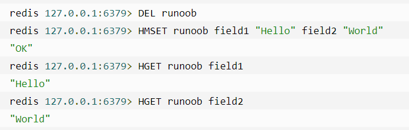
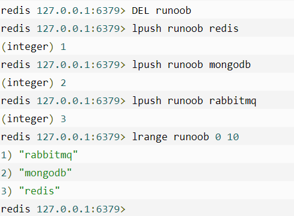
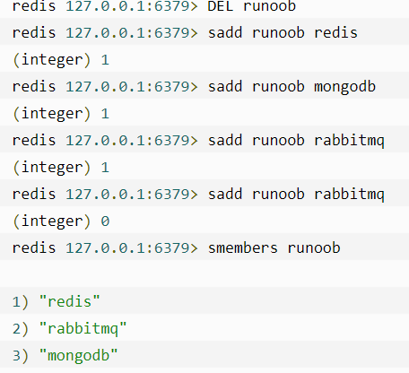
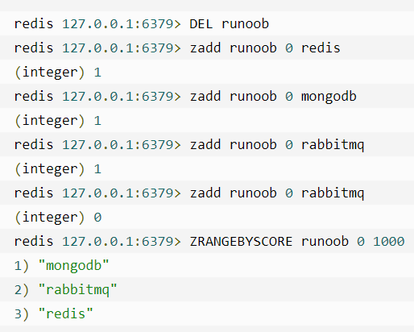
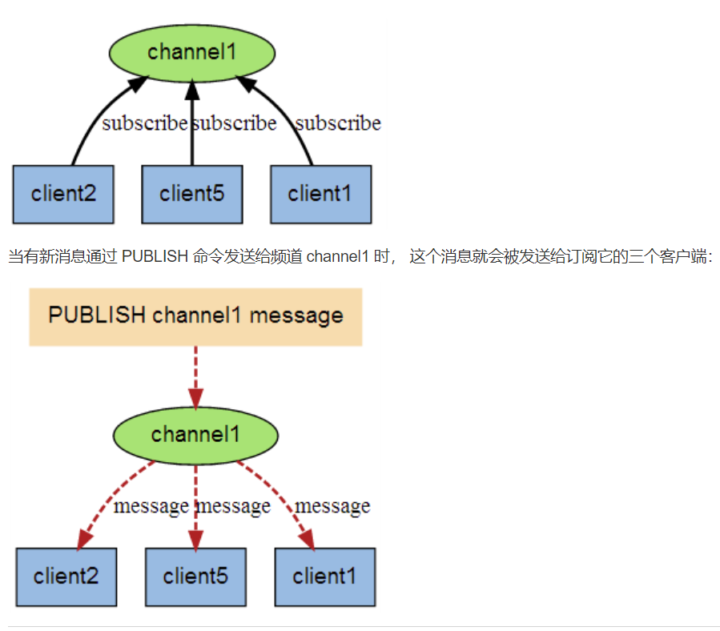
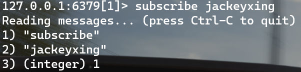
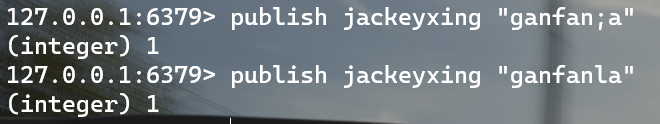
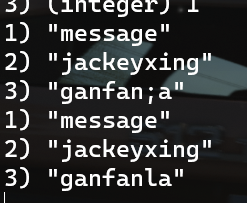
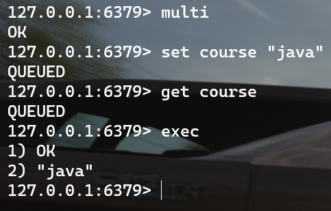
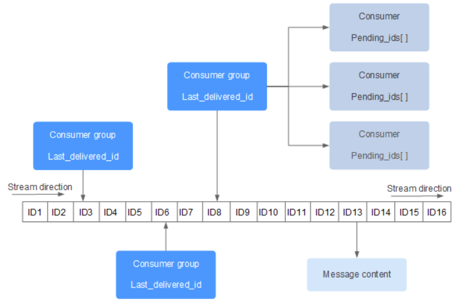

# Redis

## 基础篇

### 数据结构

1. 基本数据类型：string,hash,list,set,sortedSet
2. 特殊类型：GEO，BitMap，HyperLog

#### String（字符串）

string 是 redis 最基本的类型，你可以理解成与 Memcached 一模一样的类型，**一个 key 对应一个 value。**

string 类型是二进制安全的。意思是** redis 的 string 可以包含任何数据**。比如jpg图片或者序列化的对象。

string 类型是 Redis 最基本的数据类型，**string 类型的值最大能存储 512MB。**

#### Hash(哈希)

Redis hash 是一个键值(key=>value)对集合。

Redis hash 是一个 **string 类型**的 **field 和 value 的映射表**，hash 特别**适合用于存储对象**。



实例中我们使用了 Redis HMSET, HGET 命令，HMSET 设置了两个 field=>value 对, HGET 获取对应 field 对应的 value。

每个 hash 可以存储 2$$32 -1 键值对（40多亿）。

#### List（列表）

Redis 列表是简单的字符串列表，**按照插入顺序排序**。你可以添加一个元素到列表的头部（左边）或者尾部（右边）。



列表最多可存储 232 - 1 元素 (4294967295, 每个列表可存储40多亿)。

#### Set（集合）

Redis 的 **Set 是 string 类型的无序集合。**

集合是通过哈希表实现的，所以添加，删除，查找的复杂度都是 O(1)。

**sadd 命令**
添加一个 string 元素到 key 对应的 set 集合中，成功返回 1，如果元素已经在集合中返回 0。



**注意**：以上实例中 rabbitmq 添加了两次，但根据**集合内元素的唯一性**，第二次插入的元素将被忽略。

集合中最大的成员数为 232 - 1(4294967295, 每个集合可存储40多亿个成员)。

#### zset(sorted set：有序集合)

Redis zset 和 set 一样也是**string类型元素的集合,且不允许重复的成员**。
不同的是每个元素都会**关联一个double类型的分数**。redis正是**通过分数**来为集合中的成员进行**从小到大的排序**。

zset的成员是唯一的,但**分数(score)却可以重复**。

**zadd 命令**
添加元素到集合，元素在集合中存在则更新对应score



### Redis键

1    DEL key
该命令用于在 key 存在时删除 key。
2    DUMP key
序列化给定 key ，并返回被序列化的值。
3    EXISTS key
检查给定 key 是否存在。
4    EXPIRE key seconds
为给定 key 设置过期时间，以秒计。
5    EXPIREAT key timestamp
EXPIREAT 的作用和 EXPIRE 类似，都用于为 key 设置过期时间。 不同在于 EXPIREAT 命令接受的时间参数是 UNIX 时间戳(unix timestamp)。
6    PEXPIRE key milliseconds
设置 key 的过期时间以毫秒计。
7    PEXPIREAT key milliseconds-timestamp
设置 key 过期时间的时间戳(unix timestamp) 以毫秒计
8    KEYS pattern
查找所有符合给定模式( pattern)的 key 。
9    MOVE key db
将当前数据库的 key 移动到给定的数据库 db 当中。
10    PERSIST key
移除 key 的过期时间，key 将持久保持。
11    PTTL key
以毫秒为单位返回 key 的剩余的过期时间。
12    TTL key
以秒为单位，返回给定 key 的剩余生存时间(TTL, time to live)。
13    RANDOMKEY
从当前数据库中随机返回一个 key 。
14    RENAME key newkey
修改 key 的名称
15    RENAMENX key newkey
仅当 newkey 不存在时，将 key 改名为 newkey 。
16    SCAN cursor [MATCH pattern] [COUNT count]
迭代数据库中的数据库键。
17    TYPE key
返回 key 所储存的值的类型。

### Redis 字符串(String)

1    SET key value
设置指定 key 的值。
2    GET key
获取指定 key 的值。
3    GETRANGE key start end
返回 key 中字符串值的子字符
4    GETSET key value
将给定 key 的值设为 value ，并返回 key 的旧值(old value)。
5    GETBIT key offset
对 key 所储存的字符串值，获取指定偏移量上的位(bit)。
6    MGET key1 [key2..]
获取所有(一个或多个)给定 key 的值。
7    SETBIT key offset value
对 key 所储存的字符串值，设置或清除指定偏移量上的位(bit)。
8    SETEX key seconds value
将值 value 关联到 key ，并将 key 的过期时间设为 seconds (以秒为单位)。
9    SETNX key value
只有在 key 不存在时设置 key 的值。
10    SETRANGE key offset value
用 value 参数覆写给定 key 所储存的字符串值，从偏移量 offset 开始。
11    STRLEN key
返回 key 所储存的字符串值的长度。
12    MSET key value [key value ...]
同时设置一个或多个 key-value 对。
13    MSETNX key value [key value ...]
同时设置一个或多个 key-value 对，当且仅当所有给定 key 都不存在。
14    PSETEX key milliseconds value
这个命令和 SETEX 命令相似，但它以毫秒为单位设置 key 的生存时间，而不是像 SETEX 命令那样，以秒为单位。
15    INCR key
将 key 中储存的数字值增一。
16    INCRBY key increment
将 key 所储存的值加上给定的增量值（increment） 。
17    INCRBYFLOAT key increment
将 key 所储存的值加上给定的浮点增量值（increment） 。
18    DECR key
将 key 中储存的数字值减一。
19    DECRBY key decrement
key 所储存的值减去给定的减量值（decrement） 。
20    APPEND key value
如果 key 已经存在并且是一个字符串， APPEND 命令将指定的 value 追加到该 key 原来值（value）的末尾。\

### Redis 哈希(Hash)

1    HDEL key field1 [field2]
删除一个或多个哈希表字段
2    HEXISTS key field
查看哈希表 key 中，指定的字段是否存在。
3    HGET key field
获取存储在哈希表中指定字段的值。
4    HGETALL key
获取在哈希表中指定 key 的所有字段和值
5    HINCRBY key field increment
为哈希表 key 中的指定字段的整数值加上增量 increment 。
6    HINCRBYFLOAT key field increment
为哈希表 key 中的指定字段的浮点数值加上增量 increment 。
7    HKEYS key
获取所有哈希表中的字段
8    HLEN key
获取哈希表中字段的数量
9    HMGET key field1 [field2]
获取所有给定字段的值
10    HMSET key field1 value1 [field2 value2 ]
同时将多个 field-value (域-值)对设置到哈希表 key 中。
11    HSET key field value
将哈希表 key 中的字段 field 的值设为 value 。
12    HSETNX key field value
只有在字段 field 不存在时，设置哈希表字段的值。
13    HVALS key
获取哈希表中所有值。
14    HSCAN key cursor [MATCH pattern] [COUNT count]
迭代哈希表中的键值对。

---

### Redis 列表(List)

**Redis列表是简单的字符串列表，按照插入顺序排序。**你可以添加一个元素到列表的头部（左边）或者尾部（右边）

一个列表最多可以包含 2$32 - 1 个元素 (4294967295, 每个列表超过40亿个元素)。

1    BLPOP key1 [key2 ] timeout
移出并获取列表的第一个元素， 如果列表没有元素会阻塞列表直到等待超时或发现可弹出元素为止。
2    BRPOP key1 [key2 ] timeout
移出并获取列表的最后一个元素， 如果列表没有元素会阻塞列表直到等待超时或发现可弹出元素为止。
3    BRPOPLPUSH source destination timeout
从列表中弹出一个值，将弹出的元素插入到另外一个列表中并返回它； 如果列表没有元素会阻塞列表直到等待超时或发现可弹出元素为止。
4    LINDEX key index
通过索引获取列表中的元素
5    LINSERT key BEFORE|AFTER pivot value
在列表的元素前或者后插入元素
6    LLEN key
获取列表长度
7    LPOP key
移出并获取列表的第一个元素
8    LPUSH key value1 [value2]
将一个或多个值插入到列表头部
9    LPUSHX key value
将一个值插入到已存在的列表头部
10    **LRANGE key start stop**
获取列表指定范围内的元素
11    LREM key count value(count值影响删除的规则)
移除列表元素
12    LSET key index value
通过索引设置列表元素的值
13    LTRIM key start stop
对一个列表进行修剪(trim)，就是说，让列表只保留指定区间内的元素，不在指定区间之内的元素都将被删除。
14    RPOP key
移除列表的最后一个元素，返回值为移除的元素。
15    RPOPLPUSH source destination
移除列表的最后一个元素，并将该元素添加到另一个列表并返回
16    RPUSH key value1 [value2]
在列表中添加一个或多个值
17    RPUSHX key value
为已存在的列表添加值

<br/>

### Redis 集合(Set)

Redis 的 Set 是 String 类型的无序集合。**集合成员是唯一的**，这就意味着集合中不能出现重复的数据。

集合对象的编码可以是 intset 或者 hashtable。

Redis 中集合是通过哈希表实现的，所以添加，删除，查找的复杂度都是 O(1)。

集合中最大的成员数为 2$32 - 1 (4294967295, 每个集合可存储40多亿个成员)。

**Redis 集合命令**
下表列出了 Redis 集合基本命令：

1    SADD key member1 [member2]
向集合添加一个或多个成员
2    SCARD key
获取集合的成员数
3    SDIFF key1 [key2]
返回第一个集合与其他集合之间的差异。
4    SDIFFSTORE destination key1 [key2]
返回给定所有集合的差集并存储在 destination 中
5    SINTER key1 [key2]
返回给定所有集合的交集
6    SINTERSTORE destination key1 [key2]
返回给定所有集合的交集并存储在 destination 中
7    SISMEMBER key member
判断 member 元素是否是集合 key 的成员
8    SMEMBERS key
返回集合中的所有成员
9    SMOVE source destination member
将 member 元素从 source 集合移动到 destination 集合
10    SPOP key
移除并返回集合中的一个随机元素
11    SRANDMEMBER key [count]
返回集合中一个或多个随机数
12    SREM key member1 [member2]
移除集合中一个或多个成员
13    SUNION key1 [key2]
返回所有给定集合的并集
14    SUNIONSTORE destination key1 [key2]
所有给定集合的并集存储在 destination 集合中
15    SSCAN key cursor [MATCH pattern] [COUNT count]
迭代集合中的元素

<br/>

### Redis 有序集合(sorted set)

Redis 有序集合和集合一样也是 string 类型元素的集合,且不允许重复的成员。

不同的是每个元素都会关联一个 double 类型的分数。redis 正是通过分数来为集合中的成员进行从小到大的排序。

**有序集合的成员是唯一的,但分数(score)却可以重复。**

集合是通过哈希表实现的，所以添加，删除，查找的复杂度都是 O(1)。 集合中最大的成员数为 2$32 - 1 (4294967295, 每个集合可存储40多亿个成员)。

**Redis 有序集合命令**

1    ZADD key score1 member1 [score2 member2]
向有序集合添加一个或多个成员，或者更新已存在成员的分数
2    ZCARD key
获取有序集合的成员数
3    ZCOUNT key min max
计算在有序集合中指定区间分数的成员数
4    ZINCRBY key increment member
有序集合中对指定成员的分数加上增量 increment
5    ZINTERSTORE destination numkeys key [key ...] **(记住要给定key的个数)**
计算给定的一个或多个有序集的交集并将结果集存储在新的有序集合 destination 中
6    ZLEXCOUNT key min max **(例如zlexcount name [a [z)**
在有序集合中计算指定字典区间内成员数量
7    ZRANGE key start stop [WITHSCORES]
通过索引区间返回有序集合指定区间内的成员
8    ZRANGEBYLEX key min max [LIMIT offset count]
通过字典区间返回有序集合的成员
9    ZRANGEBYSCORE key min max [WITHSCORES] [LIMIT]
通过分数返回有序集合指定区间内的成员
10    ZRANK key member
返回有序集合中指定成员的索引
11    ZREM key member [member ...]
移除有序集合中的一个或多个成员
12    ZREMRANGEBYLEX key min max
移除有序集合中给定的字典区间的所有成员
13    ZREMRANGEBYRANK key start stop
移除有序集合中给定的排名区间的所有成员
14    ZREMRANGEBYSCORE key min max
移除有序集合中给定的分数区间的所有成员
15    ZREVRANGE key start stop [WITHSCORES]
返回有序集中指定区间内的成员，通过索引，分数从高到低
16    ZREVRANGEBYSCORE key max min [WITHSCORES]
返回有序集中指定分数区间内的成员，分数从高到低排序
17    ZREVRANK key member
返回有序集合中指定成员的排名，有序集成员按分数值递减(从大到小)排序
18    ZSCORE key member
返回有序集中，成员的分数值
19    ZUNIONSTORE destination numkeys key [key ...]
计算给定的一个或多个有序集的并集，并存储在新的 key 中
20    ZSCAN key cursor [MATCH pattern] [COUNT count]
迭代有序集合中的元素（包括元素成员和元素分值）

<br/>

### Redis HyperLogLog

Redis 在 **2.8.9** 版本添加了 HyperLogLog 结构。

Redis HyperLogLog 是用来做基数统计的算法，HyperLogLog 的**优点是，在输入元素的数量或者体积非常非常大时，计算基数所需的空间总是固定 的、并且是很小的。**

在 Redis 里面，每个 HyperLogLog 键只需要花费 12 KB 内存，就可以计算接近 2^64 个不同元素的基 数。这和计算基数时，元素越多耗费内存就越多的集合形成鲜明对比。

但是，**因为 HyperLogLog 只会根据输入元素来计算基数，而不会储存输入元素本身，所以 HyperLogLog 不能像集合那样，返回输入的各个元素**

**什么是基数?**
比如数据集 {1, 3, 5, 7, 5, 7, 8}， 那么这个数据集的**基数集**为 {1, 3, 5 ,7, 8}, 基数(不重复元素)为5。 基数估计就是在误差可接受的范围内，快速计算基数。

**Redis HyperLogLog 命令**

1    PFADD key element [element ...]
添加指定元素到 HyperLogLog 中。
2    PFCOUNT key [key ...]
返回给定 HyperLogLog 的基数估算值。
3    PFMERGE destkey sourcekey [sourcekey ...]
将多个 HyperLogLog 合并为一个 HyperLogLog

<br/>

### Redis 发布订阅

Redis 发布订阅 (pub/sub) 是一种消息通信模式：发送者 (pub) 发送消息，订阅者 (sub) 接收消息。

Redis 客户端可以订阅任意数量的频道。

下图展示了频道 channel1 ， 以及订阅这个频道的三个客户端 —— client2 、 client5 和 client1 之间的关系：



1. **创建客户端1并且订阅频道jackeyxing**



2. **创建客户端2向频道jackeyxing发送信息**



3. **此时返回客户端1可以看见收到的信息**



<br/>

**Redis 发布订阅命令**

1    PSUBSCRIBE pattern [pattern ...]
订阅一个或多个符合给定模式的频道。
2    PUBSUB subcommand [argument [argument ...]]
查看订阅与发布系统状态。

**pubsub channels[pattern]：列出当前的活跃频道；
pubsub numsub[channel_1....channel_n]：返回给定频道订阅者的数量；
pubsub numpat：返回订阅者的数量，所有客户端之和。**

3    PUBLISH channel message
将信息发送到指定的频道。
4    PUNSUBSCRIBE [pattern [pattern ...]]
退订所有给定模式的频道。
5    SUBSCRIBE channel [channel ...]
订阅给定的一个或多个频道的信息。
6    UNSUBSCRIBE [channel [channel ...]]
指退订给定的频道。

<br/>

### Redis 事务

Redis 事务**可以一次执行多个命令**， 并且带有以下**三个重要的保证**：

批量操作在发送 EXEC 命令前被放入队列缓存。
收到 EXEC 命令后进入事务执行，事务中任意命令执行失败，其余的命令依然被执行。
在事务执行过程，其他客户端提交的命令请求不会插入到事务执行命令序列中。
一个事务从开始到执行会经历以下三个阶段：

开始事务。
命令入队。
执行事务。

**实例**

以下是一个事务的例子， 它先以 MULTI 开始一个事务， 然后将多个命令入队到事务中， 最后由 EXEC 命令触发事务， 一并执行事务中的所有命令：



单个 Redis 命令的执行是原子性的，但 Redis 没有在事务上增加任何维持原子性的机制，所以 **Redis 事务的执行并不是原子性**的。

事务可以理解为一个打包的批量执行脚本，但批量指令并非原子化的操作，中间某条指令的失败不会导致前面已做指令的回滚，也不会造成后续的指令不做。

**Redis 事务命令**

1    DISCARD
取消事务，放弃执行事务块内的所有命令。
2    EXEC
执行所有事务块内的命令。
3    MULTI
标记一个事务块的开始。
4    [UNWATCH](http://t.csdn.cn/EQuP4)
取消 WATCH 命令对所有 key 的监视。
5    WATCH key [key ...]
监视一个(或多个) key ，如果在事务执行之前这个(或这些) key 被其他命令所改动，那么事务将被打断。

<br/>

### Redis 脚本

Redis 脚本**使用 Lua 解释器来执行脚本**。 Redis 2.6 版本通过内嵌支持 Lua 环境。执行脚本的常用命令为 EVAL。

**Redis 脚本命令**

1    EVAL script numkeys key [key ...] arg [arg ...]
执行 Lua 脚本。
2    EVALSHA sha1 numkeys key [key ...] arg [arg ...]
执行 Lua 脚本。
3    SCRIPT EXISTS script [script ...]
查看指定的脚本是否已经被保存在缓存当中。
4    SCRIPT FLUSH
从脚本缓存中移除所有脚本。
5    SCRIPT KILL
杀死当前正在运行的 Lua 脚本。
6    SCRIPT LOAD script
将脚本 script 添加到脚本缓存中，但并不立即执行这个脚本。

<br/>

### Redis 连接

Redis 连接命令主要是用于连接 redis 服务。

实例
以下实例演示了客户端如何通过密码验证连接到 redis 服务，并检测服务是否在运行:

1    AUTH password
验证密码是否正确
2    ECHO message
打印字符串
3    PING
查看服务是否运行
4    QUIT
关闭当前连接
5    SELECT index
切换到指定的数据库

<br/>

### Redis 服务器

Redis 服务器命令主要是用于管理 redis 服务。

1    BGREWRITEAOF
异步执行一个 AOF（AppendOnly File） 文件重写操作
2    BGSAVE
在后台异步保存当前数据库的数据到磁盘
3    CLIENT KILL [ip:port] [ID client-id]
关闭客户端连接
4    CLIENT LIST
获取连接到服务器的客户端连接列表
5    CLIENT GETNAME
获取连接的名称
6    CLIENT PAUSE timeout
在指定时间内终止运行来自客户端的命令
7    CLIENT SETNAME connection-name
设置当前连接的名称
8    CLUSTER SLOTS
获取集群节点的映射数组
9    COMMAND
获取 Redis 命令详情数组
10    COMMAND COUNT
获取 Redis 命令总数
11    COMMAND GETKEYS
获取给定命令的所有键
12    TIME
返回当前服务器时间
13    COMMAND INFO command-name [command-name ...]
获取指定 Redis 命令描述的数组
14    CONFIG GET parameter
获取指定配置参数的值
15    CONFIG REWRITE
对启动 Redis 服务器时所指定的 redis.conf 配置文件进行改写
16    CONFIG SET parameter value
修改 redis 配置参数，无需重启
17    CONFIG RESETSTAT
重置 INFO 命令中的某些统计数据
18    DBSIZE
返回当前数据库的 key 的数量
19    DEBUG OBJECT key
获取 key 的调试信息
20    DEBUG SEGFAULT
让 Redis 服务崩溃
21    FLUSHALL
删除所有数据库的所有key
22    FLUSHDB
删除当前数据库的所有key
23    INFO [section]
获取 Redis 服务器的各种信息和统计数值
24    LASTSAVE
返回最近一次 Redis 成功将数据保存到磁盘上的时间，以 UNIX 时间戳格式表示
25    MONITOR
实时打印出 Redis 服务器接收到的命令，调试用
26    ROLE
返回主从实例所属的角色
27    SAVE
同步保存数据到硬盘
28    SHUTDOWN [NOSAVE] [SAVE]
异步保存数据到硬盘，并关闭服务器
29    SLAVEOF host port
将当前服务器转变为指定服务器的从属服务器(slave server)
30    SLOWLOG subcommand [argument]
管理 redis 的慢日志
31    SYNC
用于复制功能(replication)的内部命令

<br/>

### Redis GEO

Redis GEO 主要用于**存储地理位置信息，并对存储的信息进行操作**，该功能在 **Redis 3.2** 版本新增。

Redis GEO 操作方法有：

geoadd：添加地理位置的坐标。
geopos：获取地理位置的坐标。
geodist：计算两个位置之间的距离。
georadius：根据用户给定的经纬度坐标来获取指定范围内的地理位置集合。
georadiusbymember：根据储存在位置集合里面的某个地点获取指定范围内的地理位置集合。
geohash：返回一个或多个位置对象的 geohash 值。

<br/>

### Redis Stream(我用的4.0版本故没演示)

Redis Stream 是 Redis 5.0 版本新增加的数据结构。

Redis Stream 主要**用于消息队列（MQ，Message Queue）**，Redis 本身是有一个 Redis 发布订阅 (pub/sub) 来实现消息队列的功能，但它有个**缺点就是消息无法持久化**，如果出现网络断开、Redis 宕机等，消息就会被丢弃。

**简单来说发布订阅 (pub/sub) 可以分发消息，但无法记录历史消息。**

而 Redis Stream **提供了消息的持久化和主备复制功能**，可以让任何客户端访问任何时刻的数据，并且能记住每一个客户端的访问位置，还能保证消息不丢失。

Redis Stream 的结构如下所示，它有一个消息链表，将所有加入的消息都串起来，每个消息都有一个唯一的 ID 和对应的内容：



每个 Stream 都有唯一的名称，它就是 Redis 的 key，在我们首次使用 xadd 指令追加消息时自动创建。

上图解析：

Consumer Group ：消费组，使用 XGROUP CREATE 命令创建，一个消费组有多个消费者(Consumer)。
last_delivered_id ：游标，每个消费组会有个游标 last_delivered_id，任意一个消费者读取了消息都会使游标 last_delivered_id 往前移动。
pending_ids ：消费者(Consumer)的状态变量，作用是维护消费者的未确认的 id。 pending_ids 记录了当前已经被客户端读取的消息，但是还没有 ack (Acknowledge character：确认字符）。
消息队列相关命令：

XADD - 添加消息到末尾
XTRIM - 对流进行修剪，限制长度
XDEL - 删除消息
XLEN - 获取流包含的元素数量，即消息长度
XRANGE - 获取消息列表，会自动过滤已经删除的消息
XREVRANGE - 反向获取消息列表，ID 从大到小
XREAD - 以阻塞或非阻塞方式获取消息列表
消费者组相关命令：

XGROUP CREATE - 创建消费者组
XREADGROUP GROUP - 读取消费者组中的消息
XACK - 将消息标记为"已处理"
XGROUP SETID - 为消费者组设置新的最后递送消息ID
XGROUP DELCONSUMER - 删除消费者
XGROUP DESTROY - 删除消费者组
XPENDING - 显示待处理消息的相关信息
XCLAIM - 转移消息的归属权
XINFO - 查看流和消费者组的相关信息；
XINFO GROUPS - 打印消费者组的信息；
XINFO STREAM - 打印流信息

---

## 高级篇

### Redis 数据备份与恢复

Redis SAVE 命令用于创建当前数据库的备份。该命令将在 redis 安装目录中创建dump.rdb文件。

**恢复数据**
如果需要恢复数据，只需将备份文件 (dump.rdb) **移动到 redis 安装目录**并启动服务即可。

**Bgsave**
创建 redis 备份文件也可以使用命令 BGSAVE，该命令在后台执行。

<br/>

### Redis 安全

我们可以通过 redis 的配置文件设置密码参数，这样客户端连接到 redis 服务就需要密码验证，这样可以让你的 redis 服务更安全。

- 查看设置的密码 CONFIG get requirepass
- 设置密码 config set requirepass "password"
- 设置密码后登录客户端 redis-cli -a "password" 或者登陆后使用auth password命令

<br/>

<br/>

### Redis 性能测试

Redis 性能测试是通过同时执行多个命令实现的。

redis 性能测试的基本命令如下：

**redis-benchmark [option] [option value]**

**注意**：该命令是**在 redis 的目录下执行**的，而不是 redis 客户端的内部指令。

redis 性能测试工具可选参数如下所示：

号    选项    描述                                                                     默认值
1    -h    指定服务器主机名                                                        127.0.0.1
2    -p    指定服务器端口                                                            6379
3    -s    指定服务器 socket    
4    -c    指定并发连接数                                                             50
5    -n    指定请求数                                                                   10000
6    -d    以字节的形式指定 SET/GET 值的数据大小                      2
7    -k    1=keep alive 0=reconnect                                            1
8    -r    SET/GET/INCR 使用随机 key, SADD 使用随机值    
9    -P    通过管道传输 <numreq> 请求                                        1
10    -q    强制退出 redis。仅显示 query/sec 值    
11    --csv    以 CSV 格式输出    
12    -l（L 的小写字母）    生成循环，永久执行测试    
13    -t    仅运行以逗号分隔的测试命令列表。    
14    -I（i 的大写字母）    Idle 模式。仅打开 N 个 idle 连接并等待。    


以上实例中主机为 127.0.0.1，端口号为 6379，执行的命令为 set,lpush，请求数为 10000，通过 -q 参数让结果只显示每秒执行的请求数。

<br/>

### Redis 客户端连接

Redis 通过监听一个 TCP 端口或者 Unix socket 的方式来接收来自客户端的连接，当一个连接建立后，Redis 内部会进行以下一些操作：

- 首先，客户端 socket 会被**设置为非阻塞模式**，因为 Redis 在网络事件处理上采用的是非阻塞多路复用模型。
- 然后为这个 socket **设置 TCP_NODELAY 属性**，禁用 Nagle 算法
- 然后**创建一个可读的文件事件用于监听**这个客户端 socket 的数据发送

**最大连接数**
在 Redis2.4 中，最大连接数是被直接硬编码在代码里面的，而在2.6版本中这个值变成可配置的。

maxclients 的默认值是 10000，也可以在 redis.conf 中对这个值进行修改。我们可以在服务启动时设置最大连接数为 100000：

**redis-server --maxclients 100000**

**客户端命令**

1    CLIENT LIST    返回连接到 redis 服务的客户端列表
2    CLIENT SETNAME    设置当前连接的名称
3    CLIENT GETNAME    获取通过 CLIENT SETNAME 命令设置的服务名称
4    CLIENT PAUSE    挂起客户端连接，指定挂起的时间以毫秒计
5    CLIENT KILL  IP:PORT  关闭客户端连接

<br/>

### Redis 管道技术

Redis是一种基于客户端-服务端模型以及请求/响应协议的TCP服务。这意味着**通常情况下**一个请求会遵循以下步骤：

- 客户端向服务端发送一个查询请求，并监听Socket返回，通常是以阻塞模式，等待服务端响应。
- 服务端处理命令，并将结果返回给客户端。

**Redis管道技术**

Redis 管道技术可以在**服务端未响应时**，客户端**可以继续向服务端发送请求**，并最终**一次性**读取所有服务端的响应。


以上实例中我们通过使用 PING 命令查看redis服务是否可用， 之后我们设置了 name的值为 xxj，然后我们获取 name的值并使得 visitor 自增 3 次。

在返回的结果中我们**可以看到这些命令一次性向 redis 服务提交，并最终一次性读取所有服务端的响应**。

管道技术最显著的优势是**提高了 redis 服务的性能。**

<br/>

### Redis 分区

分区是**分割数据到多个Redis实例的处理过程**，因此**每个实例只保存key的一个子集**。

**分区的优势**

- 通过**利用多台计算机内存的和值**，允许我们**构造更大的数据库。**
- 通过多核和多台计算机，允许我们扩展计算能力；通过多台计算机和网络适配器，允许我们扩展网络带宽。

**分区的不足**
redis的一些特性在分区方面表现的不是很好：

- 涉及多个key的操作通常是不被支持的。举例来说，当两个set映射到不同的redis实例上时，你就不能对这两个set执行交集操作。
- 涉及多个key的redis事务不能使用。
- 当使用分区时，数据处理较为复杂，比如你需要处理多个rdb/aof文件，并且从多个实例和主机备份持久化文件。
- 增加或删除容量也比较复杂。redis集群大多数支持在运行时增加、删除节点的透明数据平衡的能力，但是类似于客户端分区、代理等其他系统则不支持这项特性。然而，一种叫做presharding的技术对此是有帮助的。

<br/>

***分区类型***
Redis 有两种类型分区。 假设有4个Redis实例 R0，R1，R2，R3，和类似user:1，user:2这样的表示用户的多个key，对既定的key有多种不同方式来选择这个key存放在哪个实例中。也就是说，有不同的系统来映射某个key到某个Redis服务。

- **范围分区**
最简单的分区方式是按范围分区，就是映射一定范围的对象到特定的Redis实例。比如，ID从0到10000的用户会保存到实例R0，ID从10001到 20000的用户会保存到R1，以此类推。这种方式是可行的，并且在实际中使用，不足就是要有一个区间范围到实例的映射表。这个表要被管理，同时还需要各 种对象的映射表，通常对Redis来说并非是好的方法。
- **哈希分区**
  
  另外一种分区方法是hash分区。这对任何key都适用，也无需是object_name:这种形式，像下面描述的一样简单：
  - 用一个hash函数将key转换为一个数字，比如使用crc32 hash函数。对key foobar执行crc32(foobar)会输出类似93024922的整数。
  - 对这个整数取模，将其转化为0-3之间的数字，就可以将这个整数映射到4个Redis实例中的一个了。93024922 % 4 = 2，就是说key foobar应该被存到R2实例中。注意：取模操作是取除的余数，通常在多种编程语言中用%操作符实现。

<br/>

### Java 使用 Redis

需要导入jedis包

**实例**

1. **连接到 redis 服务**

```java
package redisTest;

import redis.clients.jedis.Jedis;
public class RedisConnection {
    public static void main(String[] args) {
        //连接本地的Redis服务
        Jedis jedis = new Jedis("127.0.0.1",6379);
        //如果redis客户端需要密码
//        jedis.auth("xxj");
        System.out.println("连接成功");
        //查看服务是否在运行
        System.out.println("Ping!!" + jedis.ping());
    }
}

```

2. **Redis Java String(字符串)**

```java
package redisTest;

import org.junit.Test;
import redis.clients.jedis.Jedis;

public class RedisTest {
    private String url = "127.0.0.1";
    @Test
    public void redisStringJava() {
        try(Jedis jedis = new Jedis(url,6379);){//运行结束后，会自动关闭小括号中的资源
            System.out.println("连接成功");
            //设置redis字符串数据
            jedis.set("name","xxj");
            //获取数据并输出
            System.out.println("redis name储存的字符串" + jedis.get("name"));

        }
    }
}

```