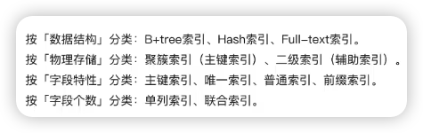
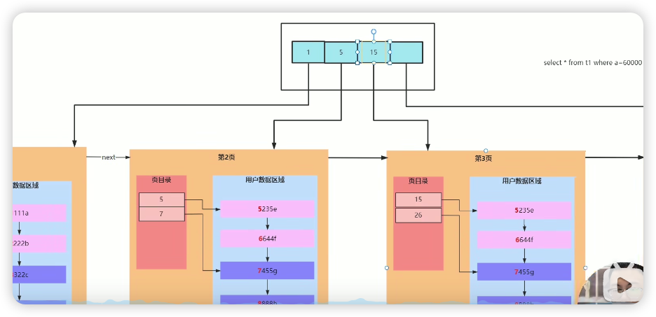
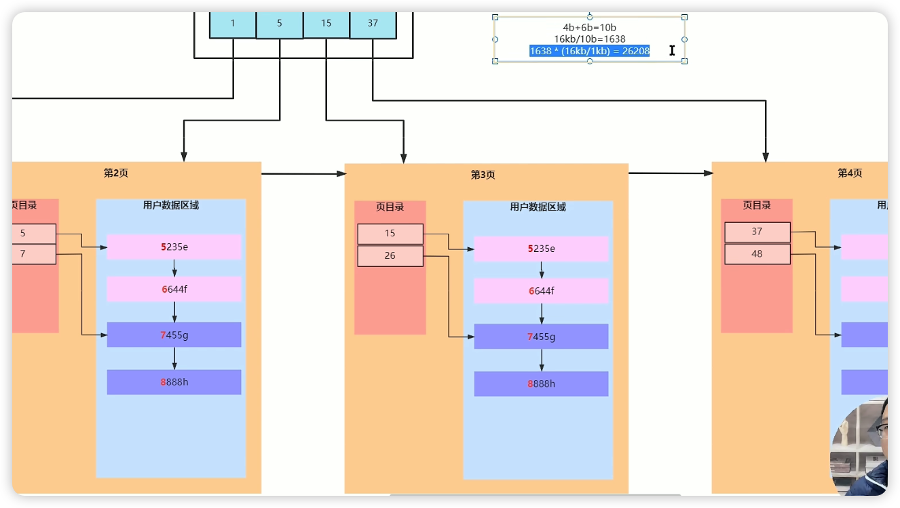
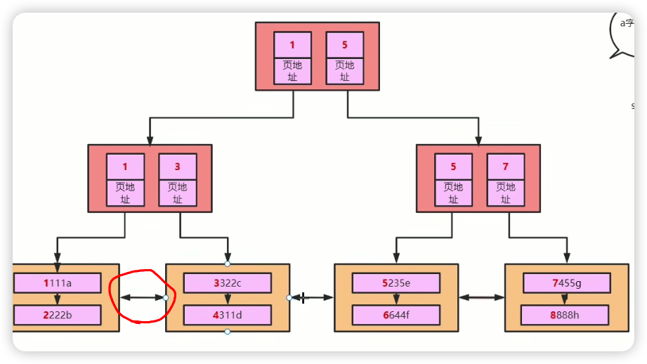
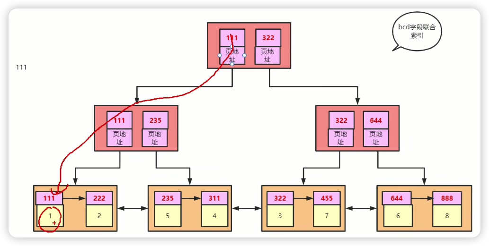

# MySQL连环50问

【小破站高质量面试题：MySQL 夺命连环50问（高频面试题及解析）】 https://www.bilibili.com/video/BV1ta411C7xq/?p=4&share_source=copy_web&vd_source=72c4cacd7237c3e04c39153a62aed182

## 1. 索引的分类

- 按照数据结构分类：B+tree索引、Hash索引、Full-text索引
- 按照物理存储分类：聚簇索引（主键索引）、二级索引（辅助索引）
  - 聚簇索引：Innodb将索引值和数据存储在一起
  - 二级索引：Innodb中只存储了索引值和主键id
- 按照字段特性分类：主键索引、唯一索引、普通索引、前缀索引
- 按照字段个数分类：单列索引、联合索引

## 2. B树和B+树的区别是什么

主要就是叶子结点之间按顺序有指针连接

## 3. innodb中的B+树是如何产生的

思想跟操作系统的二级页表、Redis跳表相似

一页就是一个节点 一页16kb

一般最好两层最好，超过4层就影响性能了

## 4. 高度为2的B+树能存多少数据

跟存的记录大小有关，假设索引页的记录大小为10b(int 4b + 指针 6b)，可以存16kb/10= 1638个索引，也就是能管理1638个叶子节点，假设叶子节点记录大小为1kb那么一页可以存16条，所以一共能存1638 * 16条数据记录。

## 5. Innodb是如何支持范围查找能走索引的？

秒在数据页（叶子节点）间的双向指针，比如主键是a。要查询a>4的数据，那么他会去查找a=4的数据，然后根据数据页的指针返回之后的数据，如果要查a<4的数据，也是先查a=4然后依据指针返回前面的数据，这就是为什么需要双向指针的原因。

## 6. 为什么要遵循最左前缀原则才能利用索引

假设五个字段a,b,c,d,e主键为a，在这里创建了bcd联合索引，那么他是怎么排序的呢？是一次比较各个字段进行排序的，就是第一个字段相等那就比较第二个字段，以此类推，类似于java字符串比较大小。

创建的b+树是这样的：

这里只存了bcd三个字段，如果需要查找a和e则需要回表

为什么要最左前缀原则看这个树的结构想想就知道了，如果给出这样的查询条件d=2 & c = 3（这里查询语句的顺序没有影响）没有b那怎么比较呢？？第一个数不知道是啥，比不了，那如果是查询条件是1*1就是c不给的意思，看上面的树，他会找到1\*1所在的页，然后再在这个页中查找d=1的数据，然后如果需要回表就回表。

这里提一下1*1这种查询会出现索引下推的问题，5.6之前他是这样查的：先找到1\*1的页，如果要回表的话，就这些页全部回表，然后再在聚簇索引中查找d=1的数据；而5.6之后，先在页面中查找，再回表。实际上就减少了回表次数。