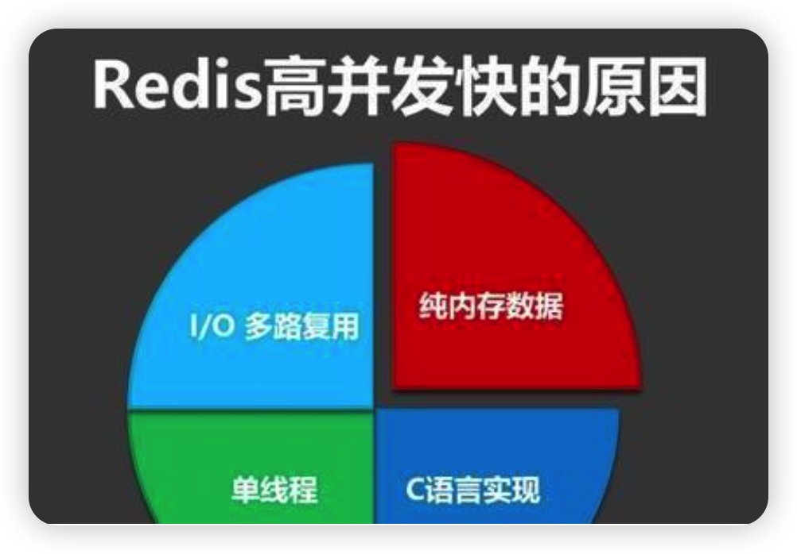
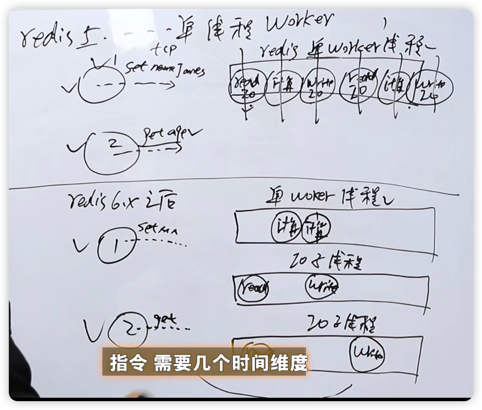
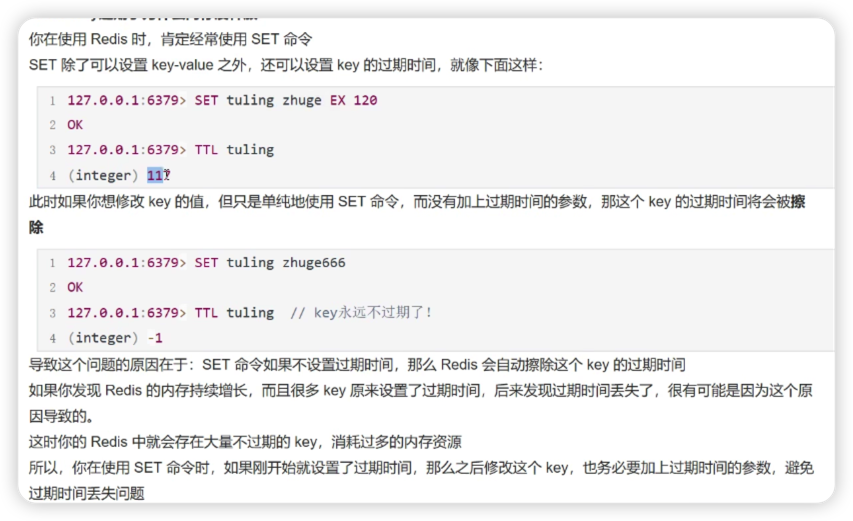
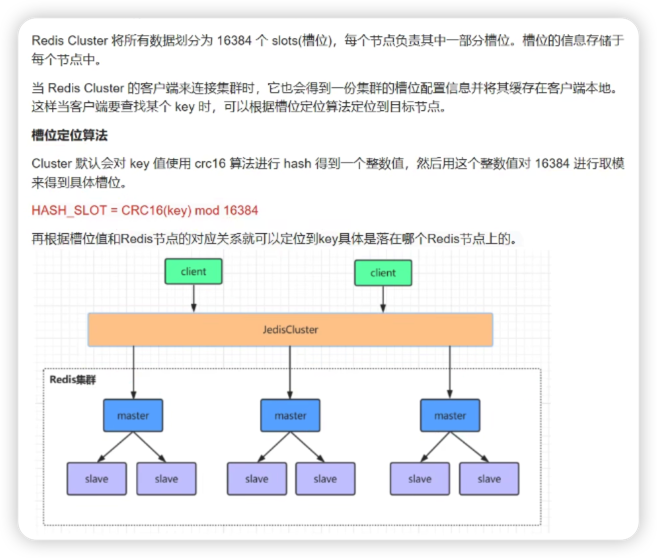
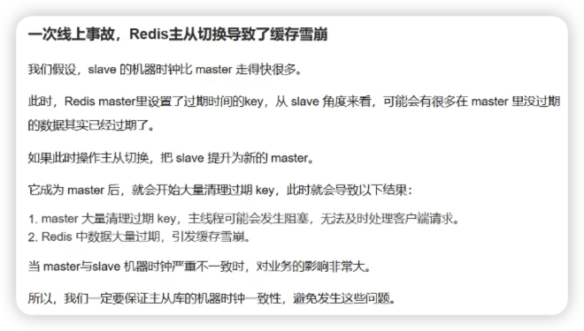

# Redis八股文--B站微软程序员

【【微软程序员】Redis入门】 https://www.bilibili.com/video/BV1aU4y1Z71c/?p=4&share_source=copy_web&vd_source=72c4cacd7237c3e04c39153a62aed182

## 一、基本数据类型

基本数据类型指的是值的数据类型，键都为字符串

### 1. 字符串


- 为什么Redis不采用c语言的字符串直接做具体实现呢？
  - O(n)复杂度获取长度
  - 没有较好的扩容机制
  - 特殊字符无法处理


左图3.0之前的，右图是之后的

Redis字符串又称为SDS（Simple Dynamic String）

- 左图
  - len是实际使用的长度，free是未使用的长度，len + free是实际申请的长度（空间）
  - buf就是存储字符串的结构了
- 右图
  - alloc是分配的长度，剩余的长度=alloc - len
  - flags是啥后面讲


因为有的字符串长一点有的短一点不同的flags对应不同长度的sds，为了节省空间

- 总结
  - Redis字符串本质上是C语言的字符数组，加上了一点别的标识属性的结构体而已。
  - 这样做的优点
    - 字符串长度获取时间复杂度变从O(n)变为O(1)
    - 减少字符串扩容引起的数据搬运次数
    - 可以存储更加复杂的二进制数据

### 2. 链表

Redis底层链表的实现是双向链表

```c++
typedef struct listNode {
	struct listNode *prev;
	struct listNode *next;
	void * value;
} listNode;

typedef struct list {
  listNode * head; //链表头节点
  
  listNode * tail; //链表尾节点
  
  unsigned long len; //链表长度
  
  void *(*dup) (void *ptr); //节点复制函数
  
  void *(free) (void *ptr); //节点值释放函数
  
  void(*match) (void *ptr, void *key); //节点值对比函数
}
```

常见API函数：


### 3. 哈希表

哈希表是一种存储数据的结构。

在哈希表中，键和值是一一对应的关系。哈希表可以通过键，在O(1)的时间复杂度的情况下获得对应的值。

由于C语言自己没有内置哈希表这一数据结构，因此Redis自己实现了Hash表。

- Redis采用拉链法作为哈希表的实现。


- Redis中哈希表的数据结构

  - dicht 单纯表示一个哈希表

  - 

    - ```c++
      typedef struct dictht {
        dictEntry **table; //哈希表数组（哈希表项集合）
        unsigned long size; //Hash表的大小
        unsigned long sizemask; //哈希表掩码。类似于子网掩码，计算下标
        unsigned long used; //Hash表已使用的大小	 
      } dictht;
      ```

      负载因子 = used / size，需要保证负载因子在一个合理范围之内，不要太小白白占用空间，不要太大降低查询效率，后面讲调整原则。

  - dictEntry 哈希表的一项，可以看作就是一个键值对

  - 

    - ```c++
      typedef struct dictEntry {
        void *key;
        union {
          void *val;
          uint64_t u64;
          int64_t s64;
          double d;
        } v;
        struct dictEntry *next;
      } dictEntry;
      ```

  - dict Redis给外层调用的哈希表结构，包括两个dictht，也可以说封装了dicht

    - 

    - ```c++
      typedef struct dict {
        dictType *type;
        void *privdata;
        dictht ht[2];
        int rehashidx;
      } dict;
      ```

    - 负载因子 = 散列表内元素个数 / 散列表的长度

      负载因子值在合理范围内，程序需要对哈希表进行扩展和收缩。

      由于空间变大或者缩小，之前的键在老表的存储位置，在新表中不一定一样了，需要重新计算。这个重新计算，并把老表元素转移到新表元素的过程就叫做rehash。

    - ht[0]存放的老表，ht[1]存放的是新表

      步骤：

      - 分配空间给ht[1]。分配空间有ht[0]的具体参数决定。
      - 将ht[0]存储的键值对，重新计算hash值和索引值，并复制到ht[1]的对应位置中。
      - 当复制完成后，释放ht[0]所占空间，并将ht[0]指向ht[1]目前的地址。
      - ht[1]指向空表。

- 关于负载因子

  - 
  - 如果Redis没有执行后台备份，当负载因子大于等于1就执行（反正CPU闲着也是闲着）
  - 如果Redis在执行那个后台备份，当负载因子大于等于5就执行。（CPU在干备份了，咋对于实在挤的表改一改，等CPU闲下来，再把稍微偏挤的rehash）

### 4. 集合

- 普通集合

  - 就是对hash表的封装

- 整数集合

  - 里面只有整数，且是有序的

  - 

  - ```c++
    typedef struct intset {
      uint32_t encoding; //编码方式，包含int16_t, int32_t, int64_t
    	uint32_t length; //集合长度
      int8_t contents[]; //元素数组
    }
    ```

  - content是递增的数组，只能通过二分法查找元素，时间复杂度为O(logN)了，效率低于Hash查找，但是节省空间，这是Redis时间换空间的策略。

  - intset修改查找操作怎么做呢？

    - 修改：由于intset占用一段连续内存，所以每次修改数据需要重新申请空间，增加就是扩容，删除就是缩容
    - 查找，intset一段空间有序，因此可以执行二分查找算法

### 5. 有序集合

Zet实现方式之一是跳表，再讲之前需要讲一下跳表

普通链表，查找O(n)


跳表降低了时间复杂度


ZSet数据结构


```c++
typedef struct zskiplistNode {
  sds ele; //元素，在热词情景中，就变成了一段文字
  
  double score; //权重值，热词场景下就是热度
  
  struct zskiplistNode *backward;//指向后面的指针
  
	struct skiplistLevel {
    struct zskiplistNode *forward;
    unsigned long span;
  } level[];
  //节点的level数组，x.level[i].span
  //表示节点x在第i层到其下一个节点需跳过的节点数，两个相邻节点span为1
} zskiplistNode;

typedef struct zskiplist {
  struct zskiplistNode *header, *tail;
  unsigned long length;
  int level;
} zskiplist;
```

有意思的是level[]，比如上图三个索引的2（就是第一个节点）就是使用level[]来区分的，不是真正创建了三个节点。

- 跳表有什么问题吗？更新元素的时候需要重新创建索引，那有什么解决方法吗
  - 
  - 以上方法，对查询效率有影响，但是最终差不了太多

- 业务场景：利用Redis跳表实现微博热搜Top K

- ZSet常见API

  

## 二、持久化

### 1. RDB

- Redis持久化简述
  - Redis是内存型数据库
  - 优点：内存读取速度快
  - 缺点：数据易失性，断电后内存数据消失
  - 解决方法：RDB(Redis Data Base)、AOP(Append Only File)
- RDB
  - 是一种全量备份
  - 把目前Redis内存中的数据，生成一个快照文件(RDB文件)，保存在硬盘中，如果发生事故，Redis可以通过RDB文件，进行文件读取，并将数据重新载入内存中
- RDB文件示意图
  - 
  - Redis、RDB版本号、数据、RDB文件结束标识码、RDB文件校验和
- 各个基础数据类型在RDB中的结构
  - 
- RDB触发条件
  - 手动触发
    - save: 执行该命令后，主线程执行rdbSave函数，服务器进程阻塞，即不能处理任何其他请求
    - bgsave: 本质上这个命令和save差不多，区别在于这个命令会去fork一个子进程，去执行rdbSave函数，因此主线程还是可以执行新请求的
  - 自动触发
    - 配置文件中写入save  m n，代表m秒内发生n次变化就执行bgsave
- 优点：
  - 数据集大时，比AOF的启动效率更高
  - 容灾性好，方便备份
  
- 缺点:
  - 数据完整性低，如果在备份期间Redis发生故障，会发生数据丢失
  - 即使fork子进程协助完成持久化，在数据量大的情况下可能会导致整个服务器停止服务几百毫秒甚至是一秒钟
  

### 2. AOF

AOF: 以日志的方式记录服务器所处理的**更新操作**，以文本的方式记录，可以打开文件查看详细的操作记录

如果发生事故，Redis可以通过AOF文件，将文件中的数据修改命令全部执行一遍，以此来恢复数据

- AOF重写和恢复

  - 
  - 重写生成新的AOF文件的过程中，**不会参考老的AOF文件**，而是直接根据当前Redis数据生成
- AOF触发条件
  - 手动触发：bgrewriteaof
  - 自动触发：配置文件中设置appendonly yes开启，写入策略如下
    - Always：及同步写回，在每个写命令执行完成后，直接将命令落入磁盘文件（数据基本保证可靠性，但是影响Redis性能）
    - Everysec：即每秒写回，对于每个命令执行完成后，该命令被写入文件的内存缓冲区，每过1秒，Redis就会把该缓冲区的命令写到磁盘的AOF文件中（出了问题最多丢失一秒内的数据，性能影响较小）
    - NO：意思不是不执行AOF，而是将操作命令全部只写到Redis缓存区，至于在何时将缓存落盘，交给操作系统决定（出了问题，数据丢失情况不可控，性能影响最小）
    - 默认策略是Everysec
- Redis恢复和重写流程图
  - 
  - 恢复会创建一个伪客户端执行命令
- 优点
  - 数据完整度高，即使采用Everysec发生故障也只会丢失1秒的数据
  - 通过append模式写文件，即使server中途宕机也不会破坏已经存在的内容，可以通过Redis-check-aof工具解决数据一致性问题
  - rewrite机制，定期重写可以压缩AOF文件
  
- 缺点
  - AOF比RDB文件大，且恢复速度慢
  - 数据集大的时候，比rdb效率低
  - 运行效率没有RDB高
  
- 小结：
  - AOF比RDB更新频率高，优先使用AOF还原数据
  - AOF比RDB更安全也更大
  - RDB性能比AOF好
  - 如果两个都设置了，服务器优先使用AOF


## 三、缓存

### 1. 缓存淘汰（感觉没有细化）

- ### FIFO先进先出

  - 

- ### LRU最近最少使用

  - 
  - 双向链表 + 哈希表，双向链表用来存放值，哈希用来方便查找值，弥补链表查询效率为O(n)的缺点
  - 
  - 被访问到了就调整到最前面的位置

- ### LFU最不经常使用

  - 

### 2. 过期删除

- 主动删除
  - 
  - 到期就删除，对Redis性能影响较大
- 惰性删除
  - 
  - 访问该值的时候会查看是否过期，如果没有过期就返回否则则删除
  - 优点：服务器运算资源占用小
  - 缺点：可能导致一些数据长期霸占内存，不被删除的情况
- Redis删除策略：定期删除
  - 
  - 每隔一段时间主动删除过期的，其他时间点惰性删除

### 3. 缓存一致

- Cache Aside

  - 

  - 它的核心思想是，**当缓存数据需要更新值了**，它采用的不是更新缓存数据，而是删除缓存数据

  - 两种读写流程

    - 

      当前情况下，会读到缓存的旧数据。为了解决这个问题，可以采用延迟双删

      

    - 

      这种情况比较少见，原因：更新频繁的数据就不应该使用Redis缓存，第二查询数据库正常情况下是要比更新快的，出现这种情况可能是网络出现波动等原因。

- Read/Write Through

  - 
  - 右图是Cache Aside
  - Read/Write Through模式核心点在于把缓存作为数据读取的主要方式，即避免缓存击穿

- Write Bebind

  - 

  - 方法一：使用mq异步更新缓存

    方法二：如canal模拟主从复制，异步更新缓存


### 4. 缓存击穿


- 定义：查询某个数据，结果缓存中不存在，就会饶过缓存查询数据库
- 一般缓存会设置数据过期时间，所以缓存击穿的情况比较常见
- 带来的问题
  - 
  - 如果查询量特别大，MySQL顶不住就会宕机
- 如何解决呢？
  - 
  - 从MySQL角度出发：减少击穿后的直接流量，如直接加锁
  - 从Redis角度出发：
    - 设置热点数据永不过期
    - 热点数据后台起一个线程，重新刷新过期时间，把数据回填到缓存层

### 5. 缓存穿透


- 定义：查询了一个缓存和数据库中都不存在的数据
- 一般解决方法
  - 拦截非法查询请求
  - 缓存空对象，直接返回空对象
  - 布隆过滤器
    - 

### 6. 缓存雪崩


- 定义：一大批被缓存的数据同时失效，此时对于这一批的数据请求就全部打到数据库上了，导致数据库宕机
- 跟缓存击穿相似，缓存击穿是单点，缓存雪崩是多点
- 如何解决：
  - 从MySQL角度：减少并发量，如加锁
    - 
  - 从Redis角度：
    - 设置热点数据永不过期
    - 分析失效时间，尽量让失效时间点分散
    - 缓存预热，即在上线前，更急当天的情况分析，将热点数据直接加载到缓存系统

## 四、集群

### 1. 主从复制

 

流程：


1. 当主从库都上线后，他们不急着进行复制过程，首先需要进行握手，进行信息验证


2. 当握手完成后，从库需要向主库发送PSYN命令，即同步命令，开启数据同步过程，并发送主库ID，复制的进度偏移量offset（为什么要发主库id呢，防止断线后主库变更）。


3. 主库会根据从库发送的信息，进行逻辑判断，并告诉从库，是进行全量复制/断线后重复制。
4. 如果是全量复制
   - 
   - 主库执行BGSAVE生成RDB文件，并将文件生成过程中的数据命令放进开辟的缓冲区中
   - RDB文件产生后，主库发送给从库，从库通过RDB恢复数据
5. 命令传播阶段
   - 
   - 主库状态被修改了（如期间更新了数据）为了同步状态，主库会把数据变更命令发给从库，从库收到后执行命令。
6. 断线后重复制
   - 
   - 断线后重复值：断线重连后，此过程依赖服务器运行ID，复制偏移量，复制挤压缓冲区
     - 服务器运行ID：唯一确定主库的身份
     - 复制偏移量：代表主节点传输了的字节数
     - 复制挤压缓冲区：是一个FIFO队列，存储了最近主节点的数据修改命令

### 2. 哨兵机制


- 哨兵机制：对主从库进行监控，如果主库下线，哨兵组进行投票，从从库中挑选出新的主库
- 哨兵服务器是一个不提供数据服务的Redis服务器


心跳检测，若设置时间内哨兵没有收到某机器的心跳，就默认这个机器断连了


哨兵自己发现主库连接不上了，就标注主库为主观下线，并通知其他哨兵，超过半数的哨兵连接不上主库后，哨兵就将其标注为客观下线，并挑选一个从库当主库。


选举结束后，哨兵向slaveof no one此时从库就会变成主库，同时向其他slave发送主库的IP端口号。


主库重新上线后，临时主库就会下线

### 3. Cluster


分布式数据库解决方案，数据切分给多台机器存储。


分区策略：采用虚拟槽，所有键通过CRC16校验函数，然后对16384取模，决定数据分配到哪个槽位。

每个Redis的cluster节点负责一部分槽slot的数据，并且集群节点也可以使用主从复制模式。

- 查询策略
  - 
  - 每个节点都包含集群中其他节点的元信息
    - 包括各个节点存储的槽数据
    - 各节点的master和slave状态
    - 各个节点是否存活
    - 。。。。
  - 元信息的传播
    - 
    - 采用gossip协议
      - 每隔一段时间执行一次
      - 像病毒传播一样类似于泛洪
- cluster扩缩容
  - 
  - 用户查询时正在扩缩容怎么办见上图

# Redis面试五十问

【B站高质量Java面试题：Redis面试夺命连环50问（redis高频面试题及解析）】 https://www.bilibili.com/video/BV1dd4y1M7iJ/?share_source=copy_web&vd_source=72c4cacd7237c3e04c39153a62aed182

## BAT大厂分布式锁实战

## Redis持久化

## 1. Redis到底是单线程还是多线程

### 1.1 前置知识：网络IO原理、IO多路复用、AE事件库、select/poll/epoll原理

【「IO番外」IO多路复用从头讲起】 https://www.bilibili.com/video/BV1oG4y167KV/?share_source=copy_web&vd_source=72c4cacd7237c3e04c39153a62aed182

- 网络IO原理

  - 

    驱动的poll函数从Ring Buffer中轮训出来变成一个个的SKB（socket buffer）

- IO多路复用

  - 

    IO多路复用核心就是如何用单线程处理多个Socket，早期的select轮训所有的socket返回就绪的socket被read调用（为什么要返回就绪的socket？返回没就绪的socket的话，可能会导致read线程阻塞，因为他只有一个线程，后面就直接G），之后的epoll将就绪的socket放入内核中的就绪队列里面，被read调用。

- AE事件库

  - 

    用户线程读取就绪队列中fd（文件描述符File describtion，用来标识socket的），执行绑定的事件

- select/poll/epoll原理

  【select/poll/epoll原理】 https://www.bilibili.com/video/BV1Rq4y1s7uu/?share_source=copy_web&vd_source=72c4cacd7237c3e04c39153a62aed182

  【IO的多路复用 select/poll/epoll 的区别】 https://www.bilibili.com/video/BV1vT4y1f7T2/?share_source=copy_web&vd_source=72c4cacd7237c3e04c39153a62aed182

  

### 1.2 Redis是单线程的正确理解

http://t.csdn.cn/aWbIQ

#### 1.2.1为什么Redis是单线程的

- 官方答案

  因为Redis是基于内存的操作，CPU不是内存的瓶颈。Redis的瓶颈最有可能是机器内存的大小或者网络带宽。既然单线程容易实现，而且COU不会成为瓶颈，那就顺理成章地采用单线程的方案了。

- 性能指标

  关于Redis的性能，官方网站上有，普通笔记本轻松处理每秒几十万的请求。

- 详细原因

  - 不需要各种锁的性能消耗

    Redis 的数据结构并不全是简单的 Key-Value，还有 list，hash 等复杂的结构。这些结构有可能会进行很细粒度的操作，比如在很长的列表后面添加一个元素，在 hash 当中添加或者删除一个对象。这些操作可能就需要加非常多的锁，导致的结果是同步开销大大增加。

    总之，在单线程的情况下，代码更加清晰，处理逻辑更加简单，不用去考虑各种锁的问题，不存在加锁和释放锁的操作，没有因为可能出现死锁而导致的性能消耗，不存在多线程或者多线程导致的切换而消耗CPU。

  - 单线程多进程的集群方案

    单线程的威力实际非常强大，没核的效率也非常高。多线程自然比单线程有更高的性能上限，但是在今天的计算环境中，即使是单机多线程的上线也往往不能满足需要了，需要进一步探索的是集群化的方案，这些方案中多线程的技术照样是用不上的。**所以单线程、多进程的集群不失为一个时髦的解决方案**。

  - CPU消耗

    采用单线程避免了不必要的上下文切换和竞争条件，也不存在多进程和多线程导致的切换而消耗CPU。但是如果CPU成为Redis的瓶颈，或者不想让其他CPU闲置，那怎么办？可以考虑多起几个Redis进程，Redis是kv数据库，不是关系型数据库，数据之间没有约束，只要客户端分分清哪些key放在哪个Redis进程上就可以了。

#### 1.2.2 Redis单线程的理解

Redis 客户端对服务端的每次调用都经历了**发送命令，执行命令，返回结果**三个过程。其中**执行命令阶段，由于 Redis 是单线程来处理命令的**，所有到达服务端的命令都不会立刻执行，**所有的命令都会进入一个队列中，然后逐个执行**，并且多个客户端发送的命令的执行顺序是不确定的，但是可以确定的是不会有两条命令被同时执行，不会产生并发问题，这就是 Redis 的单线程基本模型。

Redis 服务器通过 socket (套接字)与客户端或其他 Redis 服务器进行连接，而**文件事件就是服务器对 socket 操作的抽象**。服务器与客户端或其他服务器的通信会产生相应的文件事件，而服务器通过监听并处理这些事件来完成一系列网络通信操作。

Redis **基于 Reactor 模式**开发了自己的网络事件处理器——文件事件处理器，文件事件处理器使用 **I/O 多路复用程序来同时监听多个 socket**，并根据 socket 目前执行的任务来为 socket 关联不同的事件处理器。当被监听的 socket 准备好执行连接应答、读取、写入、关闭等操作时，与操作相对应的文件事件就会产生，这时文件事件处理器就会调用 socket 之前已关联好的事件处理器来处理这些事件。**文件事件处理器的构成：**


- IO多路复用技术

  Redis 采用网络 I/O 多路复用技术，来保证在多连接的时候系统的高吞吐量。关于 I/O 多路复用(又被称为“事件驱动”)，首先要理解的是，操作系统为你提供了一个功能，当你的**某个 socket 可读或者可写的时候，它可以给你一个通知**。这样当配合非阻塞的 socket 使用时，只有当系统通知我哪个描述符**可读了，我才去执行 read 操作，可以保证每次 read 都能读到有效数据而不做纯返回 -1 和 EAGAIN 的无用功，写操作类似**。

  操作系统的这个功能是通过 select/poll/epoll/kqueue 之类的系统调用函数来实现，这些函数都可以同时监视多个描述符的读写就绪状况，这样，多个描述符的 I/O 操作都能在一个线程内并发交替地顺序完成，这就叫 I/O 多路复用。多路—指的是多个 socket 连接，复用—指的是复用同一个 Redis 处理线程。多路复用主要有**三种技术：select，poll，epoll**。**epoll 是最新的也是目前最好的多路复用技术**。

  采用多路 **I/O 复用技术可以让单个线程高效的处理多个连接请求**(尽量减少网络 I/O 的时间消耗)，且 Redis 在内存中操作数据的速度非常快，也就是说内存内的操作不会成为影响 Redis 性能的瓶颈，基于这两点 Redis 具有很高的吞吐量。

#### 1.2.3 单线程的Redis为何高并发快

**Redis利用队列技术将并发访问变为串行访问，消除了传统数据库串行控制的开销**

- Redis的高并发和快速原因

  - Redis基于内存
  - 是单线程的，避免了上下文切换和多线程或多进程切换开销，不存在各种锁问题
  - Redis使用多路复用技术，可以处理并发的链接、非阻塞IO内部采用epoll，采用epoll + 自己实现的简单的事件框架。epoll的读、写、关闭、连接都转化为了事件，然后利用epoll的多里复用特性，绝不在IO上浪费时间。
  - 数据结构简单，对数据操作也简单，Redis中的数据结构是专门设计的
  - Redis直接自己构建了VM机制，没有调用OS的**Swap**而是自己实现，因为一般系统调用系统函数的话，会浪费一定的时间去移动和请求。

- 单进程弊端

  无法发挥出多核CPU性能，不过可以通过在单机开多个Redis实例来完善

- Redis高并发总结

  

  ​	Redis 是纯内存数据库，一般都是简单的存取操作，线程占用的时间很多，时间的花费主要集中在 IO 上，所以读取速度快。
  ​	Redis 使用的是非阻塞 IO。IO 多路复用，使用了单线程来轮询描述符，将数据库的开、关、读、写都转换成了事件，减少了线程切换时上下文的切换和竞争。
  ​	Redis 采用了单线程的模型，保证了每个操作的原子性，也减少了线程的上下文切换和竞争。
  ​	Redis 全程使用 hash 结构，读取速度快，还有一些特殊的数据结构，对数据存储进行了优化，如压缩表，对短数据进行压缩存储，再如，跳表，使用有序的数据结构加快读取的速度。
  ​	Redis 采用自己实现的事件分离器，效率比较高，内部采用非阻塞的执行方式，吞吐能力比较大。

#### 1.2.4 常见疑问

1. 为什么不采用多进程或者多线程处理
   - 多进程或者多线程可能涉及到锁
   - 多进程或者多线程会涉及到线程切消耗CPU
2. 单线程处理的缺点
   - 耗时的命令会导致并发的下降，不只是读并发，写并发也会下降
   - 无法发挥多核的CPU性能，不过可以通过在单机开多个Redis实例来完善
3. Redis不存在线程安全的问题
   - Redis采用了线程封闭的方式，把任务封闭在一个线程，自然避免了线程安全问题，不过对于需要依赖多个Redis操作（即多个Redis操作命令）的复合操作来说，依然需要锁，而且有可能是分布式锁。

### 1.3 面试题：Redis到底是单线程还是多线程的？


最后一段话是不是有问题，网络请求模块不是单线程的吗（6.0）



单线程指的不是只有一个线程，指的是worker线程只有一个，Redis6之前网络IO和键值对读写都是单线程的，Redis6之后，网络IO是多线程的，键值对读写仍然是单线程的，所以Redis仍然是并发安全的。

## 2. Redis单线程为什么这么快

1. 基于内存操作，一条命令在内存中的操作时间是几十纳秒
2. 命令执行是单线程操作，没有线程切换开销
3. 基于IO多路复用机制提升Redis的IO利用率
4. 高效的数据存储结构：全局hash表以及多种高效数据结构，比如跳表，压缩列表，链表等等

## 3. Redis底层数据是如何用跳表来存储的


将有序列表改造为支持近似”折半查找“的算法，可以进行快速的插入、删除、查找操作

## 4. Redis key过期了为什么内存没有释放掉

1. 可能是操作失误的原因，更新带有过期时间的数据时，没有设置过期时间直接set，这样Redis会自动擦除时间，是这个数据变为永不过期。

   

2. Redis的对过期数据的处理策略是定期删除 + 惰性删除，有可能这个数据没到定期删除的时候或者在这之前没有被访问。

## 5. Redis key没设置过期时间，为什么被Redis主动删除了


Redis已用内存超过maxmemory限定时，触发主动清理策略

主动清理策略在Redis 4.0之前一共实现了6中内存淘汰策略，在4.0之后又增加了两种

1. 针对设置了过期时间的key
   - volatile-ttl：按照过期时间的先后进行删除，越早过期越先删除
   - volatile-random: 随机删除
   - volatile-lru：LRU(Least Recently used)按照时间
   - volatile-lfu：LFU(Least Frequently used)按照次数
2. 针对所有的key
   - allkeys-random：所有键随机
   - allkeys-lru
   - allkeys-lfu
3. 不处理（**默认策略**）
   - noeviction：不会提出任何数据，拒绝所有写操作并返回客户端错误信息，只响应读操作。

## 6. Redis淘汰策略key的算法LRU和LFU区别

LRU(Least Recently used)以最近一次访问时间作参考

LFU(Least Frequently used)以一段时间内的访问次数作为参考

平时用LRU比较多，当存在大量热点缓存数据时，LFU可能比较好（因为使用LRU可能访问很多次的数据比不过一个最近访问只有几次数据）

## 7. 删除key的命令会阻塞Redis吗

是存在阻塞的可能性的，比如同时删除多个key，或者key对应的数据量很大的情况下会造成阻塞。

## 8. Redis主从、哨兵、集群架构优缺点比较


主从模式，有节点挂了需要运维人员或者写个脚本处理，瞬断问题比较严重。


哨兵模式，如果有节点挂了不需要人为干涉，哨兵自动调整。但是调整主节点的时候，是不能对外提供服务的瞬断问题造成的影响比较大， 因为只有一个主节点提供服务，并发请求承受能力较低。


数据可分片，没有中心节点可以水平拓展，主节点挂掉的瞬断问题印象较小，能构承受大量的并发。

## 9. Redis集群数据hash分片算法是怎么回事

16384个槽位分给各个节点，通过对key值进行crc16算法后再对16384进行取模来得到具体槽位

 

## 10. Redis命令竟然有死循环BUG

命令：RandomKey，随机查看Redis中的一个key，这个命令可能会导致Redis死循环阻塞。

如果在master中执行该命令：由于Redis的过期策略有的过期数据可能还在内存中，RandomKey访问到该数据后会执行惰性删除，假如有很多这种key，就可能导致RandomKey执行时间变长，影响Redis性能。

在slave中执行该命令的会带来更大的危害，因为slave不能主动删除过期的key，必须等到master删除后且向slave发送一个DEL命令告知其删除，所以当slave中有大量过期数据且运气不好每次都抽到过期数据，就会导致执行RandomKey是出现死循环。

这个bug Redis5.0才被修复，解决方案就是控制它在slave中的查找次数，无论是否找到都会退出循环。

## 11. 一次线上事故，Redis主从切换导致了缓存雪崩

前提是当前的slave时钟比Master时钟走的快很多

此时master设置的过期时间，站在slave的角度来看可能已经过期，例如slave上午7点，master上午6点设置过期时间为6点半。

如果此时切换主从节点，slave升级为master，可能会导致：

1. master清理这些大量的过期的key，主线程可能会阻塞，降低效率
2. Redis中大量数据过期，引发缓存雪崩

所以一定保证时钟一致。



## 12. 线上Redis持久化策略一般如何设置

如果对性能要求较高，在Master最好不要做持久化，可以再某个slave开启AOF备份数据，策略设计为每秒同步一次即可。

## 13. 一次线上事故

使用运维工具管理主节点设置主节点一旦宕机自动重启，哨兵还未发起切换，主节点未开启数据持久化，那么重新启动后就是个空实例，重启后，slave为了和主节点保持一致也会清空自己的数据，这样数据就全部丢失了。


## 14. Redis线上数据如何备份

每个公司不一样


## 15. Redis主从复制风暴

当Redis master有很多直系的slave时，某一时刻时刻如果所有节点都连接主节点，那么主节点会同时把内存快照RDB发送个多个从节点，这样会导致Redis主节点压力非常大，这就是Redis主从复制风暴。

解决方案可以slave可以连接slave节点没必要所有的slave直接连接master节点。


## 16. Redis集群网络抖动导致频繁主从切换

 主要问cluster-node-timeout配置是干啥的，一般设置为5到10秒，超时后才认为该节点失联，就不会出现频繁切换导致的数据重新复制，影响性能的问题了。


## 17. Redis集群为什么至少需要是三个master节点

与选举机制有关，至少大于半数以上的master同一才能选举成功，三个节点，同一数量超过1.5个，一个挂了，那其他两个咋选举，，，，


## 18. Redis集群为什么推荐奇数个节点

 如果四个节点，需要2个以上的master同意，此时挂了两个剩下两个就选举不了了，如果加一台变成5，只需要大于2.5就行，而不是大于3，挂了两台还剩三台可以选举。奇数台机器对资源的利用率也更高一点。


## 19. Redis集群支持批量操作命令吗 

可以执行，但是如果经过计算后，比如说set操作，这些批量操作的key不是在一个slot中的话就会报错，那么就想办法是这些key落在一个key上，在key前面加上{xx}（称作hash target），保证每个key的前面都有相同的{xx}就行（xx是任意内容）


## 20. Lua脚本能在Redis集群里面执行吗

解决方案还是上一题一样，操作的key还是要落在同一个slot上，否则会报错


