# Java并发编程

## AQS

有人说Lock、 CountDownLatch、Semaphore 等都用到了 AQS，那么在哪部分使用到了呢

AQS（AbstractQueuedSynchronizer）是 Java 并发包中的一个抽象类，它提供了一种基于队列的同步器的实现框架。Lock、CountDownLatch、Semaphore 等同步工具类都是基于 AQS 实现的。

AQS 的主要作用是管理同步状态和线程的排队，它定义了两种同步状态：独占模式（Exclusive Mode）和共享模式（Shared Mode）。具体来说，AQS 提供了一些基本的操作方法，如获取/释放同步状态、线程的排队和唤醒等。

这些同步工具类在使用 AQS 时，会通过继承 AQS 并实现特定的方法来实现自己的同步逻辑。下面是它们在 AQS 中的主要使用方式：

1. Lock：ReentrantLock 是基于 AQS 实现的互斥锁。在 AQS 中，ReentrantLock 通过继承 AQS 并实现 tryAcquire 和 tryRelease 方法来控制锁的获取和释放。
2. CountDownLatch：CountDownLatch 是一个倒计时门栓，它允许一个或多个线程等待其他线程完成操作后再继续执行。在 AQS 中，CountDownLatch 使用共享模式，即多个线程可以同时等待。通过继承 AQS 并实现 tryAcquireShared 和 tryReleaseShared 方法，CountDownLatch 实现了倒计时等待的功能。
3. Semaphore：Semaphore 是一个信号量，用于控制同时访问某个资源的线程数。在 AQS 中，Semaphore 也使用了共享模式。通过继承 AQS 并实现 tryAcquireShared 和 tryReleaseShared 方法，Semaphore 实现了对资源的控制。

这些同步工具类都通过 AQS 提供的队列和同步状态管理机制来实现线程的排队和同步控制，具体的同步逻辑会在继承 AQS 后的实现类中进行定义。这样可以减少了对线程的直接操作，提供了更高层次的抽象和灵活性。

## ReentrantLock

### 核心代码

ReentrantLock 是 Java 并发包中的可重入互斥锁，它实现了 Lock 接口。下面是 ReentrantLock 类的核心源码示例（简化版）：

```java
public class ReentrantLock implements Lock, Serializable {
    private final Sync sync;

    // 静态内部类，继承自 AQS
    private static class Sync extends AbstractQueuedSynchronizer {
        // 重写 AQS 的方法，实现获取锁的逻辑
        protected boolean tryAcquire(int arg) {
            // 获取当前线程
            Thread currentThread = Thread.currentThread();
            int c = getState();

            // 如果锁已经被当前线程持有，则重入计数增加
            if (c != 0) {
                if (currentThread == getExclusiveOwnerThread()) {
                    setState(c + 1);
                    return true;
                }
            }
            // 尝试获取锁，通过 CAS 操作修改状态值
            if (compareAndSetState(0, arg)) {
                setExclusiveOwnerThread(currentThread);
                return true;
            }
            return false;
        }

        // 重写 AQS 的方法，实现释放锁的逻辑
        protected boolean tryRelease(int arg) {
            // 获取当前线程
            Thread currentThread = Thread.currentThread();
            // 判断当前线程是否持有锁
            if (currentThread != getExclusiveOwnerThread()) {
                throw new IllegalMonitorStateException("Lock not held by current thread");
            }
            int c = getState() - arg;
            // 如果重入计数变为 0，则锁被完全释放
            if (c == 0) {
                setExclusiveOwnerThread(null);
            }
            setState(c);
            return true;
        }
    }

    // ReentrantLock 构造函数
    public ReentrantLock() {
        sync = new NonfairSync();
    }

    // 加锁
    public void lock() {
        sync.lock();
    }

    // 解锁
    public void unlock() {
        sync.unlock();
    }
}
```

ReentrantLock 的核心是内部类 Sync，它继承了 AbstractQueuedSynchronizer（AQS），通过重写 AQS 的方法来实现锁的获取和释放逻辑。

在 `tryAcquire(int arg)` 方法中，首先获取当前线程并获取当前锁的状态值。如果锁已经被当前线程持有，则重入计数增加。如果锁没有被持有，通过 CAS（比较并交换）操作将状态值设置为 1，并设置当前线程为独占锁的所有者。

在 `tryRelease(int arg)` 方法中，首先获取当前线程并检查当前线程是否持有锁。如果不是持有锁的线程调用解锁操作，则抛出 IllegalMonitorStateException 异常。然后根据传入的参数减少状态值，如果状态值变为 0，则完全释放锁，将独占锁的所有者设置为 null。

ReentrantLock 类中还包含了其他方法和内部类，用于支持公平和非公平锁的实现以及条件变量的使用，但上述源码示例是其核心部分。

### 怎么理解reentrantlock的可重入性

ReentrantLock 的可重入性是指同一个线程可以多次获取该锁，而不会导致线程自己被阻塞。换句话说，如果一个线程已经获取了 ReentrantLock 的锁，那么它可以多次调用锁的获取操作，而无需等待自己释放锁。

这种可重入性的实现是通过 ReentrantLock 内部维护的一个计数器来实现的，通常称为锁的重入计数。每当一个线程成功获取到锁时，重入计数会增加1。当该线程再次请求获取锁时，计数器会再次增加，而不是被阻塞。只有当重入计数归零时，锁才会被完全释放。

可重入性带来了一些重要的优势和便利性：

1. 避免死锁：可重入性使得同一个线程可以在持有锁的情况下继续请求获取锁，从而避免了因为同一个线程多次请求同一个锁而导致的死锁情况。
2. 增强封装性：通过使用 ReentrantLock，可以在同一个线程内部将锁保护的代码块分解为多个方法，而无需担心线程自身的锁获取和释放问题。
3. 支持递归调用：如果在某个方法中已经获取了锁，而该方法内部又递归调用了自身，由于可重入性的存在，线程可以继续获取锁，而不会被阻塞。

需要注意的是，线程在释放锁时必须相应地减少重入计数。只有当重入计数归零时，锁才会完全释放，其他线程才能够获取到该锁。

总之，ReentrantLock 的可重入性使得同一个线程能够多次获取锁，从而避免了死锁情况，增强了封装性，并支持递归调用，提供了更灵活和便利的锁控制机制。

### ReentrantLock在生产环境中的应用场景

ReentrantLock 在生产环境中有广泛的应用场景，特别是在复杂的并发情况下，它提供了更高级的同步控制和灵活性。下面是一些常见的应用场景：

1. 临界区保护：当多个线程需要同时访问某个共享资源时，可以使用 ReentrantLock 来保护临界区代码，确保只有一个线程可以进入临界区。这种情况下，ReentrantLock 提供了更细粒度的控制，可以灵活地指定哪些代码需要互斥访问。

2. 递归锁：在某些场景下，可能存在同一个线程递归调用某个方法，而该方法需要获取锁。ReentrantLock 的可重入性使得同一个线程可以多次获取该锁，保证线程的递归调用不会被阻塞，从而避免死锁的发生。

3. 公平锁和非公平锁：ReentrantLock 可以提供公平锁和非公平锁两种模式。公平锁按照线程的请求顺序来分配锁，保证先来先得的原则。非公平锁允许线程插队，当锁被释放时，等待时间最长的线程有机会先获取到锁。根据具体需求选择合适的锁模式。

4. 条件变量的使用：ReentrantLock 可以与条件变量（Condition）一起使用，实现更复杂的线程通信和等待/通知机制。条件变量可以将线程分组，使得线程可以选择性地等待或被唤醒，从而更精细地控制线程的执行顺序和并发操作。

5. 中断支持：ReentrantLock 提供了对线程中断的支持。当线程获取锁时，可以响应中断信号，即使线程在等待锁的过程中被中断，也可以通过捕获中断异常来及时退出，避免长时间的等待。

需要注意的是，ReentrantLock 是一种高级的同步工具，在使用时需要谨慎考虑锁的获取和释放，避免死锁和性能问题。在特定的应用场景下，通过合理地使用 ReentrantLock 可以提高系统的并发性能和线程安全性。

### 举例说明业务方面的使用场景

以下是一些常见的业务方面的使用场景，其中使用了 ReentrantLock：

1. 资源池管理：在连接池、线程池等资源池管理中，可以使用 ReentrantLock 来保护共享资源的访问。例如，在连接池中，当一个线程需要获取一个可用的连接时，它可以使用 ReentrantLock 来确保只有一个线程可以同时获取连接并进行操作，从而避免资源的竞争和冲突。

2. 缓存更新控制：在缓存更新的场景中，可能存在多个线程同时触发缓存的更新操作。为了避免多个线程同时更新缓存导致的数据不一致性，可以使用 ReentrantLock 来保护缓存的更新操作，确保同一时刻只有一个线程可以执行更新，而其他线程需要等待。

3. 计数器控制：在某些计数器的场景中，可能需要对计数进行原子操作并保证线程安全。例如，在网站的并发访问统计中，可以使用 ReentrantLock 来保护计数器的增加和减少操作，确保计数的准确性和一致性。

4. 并发任务调度：在并发任务调度的场景中，可能需要限制同时执行的任务数量。使用 ReentrantLock 可以实现对任务执行的互斥控制，确保同时执行的任务数量不超过指定的阈值。

5. 数据结构的线程安全：在某些需要线程安全的数据结构中，如线程安全的集合类、队列等，可以使用 ReentrantLock 来实现对数据结构的并发访问控制，从而保证数据的一致性和线程安全性。

这些场景只是举例，实际应用中的使用场景可能更加多样化和复杂化。在选择使用 ReentrantLock 时，需要结合具体业务需求和并发情况来进行评估和设计。

### 给我一个ReentrantLock例子，我来练习

当多个线程同时访问一个共享资源时，使用 ReentrantLock 可以实现线程安全的访问控制。下面是一个简单的示例，展示了如何使用 ReentrantLock 来保证线程安全访问一个计数器：

```java
javaCopy code
import java.util.concurrent.locks.ReentrantLock;

public class CounterExample {
    private int count = 0;
    private ReentrantLock lock = new ReentrantLock();

    public void increment() {
        lock.lock();
        try {
            count++;
        } finally {
            lock.unlock();
        }
    }

    public int getCount() {
        return count;
    }

    public static void main(String[] args) throws InterruptedException {
        CounterExample counterExample = new CounterExample();

        Runnable task = () -> {
            for (int i = 0; i < 1000; i++) {
                counterExample.increment();
            }
        };

        Thread thread1 = new Thread(task);
        Thread thread2 = new Thread(task);

        thread1.start();
        thread2.start();

        thread1.join();
        thread2.join();

        System.out.println("Final count: " + counterExample.getCount());
    }
}
```

在上面的例子中，`CounterExample` 类包含一个计数器和一个 ReentrantLock 对象。`increment()` 方法使用 `lock()` 获取锁，然后执行 `count++` 操作，最后使用 `unlock()` 释放锁。

在 `main()` 方法中，创建了两个线程分别执行 `increment()` 方法来增加计数器的值。通过使用 ReentrantLock，确保了每个线程在访问计数器时的互斥性，从而实现了线程安全的操作。

运行该示例代码后，你可以观察到最终的计数器值应该为 2000，因为每个线程都执行了1000次的增加操作。

## CountDownLatch

### CountDownLatch是什么

CountDownLatch 是 Java 并发包中提供的一种同步工具，用于协调多个线程之间的执行。它可以用于一个或多个线程等待一组事件的完成，然后再同时开始执行。

CountDownLatch 内部维护一个计数器，该计数器的初始值由用户指定。每当一个线程完成了一个事件，它可以调用 `countDown()` 方法将计数器减一。其他线程可以通过调用 `await()` 方法来等待计数器的值变为零，一旦计数器的值变为零，所有等待的线程将被唤醒，可以继续执行后续的操作。

CountDownLatch 的使用场景包括但不限于以下情况：

1. 主线程等待多个子线程完成：主线程创建并启动多个子线程执行任务，然后调用 `await()` 方法等待所有子线程完成任务后再继续执行。
2. 多个子线程等待主线程的信号：多个子线程同时等待主线程发出的信号，一旦主线程发出信号，所有子线程可以同时开始执行任务。
3. 并发测试：在并发测试中，可以使用 CountDownLatch 来协调测试线程和被测试线程的执行。测试线程等待被测试线程完成特定的操作后再开始断言和结果验证。
4. 并行任务的合并：将一个大任务拆分成多个子任务，多个子任务并行执行，然后使用 CountDownLatch 等待所有子任务完成后合并结果。

CountDownLatch 提供了一种简单而强大的线程协调机制，可以实现线程间的同步和等待。它的使用方式相对简单，适用于需要等待其他线程完成特定操作后再继续执行的场景。

### CountDownLatch的核心源码并解释

下面是一个简化版本的 CountDownLatch 的核心源码解释：

```
javaCopy code
public class CountDownLatch {
    private int count;

    public CountDownLatch(int count) {
        this.count = count;
    }

    public void await() throws InterruptedException {
        synchronized (this) {
            while (count > 0) {
                wait();
            }
        }
    }

    public void countDown() {
        synchronized (this) {
            if (count > 0) {
                count--;
                if (count == 0) {
                    notifyAll();
                }
            }
        }
    }
}
```

- `count` 是 CountDownLatch 内部维护的计数器，用于表示需要等待的事件数量。
- `await()` 方法用于阻塞当前线程，直到计数器变为零。在调用 `await()` 时，线程将进入等待状态，直到计数器减为零。如果计数器当前值大于零，则调用 `wait()` 方法使线程等待，直到其他线程调用 `countDown()` 方法将计数器减至零，并调用 `notifyAll()` 方法唤醒所有等待的线程。
- `countDown()` 方法用于将计数器减一。每次调用 `countDown()` 都会使计数器减一，当计数器变为零时，会唤醒所有等待的线程。如果计数器已经为零，则不会有任何影响。

CountDownLatch 的核心思想是，在一个或多个线程中等待一组事件的完成。线程调用 `await()` 方法后会被阻塞，直到计数器变为零。其他线程执行任务，并在完成各自任务后调用 `countDown()` 方法将计数器减一。当计数器减至零时，所有等待的线程都会被唤醒，继续执行后续的操作。

CountDownLatch 在并发编程中常用于线程间的协调与同步，特别适用于一组线程需要等待另一组线程完成某些操作后再同时开始执行的场景。例如，主线程需要等待所有子线程完成任务后再进行下一步操作，或者多个子线程需要等待主线程的信号才能同时开始执行任务等等。

### CountDownLatch的实际应用场景

CountDownLatch 在实际应用中有多种场景和用途。以下是一些常见的实际应用场景：

1. 启动器：在某些系统或应用程序中，可能需要等待多个组件或服务都启动完成后再启动主程序。可以使用 CountDownLatch 来实现等待启动器，主程序在启动前等待所有组件或服务的启动完成。
2. 数据加载：在某些系统中，需要在应用程序启动时加载一些初始数据，而这些数据的加载可能需要一定的时间。可以使用 CountDownLatch 来等待数据加载完成后再继续应用程序的执行。
3. 多线程协调：当一个任务需要分配给多个线程同时执行时，可以使用 CountDownLatch 来等待所有线程完成任务后再进行后续操作。例如，当需要对一个大型文件进行处理时，可以将文件分成多个块，每个线程处理一块，然后使用 CountDownLatch 等待所有线程完成处理后再进行合并操作。
4. 性能测试：在进行性能测试时，可能需要等待一组并发请求都完成后再进行结果统计和分析。可以使用 CountDownLatch 来等待所有并发请求完成后再进行后续的性能分析和报告生成。
5. 并行任务的合并：当一个任务需要分解成多个子任务并行执行时，可以使用 CountDownLatch 来等待所有子任务完成后合并结果。例如，将一个大型图像处理任务分成多个子任务进行并行处理，然后使用 CountDownLatch 来等待所有子任务完成后合并生成最终的图像结果。
6. 等待外部事件：在某些场景下，可能需要等待外部事件的发生后再进行下一步操作。可以使用 CountDownLatch 来等待外部事件的发生，一旦外部事件发生，就可以继续执行后续的操作。

CountDownLatch 的实际应用场景非常广泛，特别适用于需要等待多个线程或事件完成后再进行下一步操作的情况。它提供了一种简单而有效的线程协调机制，可以实现并发控制和同步等待。

### CountDownLatch的业务应用场景

CountDownLatch 在业务应用中有多种实际场景，下面是一些常见的业务应用场景：

1. 并行任务等待：在某些业务场景中，需要并行执行多个任务，并且需要等待所有任务完成后再执行后续操作。例如，在一个电商平台的订单处理系统中，可以将订单拆分为多个子任务，每个子任务负责处理一部分订单，使用 CountDownLatch 等待所有子任务处理完成后再进行下一步操作，如生成订单报表。
2. 数据导入和处理：在数据导入和处理的业务中，可能需要等待数据导入完成后再进行后续的处理。例如，在一个数据分析平台中，用户上传数据文件后，可以使用 CountDownLatch 等待数据导入操作完成后再进行数据清洗、转换和分析等后续处理操作。
3. 流程控制：在复杂的业务流程中，可能需要等待多个子任务完成后才能进行下一步操作。例如，在一个工作流引擎中，可以使用 CountDownLatch 来等待所有参与者完成自己的工作任务后，再进行流程的下一步操作。
4. 批量操作的并发控制：在批量操作的业务中，可能需要等待多个并发操作完成后再进行下一批操作。例如，在一个电信运营商的账单生成系统中，可以将账单生成任务分成多个批次并发执行，每个批次由多个线程处理，使用 CountDownLatch 等待每个批次的线程全部完成后再开始下一批次的账单生成操作。
5. 多阶段任务协同：在一些业务场景中，可能存在多阶段的任务协同执行。每个阶段的任务需要等待前一阶段的任务完成后才能开始执行。使用 CountDownLatch 可以在每个阶段的任务中等待前一阶段的任务完成，从而实现多阶段任务的协同执行。

这些是一些常见的业务应用场景，其中使用了 CountDownLatch 来实现线程协调和同步等待。具体的应用场景会根据业务需求的不同而有所差异，使用 CountDownLatch 可以实现更灵活、高效的线程协同和并发控制。

### 给我一个CountDownLatch例子，我来练习

当多个运动员准备参加比赛时，比赛不能开始直到所有运动员都准备好。这是一个典型的使用 CountDownLatch 的场景。

```java
javaCopy code
import java.util.concurrent.CountDownLatch;

public class RaceExample {
    public static void main(String[] args) {
        int numberOfRunners = 5;
        CountDownLatch startSignal = new CountDownLatch(1);
        CountDownLatch readySignal = new CountDownLatch(numberOfRunners);
        CountDownLatch finishSignal = new CountDownLatch(numberOfRunners);

        // 创建并启动运动员线程
        for (int i = 1; i <= numberOfRunners; i++) {
            Thread runner = new Thread(new Runner(startSignal, readySignal, finishSignal, i));
            runner.start();
        }

        try {
            System.out.println("比赛即将开始...");
            Thread.sleep(2000); // 模拟准备时间
            startSignal.countDown(); // 发出开始信号
            System.out.println("比赛开始！");

            finishSignal.await(); // 等待所有运动员跑完
            System.out.println("比赛结束！");
        } catch (InterruptedException e) {
            e.printStackTrace();
        }
    }

    static class Runner implements Runnable {
        private final CountDownLatch startSignal;
        private final CountDownLatch readySignal;
        private final CountDownLatch finishSignal;
        private final int runnerNumber;

        public Runner(CountDownLatch startSignal, CountDownLatch readySignal, CountDownLatch finishSignal, int runnerNumber) {
            this.startSignal = startSignal;
            this.readySignal = readySignal;
            this.finishSignal = finishSignal;
            this.runnerNumber = runnerNumber;
        }

        @Override
        public void run() {
            try {
                System.out.println("运动员 " + runnerNumber + " 准备好了");
                readySignal.countDown(); // 准备好了，通知等待的线程
                startSignal.await(); // 等待开始信号

                // 运动员开始跑步
                System.out.println("运动员 " + runnerNumber + " 开始跑步");
                Thread.sleep((long) (Math.random() * 5000)); // 模拟跑步过程
                System.out.println("运动员 " + runnerNumber + " 跑步结束");

                finishSignal.countDown(); // 跑步结束，通知主线程
            } catch (InterruptedException e) {
                e.printStackTrace();
            }
        }
    }
}
```

在上面的例子中，有5名运动员参加比赛。`startSignal` 是用于发出比赛开始信号的 CountDownLatch，初始计数为1。`readySignal` 是每个运动员准备好的 CountDownLatch，初始计数为5。`finishSignal` 是每个运动员跑完的 CountDownLatch，初始计数为5。

当主线程准备好开始比赛时，它会调用 `startSignal.countDown()` 发出开始信号，然后等待所有运动员跑完比赛。每个运动员会在准备好后调用 `readySignal.countDown()` 通知主线程，然后等待开始信号调用 `startSignal.await()`。当开始信号发出后，所有运动员同时开始跑步，每个运动员跑完后

## semaphore

### semaphore是什么

Semaphore 是 Java 并发包中提供的一种同步工具，用于控制对资源的访问数量。它基于计数器的原理，用于限制同时访问某个资源的线程数量。

Semaphore 维护了一个计数器，该计数器表示当前可用的许可数。线程在访问资源之前必须先获取许可，如果许可数大于 0，则线程可以获取许可并减少许可数；如果许可数为 0，则线程必须等待，直到有其他线程释放许可为止。

Semaphore 提供了两个主要的操作：

- `acquire()`: 获取许可。如果许可数大于 0，则线程获取许可并将许可数减一；如果许可数为 0，则线程被阻塞，直到有其他线程释放许可。
- `release()`: 释放许可。线程调用该方法将许可数加一，并唤醒一个等待的线程（如果有）。

Semaphore 的典型应用场景包括：

- 控制资源的并发访问数量：例如，数据库连接池中可以使用 Semaphore 来限制同时获取连接的线程数量。
- 实现有限资源池：例如，线程池中的任务可以使用 Semaphore 来限制可并发执行的任务数量。
- 解决生产者-消费者问题：通过 Semaphore 可以控制生产者和消费者的并发执行，确保生产者不会过度生产或消费者不会过度消费。

Semaphore 是一个非常有用的并发工具，可以帮助控制并发访问资源的数量，避免资源的过度竞争和冲突。

### semaphore的核心源码并解释

Semaphore 是 Java 并发包中的一个类，其核心源码实现如下：

```java
public class Semaphore {
    private final Sync sync;

    public Semaphore(int permits) {
        sync = new NonfairSync(permits);
    }

    public Semaphore(int permits, boolean fair) {
        sync = fair ? new FairSync(permits) : new NonfairSync(permits);
    }

    public void acquire() throws InterruptedException {
        sync.acquireShared(1);
    }

    public void release() {
        sync.releaseShared(1);
    }

    private static abstract class Sync extends AbstractQueuedSynchronizer {
        Sync(int permits) {
            setState(permits);
        }

        final int getPermits() {
            return getState();
        }

        final int nonfairTryAcquireShared(int acquires) {
            for (;;) {
                int available = getState();
                int remaining = available - acquires;
                if (remaining < 0 || compareAndSetState(available, remaining)) {
                    return remaining;
                }
            }
        }

        protected final boolean tryReleaseShared(int releases) {
            for (;;) {
                int current = getState();
                int next = current + releases;
                if (next < current) { // overflow
                    throw new Error("Maximum permit count exceeded");
                }
                if (compareAndSetState(current, next)) {
                    return true;
                }
            }
        }
    }

    private static final class NonfairSync extends Sync {
        NonfairSync(int permits) {
            super(permits);
        }

        protected int tryAcquireShared(int acquires) {
            return nonfairTryAcquireShared(acquires);
        }
    }

    private static final class FairSync extends Sync {
        FairSync(int permits) {
            super(permits);
        }

        protected int tryAcquireShared(int acquires) {
            for (;;) {
                if (hasQueuedPredecessors()) {
                    return -1;
                }
                int available = getState();
                int remaining = available - acquires;
                if (remaining < 0 || compareAndSetState(available, remaining)) {
                    return remaining;
                }
            }
        }
    }
}
```

Semaphore 类的核心实现是通过继承 AbstractQueuedSynchronizer（AQS）类来实现的。AQS 提供了同步器的基本功能和框架，Semaphore 则在此基础上实现了信号量的特定功能。

Semaphore 类中有两个静态内部类 `NonfairSync` 和 `FairSync`，分别用于非公平模式和公平模式的信号量。它们都继承了 `Sync` 类，`Sync` 类是 Semaphore 实际同步的核心类，继承了 AQS。

在 `Sync` 类中，通过维护一个状态变量 `state` 来表示可用的许可数量。`Sync` 的构造函数初始化了初始许可数量。`tryAcquireShared` 方法用于尝试获取许可，`tryReleaseShared` 方法用于释放许可。

在 `NonfairSync` 中，`tryAcquireShared` 方法使用了非公平的方式尝试获取许可。它首先尝试减少许可数量，如果剩余的许可数量小于 0 或者成功减少许可数量，则返回剩余的许可数量。

在 `FairSync` 中，`tryAcquireShared` 方法使用了公平的方式尝试获取许可。它首先检查是否有排在自己前面的等待线程，如果有，则返回 -1 表示获取许可失败。如果没有排在自己前面的等待线程，则尝试减少许可数量，如果剩余的许可数量小于 0 或者成功减少许可数量，则返回剩余的许可数量。

Semaphore 类提供了 `acquire()` 和 `release()` 方法，分别用于获取和释放许可。`acquire()` 方法会调用 `sync.acquireShared(1)`，而 `release()` 方法会调用 `sync.releaseShared(1)`，实际上是通过调用 AQS 的相应方法来实现的。

Semaphore 的核心思想是使用 AQS 提供的同步功能和状态管理来实现对许可的控制和管理。通过控制许可数量，Semaphore 能够限制同时访问资源的线程数量。

### 应用场景有哪些

Semaphore 在实际应用中有很多场景，下面列举几个常见的应用场景：

1. 限流：Semaphore 可以用来控制同时访问某个资源的线程数量，从而实现对系统的流量进行限制。比如，一个接口每秒只能处理一定数量的请求，可以使用 Semaphore 来限制并发访问的请求数量，防止系统被过多的请求压垮。
2. 资源池管理：Semaphore 可以用来管理有限资源的访问，比如连接池。在数据库连接池、线程池等场景中，可以使用 Semaphore 来控制可用资源的数量，确保资源的合理分配和管理。
3. 并发任务控制：Semaphore 可以用来控制并发执行的任务数量。在某些场景下，需要控制同时执行的任务数量，比如并发下载文件、并发处理数据等。Semaphore 可以用来限制并发执行的任务数量，避免系统资源被过度占用。
4. 解决生产者-消费者问题：Semaphore 可以用来解决生产者-消费者模型中的同步问题。比如，生产者线程和消费者线程之间需要进行同步操作，确保生产者不会过度生产或消费者不会过度消费。Semaphore 可以控制生产者和消费者的并发执行数量，实现同步和平衡。
5. 多线程协调：Semaphore 可以用来实现多个线程之间的协调和通信。比如，某个线程需要等待其他线程执行完毕后才能继续执行，可以使用 Semaphore 来进行线程的等待和唤醒操作，实现线程之间的同步和协调。

这些只是 Semaphore 的一些常见应用场景，实际上，Semaphore 在并发编程中的应用非常广泛，可以根据具体的业务需求进行灵活的应用和扩展。

### 业务场景有哪些

Semaphore 在实际业务场景中有很多应用，以下是一些常见的业务场景：

1. 并发限制：在某些情况下，需要限制同时执行某个操作的线程数量。例如，一个文件上传服务器需要限制同时上传的文件数量，可以使用 Semaphore 控制并发上传的线程数量。
2. 资源池管理：在连接池、线程池等场景中，Semaphore 可以用于管理可用资源的数量。例如，数据库连接池可以使用 Semaphore 来限制可用连接的数量，确保连接的合理分配和管理。
3. 任务调度和执行：在任务调度和执行的场景中，Semaphore 可以控制并发执行的任务数量。例如，一个定时任务调度器需要限制同时执行的任务数量，可以使用 Semaphore 进行任务调度和控制。
4. 缓存管理：在缓存管理中，Semaphore 可以用于控制对缓存资源的并发访问。例如，一个缓存系统中，某个缓存块只能同时被一个线程访问，可以使用 Semaphore 控制对该缓存块的访问数量。
5. 控制流量：在网络通信或接口访问中，需要限制请求的并发量以保护系统免受过多的负载。Semaphore 可以用于控制请求的并发数量，限制流量并保持系统的稳定性。
6. 生产者-消费者模型：在生产者-消费者模型中，Semaphore 可以用于实现生产者和消费者之间的协调。例如，生产者需要等待消费者处理完某些数据后才能继续生产，可以使用 Semaphore 进行线程间的等待和通信。

这些是 Semaphore 在业务场景中常见的应用之一，具体的应用场景取决于业务需求和设计。Semaphore 的灵活性和可扩展性使其适用于各种并发编程场景，能够提供并发控制和资源管理的解决方案。

### Semaphore的业务场景有哪些

Semaphore 在实际业务场景中有很多应用，以下是一些常见的业务场景：

1. 并发限制：在某些情况下，需要限制同时执行某个操作的线程数量。例如，一个文件上传服务器需要限制同时上传的文件数量，可以使用 Semaphore 控制并发上传的线程数量。
2. 资源池管理：在连接池、线程池等场景中，Semaphore 可以用于管理可用资源的数量。例如，数据库连接池可以使用 Semaphore 来限制可用连接的数量，确保连接的合理分配和管理。
3. 任务调度和执行：在任务调度和执行的场景中，Semaphore 可以控制并发执行的任务数量。例如，一个定时任务调度器需要限制同时执行的任务数量，可以使用 Semaphore 进行任务调度和控制。
4. 缓存管理：在缓存管理中，Semaphore 可以用于控制对缓存资源的并发访问。例如，一个缓存系统中，某个缓存块只能同时被一个线程访问，可以使用 Semaphore 控制对该缓存块的访问数量。
5. 控制流量：在网络通信或接口访问中，需要限制请求的并发量以保护系统免受过多的负载。Semaphore 可以用于控制请求的并发数量，限制流量并保持系统的稳定性。
6. 生产者-消费者模型：在生产者-消费者模型中，Semaphore 可以用于实现生产者和消费者之间的协调。例如，生产者需要等待消费者处理完某些数据后才能继续生产，可以使用 Semaphore 进行线程间的等待和通信。

这些是 Semaphore 在业务场景中常见的应用之一，具体的应用场景取决于业务需求和设计。Semaphore 的灵活性和可扩展性使其适用于各种并发编程场景，能够提供并发控制和资源管理的解决方案。

### 给我一个Semaphore例子，我来练习

下面是一个使用 Semaphore 的示例代码，演示了如何控制并发访问资源的数量

```java
javaCopy code
import java.util.concurrent.Semaphore;

public class SemaphoreExample {
    private static final int THREAD_COUNT = 10;
    private static final int MAX_CONCURRENT_ACCESS = 5;

    private static Semaphore semaphore = new Semaphore(MAX_CONCURRENT_ACCESS);

    public static void main(String[] args) {
        for (int i = 1; i <= THREAD_COUNT; i++) {
            Thread thread = new Thread(new Worker(i));
            thread.start();
        }
    }

    static class Worker implements Runnable {
        private int workerId;

        public Worker(int workerId) {
            this.workerId = workerId;
        }

        @Override
        public void run() {
            try {
                System.out.println("Worker " + workerId + " is trying to access the resource");
                semaphore.acquire();
                System.out.println("Worker " + workerId + " has acquired the resource");

                // 模拟对资源的访问
                Thread.sleep(2000);

                System.out.println("Worker " + workerId + " is releasing the resource");
                semaphore.release();
                System.out.println("Worker " + workerId + " has released the resource");
            } catch (InterruptedException e) {
                e.printStackTrace();
            }
        }
    }
}
```

在上面的代码中，定义了一个最大并发访问数量为 5 的 Semaphore 对象 `semaphore`。

`Worker` 类实现了 `Runnable` 接口，在 `run()` 方法中，线程首先尝试通过 `semaphore.acquire()` 获取许可。如果许可数大于 0，则线程可以获取许可并减少许可数；如果许可数为 0，则线程将被阻塞，直到有其他线程释放许可。

线程成功获取许可后，模拟对资源的访问（在这里用 `Thread.sleep(2000)` 模拟）。然后通过 `semaphore.release()` 方法释放许可，许可数加一，并唤醒等待的线程（如果有）。

运行该示例代码时，你会看到最多同时有 5 个线程在访问资源，其他线程将被阻塞直到有许可可用。

你可以尝试修改 `MAX_CONCURRENT_ACCESS` 的值，观察并发访问的数量是否受到限制。

## volatile

### Java volatile关键字是什么

在Java中，`volatile`是一个关键字，用于修饰变量。它的主要目的是确保多个线程之间对该变量的可见性和有序性。

当一个变量被声明为`volatile`时，它将具有以下特性：

1. 可见性：`volatile`变量的修改对于其他线程是可见的。当一个线程修改了`volatile`变量的值，该变量的新值将立即对其他线程可见，而不会使用本地缓存。
2. 有序性：`volatile`变量的读写操作会按照声明的顺序执行。这意味着在一个线程写入`volatile`变量之后，其他线程读取该变量时将看到最新的值。此外，`volatile`变量的写操作不会被重排序，这可以防止指令重排序引发的线程安全问题。

需要注意的是，`volatile`关键字只适用于特定的场景。它适用于如下情况：

- 对变量的写入操作不依赖于当前值，或者只有单个线程对变量进行写操作。
- 变量不参与具有依赖性的复合操作，例如自增或自减。

然而，对于一些复合操作，`volatile`关键字可能无法提供足够的保证，因此在需要更高级别的线程安全性和同步控制时，应该考虑使用`synchronized`关键字或`java.util.concurrent`包中提供的更强大的并发工具。

总之，`volatile`关键字提供了一种简单的方式来确保可见性和有序性，但它并不适用于所有的并发场景，开发人员需要根据具体情况进行选择和使用。

### volatile核心源码并解释

Java中`volatile`关键字的实现涉及到底层的Java内存模型（Java Memory Model，JMM），它规定了多线程之间的内存可见性和操作顺序。

在Java源码级别，`volatile`关键字的实现涉及到使用了一些特殊的指令和内存屏障（memory barrier）来保证其语义。下面是`volatile`关键字的核心源码及其解释：

```java
javaCopy code
public class VolatileExample {
    private volatile int count;

    public void increment() {
        count++; // 使用volatile关键字修饰的变量进行自增操作
    }

    public int getCount() {
        return count; // 使用volatile关键字修饰的变量进行读取操作
    }
}
```

在上面的示例中，`count`变量被声明为`volatile`，这意味着对它的读写操作具有特殊的语义。

在编译器和运行时的实现中，`volatile`关键字会生成一些特殊的指令，确保对`count`变量的读写操作满足以下要求：

1. 写入操作：当一个线程对`count`进行写操作时，编译器会生成一条写屏障（write barrier）指令，将修改后的值**立即刷新到主内存中，并且禁止重排序操作**，保证了写操作的有序性和可见性。
2. 读取操作：当一个线程对`count`进行读取操作时，编译器会生成一条读屏障（read barrier）指令，将**读取的值从主内存中加载到线程的工作内存**中，确保读操作看到最新的值。

`volatile`关键字的内存语义确保了对`count`变量的修改对其他线程可见，并且保证了操作的有序性，避免了指令重排序带来的问题。

需要注意的是，`volatile`关键字并不能解决所有的线程安全问题。它只能保证单个变量的可见性和有序性，而对于复合操作或需要多个变量之间的原子性操作，仍然需要使用`synchronized`关键字或其他并发工具来确保线程安全。

此外，`volatile`关键字的使用也需要谨慎，过度使用`volatile`关键字可能会影响性能。只有在确实需要保证可见性和有序性的情况下才应该使用`volatile`关键字

### volatile的应用场景

`volatile`关键字适用于以下场景：

1. 标志位的状态控制：`volatile`关键字可以用于控制多个线程之间的状态同步。例如，当一个线程修改了一个`volatile boolean`类型的标志位时，其他线程可以立即看到最新的修改，从而实现线程间的通信和协作。

```java
javaCopy code
public class Example {
    private volatile boolean flag;

    public void setFlag(boolean value) {
        flag = value;
    }

    public void doSomething() {
        while (!flag) {
            // 等待flag的修改
        }
        // 执行其他操作
    }
}
```

1. 双重检查锁定（Double-Checked Locking）：在多线程环境下，当需要创建一个单例对象时，使用`volatile`关键字可以防止指令重排序带来的问题，确保单例对象的正确初始化。

```java
javaCopy code
public class Singleton {
    private static volatile Singleton instance;

    private Singleton() {
        // 私有构造函数
    }

    public static Singleton getInstance() {
        if (instance == null) {
            synchronized (Singleton.class) {
                if (instance == null) {
                    instance = new Singleton();
                }
            }
        }
        return instance;
    }
}
```

在上述代码中，通过使用`volatile`关键字修饰`instance`变量，可以防止在多线程环境下对`instance`变量的读写操作进行重排序，保证了单例对象的正确创建。

需要注意的是，`volatile`关键字并不适用于所有的并发场景。对于复合操作、依赖性操作或需要保持原子性的操作，应该使用`synchronized`关键字或其他并发工具，如`java.util.concurrent`包中的类来确保线程安全。

在选择使用`volatile`关键字时，需要根据具体的需求和线程安全要求进行评估和决策。

### 详细解释下这个双重检查锁定

双重检查锁定（Double-Checked Locking）是一种在多线程环境下延迟加载单例对象的经典实现方式。它通过使用`volatile`关键字和`synchronized`关键字来实现线程安全和性能的平衡。

以下是双重检查锁定的详细解释：

```java
javaCopy code
public class Singleton {
    private static volatile Singleton instance;

    private Singleton() {
        // 私有构造函数
    }

    public static Singleton getInstance() {
        if (instance == null) { // 第一次检查，避免不必要的同步
            synchronized (Singleton.class) { // 进入同步块
                if (instance == null) { // 第二次检查，确保只有一个线程创建实例
                    instance = new Singleton(); // 创建单例对象
                }
            }
        }
        return instance; // 返回单例对象
    }
}
```

双重检查锁定的主要思想是在获取单例对象时进行两次检查：

1. 第一次检查：在没有线程安全问题的情况下，避免不必要的同步开销。如果`instance`已经被创建，直接返回该实例，否则继续执行第二步。
2. 同步块：当`instance`为`null`时，多个线程可能同时进入同步块，但由于`synchronized`关键字的互斥性，只有一个线程能够进入同步块，其他线程会被阻塞。
3. 第二次检查：在同步块内，再次检查`instance`是否为`null`，这是为了确保只有一个线程创建实例。由于已经在同步块内，只有一个线程能够创建实例，其他线程会等待。

通过双重检查锁定，可以避免多个线程重复创建单例对象，从而提高性能。同时，通过使用`volatile`关键字修饰`instance`变量，可以防止指令重排序带来的问题，确保单例对象的正确创建。

需要注意的是，双重检查锁定并不适用于早期版本的Java（Java 1.4及更早版本），因为在早期版本中，`volatile`关键字的语义不够强大，无法保证线程安全。从Java 5开始，对`volatile`关键字的语义进行了改进，使其能够正确实现双重检查锁定的模式。

### volatile在业务场景上的使用

`volatile`关键字在业务场景中的使用可以解决多线程并发访问共享变量的可见性问题。下面是一些常见的业务场景，可以考虑使用`volatile`关键字：

1. 标志位的状态同步：`volatile`关键字可以用于多线程之间的标志位同步，当一个线程修改了标志位时，其他线程可以立即看到最新的修改。例如，一个线程设置了某个标志位表示任务完成，其他线程根据该标志位来进行后续处理。
2. 状态切换控制：`volatile`关键字可以用于控制多个线程之间的状态切换。例如，一个状态机需要在多个线程间进行状态的切换，使用`volatile`关键字可以确保状态变量的可见性，从而保证状态切换的正确性。
3. 延迟加载单例模式：在多线程环境下，使用`volatile`关键字可以实现线程安全的延迟加载单例模式。通过双重检查锁定（Double-Checked Locking）模式，可以避免多个线程同时创建实例的问题。
4. 线程终止标识：`volatile`关键字可以用于标识线程的终止状态。例如，一个线程的运行依赖于某个标志位，当该标志位变为某个特定值时，线程自行终止。

需要注意的是，`volatile`关键字并不能解决所有的线程安全问题。它只能保证单个变量的可见性和有序性。对于复合操作、依赖性操作或需要保持原子性的操作，仍然需要使用`synchronized`关键字或其他并发工具来确保线程安全。

在使用`volatile`关键字时，需要谨慎考虑线程安全性和内存可见性的问题，并确保合理地选择合适的同步机制。对于更复杂的业务场景，可能需要结合其他并发工具、锁机制或线程安全的数据结构来实现线程安全性和性能的平衡。

### 给我一个volatile的例子，我来练习

当然！以下是一个使用`volatile`的简单例子，可以帮助您练习`volatile`关键字的使用：

```Java
javaCopy code
public class VolatileExample {
    private volatile boolean flag = false;

    public void startTask() {
        new Thread(() -> {
            System.out.println("Task started...");
            try {
                Thread.sleep(2000);
            } catch (InterruptedException e) {
                e.printStackTrace();
            }
            flag = true; // 修改volatile变量的值
            System.out.println("Task completed.");
        }).start();
    }

    public void checkTaskStatus() {
        while (!flag) {
            // 等待任务完成
        }
        System.out.println("Task status: Completed");
    }

    public static void main(String[] args) {
        VolatileExample example = new VolatileExample();
        example.startTask();
        example.checkTaskStatus();
    }
}
```

在上述示例中，我们有一个`VolatileExample`类，其中包含一个`volatile`修饰的`flag`变量。`startTask()`方法会启动一个新的线程，在线程中设置`flag`为`true`，模拟任务的完成。而`checkTaskStatus()`方法在主线程中不断检查`flag`的值，直到任务完成。

使用`volatile`关键字修饰`flag`变量，确保了对`flag`的写操作对其他线程可见。这样，在`checkTaskStatus()`方法中，线程会立即看到`flag`变为`true`，从而结束等待状态。

您可以尝试运行这个例子，观察`volatile`关键字的效果。可以尝试将`volatile`关键字去除，再运行程序，对比结果，以加深对`volatile`关键字的理解。

请注意，在实际的开发中，`volatile`关键字的应用场景和使用方式可能更加复杂，需要根据具体的需求和线程安全要求进行评估和决策。

### 小结

volatile关键字具有可见性和有序性的特点，只能控制单一变量，对变量写操作的时候会有write barrier写屏障，修改后立即刷新到内存中，在此期间不允许指令重排，保证了可见性和有序性，读操作时候会有read barrier读屏障将主内存中的值加载到工作线程中，确保看到是最新值。应用于标志位的状态同步和创建单例模式时的双重检查锁机制。

## Wait & Notify

### java并发编程中的wait和notify方法是什么

在Java并发编程中，`wait()`和`notify()`是用于线程之间进行通信和同步的两个方法。

1. `wait()`: `wait()`方法使当前线程进入等待状态，直到其他线程调用相同对象的`notify()`或`notifyAll()`方法来唤醒它。当一个线程调用了`wait()`方法后，它会释放它所持有的对象锁，并且进入等待队列，直到被唤醒。
2. `notify()`: `notify()`方法用于唤醒在相同对象上调用`wait()`方法而进入等待状态的单个线程。如果有多个线程在等待，则只能唤醒其中一个线程，并且唤醒的线程是不确定的。调用`notify()`方法后，并不会立即释放对象锁，而是等到当前线程执行完毕后才会释放锁。

这两个方法通常与`synchronized`关键字一起使用，用于实现线程之间的协调和同步。典型的使用方式是在一个共享对象的临界区内部使用`synchronized`关键字来获取对象锁，然后在需要等待某个条件满足的地方调用`wait()`方法进入等待状态，等待其他线程通过调用`notify()`或`notifyAll()`来唤醒它。

注意事项：

- `wait()`和`notify()`方法只能在同步块或同步方法中使用，因为它们依赖于对象锁。
- `wait()`和`notify()`方法必须在持有对象锁的线程上调用。
- 在调用`wait()`和`notify()`方法时，线程必须拥有对象的监视器（也就是对象锁）。否则，将会抛出`IllegalMonitorStateException`异常。

需要注意的是，Java并发包中还提供了更高级别的线程通信和同步机制，如`Condition`、`CountDownLatch`、`CyclicBarrier`、`Semaphore`等，这些机制提供了更灵活和强大的线程协调和同步能力，可以根据具体的需求选择使用。

### wait和notify的实现源码，并解释

以下是`wait()`和`notify()`方法的简化实现源码，以帮助解释其工作原理：

```
javaCopy code
class Object {
    private boolean isNotified = false;

    public synchronized void wait() throws InterruptedException {
        while (!isNotified) {
            wait(); // 释放对象锁，并等待被唤醒
        }
        isNotified = false;
    }

    public synchronized void notify() {
        isNotified = true;
        notify(); // 唤醒一个等待中的线程
    }
}
```

上述代码是一个简化的实现，以便说明`wait()`和`notify()`的基本概念。

- `wait()`方法会首先检查一个标志位（`isNotified`），如果标志位为假，则线程进入等待状态，调用`wait()`方法会释放对象锁，并使线程进入等待队列。等待状态的线程将等待被其他线程通过`notify()`方法唤醒。
- `notify()`方法将标志位设置为真，并调用`notify()`方法来唤醒一个等待中的线程。被唤醒的线程将重新尝试获取对象锁，并继续执行。

需要注意的是，实际的`wait()`和`notify()`方法的实现更为复杂，并且依赖于底层的操作系统和虚拟机的实现。这里提供的简化版本只是为了帮助理解它们的基本工作原理。

在实际的并发编程中，为了正确地使用`wait()`和`notify()`方法，需要遵循以下几点：

1. 必须在同步代码块或同步方法中调用`wait()`和`notify()`方法，以确保对象锁的正确使用。
2. 在调用`wait()`方法前，必须获取对象的锁，即当前线程必须拥有对象锁。
3. 在调用`notify()`方法时，也必须获取对象的锁，即当前线程必须拥有对象锁，并且只有在释放锁之后，等待的线程才能获得锁并继续执行。

这些注意事项的遵守可以确保正确的线程协作和同步，避免常见的并发问题，如死锁和线程饥饿。在实践中，更好的方式是使用Java并发包提供的更高级别的线程通信和同步机制，如`Lock`、`Condition`、`Semaphore`等，它们提供了更强大和灵活的功能，可以更好地满足复杂的并发编程需求。

## wait和notify的业务场景

`wait()`和`notify()`方法通常用于实现线程之间的协调和同步，特别适用于以下业务场景：

1. 生产者-消费者模型：在多线程环境下，生产者线程负责生产数据，而消费者线程负责消费数据。当生产者线程发现数据缓冲区已满时，它可以调用`wait()`方法进入等待状态，直到消费者线程消费了一些数据后通过`notify()`方法唤醒生产者线程。同样地，当消费者线程发现数据缓冲区为空时，它可以调用`wait()`方法进入等待状态，直到生产者线程生产了一些数据后通过`notify()`方法唤醒消费者线程。这样可以确保生产者和消费者线程之间的有效协调。
2. 线程间的交替执行：有时候需要两个或多个线程按照一定的顺序交替执行。例如，线程A执行完一段逻辑后需要等待线程B执行完后才能继续执行，然后线程B再等待线程C执行完后继续执行，以此类推。在这种情况下，线程A可以在执行完逻辑后调用`wait()`方法进入等待状态，然后在线程B执行完后调用`notify()`方法唤醒线程A，以此类推实现线程间的交替执行。
3. 条件满足时执行：有时候线程需要等待某个条件满足时才能继续执行。例如，一个线程需要等待某个共享资源变为可用才能继续执行。这时候线程可以调用`wait()`方法进入等待状态，直到其他线程修改了共享资源并通过`notify()`方法唤醒等待的线程，使其条件得到满足后才能继续执行。

需要注意的是，使用`wait()`和`notify()`方法进行线程间通信时，需要确保在同步块或同步方法中调用这些方法，并正确地获取和释放对象锁，以避免出现并发问题。此外，Java并发包中还提供了更高级别的线程通信和同步机制，如`Lock`、`Condition`、`Semaphore`等，它们提供了更灵活和强大的功能，可以更好地满足复杂的业务场景需求。

### 给我个wait和notify的业务例子，我来练习

当一个团队计划进行多个任务时，可以使用`wait()`和`notify()`来协调团队成员的执行。以下是一个简单的示例：

```java
javaCopy code
import java.util.ArrayList;
import java.util.List;

class Task {
    private int taskId;
    private boolean isCompleted;

    public Task(int taskId) {
        this.taskId = taskId;
        this.isCompleted = false;
    }

    public synchronized void completeTask() {
        this.isCompleted = true;
        notify(); // 通知等待的团队成员任务已完成
    }

    public synchronized void waitForCompletion() throws InterruptedException {
        while (!isCompleted) {
            wait(); // 等待任务完成的通知
        }
    }
}

class TeamMember implements Runnable {
    private int memberId;
    private List<Task> tasks;

    public TeamMember(int memberId, List<Task> tasks) {
        this.memberId = memberId;
        this.tasks = tasks;
    }

    @Override
    public void run() {
        for (Task task : tasks) {
            try {
                System.out.println("Team member " + memberId + " is working on Task " + task.taskId);
                Thread.sleep(2000); // 模拟任务执行时间
                task.completeTask(); // 标记任务完成
                System.out.println("Team member " + memberId + " completed Task " + task.taskId);
            } catch (InterruptedException e) {
                e.printStackTrace();
            }
        }
    }
}

public class TeamWorkExample {
    public static void main(String[] args) {
        List<Task> tasks = new ArrayList<>();
        tasks.add(new Task(1));
        tasks.add(new Task(2));
        tasks.add(new Task(3));

        Thread member1 = new Thread(new TeamMember(1, tasks));
        Thread member2 = new Thread(new TeamMember(2, tasks));
        Thread member3 = new Thread(new TeamMember(3, tasks));

        member1.start();
        member2.start();
        member3.start();

        for (Task task : tasks) {
            try {
                task.waitForCompletion(); // 等待任务完成
                System.out.println("All team members completed Task " + task.taskId);
            } catch (InterruptedException e) {
                e.printStackTrace();
            }
        }
    }
}
```

在上述示例中，团队成员（`TeamMember`）并行执行任务（`Task`）。每个团队成员会依次执行任务列表中的任务，并在任务完成后通过`completeTask()`方法标记任务完成。主线程在每个任务上调用`waitForCompletion()`方法等待团队成员完成任务，即调用了`wait()`方法进入等待状态。当团队成员完成任务时，会调用相应任务的`completeTask()`方法，该方法内部会调用`notify()`方法来通知等待的团队成员任务已完成，从而主线程可以继续执行。

请注意，在该示例中，`Task`类的方法都使用了`synchronized`关键字，以确保线程安全和正确的使用`wait()`和`notify()`方法。

运行示例后，你将看到团队成员按照任务顺序依次执行，主线程等待每个任务的完成，然后输出相应的完成消息。

请尝试修改和扩展此示例，以加深对`wait()`和`notify()`的理解，并进行练习。

### 小结

wait方法释放对象锁，并使当前线程进入等待状态，notify唤醒在相同对象上调用wait方法而进入等待的线程，如果是多个线程在等待则随机唤醒其中一个线程。这两个方法的使用前提都是需要获取对象锁，所以通常和synchronized一起使用，在同步代码块中调用wait和notify方法。。

## ThreadLocal

### ThreadLocal是什么

ThreadLocal是Java中的一个线程级别的变量，它提供了一种简单的方式来存储线程私有的数据。每个线程都可以独立地访问和修改自己的ThreadLocal变量，而不会干扰其他线程的数据。

ThreadLocal类提供了以下几个主要方法：

1. `set(T value)`: 将给定的值设置为当前线程的ThreadLocal变量的值。
2. `get()`: 返回当前线程的ThreadLocal变量的值。
3. `remove()`: 移除当前线程的ThreadLocal变量的值。
4. `initialValue()`: 在首次调用`get()`方法时为ThreadLocal变量提供初始值的方法（可以通过继承ThreadLocal类并覆盖该方法来实现）。

使用ThreadLocal变量时，每个线程都有一个独立的变量副本，线程之间的修改互不影响。这对于在多线程环境下保持数据的隔离性非常有用，可以在某个线程中设置ThreadLocal变量的值，并在同一个线程的其他地方获取该值，而不会受到其他线程的干扰。

ThreadLocal常见的使用场景包括：

1. 线程上下文信息传递：将一些全局上下文信息绑定到ThreadLocal变量上，以便在整个线程执行过程中方便地访问这些信息，而不需要显式地传递给每个方法或对象。
2. 线程安全的日期格式化：每个线程可以使用独立的SimpleDateFormat对象来进行日期格式化，避免多线程环境下的竞争和同步问题。
3. 数据库连接管理：在多线程的数据库访问场景中，可以将数据库连接绑定到ThreadLocal变量上，每个线程独立获取和释放连接，确保线程安全和高效的数据库连接管理。
4. Web应用请求处理：在Web应用程序中，可以使用ThreadLocal变量来存储当前请求的上下文信息，以便各个组件和层之间共享请求相关的数据，而不需要显式地传递参数。

需要注意的是，使用ThreadLocal时需要**注意内存泄漏问题。由于ThreadLocal的生命周期与线程的生命周期相同，如果没有及时清理ThreadLocal变量，可能会导致内存泄漏，因为ThreadLocal变量引用的对象无法被垃圾回收**。因此，在使用完ThreadLocal变量后，应该及时调用`remove()`方法将其值清除，以避免潜在的内存泄漏问题。

总而言之，ThreadLocal提供了一种在多线程环境下实现线程私有变量的简单而有效的机制，可以在并发编程中提供线程安全性和数据隔离性。

### ThreadLocal实现的核心源码，并解释

ThreadLocal类的核心源码如下（简化版）：

```java
javaCopy code
public class ThreadLocal<T> {
    private Map<Thread, T> threadLocalMap = Collections.synchronizedMap(new HashMap<>());

    public void set(T value) {
        Thread currentThread = Thread.currentThread();
        threadLocalMap.put(currentThread, value);
    }

    public T get() {
        Thread currentThread = Thread.currentThread();
        return threadLocalMap.get(currentThread);
    }

    public void remove() {
        Thread currentThread = Thread.currentThread();
        threadLocalMap.remove(currentThread);
    }
}
```

上述代码是ThreadLocal类的简化实现，以便说明其工作原理。

ThreadLocal类维护了一个`threadLocalMap`，它是一个以当前线程为键、ThreadLocal变量的值为值的线程安全的Map。每个线程都有自己的Map实例，用于存储其私有的ThreadLocal变量。

- `set()`方法将给定的值设置为当前线程的ThreadLocal变量的值。它首先获取当前线程，并将值存储在`threadLocalMap`中以当前线程作为键。
- `get()`方法返回当前线程的ThreadLocal变量的值。它获取当前线程，并从`threadLocalMap`中检索与当前线程相关联的值。
- `remove()`方法用于从当前线程的`threadLocalMap`中移除ThreadLocal变量的值。

需要注意的是，实际的ThreadLocal实现更为复杂，涉及到线程池、弱引用、内存回收等更多细节。上述简化版本仅用于说明ThreadLocal的基本工作原理。

使用ThreadLocal时，每个线程都可以独立地设置和获取自己的ThreadLocal变量的值，线程之间的修改互不影响。实际上，ThreadLocal通过使用当前线程作为键，将值存储在ThreadLocal的内部Map中。由于每个线程都有自己的Map实例，因此可以确保线程之间的数据隔离和线程安全性。

总结起来，ThreadLocal的实现利用了线程封闭的原理，通过将数据与线程绑定，实现了线程私有的变量。这为并发编程提供了一种方便且线程安全的方式来处理线程特定的数据。

### ThreadLocal的业务场景

ThreadLocal在以下业务场景中非常有用：

1. 线程上下文传递：在一些框架或库中，线程上下文信息（如用户身份信息、语言环境等）需要在整个线程执行过程中传递给各个组件或方法。使用ThreadLocal可以在当前线程中设置这些上下文信息，然后在任何需要访问上下文信息的地方通过ThreadLocal获取，避免了显式地传递上下文信息。
2. 线程安全的对象持有：在多线程环境下，有时候需要保证某个对象对于每个线程都是唯一的，而不会被共享。例如，一个数据库连接池中的每个线程需要独立的数据库连接。通过ThreadLocal，可以将每个线程的数据库连接绑定到ThreadLocal变量上，确保每个线程获取的都是独立的连接。
3. 请求相关数据处理：在Web应用程序中，每个请求都有一些相关的数据，如请求ID、用户信息等。使用ThreadLocal可以在请求的入口处将这些数据绑定到ThreadLocal变量上，在整个请求处理过程中，各个组件或方法可以方便地获取这些数据，而不需要在方法间显式传递这些数据。
4. 线程安全的日期格式化：在多线程环境下，常规的DateFormat对象是非线程安全的。通过ThreadLocal，每个线程可以拥有自己的DateFormat实例，避免了多线程之间的竞争和同步问题，确保线程安全的日期格式化。
5. 全局共享对象的延迟初始化：有些全局共享对象可能是昂贵的或需要复杂的初始化过程。通过ThreadLocal，可以将这些共享对象存储在ThreadLocal变量中，并在首次访问时进行延迟初始化。每个线程只会初始化自己的ThreadLocal对象，避免了多线程之间的竞争和同步问题。

需要注意的是，使用ThreadLocal时需要避免内存泄漏问题。由于ThreadLocal的生命周期与线程的生命周期相同，如果不及时清理ThreadLocal变量，可能会导致对象无法被垃圾回收，从而造成内存泄漏。因此，建议在使用完ThreadLocal变量后，手动调用`remove()`方法清除其值。

综上所述，ThreadLocal在需要实现线程隔离和线程安全的数据访问时非常有用，并且广泛应用于并发编程和多线程环境中的各种业务场景。

### 给我一个ThreadLocal的业务例子，我来练习

当用户在Web应用中发起请求时，可以使用ThreadLocal来存储当前请求的上下文信息，方便各个组件或方法在处理请求时访问该上下文信息。以下是一个简单的示例：

```java
javaCopy code
public class UserContext {
    private static ThreadLocal<User> userContext = new ThreadLocal<>();

    public static void setUser(User user) {
        userContext.set(user);
    }

    public static User getUser() {
        return userContext.get();
    }

    public static void clear() {
        userContext.remove();
    }
}

public class User {
    private String username;

    public User(String username) {
        this.username = username;
    }

    public String getUsername() {
        return username;
    }
}

public class RequestHandler {
    public void handleRequest() {
        User currentUser = UserContext.getUser();
        System.out.println("Handling request for user: " + currentUser.getUsername());
        // 其他处理逻辑...
    }
}

public class WebApplication {
    public void processRequest() {
        // 模拟用户登录，并将当前用户存储到UserContext中
        User user = new User("john");
        UserContext.setUser(user);

        // 处理请求
        RequestHandler requestHandler = new RequestHandler();
        requestHandler.handleRequest();

        // 清除UserContext中的用户信息
        UserContext.clear();
    }
}

public class Main {
    public static void main(String[] args) {
        WebApplication webApp = new WebApplication();
        webApp.processRequest();
    }
}
```

在上述示例中，`UserContext`是一个封装了ThreadLocal的辅助类，用于存储当前请求的用户上下文信息。`User`类表示用户对象，具有一个用户名属性。

当Web应用程序处理请求时，首先模拟用户登录，并将当前用户存储在`UserContext`中的`ThreadLocal`变量中，以便整个请求处理过程中各个组件可以方便地访问用户信息。在`handleRequest()`方法中，可以通过`UserContext.getUser()`方法获取当前用户，并在处理请求时使用该用户信息。

在`WebApplication`类的`processRequest()`方法中，模拟了用户登录并将用户存储到`UserContext`中。然后创建一个`RequestHandler`对象，并调用其`handleRequest()`方法来处理请求。在处理过程中，可以通过`UserContext.getUser()`方法获取当前用户信息。处理完成后，通过`UserContext.clear()`方法清除`ThreadLocal`中的用户信息，以避免潜在的内存泄漏问题。

运行示例后，你将看到处理请求时打印出当前用户的用户名。

你可以尝试修改和扩展该示例，添加更多的业务逻辑和使用`UserContext`来存储其他相关的请求上下文信息，以进一步练习使用`ThreadLocal`实现线程隔离的场景。

### ThreadLocal为什么会导致内存泄漏

ThreadLocal可能导致内存泄漏的原因是，它与线程的生命周期绑定在一起。当使用ThreadLocal时，如果没有适当地清理ThreadLocal变量，即调用`remove()`方法，可能会出现以下情况：

1. 长时间运行的线程：如果线程是长时间运行的，而ThreadLocal变量没有被清理，那么ThreadLocal实例将一直存在于内存中，以及与之关联的对象也将一直存在于内存中，即使这些对象已经不再需要。这将导致对象无法被垃圾回收，从而造成内存泄漏。
2. 线程池场景：在使用线程池的情况下，线程在执行完任务后会被返回到线程池中，而ThreadLocal变量却可能仍然存在于线程中。如果没有适当地清理ThreadLocal变量，那么在下次重用该线程时，ThreadLocal实例和与之关联的对象仍然存在于内存中，可能会造成无效的持有和内存泄漏。
3. 弱引用的问题：ThreadLocal内部使用了弱引用来管理键，而实际的值则是通过ThreadLocal实例引用的。这意味着，如果ThreadLocal实例被垃圾回收，那么对应的ThreadLocalMap中的Entry（键值对）也会被清理，但是与之关联的值并不会被自动清理。如果没有适当地清理ThreadLocal变量，那么即使ThreadLocal实例被垃圾回收，与之关联的值仍然存在于内存中，也会导致内存泄漏。

为了避免ThreadLocal导致的内存泄漏，需要在适当的时机调用`remove()`方法清理ThreadLocal变量。通常情况下，在使用完ThreadLocal变量的时候，应该显式地调用`remove()`方法，确保及时清理ThreadLocal变量的值。可以在try-finally块中使用`remove()`方法来确保即使发生异常，也能够正确地清理ThreadLocal变量。

总结起来，ThreadLocal可能导致内存泄漏的主要原因是没有及时清理ThreadLocal变量。因此，使用ThreadLocal时应该注意适时地调用`remove()`方法，以确保ThreadLocal变量的及时清理和释放，避免潜在的内存泄漏问题。

### 小结

ThreadLocal是线程级别的变量，存储每个线程的私有数据，底层是map实现key是线程，value是要存的值，注意使用时计时清理内存防止发生内存泄漏，比如线程池情况下，不清除这个变量值，下次还使用这个线程，则ThreadLocal值还在，还有长时间运行的线程，ThreadLocal变量和与之关联的对象也一直处于内存中，可能导致内存泄漏。

## Java并发编程的阻塞队列

### Java并发编程中有哪几种阻塞队列

Java 并发编程中提供了以下几种常见的阻塞队列实现：

1. `ArrayBlockingQueue`：基于数组的有界阻塞队列。它按照先进先出（FIFO）的原则对元素进行排序。
2. `LinkedBlockingQueue`：基于链表的阻塞队列。它可以选择是有界的或无界的。当队列为空时，从队列中获取元素的操作将会被阻塞，直到有元素可用。
3. `PriorityBlockingQueue`：基于优先级的阻塞队列。它可以根据元素的优先级进行排序，优先级最高的元素在队列头部。
4. `DelayQueue`：延迟队列，用于存储实现了 `Delayed` 接口的元素。每个元素都有一个过期时间，在过期之前，不能从队列中获取该元素。按照过期时间进行排序，即最早过期的元素在队列头部。
5. `SynchronousQueue`：同步队列，它是一个特殊的阻塞队列，只能容纳单个元素。在同步队列中，插入操作必须等待另一个线程的获取操作，反之亦然。

这些阻塞队列实现提供了线程安全的操作，并且支持阻塞操作，能够在多线程环境下安全地进行并发访问和修改。根据具体的需求和场景，选择适当的阻塞队列实现可以帮助简化并发编程的逻辑和处理。

### ArrayBlockingQueue

#### java并发编程的ArrayBlockingQueue是什么

`ArrayBlockingQueue` 是 Java 并发编程中提供的一种阻塞队列实现。它是一个基于数组的有界队列，可以在内部维护一个固定大小的数组，用于存储元素。该队列按照先进先出（FIFO）的原则对元素进行排序。

以下是 `ArrayBlockingQueue` 的一些关键特点：

1. 有界性：`ArrayBlockingQueue` 在创建时需要指定一个固定的容量，即队列可以容纳的元素数量。一旦队列达到容量上限，后续的插入操作将被阻塞，直到有空间可用。
2. 阻塞操作：`ArrayBlockingQueue` 提供了阻塞操作的特性。当队列为空时，从队列中获取元素的操作将会被阻塞，直到有元素可用。同样地，当队列已满时，插入元素的操作也会被阻塞，直到有空间可用。
3. 线程安全：`ArrayBlockingQueue` 内部使用锁来保证多线程环境下的线程安全性，以便多个线程可以安全地并发访问和修改队列中的元素。
4. 公平性：`ArrayBlockingQueue` 可以选择在构造函数中设置是否使用公平性。当使用公平性时，等待时间较长的线程将优先获得访问队列的权利。
5. 支持多种操作：`ArrayBlockingQueue` 提供了一系列用于插入、删除和检查元素的方法，如 `put()`、`take()`、`offer()`、`poll()` 等。

使用 `ArrayBlockingQueue` 可以方便地实现生产者-消费者模型，其中生产者线程向队列中插入元素，而消费者线程从队列中获取元素。队列的阻塞特性可以帮助协调生产者和消费者之间的操作，以避免线程间的竞争和资源浪费。

#### ArrayBlockingQueue的核心源码，并解释

以下是 `ArrayBlockingQueue` 的核心源码，并对其进行解释：

```java
javaCopy code
public class ArrayBlockingQueue<E> extends AbstractQueue<E>
        implements BlockingQueue<E>, java.io.Serializable {
    
    private final E[] items; // 用于存储队列元素的数组
    private int takeIndex; // 下一个要获取元素的索引
    private int putIndex; // 下一个要插入元素的索引
    private int count; // 当前队列中的元素数量
    private final ReentrantLock lock; // 用于保证线程安全的锁对象
    private final Condition notEmpty; // 非空条件变量，用于阻塞获取操作
    private final Condition notFull; // 非满条件变量，用于阻塞插入操作

    // 构造函数，初始化队列
    public ArrayBlockingQueue(int capacity, boolean fair) {
        if (capacity <= 0)
            throw new IllegalArgumentException();
        this.items = (E[]) new Object[capacity];
        this.lock = new ReentrantLock(fair);
        this.notEmpty = lock.newCondition();
        this.notFull = lock.newCondition();
    }

    // 插入元素到队列尾部，如果队列已满则阻塞等待
    public void put(E e) throws InterruptedException {
        Objects.requireNonNull(e);
        final ReentrantLock lock = this.lock;
        lock.lockInterruptibly();
        try {
            while (count == items.length)
                notFull.await();
            enqueue(e);
        } finally {
            lock.unlock();
        }
    }

    // 从队列头部获取并删除元素，如果队列为空则阻塞等待
    public E take() throws InterruptedException {
        final ReentrantLock lock = this.lock;
        lock.lockInterruptibly();
        try {
            while (count == 0)
                notEmpty.await();
            return dequeue();
        } finally {
            lock.unlock();
        }
    }

    // 将元素插入队列尾部
    private void enqueue(E x) {
        final E[] items = this.items;
        items[putIndex] = x;
        if (++putIndex == items.length)
            putIndex = 0;
        count++;
        notEmpty.signal();
    }

    // 从队列头部获取并删除元素
    private E dequeue() {
        final E[] items = this.items;
        E x = items[takeIndex];
        items[takeIndex] = null;
        if (++takeIndex == items.length)
            takeIndex = 0;
        count--;
        notFull.signal();
        return x;
    }

    // 其他方法和实现细节省略...
}
```

`ArrayBlockingQueue` 使用一个数组 `items` 来存储队列中的元素，使用 `takeIndex` 和 `putIndex` 分别表示下一个要获取和插入的元素的索引。`count` 表示当前队列中的元素数量。

在插入元素时，`put()` 方法会获取锁，并在队列已满时阻塞等待。一旦有空间可用，它会调用 `enqueue()` 方法将元素插入到队列尾部，并唤醒可能在等待获取操作的线程。

在获取元素时，`take()` 方法会获取锁，并在队列为空时阻塞等待。一旦有元素可用，它会调用 `dequeue()` 方法从队列头部获取并删除元素，并唤醒可能在等待插入操作的线程。

`enqueue()` 和 `dequeue()` 方法负责实际的元素插入和获取操作，它们会根据索引移动和更新计数。同时，它们也会使用条件变量 `notEmpty` 和 `notFull` 来实现阻塞和唤醒操作，以确保在队列满或空的情况下正确地阻塞和唤醒等待的线程。

通过使用锁和条件变量，`ArrayBlockingQueue` 实现了线程安全的并发访问和操作，保证了多线程环境下队列的正确性和一致性。

#### ArrayBlockingQueue使用的业务场景是什么

`ArrayBlockingQueue` 适用于以下业务场景：

1. 生产者-消费者模型：`ArrayBlockingQueue` 可以用作生产者和消费者之间的缓冲区。生产者线程可以将数据插入队列，而消费者线程可以从队列中获取数据进行处理。该队列的阻塞特性可用于在生产者或消费者暂时不可用时进行等待，以平衡两者之间的速度差异。
2. 任务调度：`ArrayBlockingQueue` 可以用于实现简单的任务调度器。将任务放入队列，然后由多个工作线程从队列中获取任务并执行。这种模式可以用于实现线程池，限制同时执行的任务数量，以及根据需要动态调整工作线程数量。
3. 数据传输和同步：`ArrayBlockingQueue` 可以用于在多个线程之间传输和同步数据。一个线程可以将数据放入队列，而另一个线程可以从队列中获取该数据进行处理。这种方式可以有效地协调和同步不同线程之间的操作。
4. 有界缓存：由于 `ArrayBlockingQueue` 是有界队列，因此它可以用作有界缓存的实现。当队列已满时，后续的插入操作将被阻塞，从而控制缓存的大小。这对于控制资源的使用和限制系统负载很有用。

需要注意的是，`ArrayBlockingQueue` 的有界性意味着在达到容量上限后，插入操作将被阻塞，因此需要根据具体场景和需求选择合适的队列大小，避免出现阻塞过早或队列溢出的问题。

#### 给我一个ArrayBlockingQueue例子，我来练习

当然！以下是一个使用 `ArrayBlockingQueue` 的简单例子：

```java
javaCopy code
import java.util.concurrent.ArrayBlockingQueue;

public class ArrayBlockingQueueExample {
    public static void main(String[] args) {
        // 创建一个容量为3的 ArrayBlockingQueue
        ArrayBlockingQueue<Integer> queue = new ArrayBlockingQueue<>(3);

        // 创建生产者线程
        Thread producerThread = new Thread(() -> {
            try {
                // 生产并插入元素到队列
                for (int i = 1; i <= 5; i++) {
                    queue.put(i);
                    System.out.println("Produced: " + i);
                }
            } catch (InterruptedException e) {
                e.printStackTrace();
            }
        });

        // 创建消费者线程
        Thread consumerThread = new Thread(() -> {
            try {
                // 消费队列中的元素
                while (true) {
                    int value = queue.take();
                    System.out.println("Consumed: " + value);
                }
            } catch (InterruptedException e) {
                e.printStackTrace();
            }
        });

        // 启动生产者和消费者线程
        producerThread.start();
        consumerThread.start();
    }
}
```

在这个例子中，我们创建了一个容量为3的 `ArrayBlockingQueue`。生产者线程负责向队列中插入元素（1到5），而消费者线程负责从队列中获取并消费元素。

当队列已满时，生产者线程会被阻塞等待，直到队列有空间可用。当队列为空时，消费者线程会被阻塞等待，直到队列中有元素可供消费。

运行该例子，你将看到生产者线程不断地向队列中插入元素，而消费者线程则不断地从队列中获取并消费元素，实现了生产者-消费者模型。注意观察输出结果，以理解队列的阻塞特性和顺序性。

### LinkedBlockingQueue

#### java并发编程的LinkedBlockingQueue是什么

`LinkedBlockingQueue` 是 Java 并发编程中的一个阻塞队列实现，它基于链表数据结构实现。

`LinkedBlockingQueue` 内部使用链表来存储队列中的元素，因此它可以根据需要动态地调整容量，**即可以是无界的也可以是有界的队列。**

与 `ArrayBlockingQueue` 不同，`LinkedBlockingQueue` 的容量可以根据实际需要进行动态扩展，因此理论上可以存储无限数量的元素（受限于内存）。这使得 `LinkedBlockingQueue` 特别适用于需要存储大量元素的场景。

`LinkedBlockingQueue` 支持并发访问和修改，提供了线程安全的操作。它提供了阻塞的插入和获取操作，这意味着在队列为空时，获取操作会被阻塞，直到有元素可用；在队列已满时，插入操作会被阻塞，直到有空间可用。

由于 `LinkedBlockingQueue` **是一个无界队列（如果没有指定容量**），因此在使用时需要注意控制队列的大小，以避免内存溢出的风险。

可以通过以下方式创建一个 `LinkedBlockingQueue` 实例：

```java
LinkedBlockingQueue<E> queue = new LinkedBlockingQueue<>();
```

在实际应用中，`LinkedBlockingQueue` 可以用于多线程的生产者-消费者模型，任务调度，消息传递等场景，提供了一种高效且线程安全的数据交换方式。

#### LinkedBlockingQueue的核心源码，并解释

以下是 `LinkedBlockingQueue` 的核心源码，并对其进行解释：

```java
javaCopy code
public class LinkedBlockingQueue<E> extends AbstractQueue<E>
        implements BlockingQueue<E>, java.io.Serializable {
    
    private static class Node<E> {
        E item; // 存储的元素
        Node<E> next; // 下一个节点

        Node(E item) {
            this.item = item;
        }
    }
    
    private final int capacity; // 队列容量
    private final AtomicInteger count = new AtomicInteger(0); // 当前队列中的元素数量
    private transient Node<E> head; // 队列头部节点
    private transient Node<E> last; // 队列尾部节点
    private final ReentrantLock takeLock = new ReentrantLock(); // 获取操作的锁
    private final ReentrantLock putLock = new ReentrantLock(); // 插入操作的锁
    private final Condition notEmpty = takeLock.newCondition(); // 非空条件变量
    private final Condition notFull = putLock.newCondition(); // 非满条件变量

    // 构造函数，默认创建一个无界队列
    public LinkedBlockingQueue() {
        this(Integer.MAX_VALUE);
    }

    // 构造函数，创建指定容量的队列
    public LinkedBlockingQueue(int capacity) {
        if (capacity <= 0)
            throw new IllegalArgumentException("Capacity must be positive");
        this.capacity = capacity;
        last = head = new Node<>(null);
    }

    // 插入元素到队列尾部，如果队列已满则阻塞等待
    public void put(E e) throws InterruptedException {
        if (e == null)
            throw new NullPointerException();
        int c = -1;
        Node<E> node = new Node<>(e);
        final ReentrantLock putLock = this.putLock;
        final AtomicInteger count = this.count;
        putLock.lockInterruptibly();
        try {
            while (count.get() == capacity)
                notFull.await();
            enqueue(node);
            c = count.getAndIncrement();
            if (c + 1 < capacity)
                notFull.signal();
        } finally {
            putLock.unlock();
        }
        if (c == 0)
            signalNotEmpty();
    }

    // 从队列头部获取并删除元素，如果队列为空则阻塞等待
    public E take() throws InterruptedException {
        E x;
        int c = -1;
        final AtomicInteger count = this.count;
        final ReentrantLock takeLock = this.takeLock;
        takeLock.lockInterruptibly();
        try {
            while (count.get() == 0)
                notEmpty.await();
            x = dequeue();
            c = count.getAndDecrement();
            if (c > 1)
                notEmpty.signal();
        } finally {
            takeLock.unlock();
        }
        if (c == capacity)
            signalNotFull();
        return x;
    }

    // 将元素插入队列尾部
    private void enqueue(Node<E> node) {
        last = last.next = node;
    }

    // 从队列头部获取并删除元素
    private E dequeue() {
        Node<E> h = head;
        Node<E> first = h.next;
        h.next = h; // help GC
        head = first;
        E x = first.item;
        first.item = null;
        return x;
    }

    // 其他方法和实现细节省略...
}
```

在 `LinkedBlockingQueue` 的核心源码中，需要注意以下要点：

- `LinkedBlockingQueue` 使用链表数据结构来存储队列中的元素，每个节点使用 `Node<E>` 类来表示。
- `capacity` 表示队列的容量，`count` 是一个 `AtomicInteger` 用于记录当前队列中的元素数量。
- `putLock` 和 `takeLock` 是用于实现插入和获取操作的锁，分别对应插入操作和获取操作。
- `notFull` 和 `notEmpty` 是条件变量，用于在队列满或空时进行阻塞和唤醒等待的线程。
- `put()` 方法用于将元素插入队列尾部，如果队列已满，则阻塞等待。`take()` 方法用于从队列头部获取并删除元素，如果队列为空，则阻塞等待。
- `enqueue()` 方法用于将元素插入队列尾部，`dequeue()` 方法用于从队列头部获取并删除元素。
- 其他方法和实现细节在代码中未完全展示。

通过使用锁、条件变量以及链表数据结构，`LinkedBlockingQueue` 实现了线程安全的并发访问和操作。它提供了阻塞的插入和获取操作，确保在队列满或空的情况下正确地阻塞和唤醒等待的线程。

### LinkedBlockingQueue的业务应用场景

`LinkedBlockingQueue` 在 Java 并发编程中有广泛的应用场景，特别适合以下业务场景：

1. 生产者-消费者模型：`LinkedBlockingQueue` 可以作为生产者和消费者之间的数据缓冲区，生产者将数据插入队列尾部，消费者从队列头部获取并处理数据。这种模型常见于多线程数据处理场景，例如日志记录、消息传递、任务调度等。
2. 任务队列：`LinkedBlockingQueue` 可以作为任务队列，多个线程可以将任务添加到队列中，然后由一组线程按照一定的策略取出任务并执行。这种场景常见于线程池的实现，用于管理和调度任务执行。
3. 数据传输和协作：`LinkedBlockingQueue` 可以用于多个线程之间的数据传输和协作。一个线程将数据放入队列，另一个线程从队列中获取数据并进行处理，从而实现线程之间的数据交换和通信。
4. 缓存和限流：`LinkedBlockingQueue` 可以用作缓存结构，允许临时存储一定数量的数据。当需要限制数据处理的速率时，可以使用有界的 `LinkedBlockingQueue`，当队列达到容量上限时，生产者线程将被阻塞，从而实现限流效果。

总的来说，`LinkedBlockingQueue` 适用于需要线程安全的、支持阻塞操作的队列场景。它提供了高效的数据交换和线程间通信机制，并且可以根据需要动态调整容量，适应不同的业务需求。

#### 给我一个LinkedBlockingQueue业务例子，我来练习

当然！以下是一个使用 `LinkedBlockingQueue` 的业务例子：

```java
javaCopy code
import java.util.concurrent.LinkedBlockingQueue;

public class LinkedBlockingQueueBusinessExample {
    public static void main(String[] args) {
        // 创建一个容量为5的 LinkedBlockingQueue
        LinkedBlockingQueue<String> queue = new LinkedBlockingQueue<>(5);

        // 创建生产者线程
        Thread producerThread = new Thread(() -> {
            try {
                // 模拟生产者不断产生数据，并插入队列
                int count = 1;
                while (true) {
                    String data = "Data " + count;
                    queue.put(data);
                    System.out.println("Produced: " + data);
                    count++;
                    Thread.sleep(1000); // 模拟产生数据的时间间隔
                }
            } catch (InterruptedException e) {
                e.printStackTrace();
            }
        });

        // 创建消费者线程
        Thread consumerThread = new Thread(() -> {
            try {
                // 模拟消费者从队列中获取并处理数据
                while (true) {
                    String data = queue.take();
                    System.out.println("Consumed: " + data);
                    // 模拟处理数据的时间间隔
                    Thread.sleep(2000);
                }
            } catch (InterruptedException e) {
                e.printStackTrace();
            }
        });

        // 启动生产者和消费者线程
        producerThread.start();
        consumerThread.start();
    }
}
```

在这个例子中，我们创建了一个容量为5的 `LinkedBlockingQueue`。生产者线程负责模拟产生数据，并将数据插入队列中。消费者线程负责模拟从队列中获取数据并进行处理。

生产者线程每隔1秒产生一条数据，插入到队列中。消费者线程每隔2秒从队列中获取一条数据进行处理。

运行该例子，你将看到生产者线程不断产生数据并插入队列，而消费者线程则从队列中获取数据并处理。通过观察输出结果，你可以看到生产者和消费者之间的协调和同步，以及队列的阻塞特性。请尝试修改线程的休眠时间，观察不同的业务场景和行为。

# 面经

## 2023.6.1 亚信科技

## Redis缓存雪崩是什么，怎么解决

就是短时间内大量请求穿过Redis打到MySQL上，导致MySQL服务器压力骤增甚至宕机的情况。

怎么解决：

1. 合理设计过期时间，防止大量缓存同时失效（可以使用随机值对过期时间进行微调，分散过期时间）；
2. 热点数据永不过期；
3. 限流和降级，对请求进行限流避免同时涌入大量请求；
4. 数据预加载，可以在大量请求到来之前就把数据加载到缓存中；
5. 多级缓存策略，可以将热点数据放到本地内存，冷数据放到Redis中，这样可以减少Redis故障时对系统的影响；
6. 增加高可用和容灾能力，搭建主从、哨兵或者集群架构，降低单点故障的同时一定程度上也可以减少雪崩发生的概率；

## 三次握手四次挥手

# Java基础

## 异常

### Java异常的继承关系

在Java中，异常类之间存在继承关系，形成了一个异常类的继承体系。下面是Java异常类的继承关系示意图：

```java
                Throwable
                  /      \
        Exception        Error
          /        \
   RuntimeException   其他可检查异常
```

在上述继承关系中，Throwable是所有异常类的根类，它是一个抽象类。Throwable类定义了异常的基本行为和属性，包括异常的消息、栈轨迹等。

Exception类是Throwable的子类，它表示可检查异常。Exception类下面又分为两个主要的子类：

1. RuntimeException类：RuntimeException及其子类表示不可检查异常，也称为运行时异常。这些异常通常是由程序错误引起的，例如空指针引用（NullPointerException）、数组越界（ArrayIndexOutOfBoundsException）等。
2. 其他可检查异常：除了RuntimeException类之外，Exception的其他子类表示可检查异常。这些异常通常是由外部环境或方法的调用者引起的，例如文件读写错误（IOException）、数据库操作错误（SQLException）等。这些异常类需要在代码中显式处理，否则编译器会报错。

Error类是Throwable的另一个子类，它表示错误。错误通常是由系统级问题引起的，例如内存溢出（OutOfMemoryError）、栈溢出（StackOverflowError）等。与异常不同，错误一般不需要我们处理，而是由Java虚拟机或操作系统层面进行处理。

通过理解异常类的继承关系，我们可以更好地组织和处理异常，根据需要选择合适的异常类型进行捕获和处理，提高程序的健壮性和可靠性。

### 可检查异常和不可检查异常

可检查异常（Checked Exception）和不可检查异常（Unchecked Exception）是Java中异常的两个主要分类。

1. 可检查异常（Checked Exception）： 可检查异常是指在编译时就需要进行处理的异常。这些异常通常是由外部环境或方法的调用者引起的，例如文件读写错误（IOException）、数据库操作错误（SQLException）等。可检查异常是Exception类及其子类的实例。

特点：

- 可检查异常需要在代码中显式处理，否则编译器会报错。
- 处理可检查异常的方式有两种：
  - 使用try-catch语句块捕获和处理异常。
  - 在方法签名中声明该异常的抛出，由方法的调用者来处理。

目的：

- 强制开发者处理潜在的错误情况，提高代码的健壮性和可靠性。
- 提示开发者在程序中考虑异常情况的处理，避免异常被忽略或导致不可预料的结果。

1. 不可检查异常（Unchecked Exception）： 不可检查异常是指在运行时可能出现的异常，也称为运行时异常（Runtime Exception）。这些异常通常是由程序错误引起的，例如空指针引用（NullPointerException）、数组越界（ArrayIndexOutOfBoundsException）等。不可检查异常是RuntimeException类及其子类的实例。

特点：

- 不可检查异常不需要在代码中显式处理，编译器不会强制要求进行处理。
- 尽管不需要显式处理，但我们仍然应该通过编写健壮的代码来避免这些异常的发生。

目的：

- 标识程序中的逻辑错误或不一致，提示开发者修复代码。
- 强调开发者应该预防和避免不可检查异常的发生。

需要注意的是，可检查异常和不可检查异常都属于Exception类的子类，它们都是Throwable类的实例。在异常处理中，根据异常的类型和特点，我们可以选择合适的方式来处理异常，提高程序的可靠性和稳定性。

### 常见的可检查异常和不可检查异常和Error有哪些

常见的可检查异常、不可检查异常和Error有以下示例：

1. 常见的可检查异常（Checked Exception）：

- IOException：文件读写错误。
- SQLException：数据库操作错误。
- ClassNotFoundException：无法找到指定的类。
- InterruptedException：线程被中断。
- NoSuchMethodException：找不到指定的方法。

1. 常见的不可检查异常（Unchecked Exception，也称为运行时异常）：

- NullPointerException：空指针引用。
- ArrayIndexOutOfBoundsException：数组越界。
- IllegalArgumentException：非法参数。
- ClassCastException：类转换异常。
- ArithmeticException：算术运算异常。

1. 常见的Error：

- OutOfMemoryError：内存溢出。
- StackOverflowError：栈溢出。
- NoClassDefFoundError：无法找到类定义。
- ExceptionInInitializerError：静态初始化器错误。
- LinkageError：链接错误。

需要注意的是，以上只是常见的异常和错误示例，实际上Java中还有很多其他类型的异常和错误。在开发过程中，我们可能会遇到不同的异常和错误情况，需要根据具体的问题进行处理。无论是可检查异常、不可检查异常还是Error，对于出现的异常情况，我们都应该根据具体情况进行适当的处理或修复，以保证程序的稳定性和可靠性。

### 小结

异常大致分为两类：可检和不可检异常。可检异常是Execption及其子类的实现，常见有空指针、数组越界、非法参数等，使用时要try catch，而不可检查异常是RuntimeExecption及其子类的实现，常见的有线程中断异常、IO异常、找不到类/方法等，使用时不用try catch。

与异常区别的是Error,是Throwable的子类及其实现，常见的有栈/内存溢出等。

但是异常和Error都是Throwable类的子类及其及其实现。

## Java线程池

### Java线程池是什么

Java线程池是一种用于管理和重用线程的机制。在多线程编程中，创建和销毁线程是一项开销较大的操作，而且如果线程数量不受控制，可能会导致系统资源耗尽。线程池通过预先创建一组线程，并在需要时重用它们，以提高性能和资源利用率。

Java线程池框架在java.util.concurrent包中提供，并包含了一些类和接口，用于创建和管理线程池。主要的类包括：

1. Executor：一个接口，定义了线程池执行任务的方法。
2. ExecutorService：继承自Executor接口，提供了更多的方法来管理线程池，比如提交任务、关闭线程池等。
3. ThreadPoolExecutor：实现了ExecutorService接口，是Java线程池的主要实现类，提供了丰富的配置选项来控制线程池的行为，如核心线程数、最大线程数、线程空闲时间等。
4. ScheduledExecutorService：继承自ExecutorService接口，用于支持延迟任务和周期性任务的执行。

通过使用线程池，可以将任务提交给线程池执行，线程池会根据配置的线程数量和任务负载来调度线程的执行。线程池会自动管理线程的生命周期，包括创建线程、执行任务、线程空闲时的保持活动状态、线程过多时的重用和销毁等。这种方式可以避免频繁地创建和销毁线程，从而提高系统的性能和响应能力。

使用Java线程池可以有效地管理多线程任务，控制线程数量，防止资源耗尽，并提高应用程序的性能和可伸缩性。

### Executor，ExecutorService，ThreadPoolExecutor和ScheduledExecutorService的核心源码，并解释

以下是Java中Executor、ExecutorService、ThreadPoolExecutor和ScheduledExecutorService的核心源码解释：

1. Executor 接口源码解释：

```java
public interface Executor {
    void execute(Runnable command);
}
```

Executor接口是一个简单的接口，只有一个execute方法，用于执行给定的命令（Runnable）。它定义了最基本的任务执行机制，可以将任务提交给执行器以异步执行。

1. ExecutorService 接口源码解释：

```java
javaCopy code
public interface ExecutorService extends Executor {
    void shutdown();
    List<Runnable> shutdownNow();
    boolean isShutdown();
    boolean isTerminated();
    boolean awaitTermination(long timeout, TimeUnit unit) throws InterruptedException;
    <T> Future<T> submit(Callable<T> task);
    <T> Future<T> submit(Runnable task, T result);
    Future<?> submit(Runnable task);
    <T> List<Future<T>> invokeAll(Collection<? extends Callable<T>> tasks) throws InterruptedException;
    <T> List<Future<T>> invokeAll(Collection<? extends Callable<T>> tasks, long timeout, TimeUnit unit) throws InterruptedException;
    <T> T invokeAny(Collection<? extends Callable<T>> tasks) throws InterruptedException, ExecutionException;
    <T> T invokeAny(Collection<? extends Callable<T>> tasks, long timeout, TimeUnit unit) throws InterruptedException, ExecutionException, TimeoutException;
}
```

ExecutorService接口扩展了Executor接口，并提供了更多的方法来管理和控制线程池。除了execute方法外，它还提供了提交任务、关闭线程池、判断线程池状态等方法。

1. ThreadPoolExecutor 类源码解释：

```java
javaCopy code
public class ThreadPoolExecutor extends AbstractExecutorService {
    // 构造方法
    public ThreadPoolExecutor(int corePoolSize, int maximumPoolSize, long keepAliveTime, TimeUnit unit, BlockingQueue<Runnable> workQueue) {
        // 省略构造方法实现
    }

    // 省略了其他方法和字段

    // execute方法实现
    public void execute(Runnable command) {
        // 省略部分代码
        if (workerCountOf(ctl.get()) < corePoolSize) {
            if (addWorker(command, true))
                return;
        }
        if (isRunning() && workQueue.offer(command)) {
            int recheck = ctl.get();
            if (!isRunning() && remove(command))
                reject(command);
            else if (workerCountOf(recheck) == 0)
                addWorker(null, false);
        }
        else if (!addWorker(command, false))
            reject(command);
    }

    // 省略了其他方法和字段
}
```

ThreadPoolExecutor是实现ExecutorService接口的主要类。它提供了一个灵活的线程池实现，可以根据配置的参数来管理线程池的行为，如核心线程数、最大线程数、线程空闲时间等。

1. ScheduledExecutorService 接口源码解释：

```java
javaCopy code
public interface ScheduledExecutorService extends ExecutorService {
    ScheduledFuture<?> schedule(Runnable command, long delay, TimeUnit unit);
    <V> ScheduledFuture<V> schedule(Callable<V> callable, long delay, TimeUnit unit);
    ScheduledFuture<?> scheduleAtFixedRate(Runnable command, long initialDelay, long period, TimeUnit unit);
    ScheduledFuture<?> scheduleWithFixedDelay(Runnable command, long initialDelay, long delay, TimeUnit unit);
}
```

ScheduledExecutorService接口继承自ExecutorService接口，提供了支持延迟任务和周期性任务的执行。它定义了schedule、scheduleAtFixedRate和scheduleWithFixedDelay等方法，用于按计划执行任务。

这些核心源码解释了Java线程池的基本实现机制和提供的功能。通过这些类和接口，可以创建和管理线程池，提交任务，并控制线程池的行为。

### 常见的两种创建线程池的方式

在Java中，可以使用以下方式来创建线程池：

1. 使用ThreadPoolExecutor类手动创建：可以通过实例化ThreadPoolExecutor类来创建线程池，并指定核心线程数、最大线程数、线程空闲时间等参数来配置线程池的行为。例如：

```java
ThreadPoolExecutor executor = new ThreadPoolExecutor(
    corePoolSize, // 核心线程数
    maximumPoolSize, // 最大线程数
    keepAliveTime, // 线程空闲时间
    TimeUnit.SECONDS, // 空闲时间单位
    new LinkedBlockingQueue<Runnable>() // 任务队列
);
```

1. 使用Executors类提供的静态方法创建：Java提供了Executors类，该类提供了一些静态方法用于创建不同类型的线程池。例如：

- newFixedThreadPool(int nThreads)：创建固定大小的线程池，核心线程数和最大线程数都是指定的数量。
- newCachedThreadPool()：创建可缓存的线程池，核心线程数为0，最大线程数为整数最大值，线程空闲时间为60秒。
- newSingleThreadExecutor()：创建单线程的线程池，只有一个核心线程，任务按照顺序执行。
- newScheduledThreadPool(int corePoolSize)：创建支持定时和周期性任务的线程池，核心线程数为指定数量。

```java
ExecutorService executor = Executors.newFixedThreadPool(nThreads);
```

### Exectors是什么，Exectors提供了哪些默认线程池

我发现之前给出的回答有误，请接受我诚挚的道歉。在Java中，正确的类名是`Executors`，而不是`Exectors`。

`Executors`是Java提供的一个工具类，位于`java.util.concurrent`包中，用于创建和管理线程池。它提供了一些静态方法来创建不同类型的线程池。

以下是`Executors`提供的一些默认线程池：

1. `newFixedThreadPool(int nThreads)`：创建固定大小的线程池。它会创建一个具有固定线程数的线程池，当线程池中的线程空闲时，它们会保持存活状态，等待新的任务。如果任务数量超过线程池大小，任务会被放入任务队列等待执行。
2. `newCachedThreadPool()`：创建可缓存的线程池。该线程池的线程数量是根据需要进行动态调整的。如果有空闲的线程可用，会重用它们；如果没有可用的线程，则会创建新的线程。线程空闲一段时间后会被回收，从而适应任务数量的变化。
3. `newSingleThreadExecutor()`：创建单线程的线程池。该线程池只有一个核心线程，用于顺序执行所有任务。如果线程因异常而终止，会创建一个新的线程来替代它。
4. `newScheduledThreadPool(int corePoolSize)`：创建支持定时和周期性任务的线程池。它可以执行延迟任务和周期性任务。线程池大小固定为指定的核心线程数，可以按需创建额外的线程来处理任务。

这些默认线程池通过`Executors`类提供了方便的创建方式，适用于不同的任务调度和执行需求。可以根据具体的场景选择合适的线程池类型来创建。

## ThreadPoolExecutor创建线程池时，各个参数的详细解释

当使用 `ThreadPoolExecutor` 创建线程池时，可以通过构造方法来传递不同的参数来配置线程池的行为。以下是各个参数的详细解释：

1. `corePoolSize`（核心线程数）：指定线程池中的核心线程数量。核心线程会一直存活，即使没有任务需要执行。默认情况下，核心线程会一直保持活动状态，即使线程处于空闲状态。
2. `maxPoolSize`（最大线程数）：指定线程池中允许创建的最大线程数量。当线程池的任务队列已满且核心线程数已达到上限时，线程池会创建新的线程来执行任务，直到达到最大线程数。
3. `keepAliveTime`（线程空闲时间）：指定线程的空闲时间，即当线程处于空闲状态并且当前线程池中的线程数大于核心线程数时，超过该空闲时间的线程将被终止并从线程池中移除。
4. `unit`（时间单位）：指定线程空闲时间的单位，可以是秒、毫秒、微秒等等。
5. `workQueue`（任务队列）：用于保存等待执行的任务的队列。线程池的任务队列可以选择不同的实现，如 `ArrayBlockingQueue`、`LinkedBlockingQueue`、`SynchronousQueue` 等。根据具体需求和场景，可以选择不同的队列类型。
6. `threadFactory`（线程工厂）：用于创建新线程的工厂类。通过自定义的线程工厂，可以对线程进行一些额外的配置，如线程的名称、优先级等。
7. `handler`（拒绝策略）：当线程池无法接受新的任务时，用于处理新任务的拒绝策略。线程池的任务队列已满且线程池中的线程数已达到最大线程数时，会触发拒绝策略。常用的拒绝策略包括抛出异常、丢弃任务、丢弃最早的任务和将任务回退给调用者等。

这些参数的配置可以根据具体的需求来进行调整，以满足业务场景的要求。需要根据任务的特性、并发量、资源限制等因素来权衡参数的设置，以达到最佳性能和资源利用的平衡。

请注意，`ThreadPoolExecutor` 还提供了一些其他的构造方法和方法来支持更多的配置选项和操作，如设置线程池的拒绝策略、预启动核心线程等。可以根据具体的需求查阅相关文档来进行更深入的学习和使用。

## 给我一个使用ThreadPoolExecutor创建线程池的业务例子，我来练习

当使用 `ThreadPoolExecutor` 创建线程池时，可以根据实际业务需求来定义线程池的行为。以下是一个简单的示例，假设我们有一个任务列表，需要使用线程池来并发执行这些任务：

```java
javaCopy code
import java.util.ArrayList;
import java.util.List;
import java.util.concurrent.*;

public class ThreadPoolExample {
    public static void main(String[] args) {
        // 创建任务列表
        List<Runnable> tasks = new ArrayList<>();
        tasks.add(new Task("Task 1"));
        tasks.add(new Task("Task 2"));
        tasks.add(new Task("Task 3"));
        tasks.add(new Task("Task 4"));
        tasks.add(new Task("Task 5"));

        // 创建 ThreadPoolExecutor
        int corePoolSize = 3;
        int maxPoolSize = 5;
        long keepAliveTime = 10;
        TimeUnit timeUnit = TimeUnit.SECONDS;
        BlockingQueue<Runnable> workQueue = new ArrayBlockingQueue<>(10);

        ThreadPoolExecutor executor = new ThreadPoolExecutor(
                corePoolSize,
                maxPoolSize,
                keepAliveTime,
                timeUnit,
                workQueue
        );

        // 提交任务给线程池执行
        for (Runnable task : tasks) {
            executor.execute(task);
        }

        // 关闭线程池
        executor.shutdown();
    }

    // 任务示例
    static class Task implements Runnable {
        private final String name;

        public Task(String name) {
            this.name = name;
        }

        @Override
        public void run() {
            System.out.println("Executing task: " + name);
            // 执行具体的业务逻辑
            // ...
        }
    }
}
```

在上述示例中，我们创建了一个包含 5 个任务的任务列表。然后，使用 `ThreadPoolExecutor` 创建了一个线程池，其中核心线程数为 3，最大线程数为 5，线程空闲时间为 10 秒，使用有界的任务队列 `ArrayBlockingQueue`。

接下来，我们使用 `execute()` 方法将任务提交给线程池执行。每个任务都会被分配一个线程来执行。在任务的 `run()` 方法中，可以编写具体的业务逻辑。

最后，我们调用 `shutdown()` 方法关闭线程池，等待所有任务执行完毕。

请注意，此示例仅用于演示如何使用 `ThreadPoolExecutor` 创建线程池和提交任务，并没有涉及实际的业务逻辑。您可以根据自己的需求和业务场景，修改和扩展示例代码。

# Redis

## 一、基本数据类型

基本数据类型指的是值的数据类型，键都为字符串

### 1. 字符串

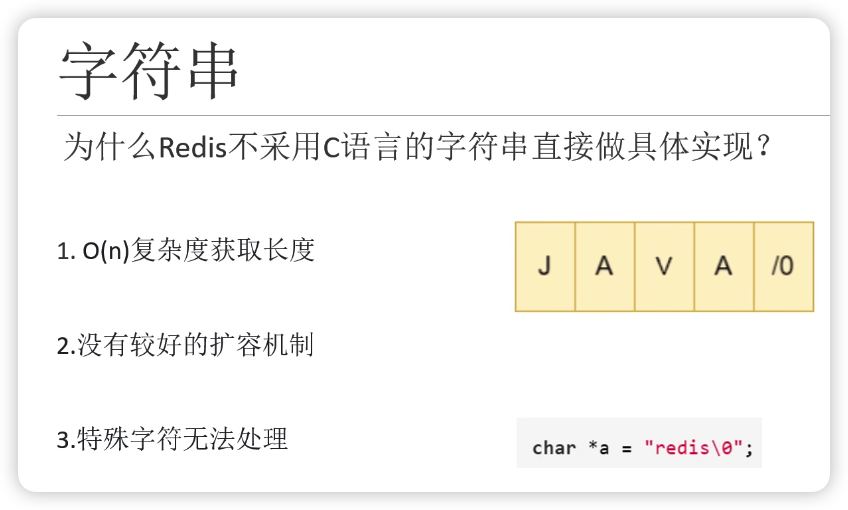

- 为什么Redis不采用c语言的字符串直接做具体实现呢？
  - O(n)复杂度获取长度
  - 没有较好的扩容机制
  - 特殊字符无法处理

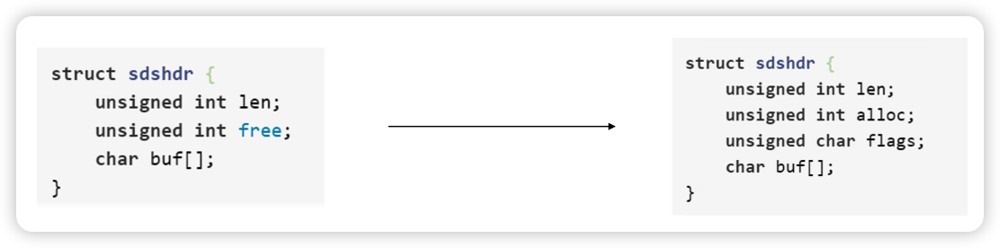

左图3.0之前的，右图是之后的

Redis字符串又称为SDS（Simple Dynamic String）

- 左图
  - len是实际使用的长度，free是未使用的长度，len + free是实际申请的长度（空间）
  - buf就是存储字符串的结构了
- 右图
  - alloc是分配的长度，剩余的长度=alloc - len
  - flags是啥后面讲

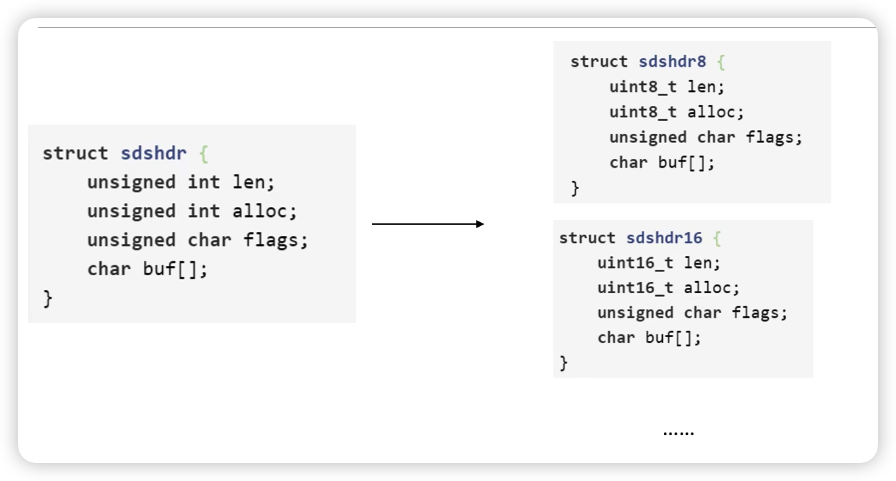

因为有的字符串长一点有的短一点不同的flags对应不同长度的sds，为了节省空间

- 总结
  - Redis字符串本质上是C语言的字符数组，加上了一点别的标识属性的结构体而已。
  - 这样做的优点
    - 字符串长度获取时间复杂度变从O(n)变为O(1)
    - 减少字符串扩容引起的数据搬运次数
    - 可以存储更加复杂的二进制数据

### 2. 链表

Redis底层链表的实现是双向链表

```c++
typedef struct listNode {
	struct listNode *prev;
	struct listNode *next;
	void * value;
} listNode;

typedef struct list {
  listNode * head; //链表头节点
  
  listNode * tail; //链表尾节点
  
  unsigned long len; //链表长度
  
  void *(*dup) (void *ptr); //节点复制函数
  
  void *(free) (void *ptr); //节点值释放函数
  
  void(*match) (void *ptr, void *key); //节点值对比函数
}
```

常见API函数：

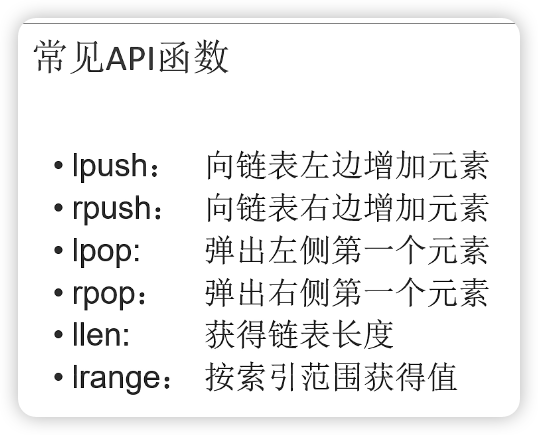

### 3. 哈希表

哈希表是一种存储数据的结构。

在哈希表中，键和值是一一对应的关系。哈希表可以通过键，在O(1)的时间复杂度的情况下获得对应的值。

由于C语言自己没有内置哈希表这一数据结构，因此Redis自己实现了Hash表。

- Redis采用拉链法作为哈希表的实现。

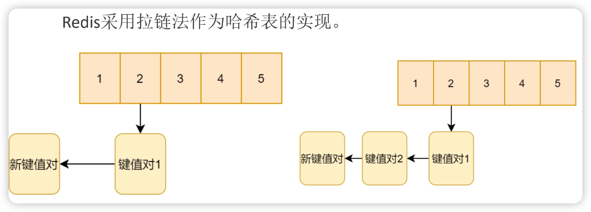

- Redis中哈希表的数据结构

  - dicht 单纯表示一个哈希表

  - 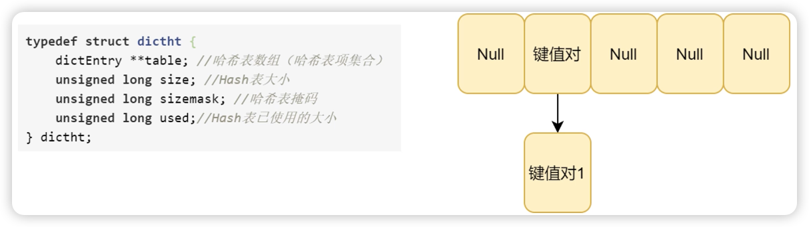

    - ```c++
      typedef struct dictht {
        dictEntry **table; //哈希表数组（哈希表项集合）
        unsigned long size; //Hash表的大小
        unsigned long sizemask; //哈希表掩码。类似于子网掩码，计算下标
        unsigned long used; //Hash表已使用的大小	 
      } dictht;
      ```

      负载因子 = used / size，需要保证负载因子在一个合理范围之内，不要太小白白占用空间，不要太大降低查询效率，后面讲调整原则。

  - dictEntry 哈希表的一项，可以看作就是一个键值对

  - 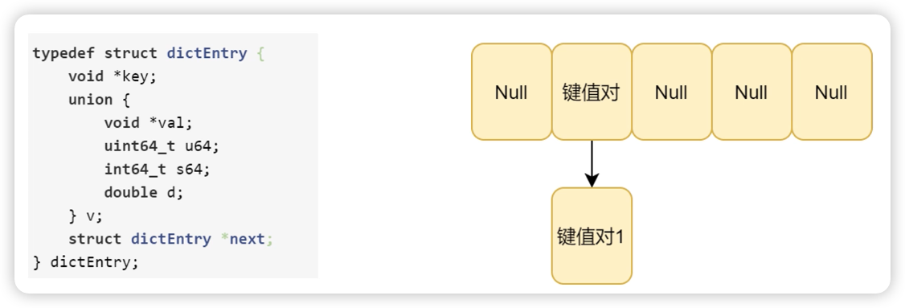

    - ```c++
      typedef struct dictEntry {
        void *key;
        union {
          void *val;
          uint64_t u64;
          int64_t s64;
          double d;
        } v;
        struct dictEntry *next;
      } dictEntry;
      ```

  - dict Redis给外层调用的哈希表结构，包括两个dictht，也可以说封装了dicht

    - 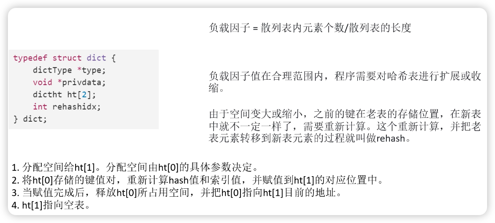

    - ```c++
      typedef struct dict {
        dictType *type;
        void *privdata;
        dictht ht[2];
        int rehashidx;
      } dict;
      ```

    - 负载因子 = 散列表内元素个数 / 散列表的长度

      负载因子值在合理范围内，程序需要对哈希表进行扩展和收缩。

      由于空间变大或者缩小，之前的键在老表的存储位置，在新表中不一定一样了，需要重新计算。这个重新计算，并把老表元素转移到新表元素的过程就叫做rehash。

    - ht[0]存放的老表，ht[1]存放的是新表

      步骤：

      - 分配空间给ht[1]。分配空间有ht[0]的具体参数决定。
      - 将ht[0]存储的键值对，重新计算hash值和索引值，并复制到ht[1]的对应位置中。
      - 当复制完成后，释放ht[0]所占空间，并将ht[0]指向ht[1]目前的地址。
      - ht[1]指向空表。

- 关于负载因子

  - 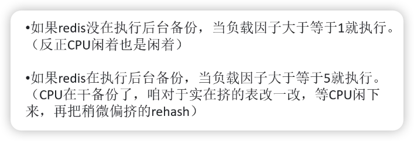
  - 如果Redis没有执行后台备份，当负载因子大于等于1就执行（反正CPU闲着也是闲着）
  - 如果Redis在执行那个后台备份，当负载因子大于等于5就执行。（CPU在干备份了，咋对于实在挤的表改一改，等CPU闲下来，再把稍微偏挤的rehash）

### 4. 集合

- 普通集合

  - 就是对hash表的封装

- 整数集合

  - 里面只有整数，且是有序的

  - 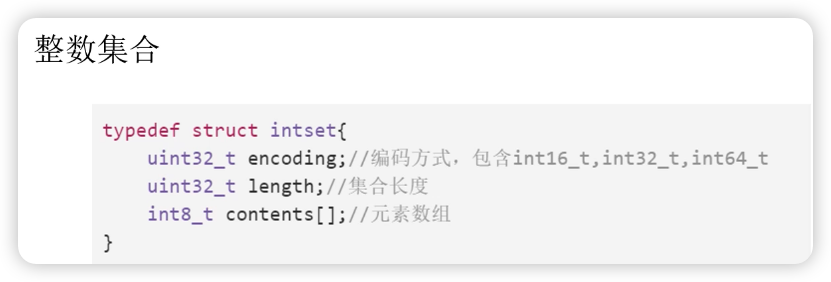

  - ```c++
    typedef struct intset {
      uint32_t encoding; //编码方式，包含int16_t, int32_t, int64_t
    	uint32_t length; //集合长度
      int8_t contents[]; //元素数组
    }
    ```

  - content是递增的数组，只能通过二分法查找元素，时间复杂度为O(logN)了，效率低于Hash查找，但是节省空间，这是Redis时间换空间的策略。

  - intset修改查找操作怎么做呢？

    - 修改：由于intset占用一段连续内存，所以每次修改数据需要重新申请空间，增加就是扩容，删除就是缩容
    - 查找，intset一段空间有序，因此可以执行二分查找算法

### 5. 有序集合

Zet实现方式之一是跳表，再讲之前需要讲一下跳表

普通链表，查找O(n)

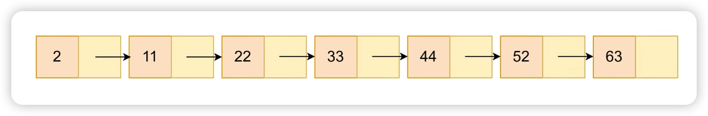

跳表降低了时间复杂度

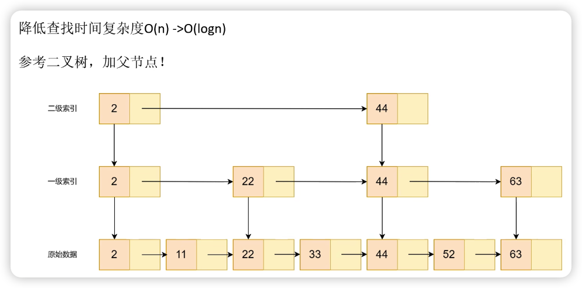

ZSet数据结构

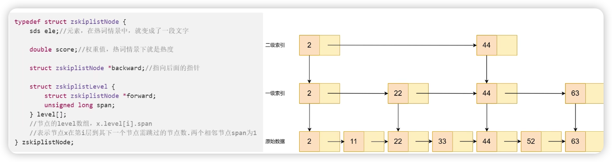

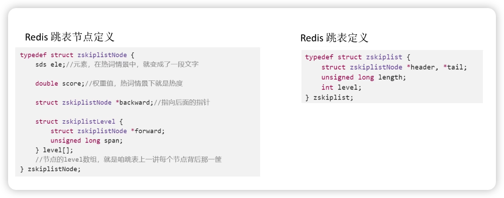

```c++
typedef struct zskiplistNode {
  sds ele; //元素，在热词情景中，就变成了一段文字
  
  double score; //权重值，热词场景下就是热度
  
  struct zskiplistNode *backward;//指向后面的指针
  
	struct skiplistLevel {
    struct zskiplistNode *forward;
    unsigned long span;
  } level[];
  //节点的level数组，x.level[i].span
  //表示节点x在第i层到其下一个节点需跳过的节点数，两个相邻节点span为1
} zskiplistNode;

typedef struct zskiplist {
  struct zskiplistNode *header, *tail;
  unsigned long length;
  int level;
} zskiplist;
```

有意思的是level[]，比如上图三个索引的2（就是第一个节点）就是使用level[]来区分的，不是真正创建了三个节点。

- 跳表有什么问题吗？更新元素的时候需要重新创建索引，那有什么解决方法吗

  - 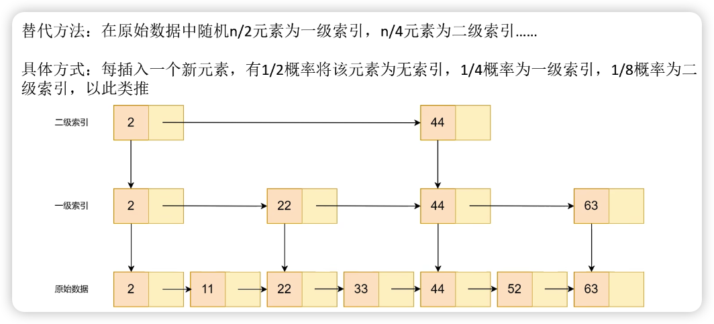
  - 以上方法，对查询效率有影响，但是最终差不了太多

- 业务场景：利用Redis跳表实现微博热搜Top K

- ZSet常见API

  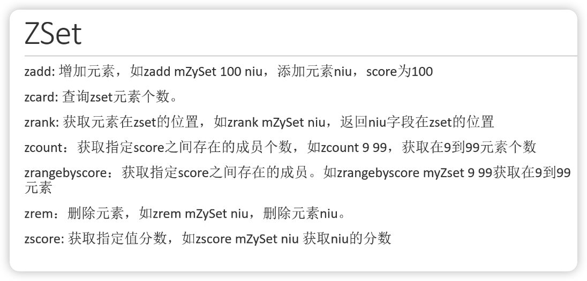

## 二、持久化

### 1. RDB

- Redis持久化简述
  - Redis是内存型数据库
  - 优点：内存读取速度快
  - 缺点：数据易失性，断电后内存数据消失
  - 解决方法：RDB(Redis Data Base)、AOP(Append Only File)
- RDB
  - 是一种全量备份
  - 把目前Redis内存中的数据，生成一个快照文件(RDB文件)，保存在硬盘中，如果发生事故，Redis可以通过RDB文件，进行文件读取，并将数据重新载入内存中
- RDB文件示意图
  - 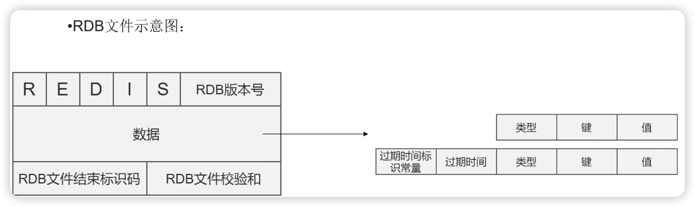
  - Redis、RDB版本号、数据、RDB文件结束标识码、RDB文件校验和
- 各个基础数据类型在RDB中的结构
  - 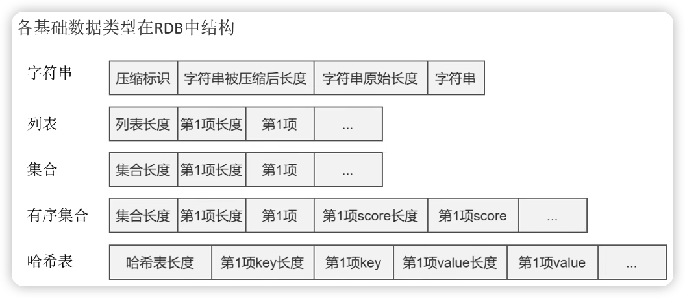
- RDB触发条件
  - 手动触发
    - save: 执行该命令后，主线程执行rdbSave函数，服务器进程阻塞，即不能处理任何其他请求
    - bgsave: 本质上这个命令和save差不多，区别在于这个命令会去fork一个子进程，去执行rdbSave函数，因此主线程还是可以执行新请求的
  - 自动触发
    - 配置文件中写入save  m n，代表m秒内发生n次变化就执行bgsave
- 优点：
  - 数据集大时，比AOF的启动效率更高
  - 容灾性好，方便备份

- 缺点:
  - 数据完整性低，如果在备份期间Redis发生故障，会发生数据丢失
  - 即使fork子进程协助完成持久化，在数据量大的情况下可能会导致整个服务器停止服务几百毫秒甚至是一秒钟

### 2. AOF

AOF: 以日志的方式记录服务器所处理的**更新操作**，以文本的方式记录，可以打开文件查看详细的操作记录

如果发生事故，Redis可以通过AOF文件，将文件中的数据修改命令全部执行一遍，以此来恢复数据

- AOF重写和恢复

  - 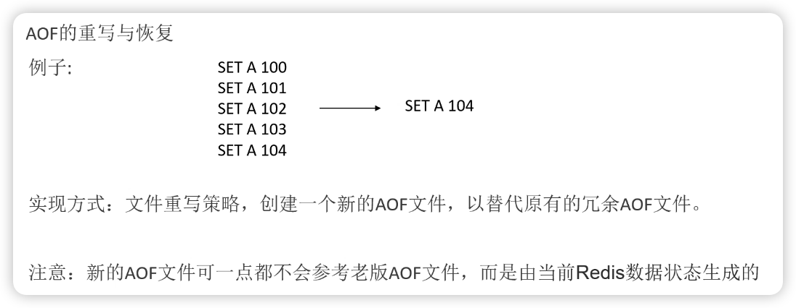
  - 重写生成新的AOF文件的过程中，**不会参考老的AOF文件**，而是直接根据当前Redis数据生成
- AOF触发条件
  - 手动触发：bgrewriteaof
  - 自动触发：配置文件中设置appendonly yes开启，写入策略如下
    - Always：及同步写回，在每个写命令执行完成后，直接将命令落入磁盘文件（数据基本保证可靠性，但是影响Redis性能）
    - Everysec：即每秒写回，对于每个命令执行完成后，该命令被写入文件的内存缓冲区，每过1秒，Redis就会把该缓冲区的命令写到磁盘的AOF文件中（出了问题最多丢失一秒内的数据，性能影响较小）
    - NO：意思不是不执行AOF，而是将操作命令全部只写到Redis缓存区，至于在何时将缓存落盘，交给操作系统决定（出了问题，数据丢失情况不可控，性能影响最小）
    - 默认策略是Everysec
- Redis恢复和重写流程图
  - 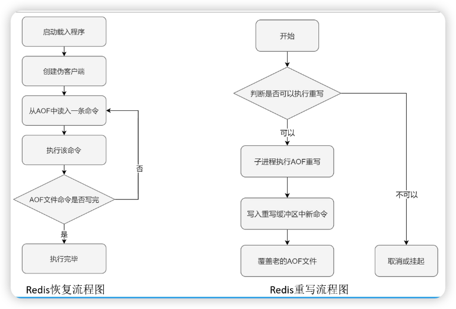
  - 恢复会创建一个伪客户端执行命令
- 优点
  - 数据完整度高，即使采用Everysec发生故障也只会丢失1秒的数据
  - 通过append模式写文件，即使server中途宕机也不会破坏已经存在的内容，可以通过Redis-check-aof工具解决数据一致性问题
  - rewrite机制，定期重写可以压缩AOF文件

- 缺点
  - AOF比RDB文件大，且恢复速度慢
  - 数据集大的时候，比rdb效率低
  - 运行效率没有RDB高

- 小结：
  - AOF比RDB更新频率高，优先使用AOF还原数据
  - AOF比RDB更安全也更大
  - RDB性能比AOF好
  - 如果两个都设置了，服务器优先使用AOF


## 三、缓存

### 1. 缓存淘汰（感觉没有细化）

- ### FIFO先进先出

  - 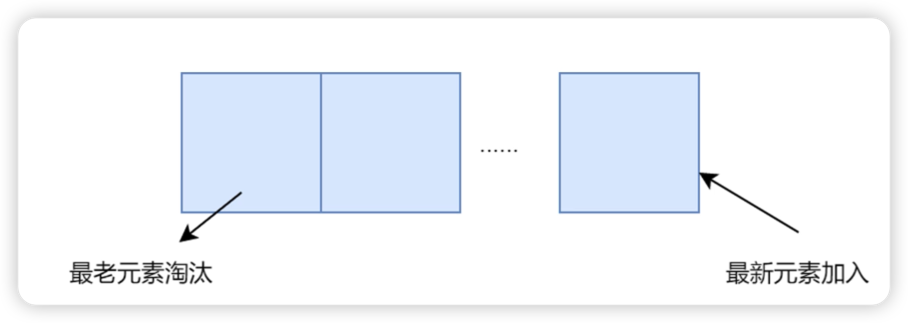

- ### LRU最近最少使用

  - 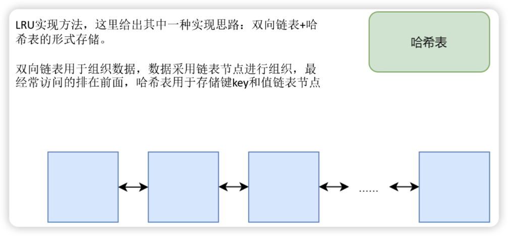
  - 双向链表 + 哈希表，双向链表用来存放值，哈希用来方便查找值，弥补链表查询效率为O(n)的缺点
  - 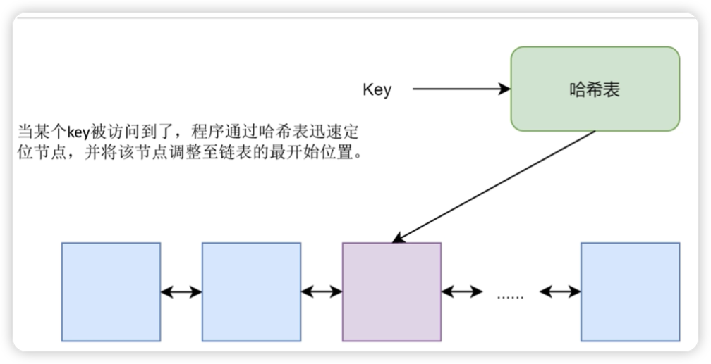
  - 被访问到了就调整到最前面的位置

- ### LFU最不经常使用

  - 

### 2. 过期删除

- 主动删除
  - 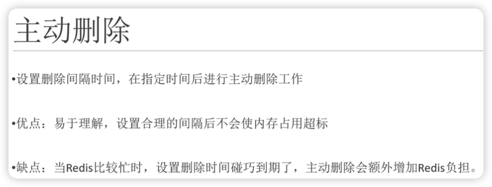
  - 到期就删除，对Redis性能影响较大
- 惰性删除
  - 
  - 访问该值的时候会查看是否过期，如果没有过期就返回否则则删除
  - 优点：服务器运算资源占用小
  - 缺点：可能导致一些数据长期霸占内存，不被删除的情况
- Redis删除策略：定期删除
  - 
  - 每隔一段时间主动删除过期的，其他时间点惰性删除

### 3. 缓存一致

- Cache Aside

  - 

  - 它的核心思想是，**当缓存数据需要更新值了**，它采用的不是更新缓存数据，而是删除缓存数据

  - 两种读写流程

    - 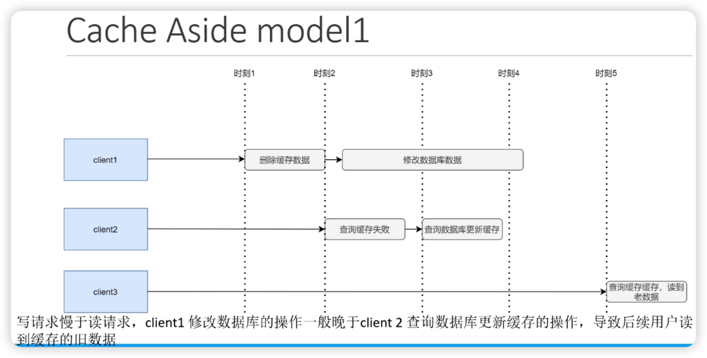

      当前情况下，会读到缓存的旧数据。为了解决这个问题，可以采用延迟双删

      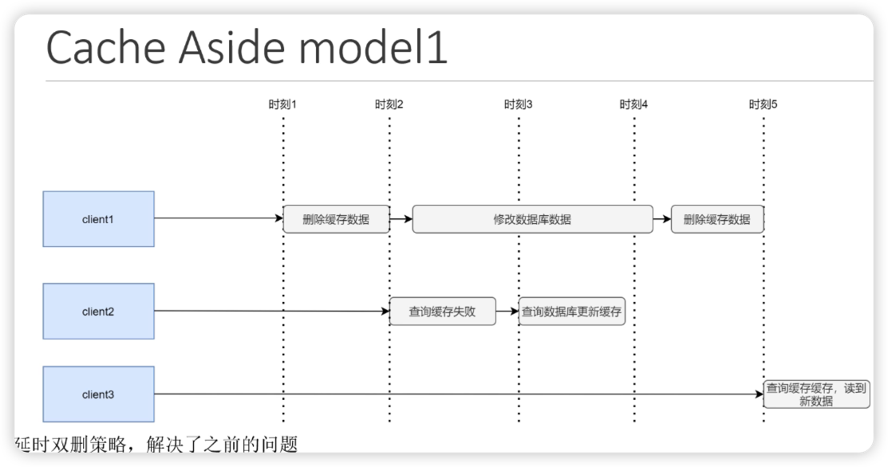

    - 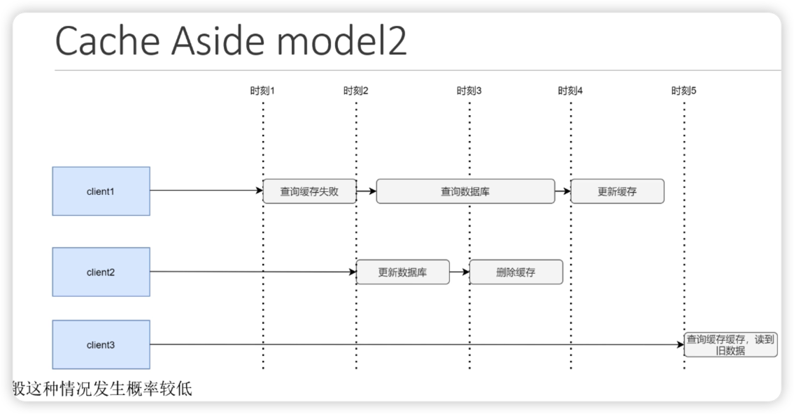

      这种情况比较少见，原因：更新频繁的数据就不应该使用Redis缓存，第二查询数据库正常情况下是要比更新快的，出现这种情况可能是网络出现波动等原因。

- Read/Write Through

  - 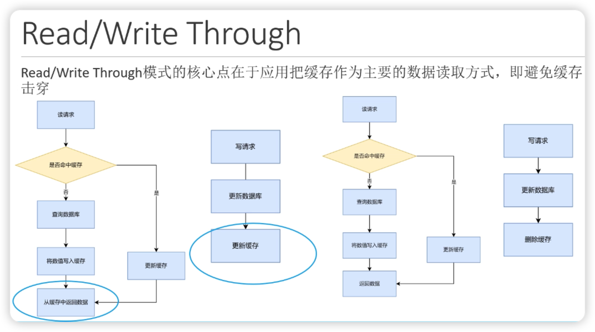
  - 右图是Cache Aside
  - Read/Write Through模式核心点在于把缓存作为数据读取的主要方式，即避免缓存击穿

- Write Bebind

  - 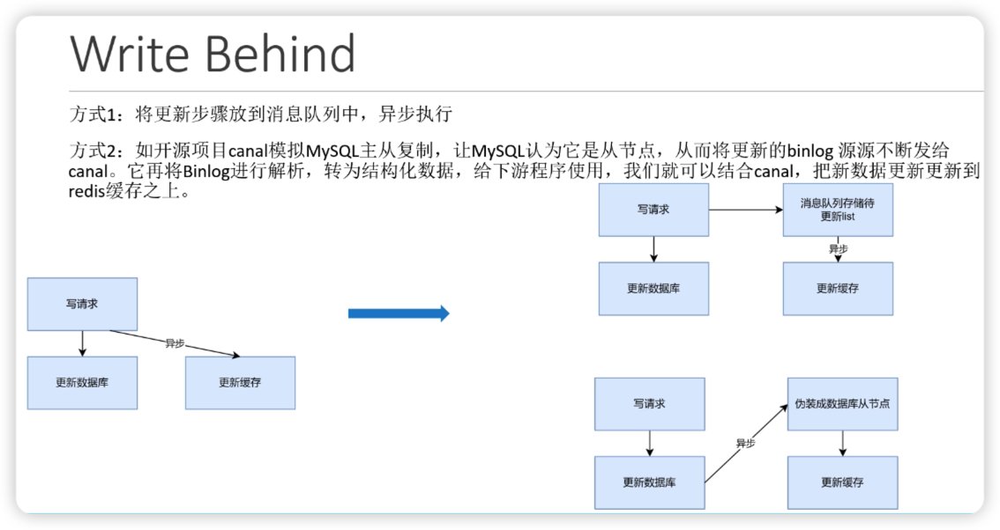

  - 方法一：使用mq异步更新缓存

    方法二：如canal模拟主从复制，异步更新缓存


### 4. 缓存击穿


- 定义：查询某个数据，结果缓存中不存在，就会饶过缓存查询数据库
- 一般缓存会设置数据过期时间，所以缓存击穿的情况比较常见
- 带来的问题
  - 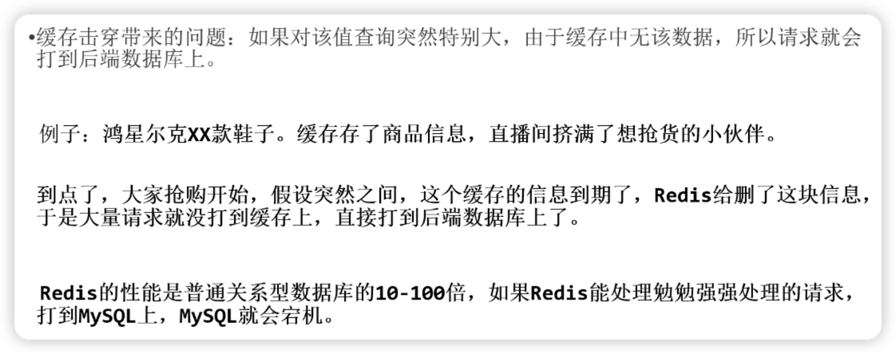
  - 如果查询量特别大，MySQL顶不住就会宕机
- 如何解决呢？
  - 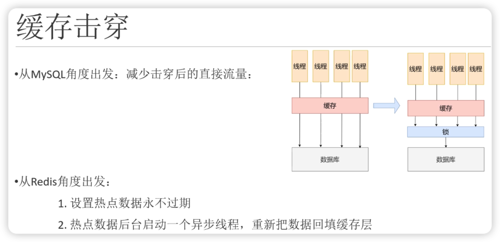
  - 从MySQL角度出发：减少击穿后的直接流量，如直接加锁
  - 从Redis角度出发：
    - 设置热点数据永不过期
    - 热点数据后台起一个线程，重新刷新过期时间，把数据回填到缓存层

### 5. 缓存穿透

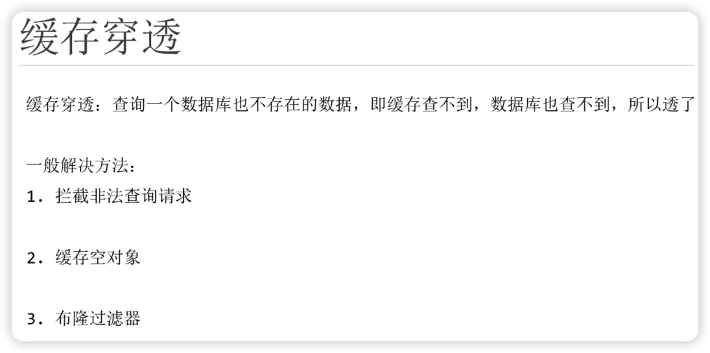

- 定义：查询了一个缓存和数据库中都不存在的数据
- 一般解决方法
  - 拦截非法查询请求
  - 缓存空对象，直接返回空对象
  - 布隆过滤器
    - 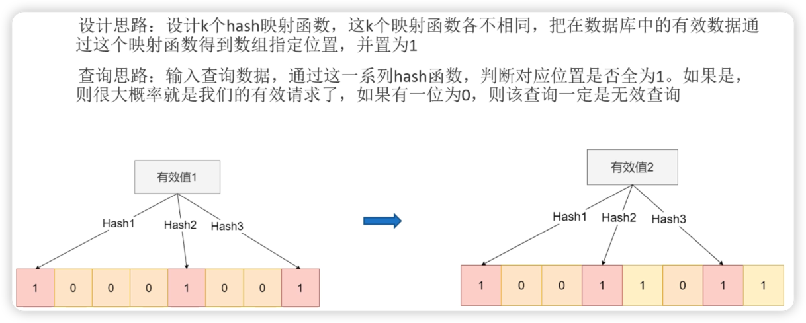

### 6. 缓存雪崩


- 定义：一大批被缓存的数据同时失效，此时对于这一批的数据请求就全部打到数据库上了，导致数据库宕机
- 跟缓存击穿相似，缓存击穿是单点，缓存雪崩是多点
- 如何解决：
  - 从MySQL角度：减少并发量，如加锁
    - 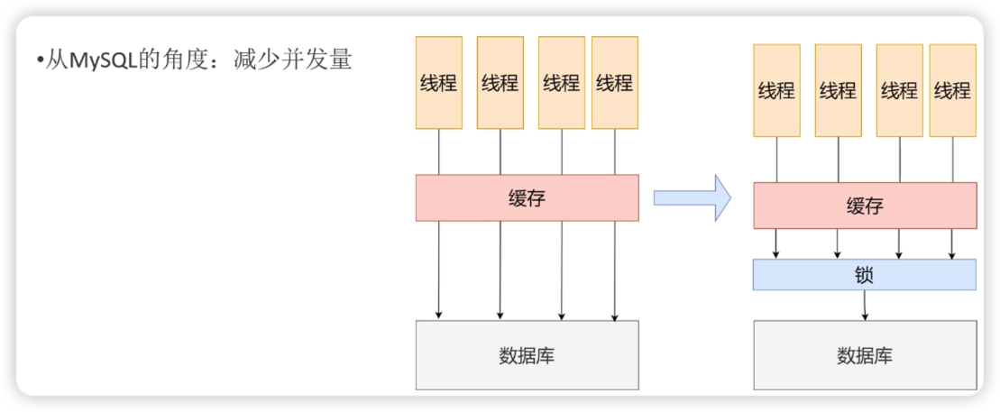
  - 从Redis角度：
    - 设置热点数据永不过期
    - 分析失效时间，尽量让失效时间点分散
    - **缓存预热，即在上线前，更急当天的情况分析，将热点数据直接加载到缓存系统**

## 四、集群

### 1. 主从复制

 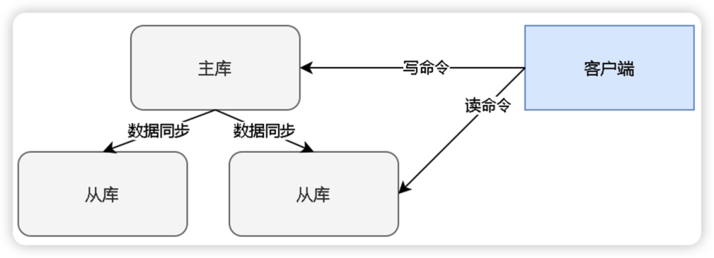

流程：

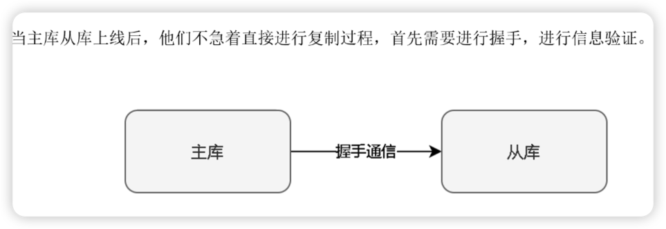

1. 当主从库都上线后，他们不急着进行复制过程，首先需要进行握手，进行信息验证

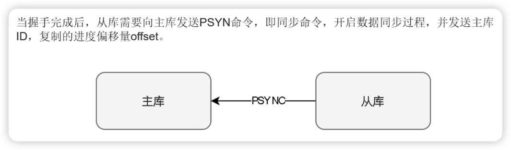

2. 当握手完成后，从库需要向主库发送PSYN命令，即同步命令，开启数据同步过程，并发送主库ID，复制的进度偏移量offset（为什么要发主库id呢，防止断线后主库变更）。

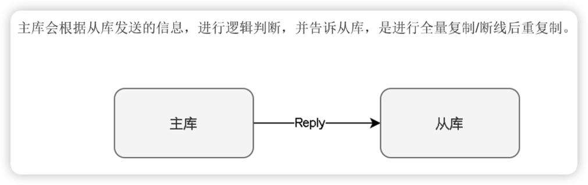

3. 主库会根据从库发送的信息，进行逻辑判断，并告诉从库，是进行全量复制/断线后重复制。
4. 如果是全量复制
   - 
   - 主库执行BGSAVE生成RDB文件，并将文件生成过程中的数据命令放进开辟的缓冲区中
   - RDB文件产生后，主库发送给从库，从库通过RDB恢复数据
5. 命令传播阶段
   - 
   - 主库状态被修改了（如期间更新了数据）为了同步状态，主库会把数据变更命令发给从库，从库收到后执行命令。
6. 断线后重复制
   - 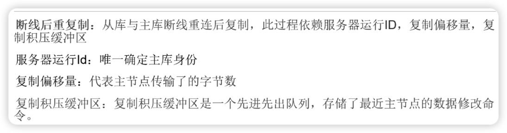
   - 断线后重复值：断线重连后，此过程依赖服务器运行ID，复制偏移量，复制挤压缓冲区
     - 服务器运行ID：唯一确定主库的身份
     - 复制偏移量：代表主节点传输了的字节数
     - 复制挤压缓冲区：是一个FIFO队列，存储了最近主节点的数据修改命令

### 2. 哨兵机制

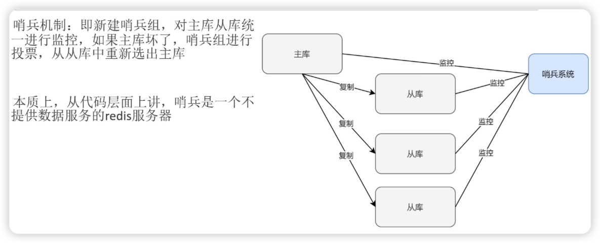

- 哨兵机制：对主从库进行监控，如果主库下线，哨兵组进行投票，从从库中挑选出新的主库
- 哨兵服务器是一个不提供数据服务的Redis服务器

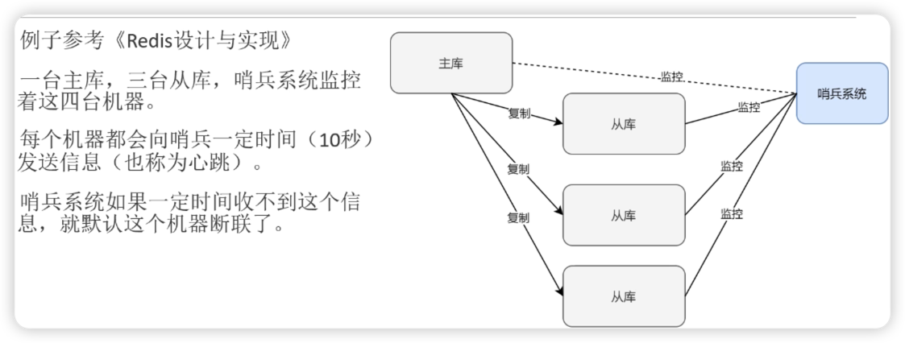

心跳检测，若设置时间内哨兵没有收到某机器的心跳，就默认这个机器断连了

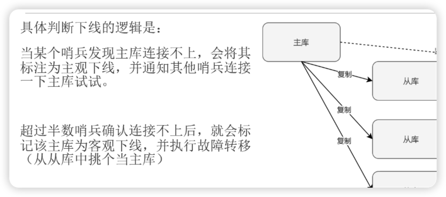

哨兵自己发现主库连接不上了，就标注主库为主观下线，并通知其他哨兵，超过半数的哨兵连接不上主库后，哨兵就将其标注为客观下线，并挑选一个从库当主库。

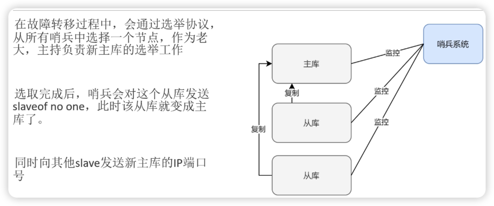

选举结束后，哨兵向slaveof no one此时从库就会变成主库，同时向其他slave发送主库的IP端口号。

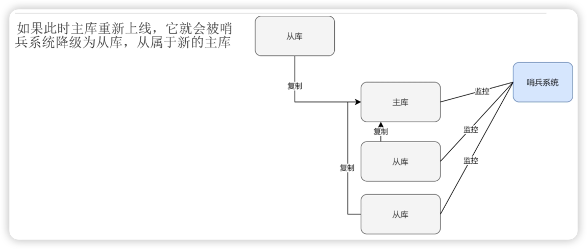

主库重新上线后，临时主库就会下线

### 3. Cluster

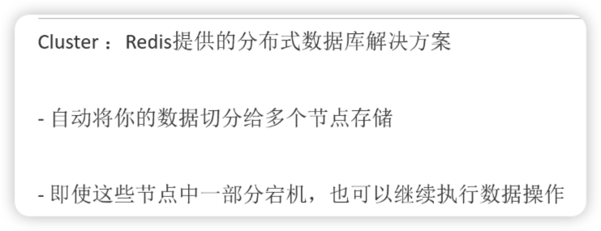

分布式数据库解决方案，数据切分给多台机器存储。·


分区策略：采用虚拟槽，所有键通过CRC16校验函数，然后对16384取模，决定数据分配到哪个槽位。

每个Redis的cluster节点负责一部分槽slot的数据，并且集群节点也可以使用主从复制模式。

- 查询策略
  - 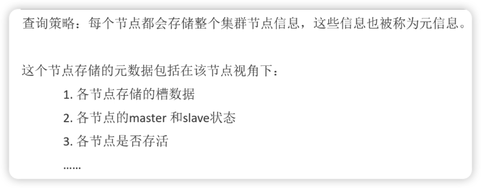
  - 每个节点都包含集群中其他节点的元信息
    - 包括各个节点存储的槽数据
    - 各节点的master和slave状态
    - 各个节点是否存活
    - 。。。。
  - 元信息的传播
    - 
    - 采用gossip协议
      - 每隔一段时间执行一次
      - 像病毒传播一样类似于泛洪
- cluster扩缩容
  - 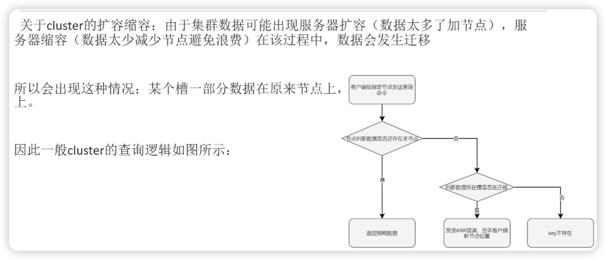
  - 用户查询时正在扩缩容怎么办见上图

## Redis面试五十问

【B站高质量Java面试题：Redis面试夺命连环50问（redis高频面试题及解析）】 https://www.bilibili.com/video/BV1dd4y1M7iJ/?share_source=copy_web&vd_source=72c4cacd7237c3e04c39153a62aed182

### 1. Redis到底是单线程还是多线程

#### 1.1 前置知识：网络IO原理、IO多路复用、AE事件库、select/poll/epoll原理

【「IO番外」IO多路复用从头讲起】 https://www.bilibili.com/video/BV1oG4y167KV/?share_source=copy_web&vd_source=72c4cacd7237c3e04c39153a62aed182

- 网络IO原理

  - 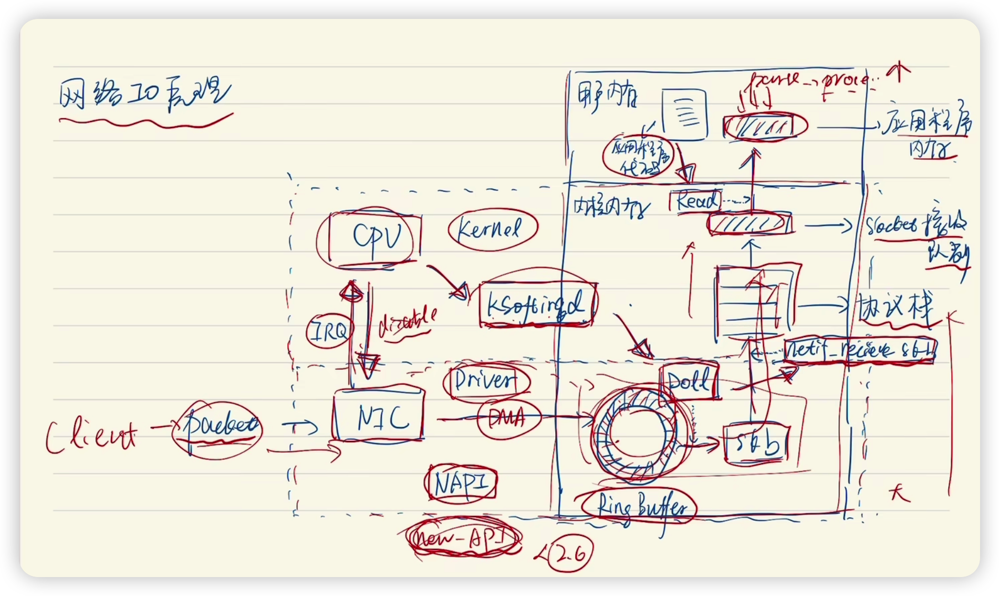

    驱动的poll函数从Ring Buffer中轮训出来变成一个个的SKB（socket buffer）

- IO多路复用

  - 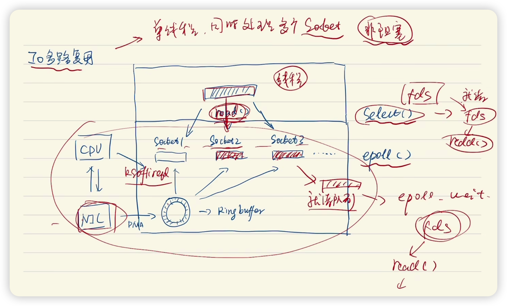

    IO多路复用核心就是如何用单线程处理多个Socket，早期的select轮训所有的socket返回就绪的socket被read调用（为什么要返回就绪的socket？返回没就绪的socket的话，可能会导致read线程阻塞，因为他只有一个线程，后面就直接G），之后的epoll将就绪的socket放入内核中的就绪队列里面，被read调用。

- AE事件库

  - 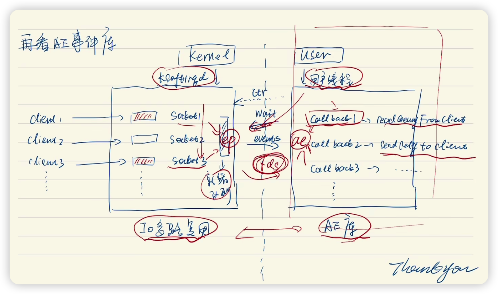

    用户线程读取就绪队列中fd（文件描述符File describtion，用来标识socket的），执行绑定的事件

- select/poll/epoll原理

  【select/poll/epoll原理】 https://www.bilibili.com/video/BV1Rq4y1s7uu/?share_source=copy_web&vd_source=72c4cacd7237c3e04c39153a62aed182

  【IO的多路复用 select/poll/epoll 的区别】 https://www.bilibili.com/video/BV1vT4y1f7T2/?share_source=copy_web&vd_source=72c4cacd7237c3e04c39153a62aed182

  

#### 1.2 Redis是单线程的正确理解

http://t.csdn.cn/aWbIQ

##### 1.2.1为什么Redis是单线程的

- 官方答案

  因为Redis是基于内存的操作，CPU不是内存的瓶颈。Redis的瓶颈最有可能是机器内存的大小或者网络带宽。既然单线程容易实现，而且COU不会成为瓶颈，那就顺理成章地采用单线程的方案了。

- 性能指标

  关于Redis的性能，官方网站上有，普通笔记本轻松处理每秒几十万的请求。

- 详细原因

  - 不需要各种锁的性能消耗

    Redis 的数据结构并不全是简单的 Key-Value，还有 list，hash 等复杂的结构。这些结构有可能会进行很细粒度的操作，比如在很长的列表后面添加一个元素，在 hash 当中添加或者删除一个对象。这些操作可能就需要加非常多的锁，导致的结果是同步开销大大增加。

    总之，在单线程的情况下，代码更加清晰，处理逻辑更加简单，不用去考虑各种锁的问题，不存在加锁和释放锁的操作，没有因为可能出现死锁而导致的性能消耗，不存在多线程或者多线程导致的切换而消耗CPU。

  - 单线程多进程的集群方案

    单线程的威力实际非常强大，没核的效率也非常高。多线程自然比单线程有更高的性能上限，但是在今天的计算环境中，即使是单机多线程的上线也往往不能满足需要了，需要进一步探索的是集群化的方案，这些方案中多线程的技术照样是用不上的。**所以单线程、多进程的集群不失为一个时髦的解决方案**。

  - CPU消耗

    采用单线程避免了不必要的上下文切换和竞争条件，也不存在多进程和多线程导致的切换而消耗CPU。但是如果CPU成为Redis的瓶颈，或者不想让其他CPU闲置，那怎么办？可以考虑多起几个Redis进程，Redis是kv数据库，不是关系型数据库，数据之间没有约束，只要客户端分分清哪些key放在哪个Redis进程上就可以了。

##### 1.2.2 Redis单线程的理解

Redis 客户端对服务端的每次调用都经历了**发送命令，执行命令，返回结果**三个过程。其中**执行命令阶段，由于 Redis 是单线程来处理命令的**，所有到达服务端的命令都不会立刻执行，**所有的命令都会进入一个队列中，然后逐个执行**，并且多个客户端发送的命令的执行顺序是不确定的，但是可以确定的是不会有两条命令被同时执行，不会产生并发问题，这就是 Redis 的单线程基本模型。

Redis 服务器通过 socket (套接字)与客户端或其他 Redis 服务器进行连接，而**文件事件就是服务器对 socket 操作的抽象**。服务器与客户端或其他服务器的通信会产生相应的文件事件，而服务器通过监听并处理这些事件来完成一系列网络通信操作。

Redis **基于 Reactor 模式**开发了自己的网络事件处理器——文件事件处理器，文件事件处理器使用 **I/O 多路复用程序来同时监听多个 socket**，并根据 socket 目前执行的任务来为 socket 关联不同的事件处理器。当被监听的 socket 准备好执行连接应答、读取、写入、关闭等操作时，与操作相对应的文件事件就会产生，这时文件事件处理器就会调用 socket 之前已关联好的事件处理器来处理这些事件。**文件事件处理器的构成：**
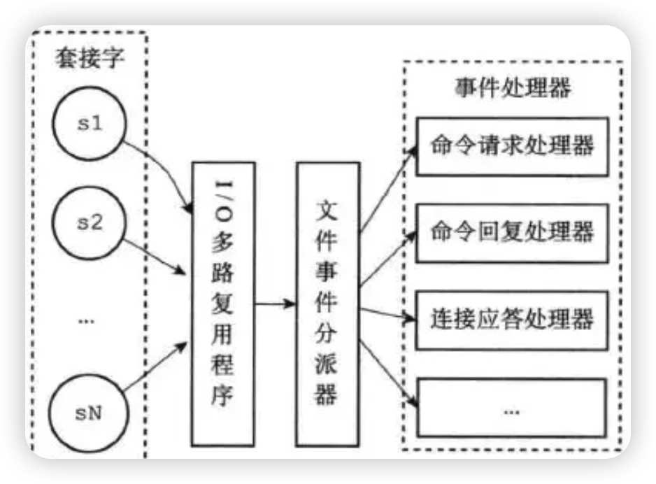

- IO多路复用技术

  Redis 采用网络 I/O 多路复用技术，来保证在多连接的时候系统的高吞吐量。关于 I/O 多路复用(又被称为“事件驱动”)，首先要理解的是，操作系统为你提供了一个功能，当你的**某个 socket 可读或者可写的时候，它可以给你一个通知**。这样当配合非阻塞的 socket 使用时，只有当系统通知我哪个描述符**可读了，我才去执行 read 操作，可以保证每次 read 都能读到有效数据而不做纯返回 -1 和 EAGAIN 的无用功，写操作类似**。

  操作系统的这个功能是通过 select/poll/epoll/kqueue 之类的系统调用函数来实现，这些函数都可以同时监视多个描述符的读写就绪状况，这样，多个描述符的 I/O 操作都能在一个线程内并发交替地顺序完成，这就叫 I/O 多路复用。多路—指的是多个 socket 连接，复用—指的是复用同一个 Redis 处理线程。多路复用主要有**三种技术：select，poll，epoll**。**epoll 是最新的也是目前最好的多路复用技术**。

  采用多路 **I/O 复用技术可以让单个线程高效的处理多个连接请求**(尽量减少网络 I/O 的时间消耗)，且 Redis 在内存中操作数据的速度非常快，也就是说内存内的操作不会成为影响 Redis 性能的瓶颈，基于这两点 Redis 具有很高的吞吐量。

##### 1.2.3 单线程的Redis为何高并发快

**Redis利用队列技术将并发访问变为串行访问，消除了传统数据库串行控制的开销**

- Redis的高并发和快速原因

  - Redis基于内存
  - 是单线程的，避免了上下文切换和多线程或多进程切换开销，不存在各种锁问题
  - Redis使用多路复用技术，可以处理并发的链接、非阻塞IO内部采用epoll，采用epoll + 自己实现的简单的事件框架。epoll的读、写、关闭、连接都转化为了事件，然后利用epoll的多里复用特性，绝不在IO上浪费时间。
  - 数据结构简单，对数据操作也简单，Redis中的数据结构是专门设计的
  - Redis直接自己构建了VM机制，没有调用OS的**Swap**而是自己实现，因为一般系统调用系统函数的话，会浪费一定的时间去移动和请求。

- 单进程弊端

  无法发挥出多核CPU性能，不过可以通过在单机开多个Redis实例来完善

- Redis高并发总结

  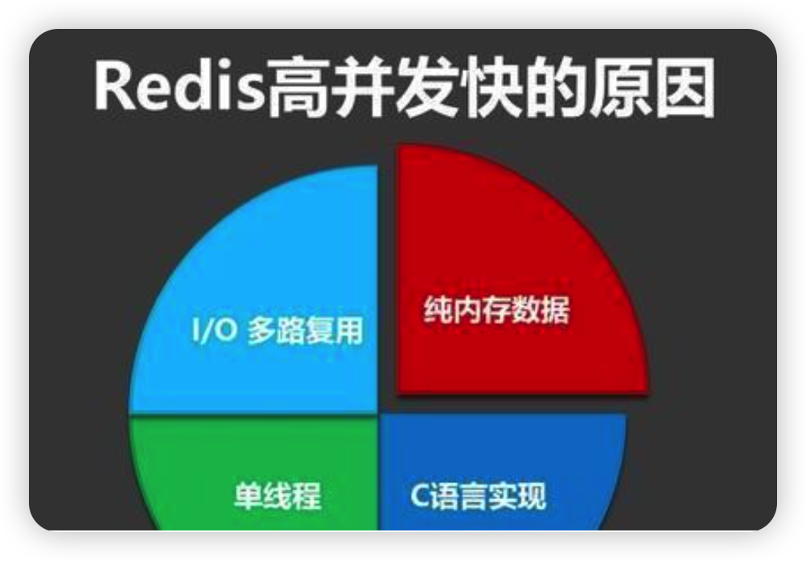

  ​	Redis 是纯内存数据库，一般都是简单的存取操作，线程占用的时间很多，时间的花费主要集中在 IO 上，所以读取速度快。
  ​	Redis 使用的是非阻塞 IO。IO 多路复用，使用了单线程来轮询描述符，将数据库的开、关、读、写都转换成了事件，减少了线程切换时上下文的切换和竞争。
  ​	Redis 采用了单线程的模型，保证了每个操作的原子性，也减少了线程的上下文切换和竞争。
  ​	Redis 全程使用 hash 结构，读取速度快，还有一些特殊的数据结构，对数据存储进行了优化，如压缩表，对短数据进行压缩存储，再如，跳表，使用有序的数据结构加快读取的速度。
  ​	Redis 采用自己实现的事件分离器，效率比较高，内部采用非阻塞的执行方式，吞吐能力比较大。

##### 1.2.4 常见疑问

1. 为什么不采用多进程或者多线程处理
   - 多进程或者多线程可能涉及到锁
   - 多进程或者多线程会涉及到线程切消耗CPU
2. 单线程处理的缺点
   - 耗时的命令会导致并发的下降，不只是读并发，写并发也会下降
   - 无法发挥多核的CPU性能，不过可以通过在单机开多个Redis实例来完善
3. Redis不存在线程安全的问题
   - Redis采用了线程封闭的方式，把任务封闭在一个线程，自然避免了线程安全问题，不过对于需要依赖多个Redis操作（即多个Redis操作命令）的复合操作来说，依然需要锁，而且有可能是分布式锁。

#### 1.3 面试题：Redis到底是单线程还是多线程的？

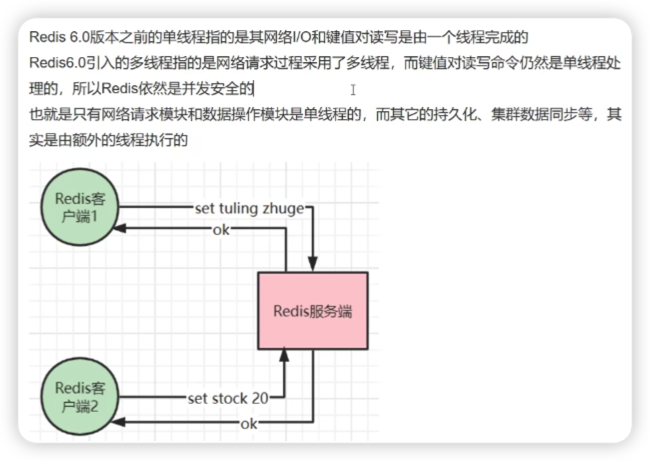

最后一段话是不是有问题，网络请求模块不是单线程的吗（6.0）

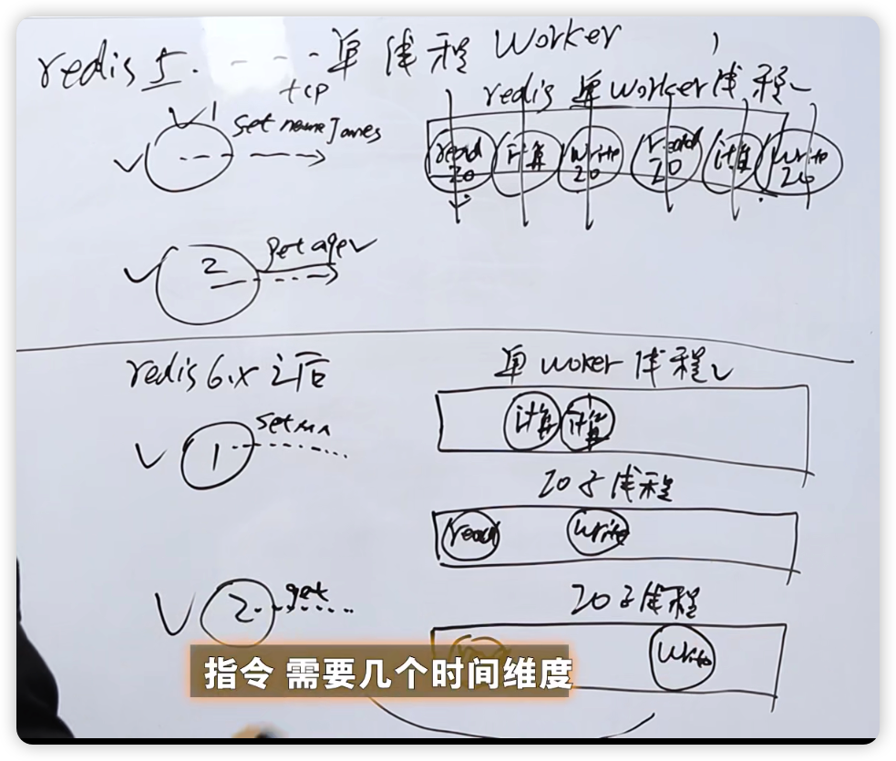

单线程指的不是只有一个线程，指的是worker线程只有一个，Redis6之前网络IO和键值对读写都是单线程的，Redis6之后，网络IO是多线程的，键值对读写仍然是单线程的，所以Redis仍然是并发安全的。

### 2. Redis单线程为什么这么快

1. 基于内存操作，一条命令在内存中的操作时间是几十纳秒
2. 命令执行是单线程操作，没有线程切换开销
3. 基于IO多路复用机制提升Redis的IO利用率
4. 高效的数据存储结构：全局hash表以及多种高效数据结构，比如跳表，压缩列表，链表等等

### 3. Redis底层数据是如何用跳表来存储的

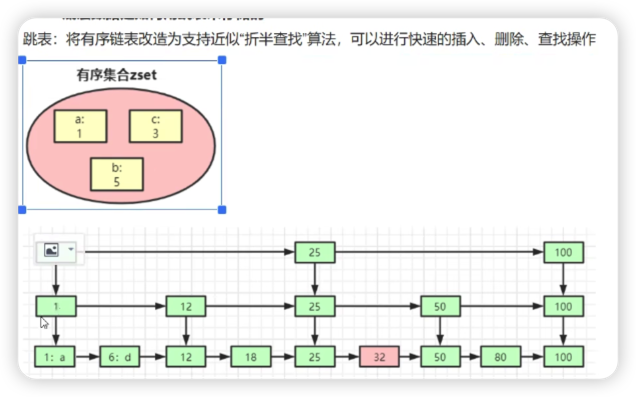

将有序列表改造为支持近似”折半查找“的算法，可以进行快速的插入、删除、查找操作

### 4. Redis key过期了为什么内存没有释放掉

1. 可能是操作失误的原因，更新带有过期时间的数据时，没有设置过期时间直接set，这样Redis会自动擦除时间，是这个数据变为永不过期。

   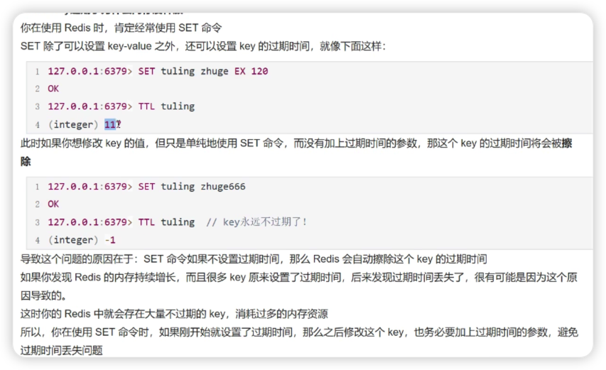

2. Redis的对过期数据的处理策略是定期删除 + 惰性删除，有可能这个数据没到定期删除的时候或者在这之前没有被访问。

### 5. Redis key没设置过期时间，为什么被Redis主动删除了

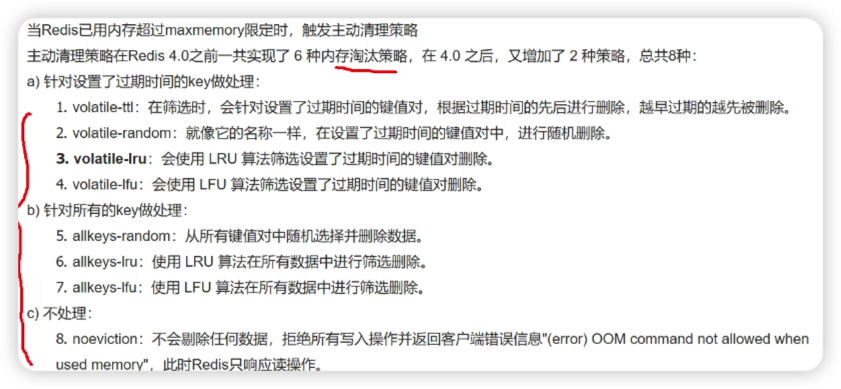

Redis已用内存超过maxmemory限定时，触发主动清理策略

主动清理策略在Redis 4.0之前一共实现了6中内存淘汰策略，在4.0之后又增加了两种

1. 针对设置了过期时间的key
   - volatile-ttl：按照过期时间的先后进行删除，越早过期越先删除
   - volatile-random: 随机删除
   - volatile-lru：LRU(Least Recently used)按照时间
   - volatile-lfu：LFU(Least Frequently used)按照次数
2. 针对所有的key
   - allkeys-random：所有键随机
   - allkeys-lru
   - allkeys-lfu
3. 不处理（**默认策略**）
   - noeviction：不会提出任何数据，拒绝所有写操作并返回客户端错误信息，只响应读操作。

### 6. Redis淘汰策略key的算法LRU和LFU区别

LRU(Least Recently used)以最近一次访问时间作参考

LFU(Least Frequently used)以一段时间内的访问次数作为参考

平时用LRU比较多，当存在大量热点缓存数据时，LFU可能比较好（因为使用LRU可能访问很多次的数据比不过一个最近访问只有几次数据）

### 7. 删除key的命令会阻塞Redis吗

是存在阻塞的可能性的，比如同时删除多个key，或者key对应的数据量很大的情况下会造成阻塞。

### 8. Redis主从、哨兵、集群架构优缺点比较

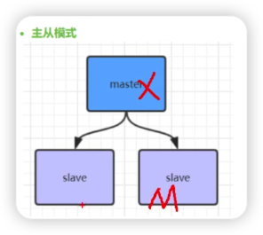

主从模式，有节点挂了需要运维人员或者写个脚本处理，瞬断问题比较严重。

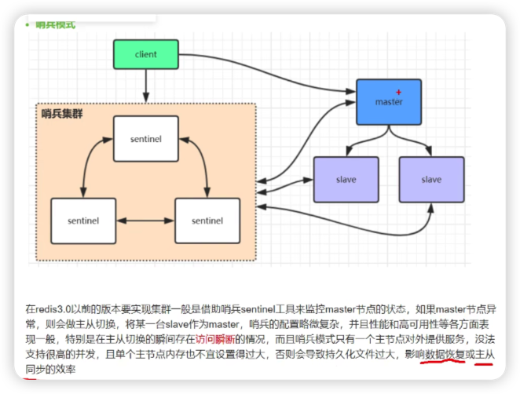

哨兵模式，如果有节点挂了不需要人为干涉，哨兵自动调整。但是调整主节点的时候，是不能对外提供服务的瞬断问题造成的影响比较大， 因为只有一个主节点提供服务，并发请求承受能力较低。

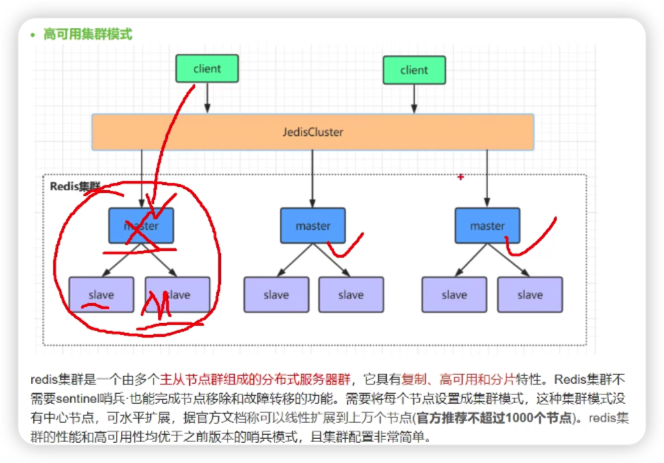

数据可分片，没有中心节点可以水平拓展，主节点挂掉的瞬断问题印象较小，能构承受大量的并发。

### 9. Redis集群数据hash分片算法是怎么回事

16384个槽位分给各个节点，通过对key值进行crc16算法后再对16384进行取模来得到具体槽位

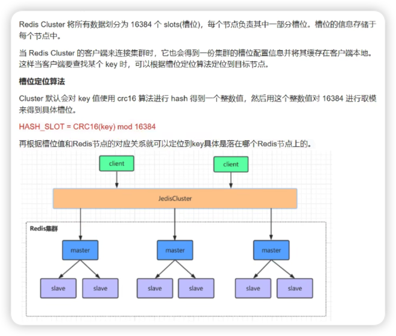 

### 10. Redis命令竟然有死循环BUG

命令：RandomKey，随机查看Redis中的一个key，这个命令可能会导致Redis死循环阻塞。

如果在master中执行该命令：由于Redis的过期策略有的过期数据可能还在内存中，RandomKey访问到该数据后会执行惰性删除，假如有很多这种key，就可能导致RandomKey执行时间变长，影响Redis性能。

在slave中执行该命令的会带来更大的危害，因为slave不能主动删除过期的key，必须等到master删除后且向slave发送一个DEL命令告知其删除，所以当slave中有大量过期数据且运气不好每次都抽到过期数据，就会导致执行RandomKey是出现死循环。

这个bug Redis5.0才被修复，解决方案就是控制它在slave中的查找次数，无论是否找到都会退出循环。

### 11. 一次线上事故，Redis主从切换导致了缓存雪崩

前提是当前的slave时钟比Master时钟走的快很多

此时master设置的过期时间，站在slave的角度来看可能已经过期，例如slave上午7点，master上午6点设置过期时间为6点半。

如果此时切换主从节点，slave升级为master，可能会导致：

1. master清理这些大量的过期的key，主线程可能会阻塞，降低效率
2. Redis中大量数据过期，引发缓存雪崩

所以一定保证时钟一致。

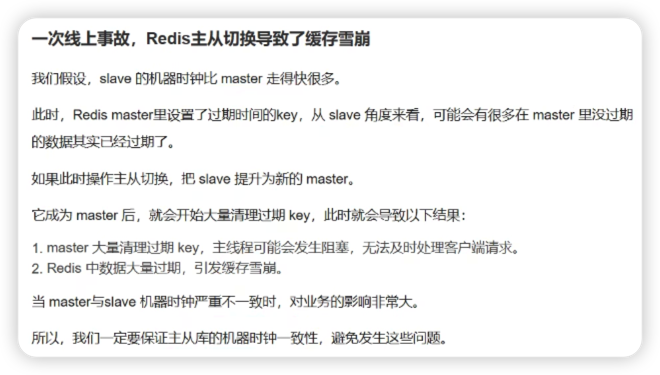

### 12. 线上Redis持久化策略一般如何设置

如果对性能要求较高，在Master最好不要做持久化，可以再某个slave开启AOF备份数据，策略设计为每秒同步一次即可。

### 13. 一次线上事故

使用运维工具管理主节点设置主节点一旦宕机自动重启，哨兵还未发起切换，主节点未开启数据持久化，那么重新启动后就是个空实例，重启后，slave为了和主节点保持一致也会清空自己的数据，这样数据就全部丢失了。

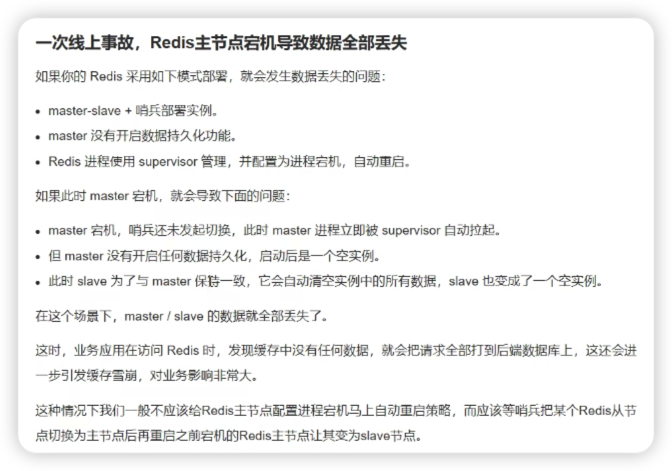

### 14. Redis线上数据如何备份

每个公司不一样

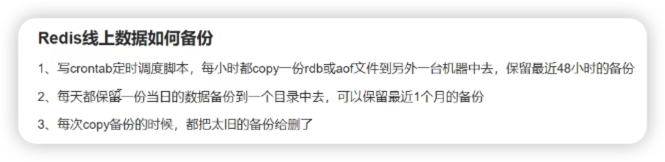

### 15. Redis主从复制风暴

当Redis master有很多直系的slave时，某一时刻时刻如果所有节点都连接主节点，那么主节点会同时把内存快照RDB发送个多个从节点，这样会导致Redis主节点压力非常大，这就是Redis主从复制风暴。

解决方案可以slave可以连接slave节点没必要所有的slave直接连接master节点。

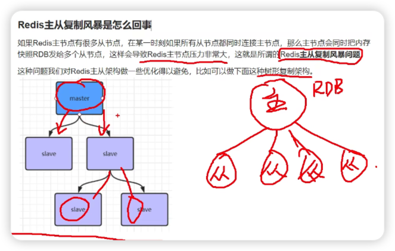

### 16. Redis集群网络抖动导致频繁主从切换

 主要问cluster-node-timeout配置是干啥的，一般设置为5到10秒，超时后才认为该节点失联，就不会出现频繁切换导致的数据重新复制，影响性能的问题了。

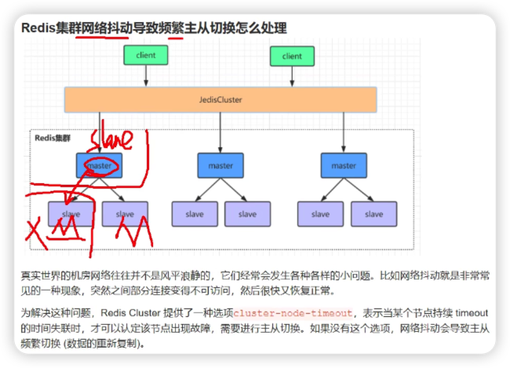

### 17. Redis集群为什么至少需要是三个master节点

与选举机制有关，至少大于半数以上的master同一才能选举成功，三个节点，同一数量超过1.5个，一个挂了，那其他两个咋选举，，，，

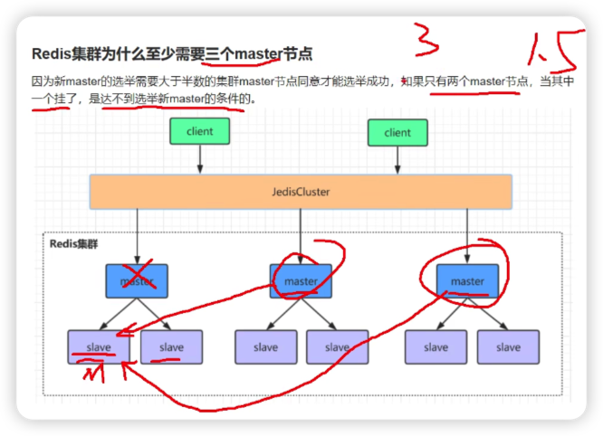

### 18. Redis集群为什么推荐奇数个节点

 如果四个节点，需要2个以上的master同意，此时挂了两个剩下两个就选举不了了，如果加一台变成5，只需要大于2.5就行，而不是大于3，挂了两台还剩三台可以选举。奇数台机器对资源的利用率也更高一点。

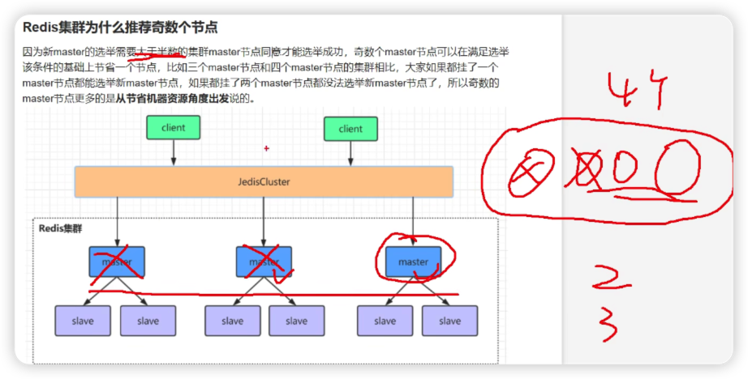

### 19. Redis集群支持批量操作命令吗 

可以执行，但是如果经过计算后，比如说set操作，这些批量操作的key不是在一个slot中的话就会报错，那么就想办法是这些key落在一个key上，在key前面加上{xx}（称作hash target），保证每个key的前面都有相同的{xx}就行（xx是任意内容）

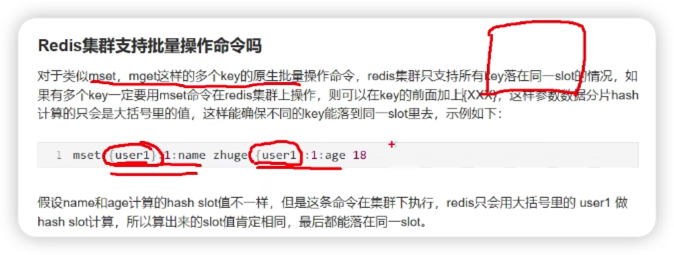

### 20. Lua脚本能在Redis集群里面执行吗

解决方案还是上一题一样，操作的key还是要落在同一个slot上，否则会报错


# MySQL

## MySQL连环50问

【小破站高质量面试题：MySQL 夺命连环50问（高频面试题及解析）】 https://www.bilibili.com/video/BV1ta411C7xq/?p=4&share_source=copy_web&vd_source=72c4cacd7237c3e04c39153a62aed182

实例：

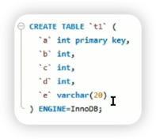

bcd为联合索引

### 1. 索引的分类

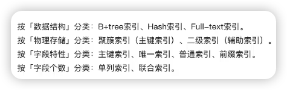

- 按照数据结构分类：B+tree索引、Hash索引、Full-text索引
- 按照物理存储分类：聚簇索引（主键索引）、二级索引（辅助索引）
  - 聚簇索引：Innodb将索引值和数据存储在一起
  - 二级索引：Innodb中只存储了索引值和主键id
- 按照字段特性分类：主键索引、唯一索引、普通索引、前缀索引
- 按照字段个数分类：单列索引、联合索引

### 2. B树和B+树的区别是什么

主要就是叶子结点之间按顺序有指针连接

### 3. innodb中的B+树是如何产生的

思想跟操作系统的二级页表、Redis跳表相似

一页就是一个节点 一页16kb

一般最好两层最好，超过4层就影响性能了

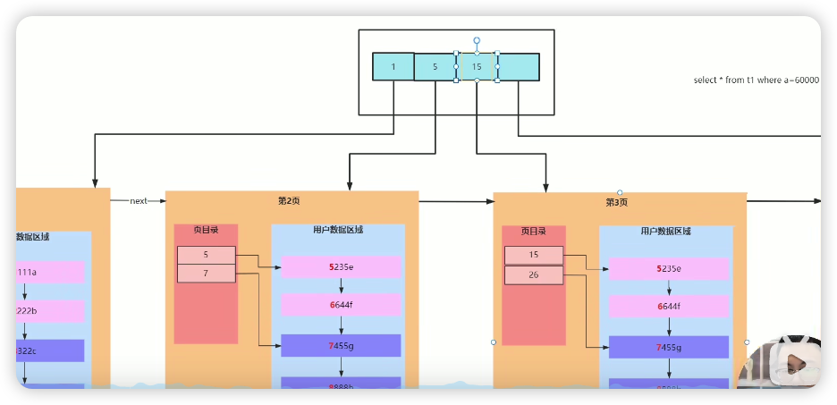

### 4. 高度为2的B+树能存多少数据

跟存的记录大小有关，假设索引页的记录大小为10b(int 4b + 指针 6b)，可以存16kb/10= 1638个索引，也就是能管理1638个叶子节点，假设叶子节点记录大小为1kb那么一页可以存16条，所以一共能存1638 * 16条数据记录。

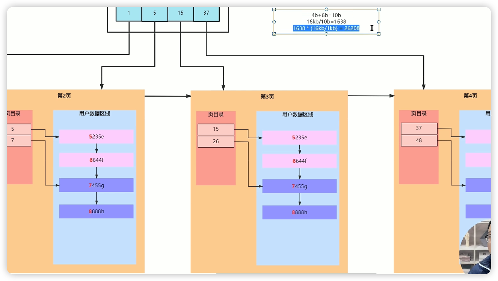

### 5. Innodb是如何支持范围查找能走索引的？

秒在数据页（叶子节点）间的双向指针，比如主键是a。要查询a>4的数据，那么他会去查找a=4的数据，然后根据数据页的指针返回之后的数据，如果要查a<4的数据，也是先查a=4然后依据指针返回前面的数据，这就是为什么需要双向指针的原因。

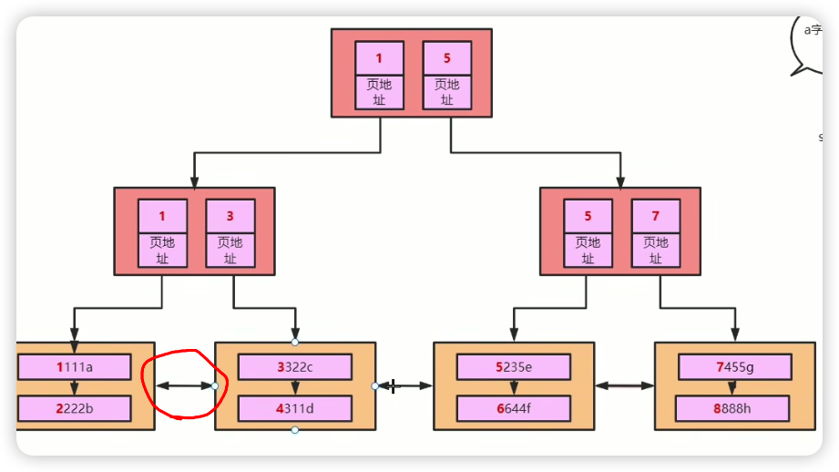

### 6. 为什么要遵循最左前缀原则才能利用索引

假设五个字段a,b,c,d,e主键为a，在这里创建了bcd联合索引，那么他是怎么排序的呢？是一次比较各个字段进行排序的，就是第一个字段相等那就比较第二个字段，以此类推，类似于java字符串比较大小。

创建的b+树是这样的：

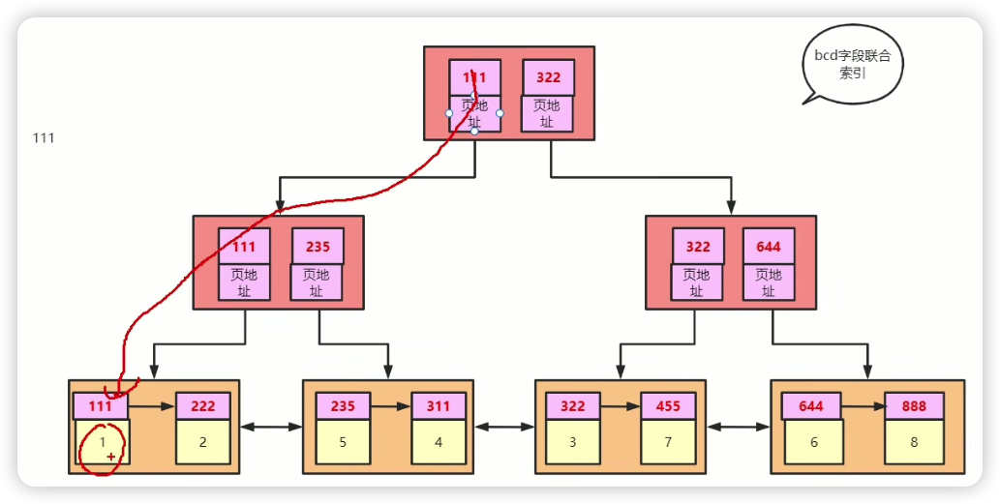

这里只存了bcd三个字段，如果需要查找a和e则需要回表

为什么要最左前缀原则看这个树的结构想想就知道了，如果给出这样的查询条件d=2 & c = 3（这里查询语句的顺序没有影响）没有b那怎么比较呢？？第一个数不知道是啥，比不了，那如果是查询条件是1*1就是c不给的意思，看上面的树，他会找到1\*1所在的页，然后再在这个页中查找d=1的数据，然后如果需要回表就回表。

这里提一下1*1这种查询会出现**索引下推**的问题，5.6之前他是这样查的：先找到1\*1的页，如果要回表的话，就把这个页中的数据全部回表，然后再在聚簇索引中查找d=1的数据；而5.6之后，先在页面中查找，再回表。实际上就减少了回表次数。

### 7. 范围查找导致索引失效

范围查找时，如果优化器觉得走二级索引还不如走全表扫描，那么就会直接全表扫描

比如selece * from db where b > 1(a为主键，bcd为联合索引，e为其他字段)时，如果走索引他会查到二级索引下面所有大于1的数据再去回表查全部数据，不走索引直接走全表扫描还快一点。

所以范围不能太宽泛

### 8. 覆盖索引底层原理

覆盖索引其实就是需要查询的数据直接就在二级索引里面，不需要回表

比如select **b** from db where b > 1;b字段就在bcd联合索引里面，不用回表。还有一个点需要注意select **a,b** from db where b > 1;这种加了主键a字段，虽然a是联合索引bcd的字段，但是联合索引暗含了主键不然咋回表嘞。

### 9. Order By为什么可能会导致索引失效？

select * from db order by b, c, d;这条语句怎么走呢？

两种可能：

- 走二级索引：不需要额外排序（因为建造二级索引的时候就是按照bcd来排序的）+ 8次回表（一共八条数据，且查询的是*）
- 全表扫描：将数据在内存中排序 + 不需要回表

如果数据量小，排序的消耗小，那么就会走全表扫描，比如这题。如果数据量很大排序的开销大于回表的开销，就会走二级索引。

select **b** from db order by b, c,d;这种坑定走二级索引，因为既不需要排序也不需要回表，坑定走二级索引楼

### 10. MySQL类型转换有什么要注意的？

给e字段添加索引，e字段类型是varchar

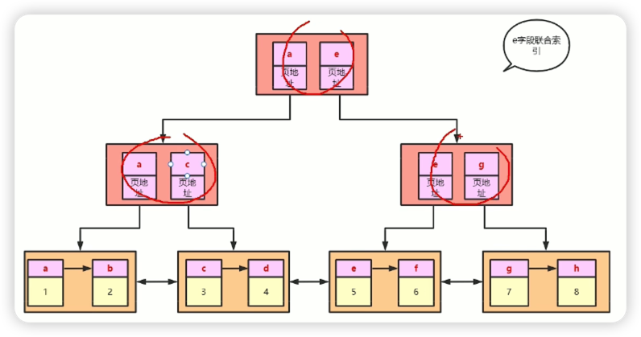

MySQL中字符和数字相比较时，会发生类型转换，同一将字符转换位数字，如果不是数字字符则转换为0，比如‘e’转换为0，'123'转换为123。

看下面几条语句会不会走索引

select * from tb where a = 1; 走索引

select * from tb where e = '1';走索引

select * from tb where a = '1';走索引

select * from tb where e = 1; 不走索引

前两条都是相同类型，后两条涉及到了类型转换

### 11. 对字段进行操作造成索引失效原理

接上条

倒数第二条类型转换成了1，最后一条类型转换要把字段e中的数据全部转换为数字之后才能去跟1比较，对字段进行了操作一般都不会走索引，你想想，如果走索引的话，是不是要将字符转换为数字然后重新生成一颗树呀，开销太大了。

总之直接对字段进行操作，比如加减法、字段类型转化等等都会导致索引失效。

## 马士兵B站面试

【这真的是B站讲的最好的Redis+MySQL数据库面试教程了，一套搞定mysql索引+事务+锁+主从复制+Redis缓存+集群+源码+实战+面试题】 https://www.bilibili.com/video/BV1pa411X7Sv/?p=10&share_source=copy_web&vd_source=72c4cacd7237c3e04c39153a62aed182

### 1. mysql事务的四个特点

ACID：原子性、隔离性、持久性、一致性

原子性：undolog

隔离性：锁和MVCC

持久性：redolog

以上三个特性形成了一致性

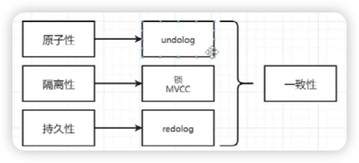

这里插播两个知识点，MySQL的架构是什么？客户端、服务端、存储引擎

MySQL有那些日志?

位于MySQL Server：

Binlog：二进制文件，用于主从复制

relaylog：从库的中继日志，接受binlog数据

Slowlog：慢查询日志

Errorlog：错误日志

位于Innodb存储引擎：

Redolog：前滚日志，用于实现持久化操作

Undolog：回滚日志，用于实现原子性和MVCC操作

### 2. 随机读写和顺序读写

顺序读写比随机读写效率高多了，redolog就是顺序读写

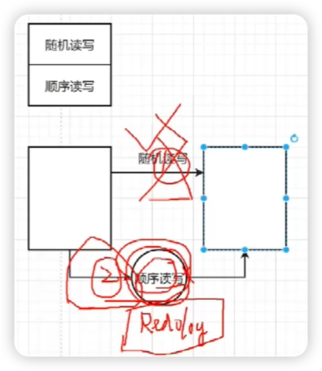

### 3. redolog和binlog有啥用

这两个日志也要保证一致，先写redolog还是再写binlog呢？自己想想如果先写binlog，redolog写失败了，那主从机不就数据不一致吗，如果先写redolog再写binlog同样会导致主从数据不一致。

所以就是要保证数据一致性？就是通过**两阶段提交**

给redolog设置为两个状态，prepare和commit，先写redolog将状态设置为prepare，再写binlog，binlog成功后再将redolog状态设置为commit。

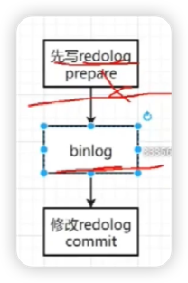

### 4. 多版本并发控制-MVCC

数据库多事务并发场景

- 读读：不会存在任何问题，不需要并发空控制
- 读写：有线程安全问题，脏读、不可重复读、幻读
  - MVCC就是为了解决数据库并发访问时的读写冲突问题
- 写写：会有线程安全问题，更新丢失

两个概念：当前读和快照读

- 当前读：在任何情况下读取的数据都是最新的数据

  - 有这些操作

    - select ...lock in share mode 
    - select ...for update

    - update
    - delete
    - insert

- 快照读：读取的时候读取的是历史版本数据

  - 有这些操作
    - select

### 5.MVCC-隐藏字段，undolog

创建表时的隐藏字段，这里介绍三个：

- DB_TRX_ID：创建者条记录或最后一次修改这条记录的事务id
- DB_ROLL_PTR：回滚指针，指向这条记录的上一个版本
- DB_ROW_ID：隐藏主键，当表中没有显式的主键时，mysql会默认生成一个6字节的rowid

那么啥是undolog?里面装的是老版本数据，类似链表结构

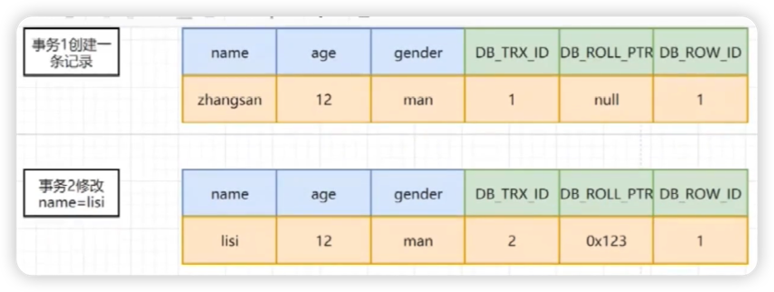

形成的undolog

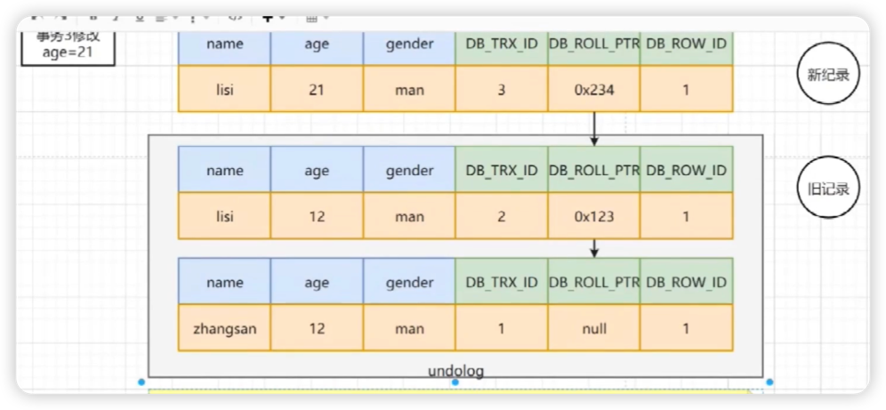

链表首部是最新的旧记录，尾部是最旧的旧记录，undolog不会一直扩容，通过异步的线程Purge可以将无效的日志删除掉

## InnoDB锁

### 列出MySQL InnoDB引擎中所有的锁并分类

在 MySQL InnoDB 存储引擎中，可以将锁分为以下几种类型：

1. 共享锁（Shared Lock）：
   - 也称为读锁（Read Lock）。
   - 多个事务可以同时持有共享锁，互不阻塞。
   - 共享锁用于读取数据，不阻止其他事务获取共享锁，但会阻止事务获取排他锁。
2. 排他锁（Exclusive Lock）：
   - 也称为写锁（Write Lock）。
   - 排他锁会阻塞其他事务的共享锁和排他锁。
   - 排他锁用于修改和删除数据，保证了数据的独占性。
3. 记录锁（Record Lock）：
   - 也称为行锁（Row Lock）。
   - 记录锁用于保护单个数据行，阻止其他事务对该行进行修改或删除。
   - 当事务修改或删除某个数据行时，会对该行加上记录锁，其他事务想要修改或删除该行时会被阻塞。
4. 间隙锁（Gap Lock）：
   - 间隙锁用于保护一个范围，而不是特定的记录。
   - 当事务执行范围查询时，会对查询范围中的间隙加上间隙锁，防止其他事务在该范围内插入新的记录。
5. 下一键锁（Next-Key Lock）：
   - 下一键锁是记录锁和间隙锁的组合。
   - 下一键锁同时锁定索引记录和相邻的间隙，用于防止幻读问题。
6. 意向锁（Intention Lock）：
   - 意向锁是表级锁，用于指示事务即将在某个数据行上加上行级锁。
   - 意向共享锁（Intention Shared Lock）指示事务即将在某个数据行上加上共享锁。
   - 意向排他锁（Intention Exclusive Lock）指示事务即将在某个数据行上加上排他锁。

需要注意的是，InnoDB 存储引擎使用多版本并发控制（MVCC）来实现锁机制，其中包括记录锁、间隙锁和下一键锁等，以提供更高的并发性和隔离性。这些锁机制的组合使用可以解决并发访问数据时的各种冲突和幻读问题。

### 共享锁和排它锁 Shared Lock、Exclusive Lock

#### 共享锁和排它锁是什么

共享锁（Shared Lock）和排他锁（Exclusive Lock）是在数据库中用于实现并发控制的两种常见的锁机制。

1. 共享锁（Shared Lock）：
   - 共享锁也被称为读锁（Read Lock）。
   - 允许多个事务同时持有共享锁，并且彼此之间不会互相阻塞。
   - 共享锁适用于读取操作，它表示事务只需要读取数据，并且不会对数据做任何修改。
   - 多个事务可以同时持有共享锁，并发地读取相同的数据，因为共享锁之间不会互斥。
2. 排他锁（Exclusive Lock）：
   - 排他锁也被称为写锁（Write Lock）。
   - 排他锁会阻塞其他事务的共享锁和排他锁，只有持有排他锁的事务可以进行写操作。
   - 排他锁适用于修改和删除操作，它表示事务需要对数据进行修改，并且在修改期间不希望其他事务读取或修改该数据。
   - 一旦事务持有了排他锁，其他事务无法同时持有任何共享锁或排他锁，排他锁具有排他性。

共享锁和排他锁是用于保护数据一致性和并发性的基本锁机制。共享锁允许多个事务并发地读取同一份数据，而排他锁则确保在修改数据时只有一个事务能够访问数据，从而防止数据的并发修改和冲突。这些锁机制在数据库事务中起到重要的作用，确保了数据的正确性和事务的隔离性。

#### 共享锁和排它锁的源码，并解释

以下是 MySQL InnoDB 存储引擎中共享锁和排他锁的相关源码片段，以及对其进行简要解释：

1. 共享锁源码示例：

```c
/* Acquire a shared (read) lock on the record */
dict_lock_table_rec_shared_low(
    dict_table_t* table, /* table object */
    rec_t* rec,          /* record object */
    ulint index,         /* index where the record is located */
    ulint type_mode,     /* lock mode: SHARED, IX or S */
    ulint roll_ptr);     /* roll pointer for undo log */

/* Acquire a shared (read) lock on the table */
dict_lock_table_shared(
    dict_table_t* table, /* table object */
    ulint type_mode);    /* lock mode: SHARED, IX or S */
```

共享锁的源码示例中，通过调用 `dict_lock_table_rec_shared_low()` 和 `dict_lock_table_shared()` 方法来获取共享锁。`dict_lock_table_rec_shared_low()` 用于在特定记录上获取共享锁，而 `dict_lock_table_shared()` 则用于在整个表上获取共享锁。

1. 排他锁源码示例：

```c
/* Acquire an exclusive (write) lock on the record */
dict_lock_table_rec_expl_low(
    dict_table_t* table, /* table object */
    rec_t* rec,          /* record object */
    ulint index,         /* index where the record is located */
    ulint type_mode,     /* lock mode: X or IX */
    ulint roll_ptr);     /* roll pointer for undo log */

/* Acquire an exclusive (write) lock on the table */
dict_lock_table_expl(
    dict_table_t* table, /* table object */
    ulint type_mode);    /* lock mode: X or IX */
```

排他锁的源码示例中，通过调用 `dict_lock_table_rec_expl_low()` 和 `dict_lock_table_expl()` 方法来获取排他锁。`dict_lock_table_rec_expl_low()` 用于在特定记录上获取排他锁，而 `dict_lock_table_expl()` 则用于在整个表上获取排他锁。

这些源码片段是 InnoDB 存储引擎中的一部分，用于处理共享锁和排他锁的获取和释放。它们涉及到底层的锁管理和并发控制机制，具体的实现细节相对复杂。这些方法在执行时会考虑当前锁的状态、事务的隔离级别以及锁的兼容性等因素，以确保数据的一致性和并发性。

#### 共享锁和排它锁的业务场景有哪些

共享锁（Shared Lock）和排它锁（Exclusive Lock）在数据库中的应用场景取决于并发操作的需求和数据访问模式。下面列举了一些常见的业务场景，以帮助理解它们的应用：

共享锁的业务场景：

1. 读取操作：当多个事务需要同时读取相同的数据时，可以使用共享锁来实现并发读取，提高读取性能。
2. 数据查询：在一个事务中执行 SELECT 查询时，可以使用共享锁来保证其他事务不会修改被查询的数据，保持一致性。
3. 并发报表生成：多个事务可以同时读取数据库中的数据来生成报表，通过共享锁避免数据读取冲突。
4. 数据备份：当执行数据备份操作时，可以使用共享锁来确保备份的数据的一致性。

排它锁的业务场景：

1. 数据修改：当一个事务需要修改或删除数据时，可以使用排它锁来保证其他事务不能同时读取或修改同一份数据，确保数据的一致性。
2. 数据写入：当一个事务需要向数据库中插入新的数据时，可以使用排它锁来防止其他事务同时进行写入操作，避免数据冲突。
3. 数据更新：在一个事务中执行 UPDATE 操作时，可以使用排它锁来防止其他事务同时读取或修改被更新的数据，确保更新操作的完整性。

需要根据具体的业务需求和并发访问模式来决定是否使用共享锁或排它锁。共享锁适用于读取和并发查询操作，可以允许多个事务同时读取数据。而排它锁适用于写入、更新和删除操作，确保在写入期间只有一个事务可以访问数据，避免数据冲突和不一致性。同时，需要注意锁的粒度和范围，避免过度的锁定导致性能下降或死锁的发生。

#### 给我一个共享锁和排它锁的业务例子，我来练习sql

假设你正在开发一个在线图书馆系统，以下是一个使用共享锁和排它锁的业务例子：

共享锁的业务例子： 多个用户同时查看图书详情：

```sql
-- 用户A查看图书详情
SELECT * FROM books WHERE book_id = 1 LOCK IN SHARE MODE;

-- 用户B查看图书详情
SELECT * FROM books WHERE book_id = 1 LOCK IN SHARE MODE;

-- 多个用户可以同时读取相同的图书详情，共享锁不会阻塞其他读取操作。
```

排它锁的业务例子： 用户借阅图书并更新库存：

```sql
-- 用户A借阅图书，需要获取排它锁来更新库存和借阅记录。
BEGIN;
SELECT * FROM books WHERE book_id = 1 FOR UPDATE;
UPDATE books SET stock = stock - 1 WHERE book_id = 1;
INSERT INTO borrow_records (user_id, book_id) VALUES (1, 1);
COMMIT;

-- 用户B尝试借阅同一本图书，在用户A事务提交之前会被阻塞。
BEGIN;
SELECT * FROM books WHERE book_id = 1 FOR UPDATE;
-- 等待用户A的事务提交后才能获取排它锁并进行更新操作。
```

在这个例子中，用户A通过获取排它锁来借阅图书并更新库存和借阅记录。而用户B在用户A的事务提交之前尝试借阅相同的图书，由于排它锁的存在，用户B会被阻塞直到用户A的事务完成。

请注意，在实际应用中，你需要根据自己的数据库架构和业务逻辑进行适当的表设计和锁定策略。这个例子仅供参考，你可以根据需要进行调整和扩展。在进行SQL练习时，确保正确地使用共享锁和排它锁，并注意锁的范围和释放，以保证数据的一致性和并发操作的正确性。

### 记录锁 record lock

#### innodb 记录锁是什么

InnoDB是MySQL数据库中的一种存储引擎，它支持事务和行级锁定。记录锁（Record Lock）是InnoDB存储引擎中的一种锁定机制，用于保护数据库中单个记录的完整性和一致性。

当一个事务需要访问或修改某个数据记录时，它会在该记录上请求一个记录锁。这样做可以防止其他事务同时修改同一条记录，确保数据的一致性。记录锁是一种排他锁（Exclusive Lock），即只允许一个事务持有该锁，其他事务在此期间无法获取该记录的锁。

记录锁在事务执行期间一直保持，直到事务提交或回滚。当事务提交时，记录锁会被释放，其他事务就可以访问该记录了。相反，如果事务回滚，则会释放所有记录锁，让其他事务能够修改这些记录。

**需要注意的是，InnoDB的记录锁是基于索引的。当你在一个表上使用记录锁时，InnoDB会根据你指定的索引来获取和释放锁。这意味着，如果你的事务使用不同的索引来访问同一条记录，那么可能会出现死锁的情况。因此，在编写应用程序时，需要注意事务的访问模式，以避免潜在的死锁问题。**

总而言之，InnoDB的记录锁是一种用于保护数据库记录完整性和一致性的机制。它可以防止并发事务对同一条记录进行冲突修改，并确保事务的隔离性和数据的一致性。

#### innodb记录锁的核心源码，并解释

InnoDB是MySQL的存储引擎之一，其源代码涉及大量复杂的数据结构和算法。在这个回答中，我将提供InnoDB记录锁的一般实现思路，而不是提供完整的源代码。以下是InnoDB记录锁的核心源码解释：

1. 锁结构体（Lock Structure）：在InnoDB中，记录锁使用Lock结构体来表示。该结构体定义了锁的类型、状态、持有者等信息。在源代码中，这个结构体通常被命名为`lock_t`。
2. 锁的获取（Lock Acquisition）：当事务需要获取一个记录的锁时，它会调用InnoDB提供的API函数，如`row_lock`或`row_lock_for_mysql`。这些函数会根据指定的参数，包括表、索引和记录的标识符，尝试获取相应的记录锁。
3. 锁的检查（Lock Checking）：在尝试获取记录锁之前，InnoDB会检查当前事务是否与其他事务持有的锁存在冲突。这包括检查锁的类型（共享锁或排他锁）以及锁的范围（记录锁、间隙锁或临键锁）。这些检查是为了确保事务的隔离性和一致性。
4. 锁的冲突解决（Lock Conflict Resolution）：如果事务需要获取的记录锁与其他事务持有的锁存在冲突，InnoDB会根据一定的策略进行冲突解决。具体的策略包括等待（Wait）、回滚（Rollback）或选择其他的执行路径（如死锁检测和回避）。
5. 锁的释放（Lock Release）：当事务提交或回滚时，InnoDB会释放持有的记录锁。这样其他事务就可以获取到相应的锁，继续进行操作。

需要注意的是，InnoDB的源代码非常庞大和复杂，涉及到许多不同的文件和模块。记录锁只是其中的一个组成部分。如果你对InnoDB的源代码有兴趣，我建议你参考MySQL官方的源代码仓库，详细研究相关文件和函数的实现。

#### 记录锁的业务场景有哪些

记录锁在数据库系统中用于管理并发访问和修改数据记录的场景。下面是一些记录锁的常见业务场景：

1. 并发读写操作：当多个事务同时读取和修改同一条记录时，为了保持数据的一致性，需要使用记录锁。记录锁可以确保在一个事务修改记录期间，其他事务无法同时读取或修改同一条记录，以避免数据不一致的情况发生。
2. 数据完整性维护：记录锁可以用于保护数据库中的数据完整性。例如，在某个订单系统中，当一个事务正在处理某个订单时，可以对该订单记录进行排他锁定，防止其他事务同时修改该订单，从而确保订单的数据完整性。
3. 防止数据丢失和冲突：在某些场景下，同时对同一条记录进行并发写操作可能导致数据丢失或冲突。通过使用记录锁，可以避免并发写操作的冲突，确保每个事务能够按照预期完成写入操作，防止数据丢失或覆盖。
4. 死锁避免：记录锁还可以用于避免死锁情况的发生。当事务需要获取多个记录的锁时，通过按照特定的顺序获取记录锁，可以减少死锁的可能性。例如，如果两个事务需要同时获取A记录和B记录的锁，可以规定按照A、B的顺序获取锁，这样可以避免死锁的发生。

需要注意的是，记录锁的使用需要谨慎，过度的锁定可能导致性能下降和并发性降低。在设计数据库系统和应用程序时，需要根据具体的业务需求和并发情况合理地使用记录锁，平衡数据一致性和性能的要求。

#### 给我一个记录锁的业务例子，我来练习sql

好的，让我们来考虑一个简单的业务例子，假设你正在开发一个在线图书商城的数据库系统。其中一个常见的业务场景是处理用户的订单。

我们可以创建两个表来表示这个场景：

1. `books` 表：存储图书信息，包括图书ID、名称、作者、价格等字段。

```java
sqlCopy code
CREATE TABLE books (
  book_id INT PRIMARY KEY,
  title VARCHAR(100),
  author VARCHAR(100),
  price DECIMAL(8,2)
);
```

1. `orders` 表：存储用户订单信息，包括订单ID、用户ID、图书ID等字段。

```java
sqlCopy code
CREATE TABLE orders (
  order_id INT PRIMARY KEY,
  user_id INT,
  book_id INT,
  quantity INT,
  FOREIGN KEY (book_id) REFERENCES books(book_id)
);
```

现在，假设有两个用户同时想购买同一本图书，并且库存只剩下一本。在这种情况下，我们需要使用记录锁来保证并发访问的正确性。以下是一个基于InnoDB存储引擎的记录锁的业务例子：

1. 用户A发起购买请求：

```java
sqlCopy code
-- 开启事务
START TRANSACTION;

-- 获取图书记录锁
SELECT * FROM books WHERE book_id = 1 FOR UPDATE;

-- 检查库存是否充足
SELECT quantity FROM books WHERE book_id = 1;

-- 如果库存足够，则创建订单
INSERT INTO orders (order_id, user_id, book_id, quantity)
VALUES (1, 1, 1, 1);

-- 更新库存数量
UPDATE books SET quantity = quantity - 1 WHERE book_id = 1;

-- 提交事务
COMMIT;
```

1. 用户B同时发起购买请求：

```java
sqlCopy code
-- 开启事务
START TRANSACTION;

-- 获取图书记录锁
SELECT * FROM books WHERE book_id = 1 FOR UPDATE;

-- 检查库存是否充足
SELECT quantity FROM books WHERE book_id = 1;

-- 如果库存足够，则创建订单
INSERT INTO orders (order_id, user_id, book_id, quantity)
VALUES (2, 2, 1, 1);

-- 更新库存数量
UPDATE books SET quantity = quantity - 1 WHERE book_id = 1;

-- 提交事务
COMMIT;
```

在上述示例中，通过使用`FOR UPDATE`语句，我们对图书记录进行了锁定，以防止其他事务同时修改相同的记录。这样，当一个用户正在购买一本图书时，另一个用户就无法同时购买相同的图书。

需要注意的是，上述示例是一个简化的演示，实际的业务场景可能更加复杂。在实际开发中，你还需要处理并发性、异常情况、事务管理和其他一些细节。

### 间隙锁 gap lock

#### 间隙锁是什么

间隙锁（Gap Lock）是MySQL中的一种锁机制，用于解决并发事务之间的幻读问题。它与记录锁不同，**记录锁用于锁定已存在的记录，而间隙锁则用于锁定两个记录之间的间隙（即不存在的记录范围）。**

间隙锁的主要作用是防止其他事务在间隙中插入或删除记录，从而保护当前事务的读取操作的一致性。当一个事务持有间隙锁时，其他事务无法在该间隙范围内插入记录，以防止幻读的发生。

#### 给我一个间隙锁的业务例子，我来练习sql

当涉及到插入新记录或范围查询时，间隙锁（Gap Lock）在数据库中起到重要的作用。下面给您一个间隙锁的业务例子，您可以练习相关的 SQL 查询：

假设有一个用户表（`users`），其中包含以下字段：

- `id`：用户ID（主键）
- `username`：用户名

现在，假设有两个事务同时进行以下操作：

事务 A：

```java
sqlCopy code
BEGIN;
INSERT INTO users (id, username) VALUES (4, 'John');
COMMIT;
```

事务 B：

```java
sqlCopy code
BEGIN;
SELECT * FROM users WHERE id > 2 AND id < 6 FOR UPDATE;
```

在这个例子中，事务 A 将要插入一个新的用户记录，而事务 B 则需要获取一个范围内的间隙锁。

根据事务 B 的查询条件 `id > 2 AND id < 6`，它会获取两个间隙锁，即 id 为 2 和 id 为 6 之间的间隙。

由于事务 B 获取了这两个间隙锁，事务 A 将无法在这个范围内插入新的记录。这就确保了在事务 B 执行期间，范围内的数据保持一致，避免了幻读的问题。

在练习时，您可以在数据库中创建一个类似的用户表，并尝试执行以上的事务 A 和事务 B。观察在事务 B 执行时间隙锁的行为，并尝试插入新的记录以查看间隙锁的影响。这样可以更好地理解和掌握间隙锁的使用和效果。

### 临键锁 next-key lock

#### next-key lock是什么

Next-Key Lock（下一个键锁）是InnoDB存储引擎中的一种锁机制，结合了记录锁和间隙锁的特性。它用于解决幻读问题和提供更严格的并发控制。

Next-Key Lock的设计思想是在索引范围扫描过程中，同时锁定满足查询条件的记录和记录之间的间隙。这种组合锁机制可以确保查询结果的一致性，并避免其他事务在扫描范围内插入或删除记录，从而防止幻读的发生。

具体来说，Next-Key Lock在索引范围扫描中的工作方式如下：

1. 记录锁（Record Lock）：对满足查询条件的记录进行记录锁定，以防止其他事务修改或删除这些记录。
2. 间隙锁（Gap Lock）：在满足查询条件的记录之间的间隙上放置间隙锁，防止其他事务在这个范围内插入新的记录。
3. 前缀锁（Next-Key Lock）：组合了记录锁和间隙锁，形成了一种锁定记录和间隙的连续范围，确保并发操作的一致性和正确性。

Next-Key Lock机制的使用场景通常涉及范围查询、唯一索引、避免幻读等情况。它提供了更强的并发控制和数据一致性保证，比单独使用记录锁或间隙锁更为有效。

需要注意的是，**Next-Key Lock仅在InnoDB存储引擎中可用**，而不是所有数据库系统中都存在该特定的锁机制。它是InnoDB为解决并发控制问题而引入的一项重要技术。

#### next-key lock的业务场景

Next-Key Lock在以下业务场景中发挥重要作用：

1. 幻读防止：Next-Key Lock可以防止幻读的发生。当一个事务在查询范围内获取Next-Key Lock时，它将锁定范围内的记录和间隙，确保其他事务无法在该范围内插入新的记录，从而避免了幻读问题。
2. 范围查询的一致性：在执行范围查询时，Next-Key Lock可以确保查询结果的一致性。它通过锁定满足查询条件的记录和记录之间的间隙，防止其他事务插入或删除记录，保持查询结果的准确性。
3. 避免并发写冲突：Next-Key Lock可以避免并发写冲突。当多个事务同时访问相同的索引范围时，Next-Key Lock将记录和间隙锁组合在一起，确保在同一范围内的并发写操作不会冲突，保证数据的完整性和一致性。
4. 唯一索引的维护：在唯一索引上进行插入、更新和删除操作时，Next-Key Lock可以确保数据的唯一性。它通过组合记录锁和间隙锁，保证了索引的唯一性约束，防止其他事务插入或修改具有相同键值的记录。

需要注意的是，Next-Key Lock的适用场景主要是在并发读写操作较多、存在范围查询和避免幻读的业务场景中。它是InnoDB存储引擎提供的一项重要特性，为数据库系统提供了更强的并发控制和数据一致性保证。

#### next-key lock的业务例子，我来练习sql

当涉及到范围查询、唯一索引、并发写操作等情况时，Next-Key Lock可以发挥作用。下面给您一个Next-Key Lock的业务例子，您可以练习相关的 SQL 查询：

假设有一个订单表（`orders`），其中包含以下字段：

- `order_id`：订单ID（主键）
- `customer_id`：客户ID
- `order_date`：订单日期

现在，假设有两个事务同时进行以下操作：

事务 A：

```sql
sqlCopy code
BEGIN;
INSERT INTO orders (order_id, customer_id, order_date) VALUES (5, 1, '2023-05-29');
COMMIT;
```

事务 B：

```sql
sqlCopy code
BEGIN;
SELECT * FROM orders WHERE order_date >= '2023-05-01' FOR UPDATE;
```

在这个例子中，事务 A 将要插入一个新的订单记录，而事务 B 则需要获取一个特定日期范围内的订单数据。

根据事务 B 的查询条件 `order_date >= '2023-05-01'`，它会获取符合条件的记录的Next-Key Lock。这意味着它会锁定符合条件的订单记录和这些记录之间的间隙，以确保数据的一致性和避免幻读的问题。

在练习时，您可以在数据库中创建一个类似的订单表，并尝试执行以上的事务 A 和事务 B。观察在事务 B 执行期间Next-Key Lock的行为，并尝试插入新的订单记录以查看锁对并发操作的影响。这样可以更好地理解和掌握Next-Key Lock的使用和效果。

### 意向锁 intention lock

#### innodb 意向锁是什么

InnoDB存储引擎中的意向锁（Intention Lock）是一种**辅助锁**，用于协调事务对表级锁的使用。它的**主要目的是在并发环境中协调共享和排他锁之间的使用，以提高并发性能和减少锁冲突。**

意向锁有两种类型：**意向共享锁（Intention Shared Lock）和意向独占锁（Intention Exclusive Lock）**。

意向共享锁（IS锁）是表级锁，用于表示一个事务打算在表中的某个数据行上设置共享锁。它表明该事务打算获取共享锁，但不排斥其他事务同时获取共享锁。

意向独占锁（IX锁）也是表级锁，用于表示一个事务打算在表中的某个数据行上设置独占锁。它表明该事务打算获取独占锁，但不排斥其他事务同时获取共享锁。

意向锁的作用是为了**协调事务对表级锁的获取和释放**，以减少不必要的锁冲突。当一个事务要在某个数据行上设置共享锁或独占锁时，它需要先获取意向锁，以通知其他事务在表级别上的锁情况。这样，其他事务可以根据意向锁的状态来判断是否需要等待或选择适当的锁模式。

意向锁的引入可以提高并发性能，因为事务可以在表级别上协调并发操作而不需要直接竞争数据行级别的锁。它减少了事务之间的冲突，提高了并发度和效率。

需要注意的是，意向锁是InnoDB存储引擎内部使用的一种锁机制，**对于普通的SQL查询语句，开发人员通常不需要显式地操作意向锁。它在底层被自动管理，确保正确的锁协调和并发控制。**

#### innodb 意向锁的业务场景

InnoDB存储引擎中的意向锁（Intention Lock）在以下业务场景中发挥重要作用：

1. 表级锁协调：意向锁用于协调事务对表级锁的使用，以减少锁冲突。当一个事务要在表中的某个数据行上设置共享锁或独占锁时，它会先获取意向锁，以通知其他事务在表级别上的锁情况。这样可以避免不必要的竞争和冲突，提高并发性能。
2. 并发读写操作：在并发读写操作的场景中，意向锁可以起到协调的作用。多个事务可能同时读取或修改同一张表的不同数据行，通过使用意向锁，它们可以在表级别上进行协调，避免不必要的锁冲突，提高并发度和效率。
3. 索引维护和范围查询：在执行索引维护操作（如插入、删除、更新）或范围查询时，意向锁可以确保数据的一致性。它可以协调并发事务对索引的操作，防止冲突和幻读问题的发生。
4. 外键约束操作：当涉及到外键约束操作时，意向锁可以确保数据的完整性。在执行外键约束操作期间，意向锁可以协调涉及到外键关联的表之间的并发操作，保持数据的一致性。

需要注意的是，意向锁在InnoDB存储引擎内部自动管理，对于大多数的SQL查询语句，开发人员不需要直接操作意向锁。它主要在底层用于锁协调和并发控制，以提供更好的并发性能和数据一致性。

