# JVM宋红康

# 第一章 JVM与Java体系结构

## 前言

你是否也遇到过这些问题？

1. 运行着的线上系统突然卡死，系统无法访问，甚至直接OOM！
2. 想解决线上JVM GC问题，但却无从下手。
3. 新项目上线，对各种JVM参数设置一脸茫然，直接默认吧然后就JJ了。
4. 每次面试之前都要重新背一遍JVM的一些原理概念性的东西，然而面试官却经常问你在实际项目中如何调优VM参数，如何解决GC、OOM等问题，一脸懵逼。


大部分Java开发人员，除了会在项目中使用到与Java平台相关的各种高精尖技术，对于Java技术的核心Java虚拟机了解甚少。

## 开发人员如何看待上层框架

1. 一些有一定工作经验的开发人员，打心眼儿里觉得SSM、微服务等上层技术才是重点，基础技术并不重要，这其实是一种本末倒置的“**病态**”。
2. 如果我们把核心类库的API比做数学公式的话，那么Java虚拟机的知识就好比公式的推导过程。


- 计算机系统体系对我们来说越来越远，在不了解底层实现方式的前提下，通过高级语言很容易编写程序代码。但事实上计算机并不认识高级语言。

## 架构师每天都在思考什么？

1. 应该如何让我的系统更快？
2. 如何避免系统出现瓶颈？

## 知乎上有条帖子：应该如何看招聘信息，直通年薪50万+？

1. 参与现有系统的性能优化，重构，保证平台性能和稳定性
2. 根据业务场景和需求，决定技术方向，做技术选型
3. 能够独立架构和设计海量数据下高并发分布式解决方案，满足功能和非功能需求
4. 解决各类潜在系统风险，核心功能的架构与代码编写
5. 分析系统瓶颈，解决各种疑难杂症，性能调优等

## 我们为什么要学习JVM

1. 面试的需要（BATJ、TMD，PKQ等面试都爱问）
2. 中高级程序员必备技能

- 项目管理、调优的需要

3. 追求极客的精神，

- 比如：垃圾回收算法、JIT、底层原理

## Java VS C++

1. 垃圾收集机制为我们打理了很多繁琐的工作，大大提高了开发的效率，但是，垃圾收集也不是万能的，懂得JVM内部的内存结构、工作机制，是设计高扩展性应用和诊断运行时问题的基础，也是Java工程师进阶的必备能力。
2. C++语言需要程序员自己来分配内存和回收内存，对于高手来说可能更加舒服，但是对于普通开发者，如果技术实力不够，很容易造成内存泄漏。而Java全部交给JVM进行内存分配和回收，这也是一种趋势，减少程序员的工作量。


## 什么人需要学JVM?

1. 拥有一定开发经验的Java开发人员，希望升职加薪
2. 软件设计师，架构师
3. 系统调优人员
4. 虚拟机爱好者，JVM实践者

## 推荐及参考书籍

官方文档

**英文文档规范**：https://docs.oracle.com/javase/specs/index.html


中文书籍：


> 周志明老师的这本书**非常推荐看**，不过只推荐看第三版，第三版较第二版更新了很多，个人觉得没必要再看第二版。


## Java生态圈

Java是目前应用最为广泛的软件开发平台之一。随着Java以及Java社区的不断壮大Java 也早已不再是简简单单的一门计算机语言了，它更是一个平台、一种文化、一个社区。

1. 作为一个平台，Java虚拟机扮演着举足轻重的作用
   - Groovy、Scala、JRuby、Kotlin等都是Java平台的一部分
2. 作为一种文化，Java几乎成为了“开源”的代名词。
   - 第三方开源软件和框架。如Tomcat、Struts，MyBatis，Spring等。
   - 就连JDK和JVM自身也有不少开源的实现，如openJDK、Harmony。
3. 作为一个社区，Java拥有全世界最多的技术拥护者和开源社区支持，有数不清的论坛和资料。从桌面应用软件、嵌入式开发到企业级应用、后台服务器、中间件，都可以看到Java的身影。其应用形式之复杂、参与人数之众多也令人咋舌。

## Java-跨平台的语言


## JVM-跨语言的平台


1. 随着Java7的正式发布，Java虚拟机的设计者们通过JSR-292规范基本实现在Java虚拟机平台上运行非Java语言编写的程序。
2. Java虚拟机根本不关心运行在其内部的程序到底是使用何种编程语言编写的，它只关心“字节码”文件。也就是说Java虚拟机拥有语言无关性，并不会单纯地与Java语言“终身绑定”，只要其他编程语言的编译结果满足并包含Java虚拟机的内部指令集、符号表以及其他的辅助信息，它就是一个有效的字节码文件，就能够被虚拟机所识别并装载运行。

- Java不是最强大的语言，但是JVM是最强大的虚拟机（有点夸张了）

1. 我们平时说的java字节码，指的是用java语言编译成的字节码。准确的说任何能在jvm平台上执行的字节码格式都是一样的。所以应该统称为：**jvm字节码**。
2. 不同的编译器，可以编译出相同的字节码文件，字节码文件也可以在不同的JVM上运行。
3. Java虚拟机与Java语言并没有必然的联系，它只与特定的二进制文件格式——Class文件格式所关联，Class文件中包含了Java虚拟机指令集（或者称为字节码、Bytecodes）和符号表，还有一些其他辅助信息。

## 多语言混合编程

1. Java平台上的多语言混合编程正成为主流，通过特定领域的语言去解决特定领域的问题是当前软件开发应对日趋复杂的项目需求的一个方向。
2. 试想一下，在一个项目之中，并行处理用Clojure语言编写，展示层使用JRuby/Rails，中间层则是Java，每个应用层都将使用不同的编程语言来完成，而且，接口对每一层的开发者都是透明的，各种语言之间的交互不存在任何困难，就像使用自己语言的原生API一样方便，因为它们最终都运行在一个虚拟机之上。
3. 对这些运行于Java虚拟机之上、Java之外的语言，来自系统级的、底层的支持正在迅速增强，以JSR-292为核心的一系列项目和功能改进（如DaVinci Machine项目、Nashorn引擎、InvokeDynamic指令、java.lang.invoke包等），推动Java虚拟机从“Java语言的虚拟机”向 “多语言虚拟机”的方向发展。

## 如何真正搞懂JVM


## Java在发展过程中的重大事件

- 1990年，在Sun计算机公司中，由Patrick Naughton、MikeSheridan及James Gosling领导的小组Green Team，开发出的新的程序语言，命名为Oak，后期命名为Java
- 1995年，Sun正式发布Java和HotJava产品，Java首次公开亮相。
- 1996年1月23日Sun Microsystems发布了JDK 1.0。
- 1998年，JDK1.2版本发布。同时，Sun发布了JSP/Servlet、EJB规范，以及将Java分成了J2EE、J2SE和J2ME。这表明了Java开始向企业、桌面应用和移动设备应用3大领域挺进。
- 2000年，JDK1.3发布，**Java HotSpot Virtual Machine正式发布，成为Java的默认虚拟机。**
- 2002年，JDK1.4发布，古老的Classic虚拟机退出历史舞台。
- 2003年年底，**Java平台的scala正式发布，同年Groovy也加入了Java阵营。**
- 2004年，JDK1.5发布。同时JDK1.5改名为JavaSE5.0。**（里程碑，出现了大量的新特性）**
- 2006年，JDK6发布。同年，**Java开源并建立了OpenJDK**。顺理成章，**Hotspot虚拟机也成为了OpenJDK中的默认虚拟机。**
- 2007年，**Java平台迎来了新伙伴Clojure。**
- 2008年，oracle收购了BEA，**得到了JRockit虚拟机。**
- 2009年，Twitter宣布把后台大部分程序从Ruby迁移到Scala，这是Java平台的又一次大规模应用。
- 2010年，Oracle收购了Sun，**获得Java商标和最具价值的HotSpot虚拟机。**此时，Oracle拥有市场占用率最高的两款虚拟机HotSpot和JRockit，并计划在未来对它们进行整合：HotRockit。JCP组织管理Java语言
- 2011年，JDK7发布。在JDK1.7u4中，**正式启用了新的垃圾回收器G1。**
- **2017年，JDK9发布。将G1设置为默认GC，替代CMS**
- 同年，**IBM的J9开源**，形成了现在的Open J9社区**（最成功的三大开源虚拟机Hotspot、HotRockit、J9）**
- 2018年，Android的Java侵权案判决，Google赔偿Oracle计88亿美元
- 同年，Oracle宣告JavagE成为历史名词JDBC、JMS、Servlet赠予Eclipse基金会
- **同年，JDK11发布，LTS版本的JDK，发布革命性的ZGC，调整JDK授权许可**
- 2019年，JDK12发布，加入RedHat领导开发的**Shenandoah GC**

## Open JDK和Oracle JDK


- 在JDK11之前，Oracle JDK中还会存在一些Open JDK中没有的，闭源的功能。但在JDK11中，我们可以认为Open JDK和Oracle JDK代码实质上已经达到完全一致的程度了。
- 主要的区别就是两者更新周期不一样

## 虚拟机

### 虚拟机概念

- 所谓虚拟机（Virtual Machine），就是一台虚拟的计算机。它是一款软件，用来执行一系列虚拟计算机指令。大体上，虚拟机可以分为系统虚拟机和程序虚拟机。

  - 大名鼎鼎的Virtual Box，VMware就属于系统虚拟机，它们完全是对物理计算机硬件的仿真(模拟)，提供了一个可运行完整操作系统的软件平台。

  - 程序虚拟机的典型代表就是Java虚拟机，它专门为执行单个计算机程序而设计，在Java虚拟机中执行的指令我们称为Java字节码指令。

- 无论是系统虚拟机还是程序虚拟机，在上面运行的软件都被限制于虚拟机提供的资源中。

### Java虚拟机

1. Java虚拟机是一台执行Java字节码的虚拟计算机，它拥有独立的运行机制，其运行的Java字节码也未必由Java语言编译而成。
2. JVM平台的各种语言可以共享Java虚拟机带来的跨平台性、优秀的垃圾回器，以及可靠的即时编译器。
3. **Java技术的核心就是Java虚拟机**（JVM，Java Virtual Machine），因为所有的Java程序都运行在Java虚拟机内部。

#### 作用

Java虚拟机就是二进制字节码的运行环境，负责装载字节码到其内部，解释/编译为对应平台上的机器指令执行。每一条Java指令，Java虚拟机规范中都有详细定义，如怎么取操作数，怎么处理操作数，处理结果放在哪里。

#### 特点

1. 一次编译，到处运行
2. 自动内存管理
3. 自动垃圾回收功能

## JVM的位置

JVM是运行在操作系统之上的，他与硬件没有直接的交互


## JVM的整体结构

1. HotSpot VM是目前市面上高性能虚拟机的代表作之一。
2. 它采用解释器与即时编译器并存的架构。
3. 在今天，Java程序的运行性能早已脱胎换骨，已经达到了可以和C/C++程序一较高下的地步。


## Java代码执行流程

凡是能生成被Java虚拟机所能解释、运行的字节码文件，那么理论上我们就可以自己设计一套语言了。


## JVM的架构模型

Java编译器输入的指令流基本上是一种**基于栈的指令集架构**，另外一种指令集架构则是**基于寄存器的指令集架构**。具体来说：这两种架构之间的区别：

### 基于栈的指令集架构

基于栈式架构的特点：

1. 设计和实现更**简单**，适用于资源受限的系统（）；
2. 避开了寄存器的分配难题：使用**零地址指令方式分配（零地址简单来说就是不需要地址就能找到操作数，因为操作数总是在栈顶）**
3. 指令流中的指令大部分是零地址指令，其执行过程依赖于操作栈。**指令集更小**，编译器容易实现
4. 不需要硬件支持，**可移植性更好**，更好实现跨平台

### 基于寄存器的指令集架构

基于寄存器架构的特点：

1. 典型的应用是x86的二进制指令集：比如传统的PC以及Android的Davlik虚拟机。
2. 指令集架构则完全依赖硬件，**与硬件的耦合度高，可移植性差**
3. **性能优秀**和执行更高效
4. 花费**更少的指令**去完成一项操作
5. 在大部分情况下，基于寄存器架构的指令集往往都以一地址指令、二地址指令和三地址指令为主，而基于栈式架构的指令集却是以零地址指令为主

### 两种架构的举例

- 基于栈的计算流程字节码

  ```java
  iconst_2 //常量2入栈
  istore_1
  iconst_3 // 常量3入栈
  istore_2
  iload_1
  iload_2
  iadd //常量2/3出栈，执行相加
  istore_0 // 结果5入栈
  ```

  有八个指令

- 而基于寄存器的计算流程

  ```java
  mov eax,2 //将eax寄存器的值设为1
  add eax,3 //使eax寄存器的值加3
  ```

### Java架构总结

1. **由于跨平台性的设计，Java的指令都是根据栈来设计的**。不同平台CPU架构不同，所以不能设计为基于寄存器的。栈的优点：跨平台，指令集小，编译器容易实现，缺点是性能比寄存器差一些。
2. 时至今日，尽管嵌入式平台已经不是Java程序的主流运行平台了（准确来说应该是HotSpot VM的宿主环境已经不局限于嵌入式平台了），那么为什么不将架构更换为基于寄存器的架构呢？
3. 因为基于栈的架构跨平台性好、指令集小，虽然相对于基于寄存器的架构来说，基于栈的架构编译得到的指令更多，执行性能也不如基于寄存器的架构好，但考虑到其跨平台性与移植性，我们还是选用栈的架构

## JVM的生命周期

### 虚拟机的启动

Java虚拟机的启动是通过引导类加载器（bootstrap class loader）创建一个初始类（initial class）来完成的，这个类是由虚拟机的具体实现指定的。

### 虚拟机的执行

1. 一个运行中的Java虚拟机有着一个清晰的任务：执行Java程序
2. 程序开始执行时他才运行，程序结束时他就停止
3. **执行一个所谓的Java程序的时候，真真正正在执行的是一个叫做Java虚拟机的进程**

### 虚拟机的退出

**有如下的几种情况：**

1. 程序正常执行结束
2. 程序在执行过程中遇到了异常或错误而异常终止
3. 由于操作系统用现错误而导致Java虚拟机进程终止
4. 某线程调用Runtime类或System类的exit()方法，或Runtime类的halt()方法，并且Java安全管理器也允许这次exit()或halt()操作。
5. 除此之外，JNI（Java Native Interface）规范描述了用JNI Invocation API来加载或卸载 Java虚拟机时，Java虚拟机的退出情况。

## JVM发展历程

### Sun Classic VM

1. 早在1996年Java1.0版本的时候，Sun公司发布了一款名为sun classic VM的Java虚拟机，它同时也是**世界上第一款商用Java虚拟机**，JDK1.4时完全被淘汰。
2. 这款虚拟机内部只提供解释器，**没有即时编译器**，因此效率比较低。【即时编译器会把热点代码的本地机器指令缓存起来，那么以后使用热点代码的时候，效率就比较高】
3. 如果使用JIT编译器，就需要进行外挂。但是一旦使用了JIT编译器，JIT就会接管虚拟机的执行系统。解释器就不再工作，解释器和编译器不能配合工作。
   - 我们将字节码指令翻译成机器指令也是需要花时间的，如果只使用JIT，就需要把所有字节码指令都翻译成机器指令，就会导致翻译时间过长，也就是说在程序刚启动的时候，等待时间会很长。
   - 而解释器就是走到哪，解释到哪。
4. 现在Hotspot内置了此虚拟机。

### Exact JVM

1. 为了解决上一个虚拟机问题，jdk1.2时，Sun提供了此虚拟机。
2. Exact Memory Management：准确式内存管理
   - 也可以叫Non-Conservative/Accurate Memory Management
   - 虚拟机可以知道内存中某个位置的数据具体是什么类型。
3. 具备现代高性能虚拟机的维形
   - 热点探测（寻找出热点代码进行缓存）
   - 编译器与解释器混合工作模式
4. 只在Solaris平台短暂使用，其他平台上还是classic vm，英雄气短，终被Hotspot虚拟机替换

### HotSpot VM(重点)

1. HotSpot历史
   - 最初由一家名为“Longview Technologies”的小公司设计
   - 1997年，此公司被Sun收购；2009年，Sun公司被甲骨文收购。
   - JDK1.3时，HotSpot VM成为默认虚拟机
2. 目前**Hotspot占有绝对的市场地位，称霸武林**。
   - 不管是现在仍在广泛使用的JDK6，还是使用比例较多的JDK8中，默认的虚拟机都是HotSpot
   - Sun/oracle JDK和openJDK的默认虚拟机
   - 因此本课程中默认介绍的虚拟机都是HotSpot，相关机制也主要是指HotSpot的GC机制。（比如其他两个商用虚机都没有方法区的概念）
3. 从服务器、桌面到移动端、嵌入式都有应用。
4. **名称中的HotSpot指的就是它的热点代码探测技术。**
   - 通过计数器找到最具编译价值代码，触发即时编译或栈上替换
   - 通过编译器与解释器协同工作，在最优化的程序响应时间与最佳执行性能中取得平衡

### JRockit(商用三大虚拟机之一)

1. 专注于服务器端应用：它可以**不太关注程序启动速度，因此JRockit内部不包含解析器实现**，全部代码都靠即时编译器编译后执行。
2. 大量的行业基准测试显示，**JRockit JVM是世界上最快的JVM**：使用JRockit产品，客户已经体验到了显著的性能提高（一些超过了70%）和硬件成本的减少（达50%）。
3. 优势：全面的Java运行时解决方案组合
   - JRockit面向延迟敏感型应用的解决方案JRockit Real Time提供以毫秒或微秒级的JVM响应时间，适合财务、军事指挥、电信网络的需要
   - Mission Control服务套件，它是一组以极低的开销来监控、管理和分析生产环境中的应用程序的工具。
4. 2008年，JRockit被Oracle收购。
5. Oracle表达了整合两大优秀虚拟机的工作，大致在JDK8中完成。整合的方式是在HotSpot的基础上，移植JRockit的优秀特性。
6. 高斯林：目前就职于谷歌，研究人工智能和水下机器人

### IBM的J9（商用三大虚拟机之一）

1. 全称：IBM Technology for Java Virtual Machine，简称IT4J，内部代号：J9
2. 市场定位与HotSpot接近，服务器端、桌面应用、嵌入式等多用途VM广泛用于IBM的各种Java产品。
3. 目前，有影响力的三大商用虚拟机之一，也号称是世界上最快的Java虚拟机。
4. 2017年左右，IBM发布了开源J9VM，命名为openJ9，交给Eclipse基金会管理，也称为Eclipse OpenJ9
5. OpenJDK -> 是JDK开源了，包括了虚拟机

### KVM和CDC/CLDC Hotspot

1. Oracle在Java ME产品线上的两款虚拟机为：CDC/CLDC HotSpot Implementation VM
2. KVM（Kilobyte）是CLDC-HI早期产品
3. 目前移动领域地位尴尬，智能机被Android和iOS二分天下。
4. KVM简单、轻量、高度可移植，面向更低端的设备上还维持自己的一片市场
   - 智能控制器、传感器
   - 老人手机、经济欠发达地区的功能手机
5. 所有的虚拟机的原则：一次编译，到处运行。

### Azul VM

1. 前面三大“高性能Java虚拟机”使用在**通用硬件平台上**
2. 这里Azul VW和BEA Liquid VM是与**特定硬件平台绑定**、软硬件配合的专有虚拟机：高性能Java虚拟机中的战斗机。
3. Azul VM是Azul Systems公司在HotSpot基础上进行大量改进，运行于Azul Systems公司的专有硬件Vega系统上的Java虚拟机。
4. 每个Azul VM实例都可以管理至少数十个CPU和数百GB内存的硬件资源，并提供在巨大内存范围内实现可控的GC时间的垃圾收集器、专有硬件优化的线程调度等优秀特性。
5. 2010年，Azul Systems公司开始从硬件转向软件，发布了自己的Zing JVM，可以在通用x86平台上提供接近于Vega系统的特性。

### Liquid VM

1. 高性能Java虚拟机中的战斗机。
2. BEA公司开发的，直接运行在自家Hypervisor系统上
3. Liquid VM即是现在的JRockit VE（Virtual Edition）。**Liquid VM不需要操作系统的支持，或者说它自己本身实现了一个专用操作系统的必要功能，如线程调度、文件系统、网络支持等**。
4. 随着JRockit虚拟机终止开发，Liquid vM项目也停止了。

### Apache Marmony

1. Apache也曾经推出过与JDK1.5和JDK1.6兼容的Java运行平台Apache Harmony。
2. 它是IElf和Intel联合开发的开源JVM，受到同样开源的Open JDK的压制，Sun坚决不让Harmony获得JCP认证，最终于2011年退役，IBM转而参与OpenJDK
3. 虽然目前并没有Apache Harmony被大规模商用的案例，但是它的Java类库代码吸纳进了Android SDK。

### Micorsoft JVM

1. 微软为了在IE3浏览器中支持Java Applets，开发了Microsoft JVM。
2. 只能在window平台下运行。但确是当时Windows下性能最好的Java VM。
3. 1997年，Sun以侵犯商标、不正当竞争罪名指控微软成功，赔了Sun很多钱。微软WindowsXP SP3中抹掉了其VM。现在Windows上安装的jdk都是HotSpot。

### Taobao JVM

1. 由AliJVM团队发布。阿里，国内使用Java最强大的公司，覆盖云计算、金融、物流、电商等众多领域，需要解决高并发、高可用、分布式的复合问题。有大量的开源产品。
2. **基于OpenJDK开发了自己的定制版本AlibabaJDK**，简称AJDK。是整个阿里Java体系的基石。
3. 基于OpenJDK Hotspot VM发布的国内第一个优化、深度定制且开源的高性能服务器版Java虚拟机。
   - 创新的GCIH（GCinvisible heap）技术实现了off-heap，**即将生命周期较长的Java对象从heap中移到heap之外，并且GC不能管理GCIH内部的Java对象，以此达到降低GC的回收频率和提升GC的回收效率的目的**。
   - GCIH中的**对象还能够在多个Java虚拟机进程中实现共享**
   - 使用crc32指令实现JvM intrinsic降低JNI的调用开销
   - PMU hardware的Java profiling tool和诊断协助功能
   - 针对大数据场景的ZenGC
4. taobao vm应用在阿里产品上性能高，**硬件严重依赖inte1的cpu，损失了兼容性，但提高了性能**

- 目前已经在淘宝、天猫上线，把Oracle官方JvM版本全部替换了。

### Dalvik VM

1. 谷歌开发的，应用于Android系统，并在Android2.2中提供了JIT，发展迅猛。
2. **Dalvik VM只能称作虚拟机，而不能称作“Java虚拟机”**，它没有遵循 Java虚拟机规范
3. 不能直接执行Java的Class文件
4. 基于寄存器架构，不是jvm的栈架构。
5. 执行的是编译以后的dex（Dalvik Executable）文件。执行效率比较高。

- 它执行的dex（Dalvik Executable）文件可以通过class文件转化而来，使用Java语法编写应用程序，可以直接使用大部分的Java API等。

1. Android 5.0使用支持提前编译（Ahead of Time Compilation，AoT）的ART VM替换Dalvik VM。

### Graal VM（未来虚拟机）

1. 2018年4月，Oracle Labs公开了GraalvM，号称 “**Run Programs Faster Anywhere**”，勃勃野心。与1995年java的”write once，run anywhere"遥相呼应。
2. GraalVM在HotSpot VM基础上增强而成的**跨语言全栈虚拟机，可以作为“任何语言”**的运行平台使用。语言包括：Java、Scala、Groovy、Kotlin；C、C++、Javascript、Ruby、Python、R等
3. 支持不同语言中混用对方的接口和对象，支持这些语言使用已经编写好的本地库文件
4. 工作原理是将这些语言的源代码或源代码编译后的中间格式，通过解释器转换为能被Graal VM接受的中间表示。Graal VM提供Truffle工具集快速构建面向一种新语言的解释器。在运行时还能进行即时编译优化，获得比原生编译器更优秀的执行效率。
5. **如果说HotSpot有一天真的被取代，Graalvm希望最大**。但是Java的软件生态没有丝毫变化。

### 总结

具体JVM的内存结构，其实取决于其实现，不同厂商的JVM，或者同一厂商发布的不同版本，都有可能存在一定差异。主要以Oracle HotSpot VM为默认虚拟机。

# 第二章 类加载子系统

## 内存结构图

**简图：**


**详细图-英**


**详细图-中**


> 注意：方法区只有HotSpot有

如果自己想手写一个Java虚拟机的话，主要考虑哪些结构呢？

1. 类加载器
2. 执行引擎

## 类加载器子系统

类加载器子系统作用：

1. 负责从从文件系统中或者网络中加载Class文件，class文件开头有特定的文件标识。
2. ClassLoader**只负责class文件的加载，至于它是否可以运行**，则由Execution Engine决定。
3. 加载的类信息存放于一块称为**方法区**的内存空间。除了类的信息外，**方法区中还会存放运行时常量池信息**，可能还包括字符串字面量和数字常量（这部分常量信息是Class文件中常量池部分的内存映射）


## 类加载器CLassLoader角色

1. class file（在下图中就是Car.class文件）存在于本地硬盘上，可以理解为设计师画在纸上的模板，而最终这个模板在执行的时候是要加载到JVM当中来根据这个文件实例化出n个一模一样的实例。
2. class file加载到JVM中，被称为**DNA元数据模板（在下图中就是内存中的Car Class），放在方法区。**
3. 在.class文件–>JVM–>最终成为元数据模板，此过程就要一个运输工具（类装载器Class Loader），扮演一个快递员的角色。


## 类加载过程

概述

```java
public class HelloLoader {

    public static void main(String[] args) {
        System.out.println("谢谢ClassLoader加载我....");
        System.out.println("你的大恩大德，我下辈子再报！");
    }
}
```

他的执行过程

- 执行 main() 方法（静态方法）就需要先加载main方法所在类 HelloLoader
- 加载成功，则进行链接、初始化等操作。完成后调用 HelloLoader 类中的静态方法 main
- 加载失败则抛出异常


完整的流程图如下所示：（流程图中的加载不是指类加载，他是类加载过程过程中的一部分）

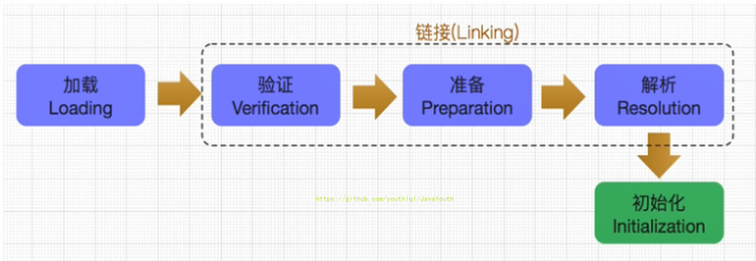

### 加载阶段

#### 加载

1. 通过一个类的全限定名获取定义此类的二进制字节流
2. 将这个字节流所代表的静态存储结构转化为方法区的运行时数据结构
3. **在内存中生成一个代表这个类的java.lang.Class对象**，作为方法区这个类的各种数据的访问入口

#### 加载class文件的方式

1. 从本地系统中直接加载
2. 通过网络获取，典型场景：Web Applet
3. 从zip压缩包中读取，成为日后jar、war格式的基础
4. 运行时计算生成，使用最多的是：动态代理技术
5. 由其他文件生成，典型场景：JSP应用从专有数据库中提取.class文件，比较少见
6. 从加密文件中获取，典型的防Class文件被反编译的保护措施

### 链接阶段

链接分为三个子阶段：验证 -> 准备 -> 解析

#### 验证(Verify)

1. 目的在于确保Class文件的字节流中包含信息符合当前虚拟机要求，保证被加载类的正确性，不会危害虚拟机自身安全
2. 主要包括四种验证，文件格式验证，元数据验证，字节码验证，符号引用验证。

**举例：**使用 BinaryViewer软件查看字节码文件，其开头均为 CAFE BABE ，如果出现不合法的字节码文件，那么将会验证不通过。


#### 准备(Prepare)

1. 为类变量（static变量）分配内存并且设置该类变量的**默认初始值**，即零值
2. 这里不包含用final修饰的static，因为final**在编译的时候就会分配好了默认值**，准备阶段会显式初始化
3. 注意：这里**不会为实例变量分配初始化**，类变量会分配在方法区中，而实例变量是会随着对象一起分配到Java堆中

**举例**

代码：变量a在准备阶段会赋初始值，但不是1，而是0，在初始化阶段会被赋值为 1

```java
public class HelloApp {
    private static int a = 1;//prepare：a = 0 ---> initial : a = 1


    public static void main(String[] args) {
        System.out.println(a);
    }
}
```

#### 解析(Resolve)

1. **将常量池内的符号引用转换为直接引用的过程**
2. 事实上，解析操作往往会伴随着JVM在执行完初始化之后再执行
3. 符号引用就是一组符号来描述所引用的目标。符号引用的字面量形式明确定义在《java虚拟机规范》的class文件格式中。直接引用就是直接指向目标的指针、相对偏移量或一个间接定位到目标的句柄
4. 解析动作主要针对类或接口、字段、类方法、接口方法、方法类型等。对应常量池中的CONSTANT Class info、CONSTANT Fieldref info、CONSTANT Methodref info等

**符号引用**

- 反编译 class 文件后可以查看符号引用，下面带# 的就是符号引用


### 初始化阶段

#### 类初始化时机

1. 创建类的实例
2. 访问某个类或接口的静态变量，或者对该静态变量赋值
3. 调用类的静态方法
4. 反射（比如：Class.forName(“com.atguigu.Test”)）
5. 初始化一个类的子类
6. Java虚拟机启动时被标明为启动类的类
7. JDK7开始提供的动态语言支持：java.lang.invoke.MethodHandle实例的解析结果REF_getStatic、REF putStatic、REF_invokeStatic句柄对应的类没有初始化，则初始化

除了以上七种情况，其他使用Java类的方式都被看作是对类的被动使用，都不会导致类的初始化，即不会执行初始化阶段（不会调用 clinit() 方法和 init() 方法）

#### clinit()

1. **初始化阶段就是执行类构造器方法`<clinit>()`的过程**
2. 此方法不需定义，是javac编译器自动收集类中的所有**类变量**的赋值动作和静态代码块中的语句合并而来。也就是说，当我们代码中包含static变量的时候，就会有clinit方法
3. `<clinit>()`方法中的指令按语句在源文件中出现的顺序执行
4. `<clinit>()`不同于类的构造器。（关联：构造器是虚拟机视角下的`<init>()`）
5. 若该类具有父类，JVM会保证子类的`<clinit>()`执行前，父类的`<clinit>()`已经执行完毕
6. 虚拟机必须保证一个类的`<clinit>()`方法在多线程下被同步加锁

#### 1，2，3说明

**举例1：有static变量**

查看下面这个代码的字节码，可以发现有一个`<clinit>()`方法。当我们代码中包含static变量的时候，就会有clinit方法


```java
public class ClassInitTest {
   private static int num = 1;

   static{
       num = 2;
       number = 20;
       System.out.println(num);
       //System.out.println(number);//报错：非法的前向引用。
   }

   /**
    * 1、linking之prepare: number = 0 --> initial: 20 --> 10
    * 2、这里因为静态代码块出现在声明变量语句前面，所以之前被准备阶段为0的number变量会
    * 首先被初始化为20，再接着被初始化成10（这也是面试时常考的问题哦）
    *
    */
   private static int number = 10;

    public static void main(String[] args) {
        System.out.println(ClassInitTest.num);//2
        System.out.println(ClassInitTest.number);//10
    }
}

```

<clint字节码>:

```
 0 iconst_1
 1 putstatic #3 <com/atguigu/java/ClassInitTest.num>
 4 iconst_2
 5 putstatic #3 <com/atguigu/java/ClassInitTest.num>
 8 bipush 20	 //先赋20
10 putstatic #5 <com/atguigu/java/ClassInitTest.number>
13 getstatic #2 <java/lang/System.out>
16 getstatic #3 <com/atguigu/java/ClassInitTest.num>
19 invokevirtual #4 <java/io/PrintStream.println>
22 bipush 10	//再赋10
24 putstatic #5 <com/atguigu/java/ClassInitTest.number>
27 return
```

**举例2：无 static 变量**


加上之后就有了


#### 4说明


在构造器中：

- 先将类变量 a 赋值为 10
- 再将局部变量赋值为 20

#### 5说明

若该类具有父类，JVM会保证子类的`<clinit>()`执行前，父类的`<clinit>()`已经执行完毕


如上代码，加载流程如下：

- 首先，执行 main() 方法需要加载 ClinitTest1 类
- 获取 Son.B 静态变量，需要加载 Son 类
- Son 类的父类是 Father 类，所以需要先执行 Father 类的加载，再执行 Son 类的加载

#### 6说明

虚拟机必须保证一个类的`<clinit>()`方法在多线程下被同步加锁

```java
public class DeadThreadTest {
    public static void main(String[] args) {
        Runnable r = () -> {
            System.out.println(Thread.currentThread().getName() + "开始");
            DeadThread dead = new DeadThread();
            System.out.println(Thread.currentThread().getName() + "结束");
        };

        Thread t1 = new Thread(r,"线程1");
        Thread t2 = new Thread(r,"线程2");

        t1.start();
        t2.start();
    }
}

class DeadThread{
    static{
        if(true){
            System.out.println(Thread.currentThread().getName() + "初始化当前类");
            while(true){

            }
        }
    }
}
```

输出结果：

```
线程2开始
线程1开始
线程2初始化当前类

/然后程序卡死了
```

程序卡死，分析原因：

- 两个线程同时去加载 DeadThread 类，而 DeadThread 类中静态代码块中有一处死循环
- 先加载 DeadThread 类的线程抢到了同步锁，然后在类的静态代码块中执行死循环，而另一个线程在等待同步锁的释放
- 所以无论哪个线程先执行 DeadThread 类的加载，另外一个类也不会继续执行。（一个类只会被加载一次）

## 类加载器的分类

### 概述

1. JVM严格来说支持两种类型的类加载器。分别为引导类加载器（Bootstrap ClassLoader)和自定义加载器（User-Defined ClassLoader）
2. 从概念上来讲，自定义类加载器一般指的是程序中有开发人员自定义的一类类加载器，但是Java虚拟机规范中却没有这么定义，而是将所有派生于抽象类ClassLoader的类加载器都划分为自定义类加载器
3. 无论类加载器的类型如何区分，在程序中我们最常见的累加器只有三个，如下所示


ExtClassLoader


AppClassLoader


```java
public class ClassLoaderTest {
    public static void main(String[] args) {

        //获取系统类加载器
        ClassLoader systemClassLoader = ClassLoader.getSystemClassLoader();
        System.out.println(systemClassLoader);//sun.misc.Launcher$AppClassLoader@18b4aac2

        //获取其上层：扩展类加载器
        ClassLoader extClassLoader = systemClassLoader.getParent();
        System.out.println(extClassLoader);//sun.misc.Launcher$ExtClassLoader@1540e19d

        //获取其上层：获取不到引导类加载器
        ClassLoader bootstrapClassLoader = extClassLoader.getParent();
        System.out.println(bootstrapClassLoader);//null

        //对于用户自定义类来说：默认使用系统类加载器进行加载
        ClassLoader classLoader = ClassLoaderTest.class.getClassLoader();
        System.out.println(classLoader);//sun.misc.Launcher$AppClassLoader@18b4aac2

        //String类使用引导类加载器进行加载的。---> Java的核心类库都是使用引导类加载器进行加载的。
        ClassLoader classLoader1 = String.class.getClassLoader();
        System.out.println(classLoader1);//null


    }
}
```

- 我们尝试获取引导类加载器，获取到的值为 null ，这并不代表引导类加载器不存在，**因为引导类加载器右 C/C++ 语言，我们获取不到**
- 两次获取系统类加载器的值都相同：sun.misc.Launcher$AppClassLoader@18b4aac2 ，这说明**系统类加载器是全局唯一的**

### 虚拟机自带的加载器

#### 启动类加载器

1. 这个类加载使用C/C++语言实现的，嵌套在JVM内部
2. 它用来加载Java的核心库（JAVA_HOME/jre/lib/rt.jar、resources.jar或sun.boot.class.path路径下的内容），用于提供JVM自身需要的类
3. 并不继承自java.lang.ClassLoader，没有父加载器
4. 加载扩展类和应用程序类加载器，并作为他们的父类加载器
5. 出于安全考虑，Bootstrap启动类加载器**只加载包名为java、javax、sun等开头的类**

#### 扩展类加载器

1. Java语言编写，由sun.misc.Launcher$ExtClassLoader实现
2. 派生于ClassLoader类
3. 父类加载器为启动类加载器
4. 从java.ext.dirs系统属性所指定的目录中加载类库，或从JDK的安装目录的jre/lib/ext子目录（扩展目录）下加载类库。如果用户创建的JAR放在此目录下，也会自动由扩展类加载器加载

#### 系统类加载器

1. Java语言编写，由sun.misc.LaunchersAppClassLoader实现
2. 派生于ClassLoader类
3. 父类加载器为扩展类加载器
4. 它负责加载环境变量classpath或系统属性java.class.path指定路径下的类库
5. 该类加载是程序中默认的类加载器，一般来说，Java应用的类都是由它来完成加载
6. 通过classLoader.getSystemclassLoader()方法可以获取到该类加载器

```java
public class ClassLoaderTest1 {
    public static void main(String[] args) {
        System.out.println("**********启动类加载器**************");
        //获取BootstrapClassLoader能够加载的api的路径
        URL[] urLs = sun.misc.Launcher.getBootstrapClassPath().getURLs();
        for (URL element : urLs) {
            System.out.println(element.toExternalForm());
        }
        //从上面的路径中随意选择一个类,来看看他的类加载器是什么:引导类加载器
        ClassLoader classLoader = Provider.class.getClassLoader();
        System.out.println(classLoader);

        System.out.println("***********扩展类加载器*************");
        String extDirs = System.getProperty("java.ext.dirs");
        for (String path : extDirs.split(";")) {
            System.out.println(path);
        }

        //从上面的路径中随意选择一个类,来看看他的类加载器是什么:扩展类加载器
        ClassLoader classLoader1 = CurveDB.class.getClassLoader();
        System.out.println(classLoader1);//sun.misc.Launcher$ExtClassLoader@1540e19d

    }
}
```

输出结果

```
**********启动类加载器**************
file:/C:/Program%20Files/Java/jdk1.8.0_131/jre/lib/resources.jar
file:/C:/Program%20Files/Java/jdk1.8.0_131/jre/lib/rt.jar
file:/C:/Program%20Files/Java/jdk1.8.0_131/jre/lib/sunrsasign.jar
file:/C:/Program%20Files/Java/jdk1.8.0_131/jre/lib/jsse.jar
file:/C:/Program%20Files/Java/jdk1.8.0_131/jre/lib/jce.jar
file:/C:/Program%20Files/Java/jdk1.8.0_131/jre/lib/charsets.jar
file:/C:/Program%20Files/Java/jdk1.8.0_131/jre/lib/jfr.jar
file:/C:/Program%20Files/Java/jdk1.8.0_131/jre/classes
null
***********扩展类加载器*************
C:\Program Files\Java\jdk1.8.0_131\jre\lib\ext
C:\Windows\Sun\Java\lib\ext
sun.misc.Launcher$ExtClassLoader@29453f44
```

#### 用户自定义类加载器

**什么时候需要自定义加载器？**

在Java的日常应用程序开发中，类的加载几乎是由上述3种类加载器相互配合执行的，在必要时，我们还可以自定义类加载器，来定制类的加载方式。那为什么还需要自定义类加载器？

1. 隔离加载类（比如说我假设现在Spring框架，和RocketMQ有包名路径完全一样的类，类名也一样，这个时候类就冲突了。不过一般的主流框架和中间件都会自定义类加载器，实现不同的框架，中间价之间是隔离的）
2. 修改类加载的方式
3. 扩展加载源（还可以考虑从数据库中加载类，路由器等等不同的地方）
4. 防止源码泄漏（对字节码文件进行解密，自己用的时候通过自定义类加载器来对其进行解密）

**如何自定义类加载器？**

1. 开发人员可以通过继承抽象类java.lang.ClassLoader类的方式，实现自己的类加载器，以满足一些特殊的需求
2. 在JDK1.2之前，在自定义类加载器时，总会去继承ClassLoader类并重写loadClass()方法，从而实现自定义的类加载类，但是在JDK1.2之后已不再建议用户去覆盖loadClass()方法，而是建议把自定义的类加载逻辑写在**findclass**()方法中
3. 在编写自定义类加载器时，如果没有太过于复杂的需求，可以直接继承URIClassLoader类，这样就可以避免自己去编写findclass()方法及其获取字节码流的方式，使自定义类加载器编写更加简洁。

代码示例

```java
public class CustomClassLoader extends ClassLoader {
    @Override
    protected Class<?> findClass(String name) throws ClassNotFoundException {

        try {
            byte[] result = getClassFromCustomPath(name);
            if (result == null) {
                throw new FileNotFoundException();
            } else {
                //defineClass和findClass搭配使用
                return defineClass(name, result, 0, result.length);
            }
        } catch (FileNotFoundException e) {
            e.printStackTrace();
        }

        throw new ClassNotFoundException(name);
    }
	//自定义流的获取方式
    private byte[] getClassFromCustomPath(String name) {
        //从自定义路径中加载指定类:细节略
        //如果指定路径的字节码文件进行了加密，则需要在此方法中进行解密操作。
        return null;
    }

    public static void main(String[] args) {
        CustomClassLoader customClassLoader = new CustomClassLoader();
        try {
            Class<?> clazz = Class.forName("One", true, customClassLoader);
            Object obj = clazz.newInstance();
            System.out.println(obj.getClass().getClassLoader());
        } catch (Exception e) {
            e.printStackTrace();
        }
    }
}
```

### 关于ClassLoader

ClassLoader类，它是一个抽象类，其后所有的类加载器都继承自ClassLoader（不包括启动类加载器）


获取ClassLoader的途径


```java
public class ClassLoaderTest2 {
    public static void main(String[] args) {
        try {
            //1.
            ClassLoader classLoader = Class.forName("java.lang.String").getClassLoader();
            System.out.println(classLoader);
            //2.
            ClassLoader classLoader1 = Thread.currentThread().getContextClassLoader();
            System.out.println(classLoader1);

            //3.
            ClassLoader classLoader2 = ClassLoader.getSystemClassLoader().getParent();
            System.out.println(classLoader2);

        } catch (ClassNotFoundException e) {
            e.printStackTrace();
        }
    }
}
```

输出结果

```
null
sun.misc.Launcher$AppClassLoader@18b4aac2
sun.misc.Launcher$ExtClassLoader@1540e19d

Process finished with exit code 0
```

sun.misc.Launcher 它是一个java虚拟机的入口应用

## 双亲委派机制

### 双亲委派机制原理

Java虚拟机对class文件采用的是**按需加载**的方式，也就是说当需要使用该类时才会将它的class文件加载到内存生成class对象。而且加载某个类的class文件时，Java虚拟机采用的是双亲委派模式，即把请求交由父类处理，它是一种任务委派模式

1. 如果一个类加载器收到了类加载请求，它并不会自己先去加载，而是把这个请求委托给父类的加载器去执行；
2. 如果父类加载器还存在其父类加载器，则进一步向上委托，依次递归，请求最终将到达顶层的启动类加载器；
3. 如果父类加载器可以完成类加载任务，就成功返回，倘若父类加载器无法完成此加载任务，子加载器才会尝试自己去加载，这就是双亲委派模式。
4. 父类加载器一层一层往下分配任务，如果子类加载器能加载，则加载此类，如果将加载任务分配至系统类加载器也无法加载此类，则抛出异常


### 双亲委派机制代码演示

#### 举例1

1、我们自己建立一个 java.lang.String 类，写上 static 代码块

```java
public class String {
    //
    static{
        System.out.println("我是自定义的String类的静态代码块");
    }
}
```

2、在另外的程序中加载 String 类，看看加载的 String 类是 JDK 自带的 String 类，还是我们自己编写的 String 类

```java
public class StringTest {

    public static void main(String[] args) {
        java.lang.String str = new java.lang.String();
        System.out.println("hello,atguigu.com");

        StringTest test = new StringTest();
        System.out.println(test.getClass().getClassLoader());
    }
}
```

输出结果：

```
hello,atguigu.com
sun.misc.Launcher$AppClassLoader@18b4aac2
```

程序并没有输出我们静态代码块中的内容，可见仍然加载的是 JDK 自带的 String 类。

把刚刚的类改一下

```java
package java.lang;
public class String {
    //
    static{
        System.out.println("我是自定义的String类的静态代码块");
    }
    //错误: 在类 java.lang.String 中找不到 main 方法
    public static void main(String[] args) {
        System.out.println("hello,String");
    }
}
```


由于双亲委派机制一直找父类，所以最后找到了Bootstrap ClassLoader，Bootstrap ClassLoader找到的是 JDK 自带的 String 类，在那个String类中并没有 main() 方法，所以就报了上面的错误。

#### 举例2

```java
package java.lang;


public class ShkStart {

    public static void main(String[] args) {
        System.out.println("hello!");
    }
}
```

输出结果：

```java
java.lang.SecurityException: Prohibited package name: java.lang
	at java.lang.ClassLoader.preDefineClass(ClassLoader.java:662)
	at java.lang.ClassLoader.defineClass(ClassLoader.java:761)
	at java.security.SecureClassLoader.defineClass(SecureClassLoader.java:142)
	at java.net.URLClassLoader.defineClass(URLClassLoader.java:467)
	at java.net.URLClassLoader.access$100(URLClassLoader.java:73)
	at java.net.URLClassLoader$1.run(URLClassLoader.java:368)
	at java.net.URLClassLoader$1.run(URLClassLoader.java:362)
	at java.security.AccessController.doPrivileged(Native Method)
	at java.net.URLClassLoader.findClass(URLClassLoader.java:361)
	at java.lang.ClassLoader.loadClass(ClassLoader.java:424)
	at sun.misc.Launcher$AppClassLoader.loadClass(Launcher.java:335)
	at java.lang.ClassLoader.loadClass(ClassLoader.java:357)
	at sun.launcher.LauncherHelper.checkAndLoadMain(LauncherHelper.java:495)
Error: A JNI error has occurred, please check your installation and try again
Exception in thread "main" 
Process finished with exit code 1
```

即使类名没有重复，也禁止使用java.lang这种包名。这是一种保护机制

#### 举例3

线程上下文类加载器破坏了“双亲委派模型”，可以在执行线程中抛弃双亲委派加载链模式，使程序可以逆向使用类加载器。http://t.csdn.cn/oQGPi

当我们加载jdbc.jar 用于实现数据库连接的时候

1. 我们现在程序中需要用到SPI接口，而SPI接口属于rt.jar包中Java核心api
2. 然后使用双清委派机制，引导类加载器把rt.jar包加载进来，而rt.jar包中的SPI存在一些接口，接口我们就需要具体的实现类了
3. 具体的实现类就涉及到了某些第三方的jar包了，比如我们加载SPI的实现类jdbc.jar包【首先我们需要知道的是 jdbc.jar是基于SPI接口进行实现的】
4. 第三方的jar包中的类属于系统类加载器来加载
5. 从这里面就可以看到SPI核心接口由引导类加载器来加载，SPI具体实现类由系统类加载器来加载


### 双亲委派机制优势

通过上面的例子，我们可以知道，双亲机制可以

1. 避免类的重复加载
2. 保护程序安全，防止核心API被随意篡改
   - 自定义类：自定义java.lang.String 没有被加载。
   - 自定义类：java.lang.ShkStart（报错：阻止创建 java.lang开头的类）

## 沙箱安全机制

1. 自定义String类时：在加载自定义String类的时候会率先使用引导类加载器加载，而引导类加载器在加载的过程中会先加载jdk自带的文件（rt.jar包中java.lang.String.class），报错信息说没有main方法，就是因为加载的是rt.jar包中的String类。
2. 这样可以保证对java核心源代码的保护，这就是沙箱安全机制。

## 其他

### 如何判断两个Class对象是否相同

在JVM中表示两个class对象是否为同一个类存在两个必要条件：

1. 类的完整类名必须一致，包括包名
2. **加载这个类的ClassLoader（指ClassLoader实例对象）必须相同**
3. 换句话说，在JVM中，即使这两个类对象（class对象）来源同一个Class文件，被同一个虚拟机所加载，但只要加载它们的ClassLoader实例对象不同，那么这两个类对象也是不相等的

### 对类加载器的引用

1. JVM必须知道一个类型是由启动加载器加载的还是由用户类加载器加载的
2. **如果一个类型是由用户类加载器加载的，那么JVM会将这个类加载器的一个引用作为类型信息的一部分保存在方法区中**
3. 当解析一个类型到另一个类型的引用的时候，JVM需要保证这两个类型的类加载器是相同的（后面讲动态链接的时候提到）

### 类的主动使用和被动使用

区别在于被动使用不会导致类的初始化（类加载的最后一个阶段），后面字节码和类加载的时候会详细说。


# 第三章 运行时数据区概述及线程

## 前言

本节主要讲的是运行时数据区，也就是下图这部分，它是在类加载完成后的阶段


当我们通过前面的：类的加载 --> 验证 --> 准备 --> 解析 --> 初始化，这几个阶段完成后，就会用到执行引擎对我们的类进行使用，同时执行引擎将会使用到我们运行时数据区


类比一下也就是大厨做饭，我们把大厨后面的东西（切好的菜，刀，调料），比作是运行时数据区。而厨师可以类比于执行引擎，将通过准备的东西进行制作成精美的菜品。


## 运行时数据区结构

### 运行时数据区与内存

1. 内存是非常重要的系统资源，是硬盘和CPU的中间仓库及桥梁，承载着操作系统和应用程序的实时运行。JVM内存布局规定了Java在运行过程中内存申请、分配、管理的策略，保证了JVM的高效稳定运行。**不同的JVM对于内存的划分方式和管理机制存在着部分差异**。结合JVM虚拟机规范，来探讨一下经典的JVM内存布局。
2. 我们通过磁盘或者网络IO得到的数据，都需要先加载到内存中，然后CPU从内存中获取数据进行读取，也就是说内存充当了CPU和磁盘之间的桥梁

下图来自阿里巴巴手册JDK8


### 线程的内存空间

1. Java虚拟机定义了若干种程序运行期间会使用到的运行时数据区：其中有一些会随着虚拟机启动而创建，随着虚拟机退出而销毁。另外一些则是与线程一一对应的，这些与线程对应的数据区域会随着线程开始和结束而创建和销毁。
2. 灰色的为单独线程私有的，红色的为多个线程共享的。即：
   - 线程独有：程序计数器、栈、本地方法栈
   - 线程间共享：堆、堆外内存（永久代或元空间、代码缓存）

### Runtime类

每个JVM只有一个Runtime实例，即运行时环境，相当于内存结构中间的那一部分：运行时数据区


## 线程

### JVM线程

1. 线程是一个程序里的运行单元。JVM允许一个应用有多个线程并行执行
2. **在HotSpot JVm里，每个线程都与操作系统的本地线程直接映射**
   - 当一个Java线程准备好执行以后，此时一个操作系统的本地线程也同时创建。Java线程执行终止后，本地线程也会回收
3. 操作系统负责将线程安排调度到任何一个可用的CPU上。**一旦本地线程初始化成功，它就会调用Java线程中的run()方法**

### JVM系统线程

- 如果你使用jconsole或者是任何一个调试工具，都能看到在后台有许多线程在运行。这些后台线程不包括调用`public static void main(String[])`的main线程以及所有这个main线程自己创建的线程。
- 这些主要的后台系统线程在Hotspot JVM里主要是以下几个：虚拟机线程、周期任务线程、GC线程、编译线程、信号调度线程

1. **虚拟机线程**：这种线程的操作是需要JVM达到**安全点（后面会讲）**才会出现。这些操作必须在不同的线程中发生的原因是他们都需要JVM达到安全点，这样堆才不会变化。这种线程的执行类型括"stop-the-world"的垃圾收集，线程栈收集，线程挂起以及偏向锁撤销
2. **周期任务线程**：这种线程是时间周期事件的体现（比如中断），他们一般用于周期性操作的调度执行
3. **GC线程**：这种线程对在JVM里不同种类的垃圾收集行为提供了支持
4. **编译线程**：这种线程在运行时会将字节码编译成到本地代码
5. **信号调度线程**：这种线程接收信号并发送给JVM，在它内部通过调用适当的方法进行处理

## 程序计数器(PC寄存器)

### PC寄存器介绍

> 官方文档网址：https://docs.oracle.com/javase/specs/jvms/se8/html/index.html


1. JVM中的程序计数寄存器（Program Counter Register）中，Register的命名源于CPU的寄存器，**寄存器存储指令相关的现场信息**。CPU只有把数据装载到寄存器才能够运行。
2. 这里，**并非是广义上所指的物理寄存器**，或许将其翻译为PC计数器（或指令计数器）会更加贴切（也称为程序钩子），并且也不容易引起一些不必要的误会。**JVM中的PC寄存器是对物理PC寄存器的一种抽象模拟**。
3. 它是一块很小的内存空间，**几乎可以忽略不记（因为记录着下一条指令的地址）**。也是运行速度最快的存储区域。
4. 在JVM规范中，每个线程都有它自己的程序计数器，是线程私有的，生命周期与线程的生命周期保持一致。
5. **任何时间一个线程都只有一个方法在执行**，也就是所谓的**当前方法**。程序计数器会存储当前线程正在执行的Java方法的JVM指令地址；或者，如果是在执行native方法，则是未指定值（undefned）。
6. 它是**程序控制流**的指示器，分支、循环、跳转、异常处理、线程恢复等基础功能都需要依赖这个计数器来完成。
7. 字节码解释器工作时就是通过改变这个计数器的值来选取下一条需要执行的字节码指令。
8. 它是**唯一一个**在Java虚拟机规范中**没有规定任何OutofMemoryError情况的区域。**

### PC寄存器的作用

用来存储指向下一条指令的地址。由执行引擎读取下一条指令，并执行。


### 举例

```java
public class PCRegisterTest {

    public static void main(String[] args) {
        int i = 10;
        int j = 20;
        int k = i + j;

        String s = "abc";
        System.out.println(i);
        System.out.println(k);

    }
}
```

**查看字节码**

> 看字节码的方法：https://blog.csdn.net/21aspnet/article/details/88351875

```java
Classfile /F:/IDEAWorkSpaceSourceCode/JVMDemo/out/production/chapter04/com/atguigu/java/PCRegisterTest.class
  Last modified 2020-11-2; size 675 bytes
  MD5 checksum 53b3ef104479ec9e9b7ce5319e5881d3
  Compiled from "PCRegisterTest.java"
public class com.atguigu.java.PCRegisterTest
  minor version: 0
  major version: 52
  flags: ACC_PUBLIC, ACC_SUPER
Constant pool:
   #1 = Methodref          #6.#26         // java/lang/Object."<init>":()V
   #2 = String             #27            // abc
   #3 = Fieldref           #28.#29        // java/lang/System.out:Ljava/io/PrintStream;
   #4 = Methodref          #30.#31        // java/io/PrintStream.println:(I)V
   #5 = Class              #32            // com/atguigu/java/PCRegisterTest
   #6 = Class              #33            // java/lang/Object
   #7 = Utf8               <init>
   #8 = Utf8               ()V
   #9 = Utf8               Code
  #10 = Utf8               LineNumberTable
  #11 = Utf8               LocalVariableTable
  #12 = Utf8               this
  #13 = Utf8               Lcom/atguigu/java/PCRegisterTest;
  #14 = Utf8               main
  #15 = Utf8               ([Ljava/lang/String;)V
  #16 = Utf8               args
  #17 = Utf8               [Ljava/lang/String;
  #18 = Utf8               i
  #19 = Utf8               I
  #20 = Utf8               j
  #21 = Utf8               k
  #22 = Utf8               s
  #23 = Utf8               Ljava/lang/String;
  #24 = Utf8               SourceFile
  #25 = Utf8               PCRegisterTest.java
  #26 = NameAndType        #7:#8          // "<init>":()V
  #27 = Utf8               abc
  #28 = Class              #34            // java/lang/System
  #29 = NameAndType        #35:#36        // out:Ljava/io/PrintStream;
  #30 = Class              #37            // java/io/PrintStream
  #31 = NameAndType        #38:#39        // println:(I)V
  #32 = Utf8               com/atguigu/java/PCRegisterTest
  #33 = Utf8               java/lang/Object
  #34 = Utf8               java/lang/System
  #35 = Utf8               out
  #36 = Utf8               Ljava/io/PrintStream;
  #37 = Utf8               java/io/PrintStream
  #38 = Utf8               println
  #39 = Utf8               (I)V
{
  public com.atguigu.java.PCRegisterTest();
    descriptor: ()V
    flags: ACC_PUBLIC
    Code:
      stack=1, locals=1, args_size=1
         0: aload_0
         1: invokespecial #1                  // Method java/lang/Object."<init>":()V
         4: return
      LineNumberTable:
        line 7: 0
      LocalVariableTable:
        Start  Length  Slot  Name   Signature
            0       5     0  this   Lcom/atguigu/java/PCRegisterTest;

  public static void main(java.lang.String[]);
    descriptor: ([Ljava/lang/String;)V
    flags: ACC_PUBLIC, ACC_STATIC
    Code:
      stack=2, locals=5, args_size=1
         0: bipush        10
         2: istore_1
         3: bipush        20
         5: istore_2
         6: iload_1
         7: iload_2
         8: iadd
         9: istore_3
        10: ldc           #2                  // String abc
        12: astore        4
        14: getstatic     #3                  // Field java/lang/System.out:Ljava/io/PrintStream;
        17: iload_1
        18: invokevirtual #4                  // Method java/io/PrintStream.println:(I)V
        21: getstatic     #3                  // Field java/lang/System.out:Ljava/io/PrintStream;
        24: iload_3
        25: invokevirtual #4                  // Method java/io/PrintStream.println:(I)V
        28: return
      LineNumberTable:
        line 10: 0
        line 11: 3
        line 12: 6
        line 14: 10
        line 15: 14
        line 16: 21
        line 18: 28
      LocalVariableTable:
        Start  Length  Slot  Name   Signature
            0      29     0  args   [Ljava/lang/String;
            3      26     1     i   I
            6      23     2     j   I
           10      19     3     k   I
           14      15     4     s   Ljava/lang/String;
}
SourceFile: "PCRegisterTest.java"
```

左边的数字代表**指令地址（指令偏移）**，即 PC 寄存器中可能存储的值，然后执行引擎读取 PC 寄存器中的值，并执行该指令。

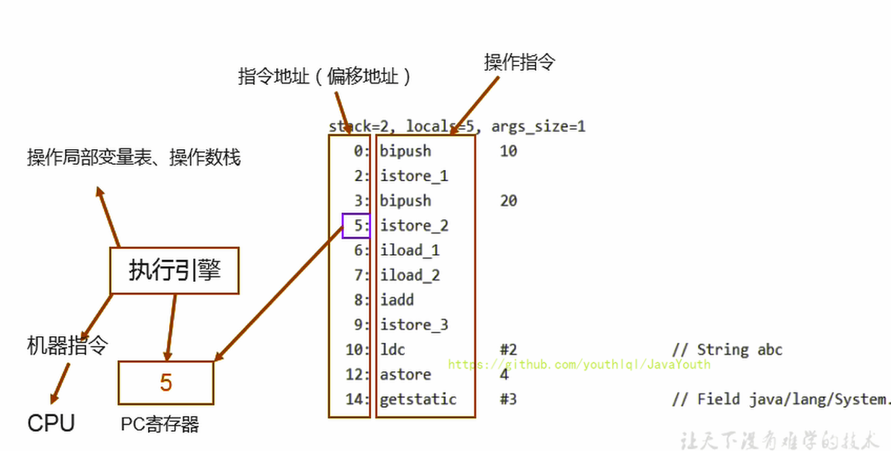

### 常见的面试问题

**使用PC寄存器存储字节码指令地址有什么用呢？或者问为什么使用 PC 寄存器来记录当前线程的执行地址呢？**

1. 因为CPU需要不停的切换各个线程，这时候切换回来以后，就得知道接着从哪开始继续执行
2. JVM的字节码解释器就需要通过改变PC寄存器的值来明确下一条应该执行什么样的字节码指令


**PC寄存器为什么被设定为私有的？**

1. 我们都知道所谓的多线程在一个特定的时间段内只会执行其中某一个线程的方法，CPU会不停地做任务切换，这样必然导致经常中断或恢复，如何保证分毫无差呢？**为了能够准确地记录各个线程正在执行的当前字节码指令地址，最好的办法自然是为每一个线程都分配一个PC寄存器**，这样一来各个线程之间便可以进行独立计算，从而不会出现相互干扰的情况。
2. 由于CPU时间片轮限制，众多线程在并发执行过程中，任何一个确定的时刻，一个处理器或者多核处理器中的一个内核，只会执行某个线程中的一条指令。
3. 这样必然导致经常中断或恢复，如何保证分毫无差呢？每个线程在创建后，都会产生自己的程序计数器和栈帧，程序计数器在各个线程之间互不影响。

> 注意并行和并发的区别，笔者的并发系列有讲

### CPU时间片

1. CPU时间片即CPU分配给各个程序的时间，每个线程被分配一个时间段，称作它的时间片。

2. 在宏观上：我们可以同时打开多个应用程序，每个程序并行不悖，同时运行。

3. 但在微观上：由于只有一个CPU，一次只能处理程序要求的一部分，如何处理公平，一种方法就是引入时间片，**每个程序轮流执行**。


# 本地方法接口

调用非java代码的接口。

## 本地方法

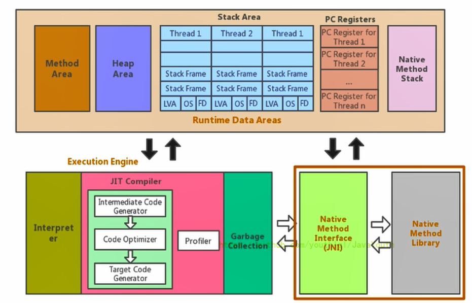

1. 简单地讲，**一个Native Method是一个Java调用非Java代码的接囗**一个Native Method是这样一个Java方法：该方法的实现由非Java语言实现，比如C。这个特征并非Java所特有，很多其它的编程语言都有这一机制，比如在C++中，你可以用extern 告知C++编译器去调用一个C的函数。
2. “A native method is a Java method whose implementation is provided by non-java code.”（本地方法是一个非Java的方法，它的具体实现是非Java代码的实现）
3. 在定义一个native method时，并不提供实现体（有些像定义一个Java interface），因为其实现体是由非java语言在外面实现的。
4. 本地接口的作用是融合不同的编程语言为Java所用，它的初衷是融合C/C++程序。

## 举例

需要注意的是：标识符native可以与其它java标识符连用，但是abstract除外

```java
public class IHaveNatives {
    public native void Native1(int x);

    public native static long Native2();

    private native synchronized float Native3(Object o);

    native void Native4(int[] ary) throws Exception;
    
}
```


## 为什么要使用 Native Method？

Java使用起来非常方便，然而有些层次的任务用Java实现起来不容易，或者我们对程序的效率很在意时，问题就来了。

### 与Java环境外交互

**有时Java应用需要与Java外面的硬件环境交互，这是本地方法存在的主要原因**。你可以想想Java需要与一些**底层系统**，如操作系统或某些硬件交换信息时的情况。本地方法正是这样一种交流机制：它为我们提供了一个非常简洁的接口，而且我们无需去了解Java应用之外的繁琐的细节。

### 与操作系统的交互

1. JVM支持着Java语言本身和运行时库，它是Java程序赖以生存的平台，它由一个解释器（解释字节码）和一些连接到本地代码的库组成。
2. 然而不管怎样，它毕竟不是一个完整的系统，它经常依赖于一底层系统的支持。这些底层系统常常是强大的操作系统。
3. **通过使用本地方法，我们得以用Java实现了jre的与底层系统的交互，甚至JVM的一些部分就是用C写的**。
4. 还有，如果我们要使用一些Java语言本身没有提供封装的操作系统的特性时，我们也需要使用本地方法。

### Sun’s Java

1. Sun的解释器是用C实现的，这使得它能像一些普通的C一样与外部交互。jre大部分是用Java实现的，它也通过一些本地方法与外界交互。
2. 例如：类java.lang.Thread的setPriority()方法是用Java实现的，但是它实现调用的是该类里的本地方法setPriority0()。这个本地方法是用C实现的，并被植入JVM内部在Windows 95的平台上，这个本地方法最终将调用Win32 setpriority() API。这是一个本地方法的具体实现由JVM直接提供，更多的情况是本地方法由外部的动态链接库（external dynamic link library）提供，然后被JVM调用。

### 本地方法的现状

目前该方法使用的越来越少了，除非是与硬件有关的应用，比如通过Java程序驱动打印机或者Java系统管理生产设备，在企业级应用中已经比较少见。因为现在的异构领域间的通信很发达，比如可以使用Socket通信，也可以使用Web Service等等，不多做介绍。

# 本地方法栈

存放本地方法的栈帧，HotSpot直接将本地方法栈和虚拟机栈合二为一了。

1. **Java虚拟机栈于管理Java方法的调用，而本地方法栈用于管理本地方法的调用**。
2. 本地方法栈，也是线程私有的。
3. 允许被实现成固定或者是可动态扩展的内存大小（在内存溢出方面和虚拟机栈相同）
   - 如果线程请求分配的栈容量超过本地方法栈允许的最大容量，Java虚拟机将会抛出一个stackoverflowError 异常。
   - 如果本地方法栈可以动态扩展，并且在尝试扩展的时候无法申请到足够的内存，或者在创建新的线程时没有足够的内存去创建对应的本地方法栈，那么Java虚拟机将会抛出一个outofMemoryError异常。
4. 本地方法一般是使用C语言或C++语言实现的。
5. 它的具体做法是Native Method Stack中登记native方法，在Execution Engine 执行时加载本地方法库。


**注意事项**

1. 当某个线程调用一个本地方法时，它就进入了一个全新的并且不再受虚拟机限制的世界。它和虚拟机拥有同样的权限。
   - 本地方法可以通过本地方法接口来访问虚拟机内部的运行时数据区
   - 它甚至可以直接使用本地处理器中的寄存器
   - 直接从本地内存的堆中分配任意数量的内存
2. 并不是所有的JVM都支持本地方法。因为Java虚拟机规范并没有明确要求本地方法栈的使用语言、具体实现方式、数据结构等。如果JVM产品不打算支持native方法，也可以无需实现本地方法栈。
3. 在Hotspot JVM中，直接将本地方法栈和虚拟机栈合二为一。

# 第四章 虚拟机栈

## 简介

### 虚拟机栈出现的背景

1. 由于跨平台性的设计，Java的指令都是根据栈来设计的。不同平台CPU架构不同，所以不能设计为基于寄存器的【如果设计成基于寄存器的，耦合度高，性能会有所提升，因为可以对具体的CPU架构进行优化，但是跨平台性大大降低】。
2. 优点是跨平台，指令集小，编译器容易实现，缺点是性能下降，实现同样的功能需要更多的指令。

### 内存中的栈

1. 首先栈是运行时的单位，而堆是存储的单位。
2. 即：栈解决程序的运行问题，即程序如何执行，或者说如何处理数据。堆解决的是数据存储的问题，即数据怎么放，放哪里


### 虚拟机栈的基本内容

- Java虚拟机栈是什么？

  - Java虚拟机栈（Java Virtual Machine Stack），早期也叫Java栈。每个线程在创建时都会创建一个虚拟机栈，其内部保存一个个的栈帧（Stack Frame），**对应着一次次的Java方法调用**，栈是**线程私有的**。

    ```java
    public class StackTest {
    
        public static void main(String[] args) {
            StackTest test = new StackTest();
            test.methodA();
        }
    
        public void methodA() {
            int i = 10;
            int j = 20;
    
            methodB();
        }
    
        public void methodB(){
            int k = 30;
            int m = 40;
        }
    }
    ```

    

- 虚拟机栈的声明周期

  - 生命周期和线程一致，也就是线程结束了，该虚拟机栈也销毁了

- 虚拟机栈的作用

  - 主管Java程序的运行，它保存方法的局部变量（8 种基本数据类型、对象的引用地址）、部分结果，并参与方法的调用和返回。
  - 局部变量，它是相比于成员变量来说的（或属性）
  - 基本数据类型变量 VS 引用类型变量（类、数组、接口）

### 虚拟机栈的特点

- 栈是一种快速有效的分配存储方式，访问速度仅次于程序计数器。
- JVM直接对Java栈的操作只有两个：
  - 每个方法执行，伴随着**进栈**（入栈、压栈）
  - 执行结束后的**出栈**工作
- 对于栈来说**不存在垃圾回收问题**
  - **栈不需要GC，但是可能存在OOM**

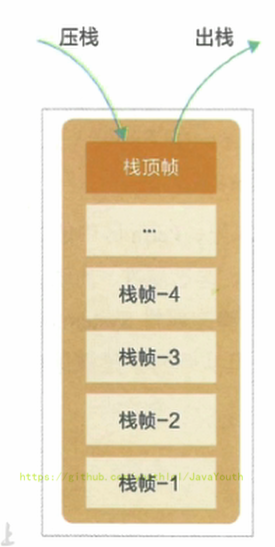

### 虚拟机栈的异常

面试题：栈中可能出现的异常？

- Java 虚拟机规范允许Java栈的大小是动态的或者是固定不变的。
  - 如果采用固定大小的Java虚拟机栈，那每一个线程的Java虚拟机栈容量可以在线程创建的时候独立选定。如果线程请求分配的栈容量超过Java虚拟机栈允许的最大容量，Java虚拟机将会抛出一个**StackoverflowError** 异常。
  - 如果Java虚拟机栈可以动态扩展，并且在尝试扩展的时候无法申请到足够的内存，或者在创建新的线程时没有足够的内存去创建对应的虚拟机栈，那Java虚拟机将会抛出一个 **OutofMemoryError** 异常。

### 设置栈内存的大小

#### 概念

> 多去官方文档看看：https://docs.oracle.com/en/java/javase/11/tools/java.html#GUID-3B1CE181-CD30-4178-9602-230B800D4FAE
>
> 地址经常变

我们可以使用参数 **-Xss** 选项来设置线程的最大栈空间，栈的大小直接决定了函数调用的最大可达深度。

> Sets the thread stack size (in bytes). Append the letter `k` or `K` to indicate KB, `m` or `M` to indicate MB, and `g` or `G` to indicate GB. The default value depends on the platform:
>
> - Linux/x64 (64-bit): 1024 KB
> - macOS (64-bit): 1024 KB
> - Oracle Solaris/x64 (64-bit): 1024 KB
> - Windows: The default value depends on virtual memory

The following examples set the thread stack size to 1024 KB in different units:

```java
-Xss1m
-Xss1024k
-Xss1048576
```

#### 举例

```java
public class StackErrorTest {
    private static int count = 1;
    public static void main(String[] args) {
        System.out.println(count);
        count++;
        main(args);
    }
}
```

**没设置参数前**

部分输出结果：

```java
11404
11405
11406
Exception in thread "main" java.lang.StackOverflowError
	at sun.nio.cs.UTF_8$Encoder.encodeLoop(UTF_8.java:691)
```

说明栈在11406这个深度溢出了

**设置栈参数之后**


部分输出结果

```java
2474
2475
2476
Exception in thread "main" java.lang.StackOverflowError
	at sun.nio.cs.UTF_8.updatePositions(UTF_8.java:77)
```

说明参数起作用了

## 栈的存储单位

### 栈中存储什么

1. **每个线程都有自己的栈**，栈中的数据都是以**栈帧**（Stack Frame）的格式存在
2. 在这个线程上正在执行的每个方法都各自对应一个栈帧（Stack Frame）。
3. 栈帧是一个内存区块，是一个数据集，维系着方法执行过程中的各种数据信息。

### 栈的运行原理

1. JVM直接对Java栈的操作只有两个，就是对栈帧的**压栈和出栈**，遵循先进后出（后进先出）原则
2. 在一条活动线程中，一个时间点上，只会有一个活动的栈帧。即只有当前正在执行的方法的栈帧（栈顶栈帧）是有效的。这个栈帧被称为**当前栈帧（Current Frame）**，与当前栈帧相对应的方法就是**当前方法（Current Method）**，定义这个方法的类就是**当前类（Current Class）**
3. 执行引擎运行的所有字节码指令**只针对当前栈帧进行操作**。
4. 如果在该方法中调用了其他方法，对应的新的栈帧会被创建出来，放在栈的顶端，成为新的当前帧。


- **不同线程中所包含的栈帧是不允许存在相互引用的**，即不可能在一个栈帧之中引用另外一个线程的栈帧。
- 如果当前方法调用了其他方法，方法返回之际，当前栈帧会传回此方法的执行结果给前一个栈帧，接着，虚拟机会丢弃当前栈帧，使得前一个栈帧重新成为当前栈帧。
- Java方法有**两种返回函数的方式**。
  - 一种是正常的函数返回，使用return指令。
  - 另一种是方法执行中出现未捕获处理的异常，以抛出异常的方式结束。
  - 但不管使用哪种方式，**都会导致栈帧被弹出**。

### 栈帧的内部结构

每个栈帧中存储着：

- 局部变量表（Local Variables）
- 操作数栈（Operand Stack）（或表达式栈）
- 动态链接（Dynamic Linking）（或指向运行时常量池的方法引用）
- 方法返回地址（Return Address）（或方法正常退出或者异常退出的定义）
- 一些附加信息


并行每个线程下的栈都是私有的，因此每个线程都有自己各自的栈，并且每个栈里面都有很多栈帧，栈帧的大小主要由局部变量表 和 操作数栈决定的。


## 局部变量表

### 认识局部变量表

#### 概念

1. 局部变量表也被称之为局部变量数组或本地变量表
2. **定义为一个数字数组，主要用于存储方法参数和定义在方法体内的局部变量**，这些数据类型包括各类基本数据类型、对象引用（reference），以及returnAddress返回值类型。
3. 由于局部变量表是建立在线程的栈上，是**线程的私有数据，因此不存在数据安全问题**
4. **局部变量表所需的容量大小是在编译期确定下来的**，并保存在方法的Code属性的**maximum local variables**数据项中。在方法运行期间是不会改变局部变量表的大小的。
5. 方法嵌套调用的次数由栈的大小决定。一般来说，栈越大，方法嵌套调用次数越多。
   - 对一个函数而言，它的参数和局部变量越多，使得局部变量表膨胀，它的栈帧就越大，以满足方法调用所需传递的信息增大的需求。
   - 进而函数调用就会占用更多的栈空间，导致其嵌套调用次数就会减少。
6. 局部变量表中的变量只在当前方法调用中有效。
   - 在方法执行时，虚拟机通过使用局部变量表完成参数值到参数变量列表的传递过程。
   - 当方法调用结束后，随着方法栈帧的销毁，局部变量表也会随之销毁。

#### 举例

```java
public class LocalVariablesTest {
    private int count = 0;

    public static void main(String[] args) {
        LocalVariablesTest test = new LocalVariablesTest();
        int num = 10;
        test.test1();
    }

    //练习：
    public static void testStatic(){
        LocalVariablesTest test = new LocalVariablesTest();
        Date date = new Date();
        int count = 10;
        System.out.println(count);
        //因为this变量不存在于当前方法的局部变量表中！！
//        System.out.println(this.count);
    }

    //关于Slot的使用的理解
    public LocalVariablesTest(){
        this.count = 1;
    }

    public void test1() {
        Date date = new Date();
        String name1 = "atguigu.com";
        test2(date, name1);
        System.out.println(date + name1);
    }

    public String test2(Date dateP, String name2) {
        dateP = null;
        name2 = "songhongkang";
        double weight = 130.5;//占据两个slot
        char gender = '男';
        return dateP + name2;
    }

    public void test3() {
        this.count++;
    }

    public void test4() {
        int a = 0;
        {
            int b = 0;
            b = a + 1;
        }
        //变量c使用之前已经销毁的变量b占据的slot的位置
        int c = a + 1;
    }
}
```


看完字节码后，可得结论：所以局部变量表所需的容量大小是在编译期确定下来的。

#### 部分详解

为了更好讲解，我们直接用jclasslib来看字节码，以main方法为例来讲解。一些一目了然的就不讲了

1、0-15 也就是有16行字节码


2、方法异常信息表


3、Misc


4、行号表

Java代码的行号和字节码指令行号的对应关系

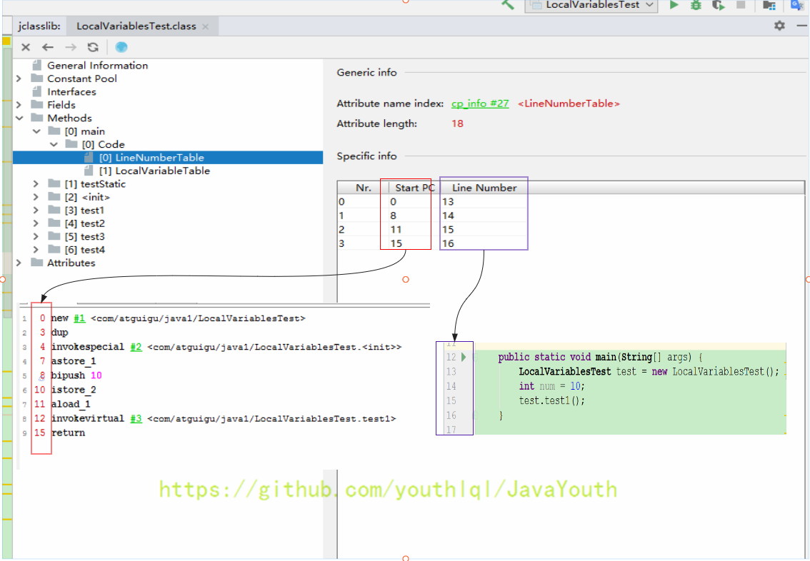

5、注意：生效行数和剩余有效行数都是针对于字节码文件的行数


1、图中圈的东西表示该局部变量的作用域

2、Start PC==11表示在字节码的11行开始生效，也就是Java代码对应的第15行。而声明int num在java代码的是第14行，说明是从声明的下一行开始生效

3、Length== 5表示局部变量剩余有效行数，main方法字节码指令总共有16行，从11行开始生效，那么剩下就是16-11 ==5。

4、`Ljava/lang/String` 前面的L表示引用类型

### 关于Slot的理解

局部变量表用于存储数据的数组，存在重复利用的问题，this变量占第一位

1. 参数值的存放总是从局部变量数组索引 0 的位置开始，到数组长度-1的索引结束。

2. 局部变量表，**最基本的存储单元是Slot（变量槽）**，局部变量表中存放编译期可知的各种基本数据类型（8种），引用类型（reference），returnAddress类型的变量。

3. 在局部变量表里，

   32位以内的类型只占用一个slot

   （包括returnAddress类型），

   64位的类型占用两个slot

   （1ong和double）。

   - byte、short、char在储存前被转换为int，boolean也被转换为int，0表示false，非0表示true
   - long和double则占据两个slot

4. JVM会为局部变量表中的每一个Slot都分配一个访问索引，通过这个索引即可成功访问到局部变量表中指定的局部变量值

5. 当一个实例方法被调用的时候，它的方法参数和方法体内部定义的局部变量将会**按照顺序被复制**到局部变量表中的每一个slot上

6. 如果需要访问局部变量表中一个64bit的局部变量值时，只需要使用前一个索引即可。（比如：访问long或double类型变量）

7. 如果当前帧是由构造方法或者实例方法创建的，那么**该对象引用this将会存放在index为0的slot处**，其余的参数按照参数表顺序继续排列。（this也相当于一个变量）

### Slot代码示例

**this 存放在 index = 0 的位置：**

代码

```
	public void test3() {
        this.count++;
    }
```

局部变量表：this 存放在 index = 0 的位置


**64位的类型（1ong和double）占用两个slot**

代码

```
 	public String test2(Date dateP, String name2) {
        dateP = null;
        name2 = "songhongkang";
        double weight = 130.5;//占据两个slot
        char gender = '男';
        return dateP + name2;
    }
```

weight 为 double 类型，index 直接从 3 蹦到了 5

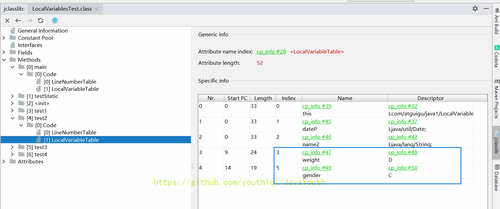

**static 无法调用 this**

this 不存在与 static 方法的局部变量表中，所以无法调用

```java
    public static void testStatic(){
        LocalVariablesTest test = new LocalVariablesTest();
        Date date = new Date();
        int count = 10;
        System.out.println(count);
        //因为this变量不存在于当前方法的局部变量表中！！
//        System.out.println(this.count);
    }
```

### Slot的重复利用

栈帧中的局部变量表中的槽位是可以重用的，如果一个局部变量过了其作用域，那么在其作用域之后申明新的局部变量变就很有可能会复用过期局部变量的槽位，从而达到节省资源的目的。

代码

```java
    public void test4() {
        int a = 0;
        {
            int b = 0;
            b = a + 1;
        }
        //变量c使用之前已经销毁的变量b占据的slot的位置
        int c = a + 1;
    }
```

局部变量 c 重用了局部变量 b 的 slot 位置

### 静态变量与局部变量的对比

```
变量的分类：
1、按照数据类型分：① 基本数据类型  ② 引用数据类型
2、按照在类中声明的位置分：
  2-1、成员变量：在使用前，都经历过默认初始化赋值
       2-1-1、类变量: linking的prepare阶段：给类变量默认赋值
              ---> initial阶段：给类变量显式赋值即静态代码块赋值
       2-1-2、实例变量：随着对象的创建，会在堆空间中分配实例变量空间，并进行默认赋值
  2-2、局部变量：在使用前，必须要进行显式赋值的！否则，编译不通过。
```


1. 参数表分配完毕之后，再根据方法体内定义的变量的顺序和作用域分配。
2. 我们知道成员变量有两次初始化的机会**，**第一次是在“准备阶段”，执行系统初始化，对类变量设置零值，另一次则是在“初始化”阶段，赋予程序员在代码中定义的初始值。
3. 和类变量初始化不同的是，**局部变量表不存在系统初始化的过程**，这意味着一旦定义了局部变量则必须人为的初始化，否则无法使用。

### 补充说明

1. 在栈帧中，与性能调优关系最为密切的部分就是前面提到的局部变量表。在方法执行时，虚拟机使用局部变量表完成方法的传递。
2. 局部变量表中的变量也是重要的垃圾回收根节点，只要被局部变量表中直接或间接引用的对象都不会被回收。

## 操作数栈

### 操作数栈的特点

1. 每一个独立的栈帧除了包含局部变量表以外，还包含一个后进先出（Last - In - First -Out）的 操作数栈，也可以称之为**表达式栈**（Expression Stack）
2. 操作数栈，在方法执行过程中，**根据字节码指令，往栈中写入数据或提取数据**，即入栈（push）和 出栈（pop）

- 某些字节码指令将值压入操作数栈，其余的字节码指令将操作数取出栈。使用它们后再把结果压入栈，
- 比如：执行复制、交换、求和等操作


### 操作数栈的作用

1. 操作数栈，**主要用于保存计算过程的中间结果，同时作为计算过程中变量临时的存储空间**。
2. 操作数栈就是JVM执行引擎的一个工作区，当一个方法刚开始执行的时候，一个新的栈帧也会随之被创建出来，这时方法的操作数栈是空的。
3. 每一个操作数栈都会拥有一个明确的栈深度用于存储数值，其所需的最大深度在编译期就定义好了，保存在方法的Code属性中，为**maxstack**的值。
4. 栈中的任何一个元素都是可以任意的Java数据类型
   - 32bit的类型占用一个栈单位深度
   - 64bit的类型占用两个栈单位深度
5. 操作数栈并非采用访问索引的方式来进行数据访问的，而是只能通过标准的入栈和出栈操作来完成一次数据访问。**只不过操作数栈是用数组这个结构来实现的而已**
6. 如果被调用的方法带有返回值的话，其返回值将会被压入当前栈帧的操作数栈中，并更新PC寄存器中下一条需要执行的字节码指令。
7. 操作数栈中元素的数据类型必须与字节码指令的序列严格匹配，这由编译器在编译器期间进行验证，同时在类加载过程中的类检验阶段的数据流分析阶段要再次验证。
8. 另外，**我们说Java虚拟机的解释引擎是基于栈的执行引擎，其中的栈指的就是操作数栈**。

## 操作数栈代码追踪

```
	public void testAddOperation() {
        //byte、short、char、boolean：都以int型来保存
        byte i = 15;
        int j = 8;
        int k = i + j;

       // int m = 800;

    }
```

对应字节码指令

```
 0 bipush 15
 2 istore_1
 3 bipush 8
 5 istore_2
 6 iload_1
 7 iload_2
 8 iadd
 9 istore_3
10 return
```

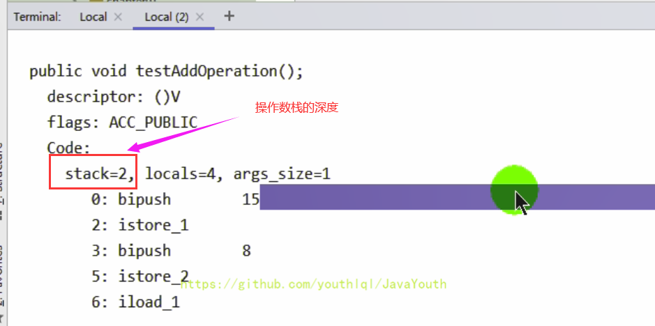

### 一步一步看流程

1、首先执行第一条语句，PC寄存器指向的是0，也就是指令地址为0，然后使用bipush让操作数15入操作数栈。

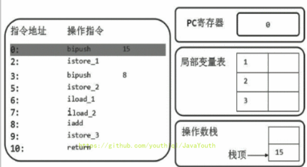](https://camo.github

2、执行完后，PC寄存器往下移，指向下一行代码，下一行代码就是将操作数栈的元素存储到局部变量表1的位置（istore_1），我们可以看到局部变量表的已经增加了一个元素。并且操作数栈为空了

- 解释为什么局部变量表索引从 1 开始，因为该方法为实例方法，局部变量表索引为 0 的位置存放的是 this

](https://camo.githubuserc

3、然后PC下移，指向的是下一行。让操作数8也入栈，同时执行store操作，存入局部变量表中


4、然后从局部变量表中，依次将数据放在操作数栈中，等待执行 add 操作

iload_1：取出局部变量表中索引为1的数据入操作数栈


5、然后将操作数栈中的两个元素执行相加操作，并存储在局部变量表3的位置

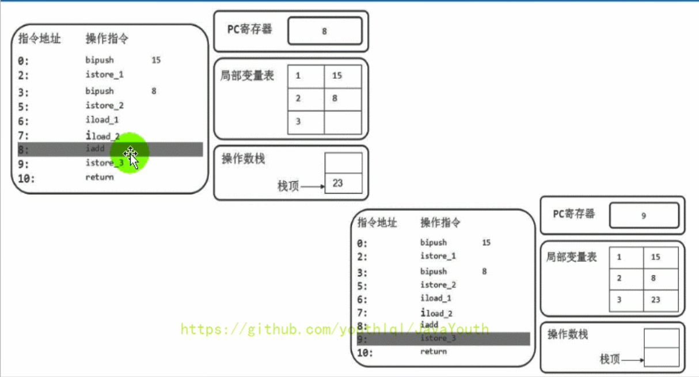

### 小问题

**关于类型转换的说明**


- 因为 8 可以存放在 byte 类型中，所以压入操作数栈的类型为 byte ，而不是 int ，所以执行的字节码指令为 bipush 8
- 但是存储在局部变量的时候，会转成 int 类型的变量：istore_4


- m改成800之后，byte存储不了，就成了short型，sipush 800

**如果被调用的方法带有返回值，返回值入操作数栈**

```java
  public int getSum(){
        int m = 10;
        int n = 20;
        int k = m + n;
        return k;
    }

    public void testGetSum(){
        //获取上一个栈桢返回的结果，并保存在操作数栈中
        int i = getSum();
        int j = 10;
    }
```


getSum() 方法字节码指令：最后带着个 ireturn


testGetSum() 方法字节码指令：一上来就加载 getSum() 方法的返回值()


## 栈顶缓存技术

**栈顶缓存技术：Top Of Stack Cashing**

1. 前面提过，基于栈式架构的虚拟机所使用的零地址指令更加紧凑，但完成一项操作的时候必然需要使用更多的入栈和出栈指令，这同时也就意味着将需要更多的指令分派（instruction dispatch）次数（也就是你会发现指令很多）和导致内存读/写次数多，效率不高。
2. 由于操作数是存储在内存中的，因此频繁地执行内存读/写操作必然会影响执行速度。为了解决这个问题，HotSpot JVM的设计者们提出了栈顶缓存（Tos，Top-of-Stack Cashing）技术，**将栈顶元素全部缓存在物理CPU的寄存器中，以此降低对内存的读/写次数，提升执行引擎的执行效率。**
3. 寄存器的主要优点：指令更少，执行速度快，但是指令集（也就是指令种类）很多

## 动态链接

设置指向运行时常量池的指针

**动态链接（或指向运行时常量池的方法引用）**

1. 每一个栈帧内部都包含**一个指向运行时常量池中该栈帧所属方法的引用**。包含这个引用的目的就是**为了支持当前方法的代码能够实现动态链接**（Dynamic Linking），比如：invokedynamic指令
2. 在Java源文件被编译到字节码文件中时，所有的变量和方法引用都作为符号引用（Symbolic Reference）保存在class文件的常量池里。比如：描述一个方法调用了另外的其他方法时，就是通过常量池中指向方法的符号引用来表示的，那么**动态链接的作用就是为了将这些符号引用转换为调用方法的直接引用**

```java
public class DynamicLinkingTest {

    int num = 10;

    public void methodA(){
        System.out.println("methodA()....");
    }

    public void methodB(){
        System.out.println("methodB()....");

        methodA();

        num++;
    }

}
```


对应字节码

```jav
Classfile /F:/IDEAWorkSpaceSourceCode/JVMDemo/out/production/chapter05/com/atguigu/java1/DynamicLinkingTest.class
  Last modified 2020-11-10; size 712 bytes
  MD5 checksum e56913c945f897c7ee6c0a608629bca8
  Compiled from "DynamicLinkingTest.java"
public class com.atguigu.java1.DynamicLinkingTest
  minor version: 0
  major version: 52
  flags: ACC_PUBLIC, ACC_SUPER
Constant pool:
   #1 = Methodref          #9.#23         // java/lang/Object."<init>":()V
   #2 = Fieldref           #8.#24         // com/atguigu/java1/DynamicLinkingTest.num:I
   #3 = Fieldref           #25.#26        // java/lang/System.out:Ljava/io/PrintStream;
   #4 = String             #27            // methodA()....
   #5 = Methodref          #28.#29        // java/io/PrintStream.println:(Ljava/lang/String;)V
   #6 = String             #30            // methodB()....
   #7 = Methodref          #8.#31         // com/atguigu/java1/DynamicLinkingTest.methodA:()V
   #8 = Class              #32            // com/atguigu/java1/DynamicLinkingTest
   #9 = Class              #33            // java/lang/Object
  #10 = Utf8               num
  #11 = Utf8               I
  #12 = Utf8               <init>
  #13 = Utf8               ()V
  #14 = Utf8               Code
  #15 = Utf8               LineNumberTable
  #16 = Utf8               LocalVariableTable
  #17 = Utf8               this
  #18 = Utf8               Lcom/atguigu/java1/DynamicLinkingTest;
  #19 = Utf8               methodA
  #20 = Utf8               methodB
  #21 = Utf8               SourceFile
  #22 = Utf8               DynamicLinkingTest.java
  #23 = NameAndType        #12:#13        // "<init>":()V
  #24 = NameAndType        #10:#11        // num:I
  #25 = Class              #34            // java/lang/System
  #26 = NameAndType        #35:#36        // out:Ljava/io/PrintStream;
  #27 = Utf8               methodA()....
  #28 = Class              #37            // java/io/PrintStream
  #29 = NameAndType        #38:#39        // println:(Ljava/lang/String;)V
  #30 = Utf8               methodB()....
  #31 = NameAndType        #19:#13        // methodA:()V
  #32 = Utf8               com/atguigu/java1/DynamicLinkingTest
  #33 = Utf8               java/lang/Object
  #34 = Utf8               java/lang/System
  #35 = Utf8               out
  #36 = Utf8               Ljava/io/PrintStream;
  #37 = Utf8               java/io/PrintStream
  #38 = Utf8               println
  #39 = Utf8               (Ljava/lang/String;)V
{
  int num;
    descriptor: I
    flags:

  public com.atguigu.java1.DynamicLinkingTest();
    descriptor: ()V
    flags: ACC_PUBLIC
    Code:
      stack=2, locals=1, args_size=1
         0: aload_0
         1: invokespecial #1                  // Method java/lang/Object."<init>":()V
         4: aload_0
         5: bipush        10
         7: putfield      #2                  // Field num:I
        10: return
      LineNumberTable:
        line 7: 0
        line 9: 4
      LocalVariableTable:
        Start  Length  Slot  Name   Signature
            0      11     0  this   Lcom/atguigu/java1/DynamicLinkingTest;

  public void methodA();
    descriptor: ()V
    flags: ACC_PUBLIC
    Code:
      stack=2, locals=1, args_size=1
         0: getstatic     #3                  // Field java/lang/System.out:Ljava/io/PrintStream;
         3: ldc           #4                  // String methodA()....
         5: invokevirtual #5                  // Method java/io/PrintStream.println:(Ljava/lang/String;)V
         8: return
      LineNumberTable:
        line 12: 0
        line 13: 8
      LocalVariableTable:
        Start  Length  Slot  Name   Signature
            0       9     0  this   Lcom/atguigu/java1/DynamicLinkingTest;

  public void methodB();
    descriptor: ()V
    flags: ACC_PUBLIC
    Code:
      stack=3, locals=1, args_size=1
         0: getstatic     #3                  // Field java/lang/System.out:Ljava/io/PrintStream;
         3: ldc           #6                  // String methodB()....
         5: invokevirtual #5                  // Method java/io/PrintStream.println:(Ljava/lang/String;)V
         8: aload_0
         9: invokevirtual #7                  // Method methodA:()V
        12: aload_0
        13: dup
        14: getfield      #2                  // Field num:I
        17: iconst_1
        18: iadd
        19: putfield      #2                  // Field num:I
        22: return
      LineNumberTable:
        line 16: 0
        line 18: 8
        line 20: 12
        line 21: 22
      LocalVariableTable:
        Start  Length  Slot  Name   Signature
            0      23     0  this   Lcom/atguigu/java1/DynamicLinkingTest;
}
SourceFile: "DynamicLinkingTest.java"
```


1、在字节码指令中，methodB() 方法中通过 invokevirtual #7 指令调用了方法 A ，那么 #7 是个啥呢？

2、往上面翻，找到常量池的定义：`#7 = Methodref #8.#31`

- 先找 #8 ：
  - `#8 = Class #32` ：去找 #32
  - `#32 = Utf8 com/atguigu/java1/DynamicLinkingTest`
  - 结论：通过 #8 我们找到了 `DynamicLinkingTest` 这个类
- 再来找 #31：
  - `#31 = NameAndType #19:#13` ：去找 #19 和 #13
  - `#19 = Utf8 methodA` ：方法名为 methodA
  - `#13 = Utf8 ()V` ：方法没有形参，返回值为 void

3、结论：通过 #7 我们就能找到需要调用的 methodA() 方法，并进行调用

4、在上面，其实还有很多符号引用，比如 Object、System、PrintStream 等等


**为什么要用常量池呢？**

1. 因为在不同的方法，都可能调用常量或者方法，所以只需要存储一份即可，然后记录其引用即可，节省了空间。
2. 常量池的作用：就是为了提供一些符号和常量，便于指令的识别

## 方法的调用

### 静态链接与动态链接

有点像多态的特征

在JVM中，将符号引用转换为调用方法的直接引用与方法的绑定机制相关

- **静态链接**：

当一个字节码文件被装载进JVM内部时，如果被调用的目标方法在**编译期确定**，且运行期保持不变时，这种情况下将调用方法的符号引用转换为直接引用的过程称之为静态链接

- **动态链接**：

如果被调用的方法在编译期无法被确定下来，也就是说，只能够在程序**运行期**将调用的方法的符号转换为直接引用，由于这种引用转换过程具备动态性，因此也被称之为动态链接。

### 早期绑定与晚期绑定

感觉跟上面的静态和动态链接差不多，他们是包含的关系

> 静态链接与动态链接针对的是方法。早期绑定和晚期绑定范围更广。早期绑定涵盖了静态链接，晚期绑定涵盖了动态链接。

静态链接和动态链接对应的方法的绑定机制为：早期绑定（Early Binding）和晚期绑定（Late Binding）。**绑定是一个字段、方法或者类在符号引用被替换为直接引用的过程**，这仅仅发生一次。

- **早期绑定**

早期绑定就是指被调用的目标方法如果在编译期可知，且运行期保持不变时，即可将这个方法与所属的类型进行绑定，这样一来，由于明确了被调用的目标方法究竟是哪一个，因此也就**可以使用静态链接的方式将符号引用转换为直接引用**。

- **晚期绑定**

如果被调用的方法在编译期无法被确定下来，**只能够在程序运行期根据实际的类型绑定相关的方法**，这种绑定方式也就被称之为晚期绑定。

```java
class Animal {

    public void eat() {
        System.out.println("动物进食");
    }
}

interface Huntable {
    void hunt();
}

class Dog extends Animal implements Huntable {
    @Override
    public void eat() {
        System.out.println("狗吃骨头");
    }

    @Override
    public void hunt() {
        System.out.println("捕食耗子，多管闲事");
    }
}

class Cat extends Animal implements Huntable {

    public Cat() {
        super();//表现为：早期绑定
    }

    public Cat(String name) {
        this();//表现为：早期绑定
    }

    @Override
    public void eat() {
        super.eat();//表现为：早期绑定
        System.out.println("猫吃鱼");
    }

    @Override
    public void hunt() {
        System.out.println("捕食耗子，天经地义");
    }
}

public class AnimalTest {
    public void showAnimal(Animal animal) {
        animal.eat();//表现为：晚期绑定
    }

    public void showHunt(Huntable h) {
        h.hunt();//表现为：晚期绑定
    }
}
```


部分字节码

```java
{
  public com.atguigu.java2.AnimalTest();
    descriptor: ()V
    flags: ACC_PUBLIC
    Code:
      stack=1, locals=1, args_size=1
         0: aload_0
         1: invokespecial #1                  // Method java/lang/Object."<init>":()V
         4: return
      LineNumberTable:
        line 54: 0
      LocalVariableTable:
        Start  Length  Slot  Name   Signature
            0       5     0  this   Lcom/atguigu/java2/AnimalTest;

  public void showAnimal(com.atguigu.java2.Animal);
    descriptor: (Lcom/atguigu/java2/Animal;)V
    flags: ACC_PUBLIC
    Code:
      stack=1, locals=2, args_size=2
         0: aload_1
         1: invokevirtual #2                  // Method com/atguigu/java2/Animal.eat:()V
         4: return
      LineNumberTable:
        line 56: 0
        line 57: 4
      LocalVariableTable:
        Start  Length  Slot  Name   Signature
            0       5     0  this   Lcom/atguigu/java2/AnimalTest;
            0       5     1 animal   Lcom/atguigu/java2/Animal;

  public void showHunt(com.atguigu.java2.Huntable);
    descriptor: (Lcom/atguigu/java2/Huntable;)V
    flags: ACC_PUBLIC
    Code:
      stack=1, locals=2, args_size=2
         0: aload_1
         1: invokeinterface #3,  1            // InterfaceMethod com/atguigu/java2/Huntable.hunt:()V
         6: return
      LineNumberTable:
        line 60: 0
        line 61: 6
      LocalVariableTable:
        Start  Length  Slot  Name   Signature
            0       7     0  this   Lcom/atguigu/java2/AnimalTest;
            0       7     1     h   Lcom/atguigu/java2/Huntable;
}
SourceFile: "AnimalTest.java"
```


invokevirtual 体现为晚期绑定

invokeinterface 也体现为晚期绑定

invokespecial 体现为早期绑定

### 多态与绑定

1. 随着高级语言的横空出世，类似于Java一样的基于面向对象的编程语言如今越来越多，尽管这类编程语言在语法风格上存在一定的差别，但是它们彼此之间始终保持着一个共性，那就是都支持封装、继承和多态等面向对象特性，既然这一类的编程语言具备多态特性，那么自然也就具备早期绑定和晚期绑定两种绑定方式。
2. Java中**任何一个普通的方法其实都具备虚函数的特征**，它们相当于C++语言中的虚函数（C++中则需要使用关键字virtual来显式定义，相当于C++中的多态）。如果在Java程序中不希望某个方法拥有虚函数的特征时，则可以**使用关键字final来标记这个方法。**（使用了final之后，这个方法就是静态链接了，编译时已经确定，不再具备虚函数的特征）

#### 虚方法与非虚方法

虚方法运行时不确定，非虚方法编译器确定运行时不可变。

**虚方法与非虚方法的区别**

1. 如果方法在编译期就确定了具体的调用版本，这个版本在运行时是不可变的。这样的方法称为非虚方法。
2. 静态方法、私有方法、final方法、实例构造器、父类方法都是非虚方法。
3. 其他方法称为虚方法。

**子类对象的多态的使用前提：**

1. 类的继承关系
2. 方法的重写

**虚拟机中调用方法的指令**

- **普通指令：**

1. invokestatic：调用静态方法，解析阶段确定唯一方法版本
2. invokespecial：调用`<init>`方法、私有及父类方法，解析阶段确定唯一方法版本
3. invokevirtual：调用所有虚方法
4. invokeinterface：调用接口方法

- **动态调用指令**

invokedynamic：动态解析出需要调用的方法，然后执行

前四条指令固化在虚拟机内部，方法的调用执行不可人为干预。而invokedynamic指令则支持由用户确定方法版本。其中invokestatic指令和invokespecial指令调用的方法称为非虚方法，其余的（final修饰的除外）称为虚方法。

#### 举例

```java
class Father {
    public Father() {
        System.out.println("father的构造器");
    }

    public static void showStatic(String str) {
        System.out.println("father " + str);
    }

    public final void showFinal() {
        System.out.println("father show final");
    }

    public void showCommon() {
        System.out.println("father 普通方法");
    }
}

public class Son extends Father {
    public Son() {
        //invokespecial
        super();
    }

    public Son(int age) {
        //invokespecial
        this();
    }

    //不是重写的父类的静态方法，因为静态方法不能被重写！
    public static void showStatic(String str) {
        System.out.println("son " + str);
    }

    private void showPrivate(String str) {
        System.out.println("son private" + str);
    }

    public void show() {
        //invokestatic
        showStatic("atguigu.com");
        //invokestatic
        super.showStatic("good!");
        //invokespecial
        showPrivate("hello!");
        //invokespecial
        super.showCommon();

        //invokevirtual
        showFinal();//因为此方法声明有final，不能被子类重写，所以也认为此方法是非虚方法。
        //虚方法如下：
        
        /*
        invokevirtual  你没有显示的加super.，编译器认为你可能调用子类的showCommon(即使son子类没有重写，也		  会认为)，所以编译期间确定不下来，就是虚方法。
        */
        showCommon();
        info();

        MethodInterface in = null;
        //invokeinterface
        in.methodA();
    }

    public void info() {

    }

    public void display(Father f) {
        f.showCommon();
    }

    public static void main(String[] args) {
        Son so = new Son();
        so.show();
    }
}

interface MethodInterface {
    void methodA();
}
```


#### 关于 invokedynamic 指令

可以在运行时判断类型

1. JVM字节码指令集一直比较稳定，一直到Java7中才增加了一个invokedynamic指令，这是Java为了实现【动态类型语言】支持而做的一种改进。
2. 但是在Java7中并没有提供直接生成invokedynamic指令的方法，需要借助ASM这种底层字节码工具来产生invokedynamic指令。直到Java8的Lambda表达式的出现，invokedynamic指令的生成，在Java中才有了直接的生成方式。
3. Java7中增加的动态语言类型支持的本质是对Java虚拟机规范的修改，而不是对Java语言规则的修改，这一块相对来讲比较复杂，增加了虚拟机中的方法调用，最直接的受益者就是运行在Java平台的动态语言的编译器。

```java
@FunctionalInterface
interface Func {
    public boolean func(String str);
}

public class Lambda {
    public void lambda(Func func) {
        return;
    }

    public static void main(String[] args) {
        Lambda lambda = new Lambda();

        Func func = s -> {
            return true;
        };

        lambda.lambda(func);

        lambda.lambda(s -> {
            return true;
        });
    }
}
```

### Java语言中方法重写的本质

动态分派，比较浪费时间，所以后面做了个缓存--虚方法表。

1. 找到操作数栈顶的第一个元素所执行的对象的实际类型，记作C。
2. 如果在类型C中找到与常量中的描述符合简单名称都相符的方法，则进行访问权限校验。
   - 如果通过则返回这个方法的直接引用，查找过程结束
   - 如果不通过，则返回java.lang.IllegalAccessError 异常
3. 否则，按照继承关系从下往上依次对C的各个父类进行第2步的搜索和验证过程。
4. 如果始终没有找到合适的方法，则抛出java.lang.AbstractMethodError异常。

> 上面这个过程称为**动态分派**

**IllegalAccessError介绍**

1. 程序试图访问或修改一个属性或调用一个方法，这个属性或方法，你没有权限访问。一般的，这个会引起编译器异常。这个错误如果发生在运行时，就说明一个类发生了不兼容的改变。
2. 比如，你把应该有的jar包放从工程中拿走了，或者Maven中存在jar包冲突

### 虚方法表

缓存方法调用关系，提升效率。

1. 在面向对象的编程中，会很频繁的使用到**动态分派**，如果在每次动态分派的过程中都要重新在类的方法元数据中搜索合适的目标的话就可能影响到执行效率。因此，为了提高性能，**JVM采用在类的方法区建立一个虚方法表（virtual method table）来实现**，非虚方法不会出现在表中（因为非虚方法已经确定了，不需要查找调用关系了）。使用索引表来代替查找。【上面动态分派的过程，我们可以看到如果子类找不到，还要从下往上找其父类，非常耗时】
2. 每个类中都有一个虚方法表，表中存放着各个方法的实际入口。
3. 虚方法表是什么时候被创建的呢？虚方法表会在类加载的链接阶段被创建并开始初始化，类的变量初始值准备完成之后，JVM会把该类的虚方法表也初始化完毕。

**例子1**

如图所示：如果类中重写了方法，那么调用的时候，就会直接在该类的虚方法表中查找


1、比如说son在调用toString的时候，Son没有重写过，Son的父类Father也没有重写过，那就直接调用Object类的toString。那么就直接在虚方法表里指明toString直接指向Object类。

2、下次Son对象再调用toString就直接去找Object，不用先找Son-->再找Father-->最后才到Object的这样的一个过程。

**例子2**[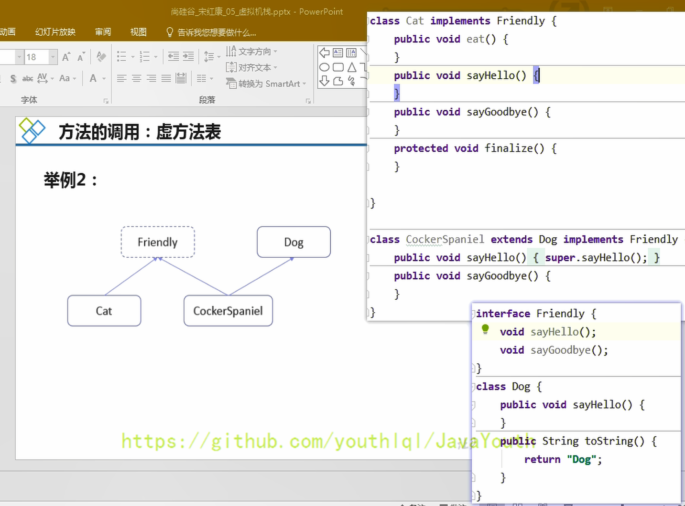


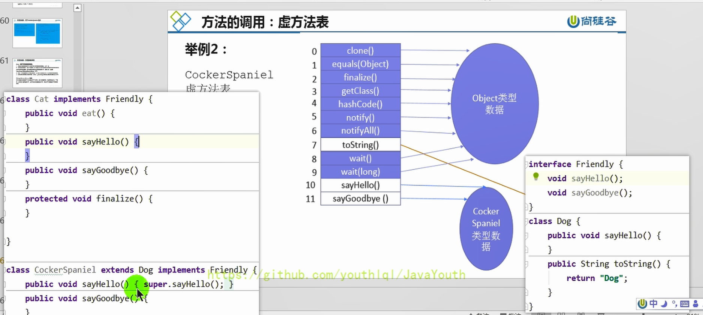


## 方法返回地址

正常退出返回pc寄存器的值，异常退出需要查询异常变量表来决定，


> 在一些帖子里，方法返回地址、动态链接、一些附加信息 也叫做帧数据区

1. 存放调用该方法的pc寄存器的值。一个方法的结束，有两种方式：
   - 正常执行完成
   - 出现未处理的异常，非正常退出
2. 无论通过哪种方式退出，在方法退出后都返回到该方法被调用的位置。方法正常退出时，**调用者的pc计数器的值作为返回地址，即调用该方法的指令的下一条指令的地址**。而通过异常退出的，返回地址是要通过异常表来确定，栈帧中一般不会保存这部分信息。
3. 本质上，方法的退出就是当前栈帧出栈的过程。此时，需要恢复上层方法的局部变量表、操作数栈、将返回值压入调用者栈帧的操作数栈、设置PC寄存器值等，让调用者方法继续执行下去。
4. 正常完成出口和异常完成出口的区别在于：通过异常完成出口退出的不会给他的上层调用者产生任何的返回值。

**方法退出的两种方式**

当一个方法开始执行后，只有两种方式可以退出这个方法，

**正常退出：**

1. 执行引擎遇到任意一个方法返回的字节码指令（return），会有返回值传递给上层的方法调用者，简称**正常完成出口**；
2. 一个方法在正常调用完成之后，究竟需要使用哪一个返回指令，还需要根据方法返回值的实际数据类型而定。
3. 在字节码指令中，返回指令包含：
   - ireturn：当返回值是boolean，byte，char，short和int类型时使用
   - lreturn：Long类型
   - freturn：Float类型
   - dreturn：Double类型
   - areturn：引用类型
   - return：返回值类型为void的方法、实例初始化方法、类和接口的初始化方法

**异常退出：**

1. 在方法执行过程中遇到异常（Exception），并且这个异常没有在方法内进行处理，也就是只要在本方法的异常表中没有搜索到匹配的异常处理器，就会导致方法退出，简称**异常完成出口**。
2. 方法执行过程中，抛出异常时的异常处理，存储在一个异常处理表，方便在发生异常的时候找到处理异常的代码


异常处理表：

- 反编译字节码文件，可得到 Exception table
- from ：字节码指令起始地址
- to ：字节码指令结束地址
- target ：出现异常跳转至地址为 11 的指令执行
- type ：捕获异常的类型


## 一些附加信息

栈帧中还允许携带与Java虚拟机实现相关的一些附加信息。例如：对程序调试提供支持的信息。

## 栈相关面试题

### 举例栈溢出的情况？

SOF（StackOverflowError），栈大小分为固定的，和动态变化。如果是固定的就可能出现StackOverflowError。如果是动态变化的，内存不足时就可能出现OOM

### 调整栈大小，就能保证不出现溢出么？

不能保证不溢出，只能保证SOF出现的几率小

### 分配的栈内存越大越好么？

不是，一定时间内降低了OOM概率，但是会挤占其它的线程空间，因为整个虚拟机的内存空间是有限的

### 垃圾回收是否涉及到虚拟机栈？

不会

| 位置                                        | 是否有Error | 是否存在GC |
| ------------------------------------------- | ----------- | ---------- |
| PC计数器                                    | 无          | 不存在     |
| 虚拟机栈                                    | 有，SOF     | 不存在     |
| 本地方法栈(在HotSpot的实现中和虚拟机栈一样) |             |            |
| 堆                                          | 有，OOM     | 存在       |
| 方法区                                      | 有          | 存在       |

### 方法中定义的局部变量是否线程安全？

这个得具体分析如果是自产自销当然线程安全，如果是将参数扔出去了（返回值）或者使用的参数传进来的，那可能就不安全了。

具体问题具体分析

1. 如果只有一个线程才可以操作此数据，则必是线程安全的。
2. 如果有多个线程操作此数据，则此数据是共享数据。如果不考虑同步机制的话，会存在线程安全问题。

**具体问题具体分析：**

- 如果对象是在内部产生，并在内部消亡，没有返回到外部，那么它就是线程安全的，反之则是线程不安全的。

```java
/**
 * 面试题：
 * 方法中定义的局部变量是否线程安全？具体情况具体分析
 *
 *   何为线程安全？
 *      如果只有一个线程才可以操作此数据，则必是线程安全的。
 *      如果有多个线程操作此数据，则此数据是共享数据。如果不考虑同步机制的话，会存在线程安全问题。
 */
public class StringBuilderTest {

    int num = 10;

    //s1的声明方式是线程安全的（只在方法内部用了）
    public static void method1(){
        //StringBuilder:线程不安全
        StringBuilder s1 = new StringBuilder();
        s1.append("a");
        s1.append("b");
        //...
    }
    //sBuilder的操作过程：是线程不安全的（作为参数传进来，可能被其它线程操作）
    public static void method2(StringBuilder sBuilder){
        sBuilder.append("a");
        sBuilder.append("b");
        //...
    }
    //s1的操作：是线程不安全的（有返回值，可能被其它线程操作）
    public static StringBuilder method3(){
        StringBuilder s1 = new StringBuilder();
        s1.append("a");
        s1.append("b");
        return s1;
    }
    //s1的操作：是线程安全的（s1自己消亡了，最后返回的只是s1.toString的一个新对象）
    public static String method4(){
        StringBuilder s1 = new StringBuilder();
        s1.append("a");
        s1.append("b");
        return s1.toString();
    }

    public static void main(String[] args) {
        StringBuilder s = new StringBuilder();


        new Thread(() -> {
            s.append("a");
            s.append("b");
        }).start();

        method2(s);

    }

}
```