## 4. Go在高并发下的数据结构

### 4.1 什么变量的大小是0字节的

是空结构体

- 空结构体的地址均相同（当不被包含在其他结构体中时）

```golang
type kong struct {
}

type kong_ struct {
    kong
    name string
}

func emptyStruct() {
    a := kong{}
    b := 2
    c := kong_{}
    d := kong{}
    fmt.Printf("空结构体a的大小：%d,空结构体的地址：%p\n",
        unsafe.Sizeof(a), &a)
    fmt.Printf("变量b的地址：%p\n", &b)
    fmt.Printf("非独立结构体c的大小：%d,非独立空结构体的地址：%p\n",
        unsafe.Sizeof(c), &c.kong)
    fmt.Printf("空结构体d的大小：%d,空结构体d的地址：%p\n",
        unsafe.Sizeof(d), &d)
    
    /*
    结果：
    空结构体a的大小：0,空结构体的地址：0xdc9540
    变量b的地址：0xc00001c098
    嵌套结构体c的大小：16,嵌套后空结构体的地址：0xc000062250
    空结构体d的大小：0,空结构体d的地址：0xdc9540
    结论：
    所有独立的空结构体都具有相同的地址，这个地址叫zeroBase,且该空结构体的大小为0
    */
}
```

- 空结构体主要是为了节省内存
  - 结合map
    ```golang
    func implHashSet() { //hashset是只有k无v的数据结构
      //使用map实现hashset
      m := map[string]struct{}{}
      m["a"] = struct{}{}
      fmt.Println(m)
      /*
          结果：map[a:{}]
      */
    }
    ```
  - 结合channel
    ```golang
    func implPureMes() {
      //传递空信息（纯信号），在不需要实际意义的信息时可以优化内存的占用
      pureMess := make(chan struct{})
      fmt.Println(pureMess)
    }
    ```

<br/>

**小结**：

- Go中部分数据长度与系统字长有关
- 空结构体不占用空间
- 空结构体与map结合可以实现hashset
- 空结构体与channel结合可以当作纯信号

<br/>

### 4.2 数组，字符串，切片的底层是一样的吗？

为什么两个不等长的字符串在内存中的长度却相等呢？

```golang
func stringDemo() {
    fmt.Println(unsafe.Sizeof("邢某某"))
    fmt.Println(unsafe.Sizeof("邢某某的blog"))
    /*
        结果：
        16
        16
    */
}
```

因为：

字符串是一个结构体，包含一个指向底层byte数组的指针和int类型的长度属性

```golang
type stringStruct struct {
  str unsafe.Pointer
  len int
}

```

<br/>

那么这个len属性表示的是byte数组的长度（字节数）还是字符的个数呢？

是字节数

- 插播一个知识点，Unicode , UTF-8
  - unicode:
    - 一种统一字符集
    - 囊括了159种文字的144679个字符
    - 14万字符至少需要3个字节（24位）表示
    - 英文字母均排在前面128个
  - utf-8
    - unicode的变长格式
    - 128个us-ascii字符只需要一个字节编码
    - 西方常用字符串需要两个字节
    - 其他字符需要三个字节，极少需要四个字节

<br/>

Go使用的UTF-8变长编码，每个字符所占的字节是不一样的：

```golang
func utf_8Test() {
    str := "英文名为Jamison"
    fmt.Println(len(str)) //19
    //四个汉字每个汉字三个字节，其余英文每个一字节
    //所以含有一个字节以上的字符不能使用传统for循环遍历，应该使用for range
    for _, s := range str {
        fmt.Printf("%c", s) //result:英文名为Jamison
    }
    fmt.Println()
    //错误做法
    for i := 0; i < len(str); i++ {
        fmt.Printf("%c", str[i]) //result:è±æå为Jamison
    }
}
```

<br/>

字符串的访问：

- 对字符串使用len方法得到的是**字节数**不是字符数
- 对字符串直接使用下标访问，得到的是字节而不是字符
- 字符串被range遍历时，被解码为rune类型的字符
- UTF-8编码解码算法位于runtime/utf8.go

<br/>

那么怎么对字符串进行切分呢？下面介绍一种方法

1. 转为rune数组
2. 切片
3. 转为string

案例，取前三个汉字：

```golang
func qieFenStr() {
    //取前三个汉字
    str := "邢某某的blog"
    str = string([]rune(str)[:3])
    fmt.Println(str) //result:邢某某
}
```

---

<br/>

切片底层

```golang
type slice struct{
  array unsafe.Pointer
  len int
  cap int
}
```

所以切片的底层是对数组的引用

<br/>

切片的扩容runtime.growslice():

- 如果期望容量大于当前容量的两倍就会使用期望容量
- 如果当前容量 小于 1024 增长2倍，如果当前容量 大于 1024 增长 1.25 倍

<br/>

**注意**：切片在并发情况下是安全的，例如有两个协程，一个协程读，一个协程写，如果在写的过程中扩容了，那么原来的切片可能会丢失（因为扩容会重新开辟内存），所以切片并发时要加锁。

<br/>

### 4.2 map

#### 4.2.1 map常见操作的底层原理

HashMap的基本方案：

- 开放寻址法（存在hash碰撞问题）

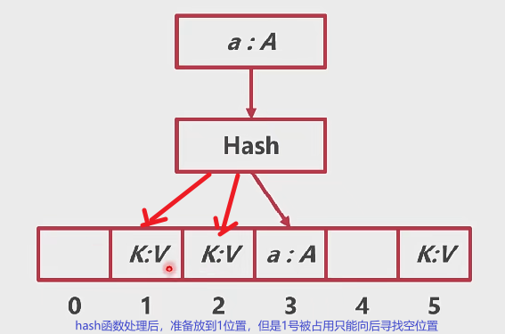

- 拉链法（常见）

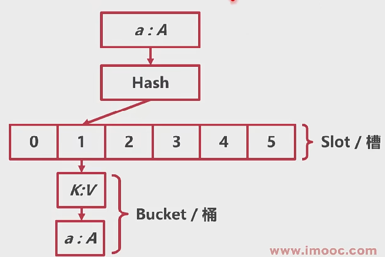

<br/>

Go的map怎么实现的呢：

采用拉链法

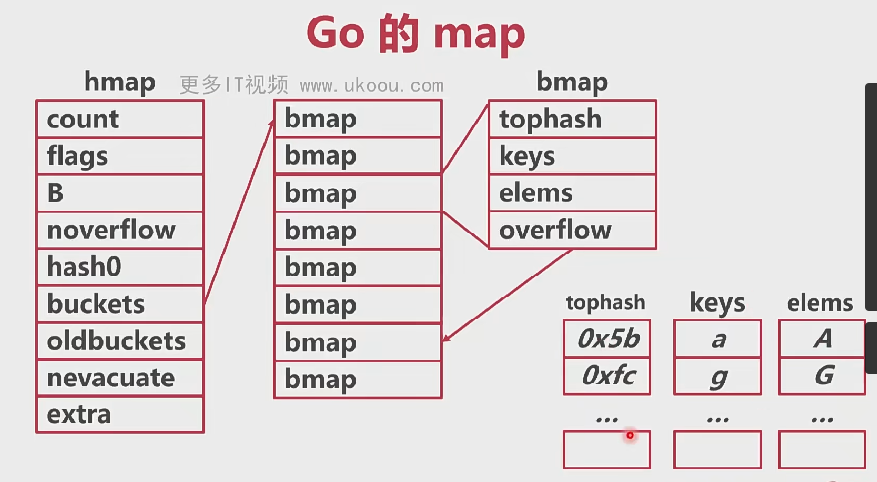

<br/>

<br/>

map的主要初始化方式:

- make

```golang
func initializeMap() {
    m := make(map[string]string, 10)
    m["name"] = "xxj"
    m["age"] = "12"
    fmt.Println(m)
}
```

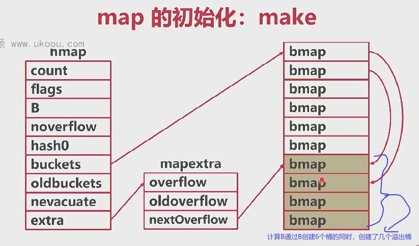

一个桶只能放八个，超出部分放进溢出桶。

<br/>

<br/>

- 字面量

```golang
    //字面量初始化
    k := map[string]int{
        "1": 2,
        "2": 2,
        "3": 2,
        ......
    }
    fmt.Println(k)
```

上面这种初始化方法，在元素少于25个时，转换为简单赋值，就是一个个赋值：

```golang
k := make(map[string]int,3)
k["1"] = 2
k["2"] = 2
k["3"] = 2
```

当元素个数大于25个时 改为循环赋值

```golang
k := make(map[string]int,26)
vstatk := []string{"1","2",....,"26"}
vstatv := []int{1,2,3,...,26}
for i := 0; i < len(vstatk); i++ {
    k[vstatk[i]] = vstatv[i]
}
```

<br/>

<br/>

map基础操作：

```golang
func initializeMap() {
    //初始化
    m := make(map[string]string, 10)
    m["name"] = "xxj"
    m["age"] = "12"
    fmt.Println(m)

    //删除
    delete(m, "name")
    fmt.Println(m)
    //打印
    for mes := range m {
        fmt.Println("年龄是：", m[mes])
    }
}
```

<br/>

<br/>

map的访问：

1. 计算桶号

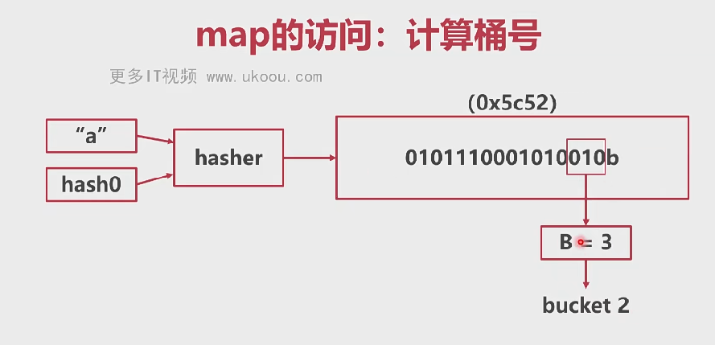

<br/>

2. 计算tophash

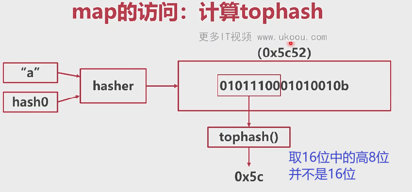

<br/>

3. 匹配

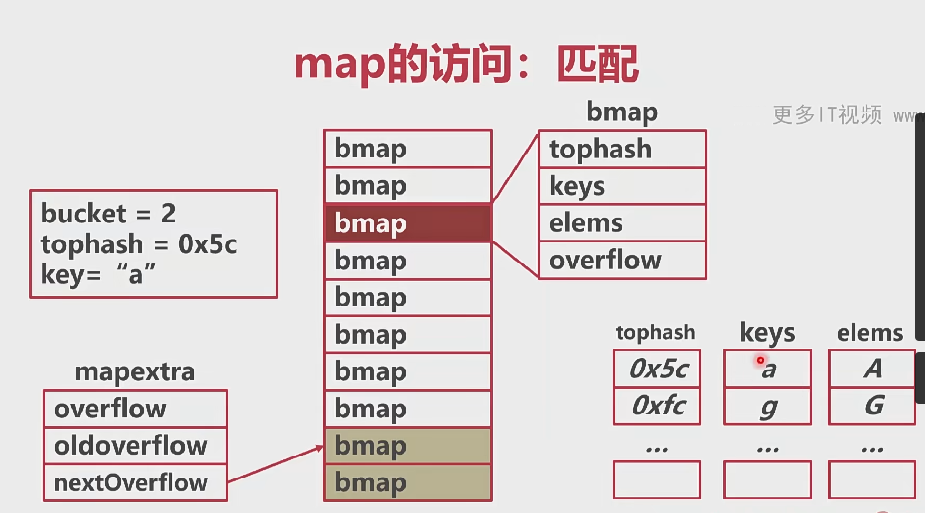

特殊情况（hash碰撞）：当tophash的高八位相等后八位不相同时，会比对 key:value 是不是我们要找的那个，没找到的话会去溢出桶里面寻找，访问结束。

<br/>

<br/>

map的写入（与map的访问相似）

<br/>

<br/>

总结：

- go语言使用拉链法实现hashmap
- 每个桶存储键哈希的前八位
- 桶超出8个数据，就会存储到溢出桶中

<br/>

#### 4.2.2 map的扩容

map为什么需要扩容，哈希碰撞问题

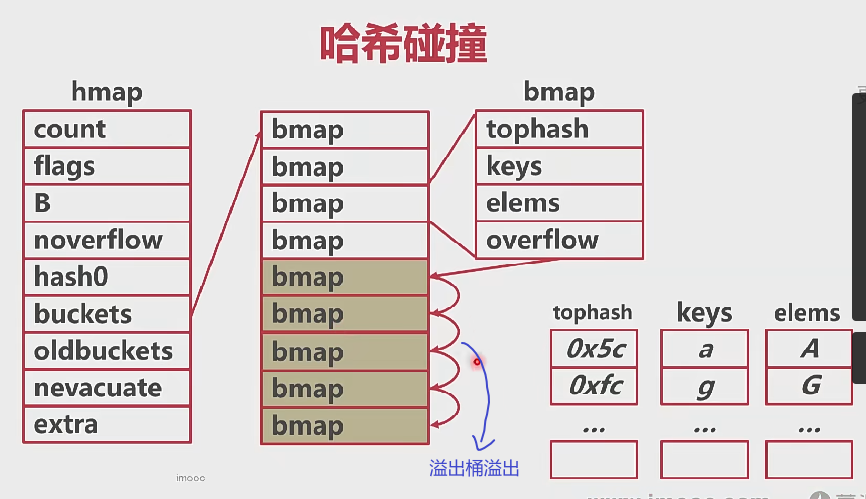

什么情况下会扩容呢：

- 溢出桶太多时会导致严重的性能下降
- runtime.mapassign()可能会触发扩容的情况
  - 装载因子超过6.5个（平均每个槽6.5个key）
  - 使用太多溢出桶（溢出桶超过了普通桶）

<br/>

<br/>

map的扩容类型:

1. 等量扩容（整理）：数据不多但是溢出桶太多了
2. 翻倍扩容：数据太多了增加普通桶的数量

<br/>

<br/>

map的扩容过程：

1. 步骤一
   1. 创建一组新桶
   2. oldbuckets指向原有的桶数组
   3. buckets指向新的桶数组 
   4. 把map标记为扩容状态
   
   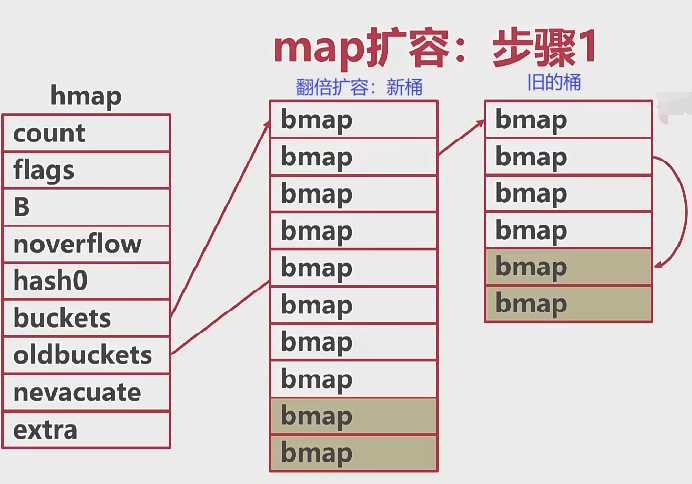
   
   <br/>
2. 步骤二
   1. 将所有的数据从旧桶驱逐到新桶
   2. 采用渐进式驱逐（好多技术都有这种思想，redis的rehash）
   3. 每次**操作一个旧桶的时**，将旧数据驱逐到新桶
   4. 读取时不进行驱逐，只判断读取新桶还是旧桶
   
   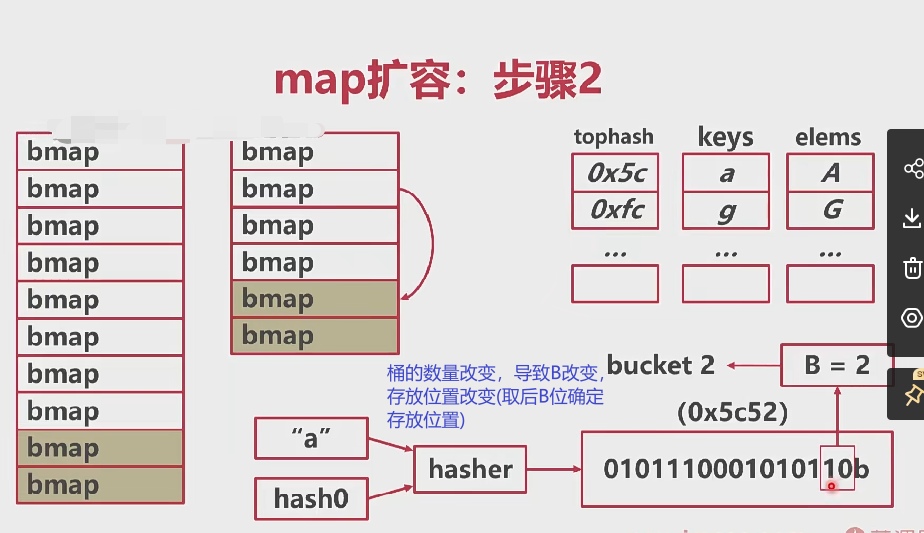

<br/>

3. 步骤三
   1. 所有的旧桶驱逐完成后
   2. oldbuckets回收
   
   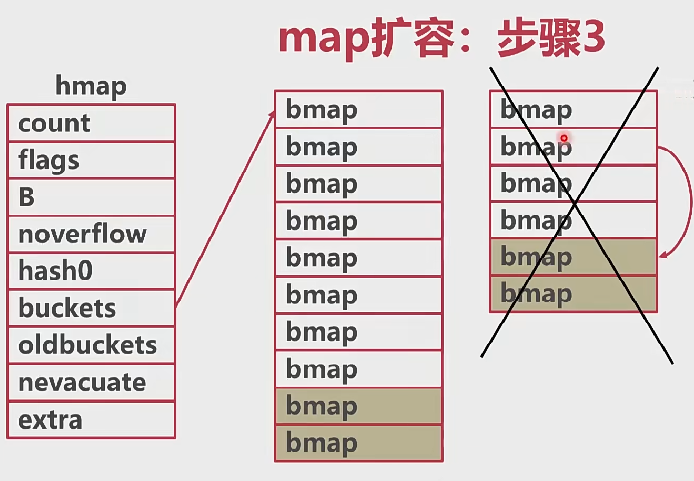

<br/>

<br/>

总结：

- 装载系数或者溢出桶的增加，会触发map扩容
- “扩容”可能并不是增加桶的数量，而是整理数据，使数据更加紧凑
- map扩容采用渐进式，桶被操作时才会重新分配

<br/>

<br/>

#### 4.2.3 如何解决map的并发问题

1. 方法一，给map加锁(mutex)
2. 方法二，使用sync.Map

<br/>

**sync.Map结构**：

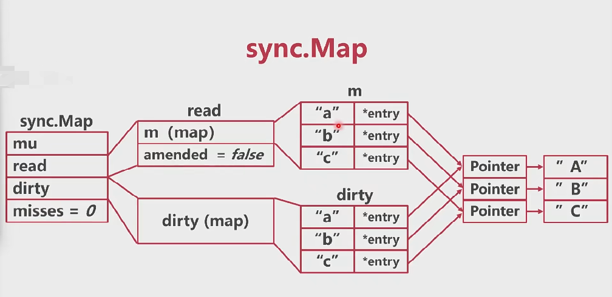

<br/>

**sync追加操作：**

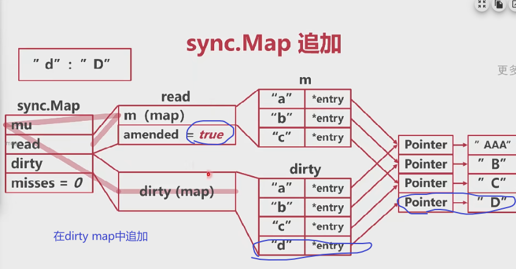

<br/>

**sync追加后的读写：**

先在read map中找追加元素，发现找不到，然后再在dirty map中找

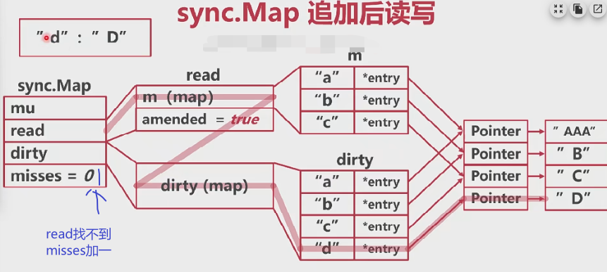

<br/>

**dirty提升（上升）：**

提升的触发条件是：misses == len(dirty)

1. misses == len(dirty)

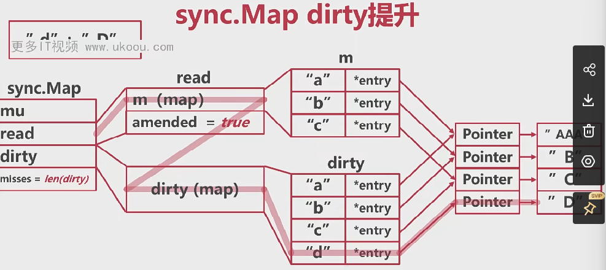

<br/>

2. 将read map释放

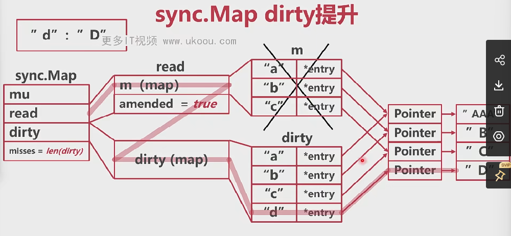

<br/>

3. 提升dirty map

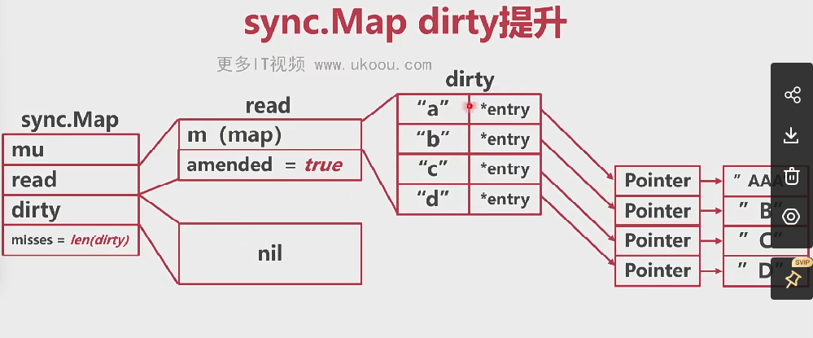

<br/>

4. 重建dirty map（追加的时候重建，不追加还是nil）

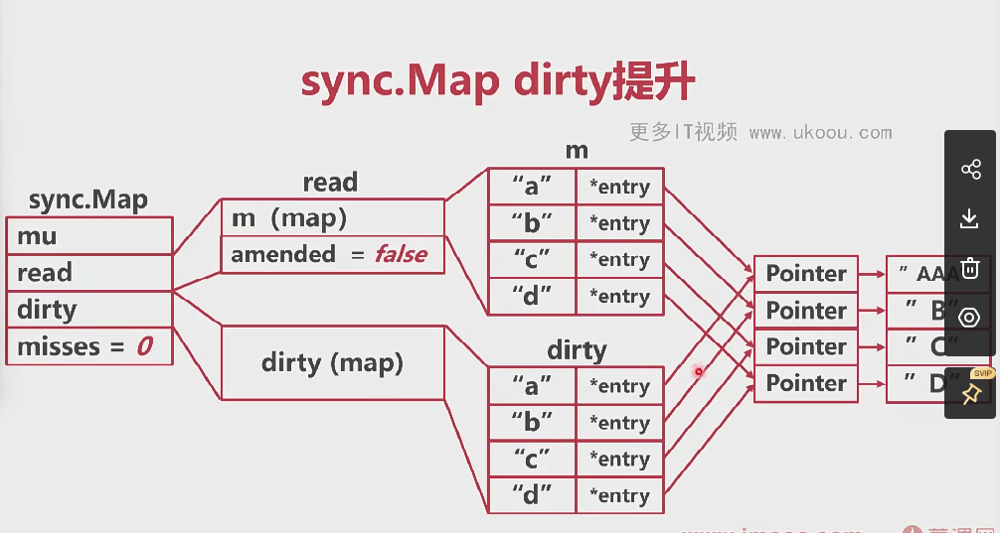

<br/>

---

**sync.Map删除**

- 相比于查询，修改，新增，删除更加麻烦
- 删除可以分为正常删除和追加后删除
- 提升后，被删的key需要特殊处理

<br/>

**1. 正常删除**

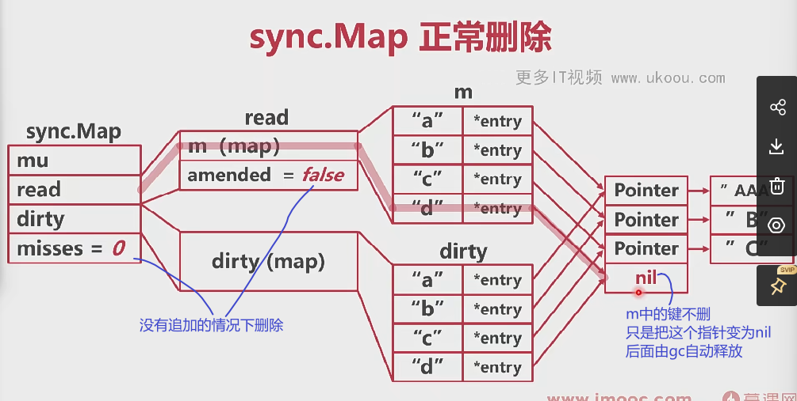

<br/>

**2. 追加后删除**

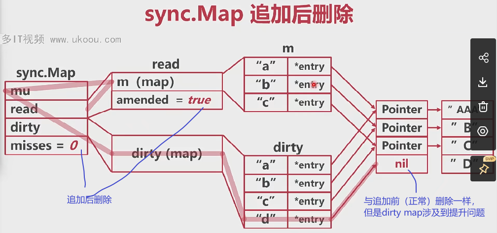

<br/>

dirty删除完成后提升怎么办

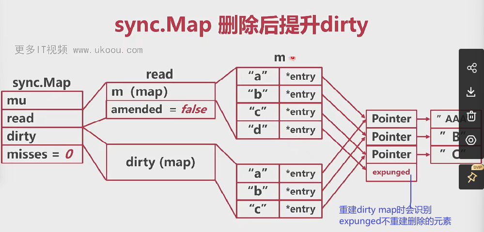

<br/>

---

总结：

- 原生map在扩容的时候会有并发问题
- sync.Map使用了两个map，分离了扩容问题
- 不会引发扩容的操作（查，改）使用read map
- 可能引发扩容的操作（新增）使用dirty map


### 4.3 接口

**接口--隐式更好还是显式更好**

#### 4.3.1 隐式接口


