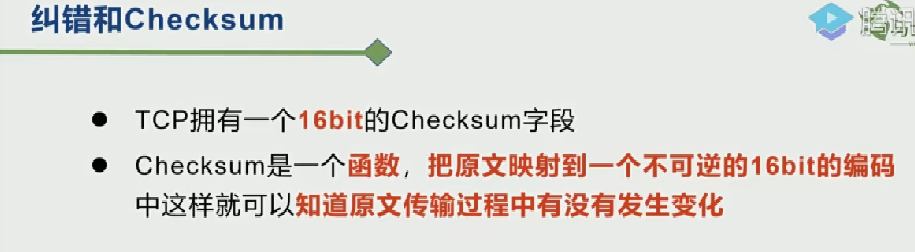

<br/>


<br/>

##  TCP协议

概述：

TCP是一个可以提供可靠的、支持全双工、连接导向的协议，因此在客户端和服务端之间传输数据的时候，是**必须先建立一个连接的**。

1. tcp的特点

- 连接


<br/>

- 全双工


<br/>

- 可靠的


<br/>

2. tcp协议的具体工作过程

- 建立连接的过程（三次握手）

 

<br/>

- 断开连接的过程（四次挥手）


<br/>

- 传输数据


<br/>

报文拆分：


<br/>

顺序保证：

<br/>


<br/>


<br/>


<br/>

- tcp头


<br/>

标志位


<br/>

tcp协议头


<br/>

- tcp协议周边配置


<br/>

纠错能力



<br/>

流程能力


## 7. IPV6协议

### 7.1 区别一：地址


### 7.2 区别二：寻址


#### 7.2.1 全局单播 


#### 7.2.2 本地单播

 


#### 7.2.3 分组多播


### 7.3   新设备接入


这种方式与ipv4不太一样，他是自己申请ip地址，有可能与其他人出现冲突，而ipv4是请求别人给的，因为4的地址少容易给出不冲突的地址。


额外信息：每个节点都必须知道其他节点的ip地址和映射表，任何一台设备都会定时广播自己的ip地址和mac地址。


### 7.4 总结

解决地址不够的问题。

多播功能强大。

发现协议更先进，无状态。


## 8. UDP协议

### 8.1 背景


### 8.2 协议介绍


### 8.3 UDP的封包格式


### 8.4 UDP和TCP的区别


## 9. Socket编程--HTTP服务

### 9.1 线程模型


### 9.2 Socket编程--Http服务

有点看不懂，这些流是干啥的

```java
package http_server;

import java.io.*;
import java.net.ServerSocket;
import java.net.Socket;

public class RawHttpServer {
    public static void main(String[] args) throws IOException {
        ServerSocket socketServer = new ServerSocket(8000);


        //main thread
        while(true) {
            //Blocking...
            //Thread --- > Sleep ---> Other Threads
            Socket socket = socketServer.accept();
            System.out.println("a socket create");

            DataInputStream iptStream = new DataInputStream(socket.getInputStream());
            BufferedReader bfReader = new BufferedReader(new InputStreamReader(iptStream));

            StringBuilder requestBuilder = new StringBuilder();

            String line = "";

            while(!(line = bfReader.readLine()).isEmpty()){
                requestBuilder.append(line + '\n');
            }

            String request = requestBuilder.toString();
            System.out.println(request);

            BufferedWriter bfWriter = new BufferedWriter(new OutputStreamWriter(socket.getOutputStream()));
            bfWriter.write("HTTP/1.1 200 ok\n\nHello world!\n");
            bfWriter.flush();
            socket.close();
        }
    }
}

```

